# SystemMapper — Executive Summary

**Document Version:** 1.0.0
**Last Updated:** 2026-06-27
**Status:** Draft — Approved for Implementation
**Author:** Principal Software Architect

---

## Table of Contents

1. [Project Overview](#1-project-overview)
2. [Vision Statement](#2-vision-statement)
3. [Problem Statement](#3-problem-statement)
4. [Primary Goals](#4-primary-goals)
5. [Non-Goals (MVP)](#5-non-goals-mvp)
6. [Project Principles](#6-project-principles)
7. [Technology Stack](#7-technology-stack)
8. [Architecture Philosophy](#8-architecture-philosophy)
9. [System Context](#9-system-context)
10. [Stakeholders](#10-stakeholders)
11. [Document Index](#11-document-index)
12. [Glossary](#12-glossary)

---

## 1. Project Overview

**SystemMapper** is an Engineering Intelligence Platform designed to provide deep, automated architectural insights into software systems. The platform operates by scanning GitHub repositories, parsing source code into Abstract Syntax Trees (ASTs) using Tree-sitter, constructing a rich architectural dependency graph within Memgraph, and storing all business metadata, user data, and operational state in PostgreSQL (via Supabase).

The platform's core differentiator is its **deterministic blast radius analysis** — the ability to calculate, with mathematical precision, the downstream impact of any code change (Pull Request) by traversing the architectural dependency graph. This analysis is then surfaced directly within the developer's workflow via automated Pull Request comments on GitHub.

Beyond blast radius, SystemMapper provides:

- **Interactive architecture visualization** using React Flow and Cytoscape.js, enabling teams to explore their codebase's structure visually.
- **Historical architecture snapshots** that capture the state of the dependency graph at specific points in time, enabling architectural evolution tracking.
- **Repository-level metrics** covering complexity, dependency density, and architectural health.
- **Team collaboration features** including shared views, notifications, and role-based access control.

### 1.1 MVP Boundary

The Minimum Viable Product (MVP) is explicitly scoped to operate **without any Large Language Model (LLM) dependency**. All risk calculations, scoring algorithms, and architectural analyses are deterministic — they produce identical outputs for identical inputs. This is a foundational design constraint that ensures reproducibility, testability, and auditability of all platform outputs.

AI-powered features (natural language explanations of blast radius, suggested refactoring, automated code review summaries) are architecturally planned as a future **optional explanation layer** that augments but never replaces the deterministic core.

### 1.2 Deployment Scope

The MVP targets **local development only**. The entire platform runs via Docker Compose on a developer's machine. Production deployment infrastructure (Kubernetes, cloud services, CI/CD pipelines) is explicitly out of scope for this architecture document but the system is designed with future cloud deployment in mind.

---

## 2. Vision Statement

> **Empower engineering teams to understand, measure, and improve their software architecture through deterministic analysis, rich visualization, and automated risk assessment — without relying on AI black boxes.**

SystemMapper transforms the implicit knowledge trapped in codebases into explicit, queryable, visualizable architectural intelligence. It makes the invisible connections between components visible and the downstream impact of changes quantifiable.

---

## 3. Problem Statement

Modern software systems suffer from several interconnected problems:

| Problem | Impact |
|---------|--------|
| **Invisible Dependencies** | Developers cannot see how components are connected across service boundaries, leading to unexpected breakages. |
| **Unknown Blast Radius** | Pull Request reviewers have no way to quantitatively assess the downstream impact of a code change. |
| **Architecture Drift** | Systems gradually deviate from their intended architecture, accumulating technical debt that is invisible until it becomes critical. |
| **Knowledge Silos** | Architectural knowledge lives in developers' heads, not in queryable systems. Team departures cause knowledge loss. |
| **No Historical Context** | There is no record of how the architecture evolved over time, making it impossible to correlate architectural changes with quality outcomes. |
| **Manual Risk Assessment** | Code review relies on individual reviewers' mental models, which are incomplete and inconsistent. |
| **Metric Gaps** | Teams lack quantitative metrics for architectural health, dependency complexity, and technical debt. |

SystemMapper addresses each of these problems through automated analysis, graph-based reasoning, and deterministic scoring.

---

## 4. Primary Goals

The MVP must deliver the following capabilities:

### 4.1 GitHub App Integration

- Register as a GitHub App with appropriate permissions.
- Support OAuth-based user authentication via GitHub.
- Receive and process webhook events (push, pull_request, installation).
- Respect GitHub API rate limits with exponential backoff.

### 4.2 Repository Onboarding

- Users install the GitHub App on their organization or personal repositories.
- The platform discovers and lists available repositories.
- Users select repositories to onboard into SystemMapper.
- Onboarding triggers an initial full scan.

### 4.3 Repository Scanning

- Clone or fetch repository contents via the GitHub API (not git clone).
- Traverse the repository file tree.
- Identify parseable source files by language and extension.
- Queue files for AST parsing.
- Track scan progress and status.

### 4.4 AST Parsing

- Parse source files using Tree-sitter grammars.
- Extract structural elements: modules, classes, functions, methods, interfaces, types, enums, variables, imports, exports.
- Normalize AST output into a language-agnostic Intermediate Representation (IR).
- Support incremental parsing (only re-parse changed files on subsequent scans).
- Handle parse errors gracefully without aborting the entire scan.

### 4.5 Dependency Graph Generation

- Transform the normalized IR into Memgraph graph nodes and relationships.
- Build a multi-layered dependency graph: file-level, module-level, class-level, function-level.
- Resolve import paths to actual graph nodes.
- Detect and record: imports, function calls, class inheritance, interface implementations, type usage, variable references.

### 4.6 Blast Radius Analysis

- Given a set of changed files (from a Pull Request), traverse the dependency graph to identify all directly and transitively affected components.
- Calculate a deterministic risk score based on: number of affected components, depth of dependency chain, criticality of affected components, presence of circular dependencies.
- Generate a structured Blast Radius Report containing affected files, affected functions, affected classes, dependency chains, risk score, and risk level.

### 4.7 Pull Request Comments

- Automatically post a formatted comment on GitHub Pull Requests containing the Blast Radius Report.
- Update the comment when the PR is updated (new commits pushed).
- Include visual indicators (risk level badges, affected component counts).
- Link back to the SystemMapper dashboard for detailed exploration.

### 4.8 Interactive Architecture Visualization

- Render the dependency graph as an interactive, zoomable, pannable diagram.
- Support multiple layout algorithms (hierarchical, force-directed, radial).
- Allow filtering by: file type, module, dependency depth, component type.
- Highlight blast radius visually on the graph.
- Support node clicking for detailed component information.

### 4.9 Historical Architecture Snapshots

- Capture a full snapshot of the dependency graph at each scan.
- Store snapshot metadata (timestamp, commit SHA, branch, scan ID) in PostgreSQL.
- Enable comparison between snapshots to identify architectural changes over time.
- Provide a timeline view of architectural evolution.

### 4.10 Repository Metrics

- Calculate and store: file count, function count, class count, dependency count, average dependency depth, circular dependency count, orphan file count, complexity score, architecture score.
- Update metrics after each scan.
- Display metrics on the repository dashboard.

### 4.11 Team Collaboration

- Organization-based multi-tenancy.
- Role-based access control (Owner, Admin, Member, Viewer).
- Repository-level permissions.
- Saved views (persisted graph filter/layout configurations).
- Notifications for scan completions, risk alerts, and PR comments.

---

## 5. Non-Goals (MVP)

The following are explicitly **not** in scope for the MVP:

| Non-Goal | Rationale |
|----------|-----------|
| LLM-powered explanations | MVP must be fully deterministic. AI is a future layer. |
| Production deployment | MVP runs locally via Docker Compose only. |
| Multi-cloud support | No cloud-specific infrastructure. |
| Real-time collaboration | Not needed for initial version. WebSocket support planned for future. |
| Custom parser grammars | MVP uses built-in Tree-sitter grammars only. |
| Self-hosted GitHub Enterprise | MVP targets github.com only. |
| GitLab / Bitbucket | GitHub-only for MVP. Multi-provider is a future feature. |
| DORA metrics | Architecturally planned but not implemented in MVP. |
| Automated refactoring suggestions | Future AI-powered feature. |
| Code generation | Out of scope entirely. |
| Mobile application | Web-only for MVP. |
| Public API | API exists but is not documented or versioned for external consumption in MVP. |

---

## 6. Project Principles

These principles are non-negotiable and must be adhered to across all packages, applications, and services.

### 6.1 Strict TypeScript

- `strict: true` in all `tsconfig.json` files.
- No `any` types unless absolutely unavoidable and explicitly documented.
- All function parameters and return types must be explicitly typed.
- No implicit type coercion.

### 6.2 No Duplicated Types

- All shared types live in the `@systemmapper/types` package.
- No type definition may exist in more than one package.
- DTOs, interfaces, enums, and constants are centralized.

### 6.3 No Duplicated Business Logic

- Business logic lives in dedicated packages (`risk-engine`, `analytics`, `parser`, `graph`).
- Applications (`web`, `api`, `worker`) are thin orchestration layers that compose package functionality.
- If logic is used by more than one application, it must be extracted into a package.

### 6.4 Dependency Injection

- NestJS applications use NestJS's built-in DI container.
- Pure packages (e.g., `risk-engine`) use constructor injection without framework dependency.
- All services depend on interfaces (abstractions), not concrete implementations.

### 6.5 SOLID Principles

- **Single Responsibility:** Every class, module, and package has one reason to change.
- **Open/Closed:** Systems are open for extension (new strategies, new parsers) but closed for modification.
- **Liskov Substitution:** All implementations of an interface are interchangeable.
- **Interface Segregation:** No client is forced to depend on interfaces it doesn't use.
- **Dependency Inversion:** High-level modules depend on abstractions, not low-level modules.

### 6.6 Clean Architecture

- The dependency rule flows inward: Frameworks → Application → Domain.
- Domain entities and business rules have zero framework dependencies.
- Use cases orchestrate domain logic.
- Adapters (repositories, controllers, gateways) translate between the domain and external systems.

### 6.7 Repository Pattern

- All database access goes through repository interfaces.
- Repositories are defined as interfaces in the domain layer.
- Implementations live in the infrastructure layer.
- This enables testing with in-memory repositories.

### 6.8 Feature-First Architecture

- Within each application, code is organized by feature, not by technical layer.
- Example: `features/repositories/` contains the controller, service, DTOs, and tests for the repository feature.
- Shared infrastructure (guards, interceptors, filters) lives in a `common/` directory.

### 6.9 Single Responsibility Packages

- Each package in `packages/` has exactly one domain concern.
- `parser` does not know about `risk-engine`.
- `graph` does not know about `github`.
- Cross-cutting concerns flow through shared types and event contracts.

---

## 7. Technology Stack

### 7.1 Frontend

| Technology | Version | Purpose |
|-----------|---------|---------|
| Next.js | 14+ (App Router) | React framework with server-side rendering, file-based routing |
| TypeScript | 5.x | Type-safe JavaScript |
| TailwindCSS | 3.x | Utility-first CSS framework |
| ShadCN UI | Latest | Accessible, composable UI component library |
| React Query (TanStack Query) | 5.x | Server state management, caching, synchronization |
| React Flow | 11.x | Node-based graph visualization for architecture diagrams |
| Cytoscape.js | 3.x | Advanced graph analysis and alternative visualization |

**Rationale:** Next.js App Router provides server components for initial page loads (reducing client-side JavaScript), while React Query handles all client-side data fetching with built-in caching, deduplication, and background refetching. React Flow provides a polished, interactive node-graph experience suitable for architecture visualization, while Cytoscape.js offers a more analysis-oriented graph rendering engine for complex traversals and layouts.

### 7.2 Backend

| Technology | Version | Purpose |
|-----------|---------|---------|
| NestJS | 10.x | Enterprise Node.js framework with DI, modules, decorators |
| TypeScript | 5.x | Type-safe JavaScript |
| Prisma | 5.x | Type-safe ORM for PostgreSQL |
| class-validator | Latest | DTO validation via decorators |
| class-transformer | Latest | DTO transformation |
| Passport | Latest | Authentication middleware |
| @nestjs/bull | Latest | BullMQ integration for job queues |

**Rationale:** NestJS is chosen for its strong opinions on architecture (modules, providers, guards, interceptors), built-in dependency injection, and first-class TypeScript support. Its module system maps naturally to Clean Architecture's layer separation. Prisma provides type-safe database access with auto-generated types that feed into the shared types package.

### 7.3 Worker

| Technology | Version | Purpose |
|-----------|---------|---------|
| NestJS (Standalone) | 10.x | Worker process using NestJS DI without HTTP server |
| BullMQ | 4.x | Redis-backed job queue processing |
| Tree-sitter | Latest | AST parsing via WASM bindings |
| neo4j-driver | 5.x | Neo4j Bolt protocol driver |

**Rationale:** The worker runs as a standalone NestJS application (no HTTP listener) that consumes jobs from BullMQ queues. Using NestJS's DI container in the worker ensures consistent dependency resolution and testability. The worker is the only component that directly interacts with Tree-sitter and Memgraph, keeping these concerns isolated from the API server.

### 7.4 Data Stores

| Technology | Version | Purpose |
|-----------|---------|---------|
| Supabase PostgreSQL | Latest | Primary relational database, user auth, business data |
| Memgraph Community Edition | 5.x | Graph database for dependency graphs |
| Redis | 7.x | Job queue backing store, caching |

**Rationale:** Supabase provides PostgreSQL with built-in authentication, row-level security, and real-time capabilities (for future use). Memgraph is the industry standard for graph databases and provides Cypher — a powerful graph query language essential for dependency traversal, blast radius calculation, and circular dependency detection. Redis backs BullMQ for reliable job queue processing.

### 7.5 Infrastructure

| Technology | Version | Purpose |
|-----------|---------|---------|
| pnpm | 8.x | Fast, disk-efficient package manager with workspace support |
| Turborepo | Latest | High-performance monorepo build system with caching |
| Docker Compose | 3.x | Local development orchestration |
| ESLint | 8.x | TypeScript linting |
| Prettier | 3.x | Code formatting |
| Husky | 8.x | Git hooks |
| Commitlint | Latest | Conventional commit enforcement |
| Vitest | Latest | Unit and integration testing |

---

## 8. Architecture Philosophy

### 8.1 Clean Architecture Layers

SystemMapper follows a four-layer Clean Architecture:

```
┌─────────────────────────────────────────────┐
│            Frameworks & Drivers             │
│  (Next.js, NestJS, Prisma, Neo4j driver,   │
│   BullMQ, Tree-sitter, React Flow)          │
├─────────────────────────────────────────────┤
│         Interface Adapters                   │
│  (Controllers, Repositories, Presenters,    │
│   Gateways, Queue Producers/Consumers)      │
├─────────────────────────────────────────────┤
│         Application (Use Cases)              │
│  (Scan Repository, Calculate Blast Radius,  │
│   Generate Metrics, Post PR Comment)        │
├─────────────────────────────────────────────┤
│              Domain (Entities)               │
│  (Repository, File, DependencyGraph,        │
│   BlastRadius, RiskScore, Metric)           │
└─────────────────────────────────────────────┘
```

**Dependency Rule:** Dependencies point inward only. The Domain layer has zero external dependencies. The Application layer depends only on Domain. Interface Adapters depend on Application and Domain. Frameworks depend on everything above.

### 8.2 Package Independence

Each package in `packages/` is designed as an independent unit that can be:

- Developed in isolation
- Tested without other packages running
- Versioned independently (future)
- Replaced without affecting other packages (as long as the interface contract is maintained)

### 8.3 Event-Driven Decoupling

Applications communicate through events and job queues rather than direct function calls. This ensures:

- The API server doesn't need to wait for parsing to complete.
- The worker can process jobs asynchronously at its own pace.
- New consumers can be added without modifying producers.
- Failed jobs can be retried without affecting the rest of the system.

### 8.4 Deterministic Core

The `risk-engine` package is the heart of the system. It is designed as a **pure function library** — given the same inputs (dependency graph data, changed files), it always produces the same outputs (risk score, blast radius). This makes it:

- Trivially testable (no mocks needed for the core logic)
- Reproducible (scores can be audited and verified)
- Framework-independent (no NestJS, no database, no side effects)

---

## 9. System Context

### 9.1 External Systems

| System | Integration | Direction |
|--------|------------|-----------|
| GitHub API | REST API v3, GraphQL v4 | Bidirectional |
| GitHub Webhooks | Inbound HTTP | Inbound |
| GitHub OAuth | OAuth 2.0 | Outbound |
| Supabase Auth | REST API, JWT | Bidirectional |
| Memgraph | Bolt Protocol | Bidirectional |
| Redis | TCP | Bidirectional |

### 9.2 Users

| User Type | Description |
|-----------|-------------|
| Developer | Views architecture, checks blast radius on PRs |
| Tech Lead | Monitors metrics, reviews architectural health |
| Engineering Manager | Tracks metrics trends, views team-level dashboards |
| Platform Admin | Manages organization settings, permissions, integrations |

---

## 10. Stakeholders

| Stakeholder | Concern |
|-------------|---------|
| Development Team | Clear module boundaries, testability, developer experience |
| Product Owner | Feature completeness, MVP scope, future extensibility |
| DevOps (Future) | Containerization, resource requirements, observability hooks |
| Security | Authentication, authorization, data isolation, audit logging |
| End Users | Performance, accuracy of blast radius, visualization quality |

---

## 11. Document Index

This architecture blueprint consists of the following documents:

| Document | File | Description |
|----------|------|-------------|
| Executive Summary | `00-executive-summary.md` | This document |
| Monorepo Structure | `01-monorepo-structure.md` | Turborepo layout, package purposes, dependencies, APIs |
| Database Design | `02-database-design.md` | Complete Prisma schema specification |
| Graph Design | `03-graph-design.md` | Memgraph node types, relationships, Cypher queries |
| Sync Strategy | `04-sync-strategy.md` | PostgreSQL ↔ Memgraph synchronization |
| Parser Architecture | `05-parser-architecture.md` | Tree-sitter pipeline, AST normalization |
| Risk Engine | `06-risk-engine.md` | Strategy pattern, scoring, interfaces |
| Analytics Package | `07-analytics-package.md` | Metrics, trends, scoring |
| GitHub Package | `08-github-package.md` | App integration, webhooks, OAuth |
| Queue Architecture | `09-queue-architecture.md` | BullMQ queues, DLQ, retry policies |
| Event Architecture | `10-event-architecture.md` | Domain events, sequence diagrams |
| API Design | `11-api-design.md` | REST API specification, RBAC, DTOs |
| Shared Types | `12-shared-types.md` | Interfaces, enums, constants |
| Folder Structure | `13-folder-structure.md` | Complete directory tree |
| Environment Variables | `14-environment-variables.md` | .env.example for all apps |
| Coding Standards | `15-coding-standards.md` | Linting, formatting, conventions |
| Testing Strategy | `16-testing-strategy.md` | Test categories, tools, patterns |
| Roadmap | `17-roadmap.md` | 12-milestone implementation plan |
| Diagrams | `18-diagrams.md` | All Mermaid diagrams |
| ADRs | `19-adrs.md` | Architecture Decision Records |
| Graph Package | `20-graph-package.md` | Graph repository, builders, traversal |

---

## 12. Glossary

| Term | Definition |
|------|-----------|
| **AST** | Abstract Syntax Tree — a tree representation of source code structure |
| **Blast Radius** | The set of components transitively affected by a code change |
| **Cypher** | Memgraph's declarative graph query language |
| **DI** | Dependency Injection — a design pattern for achieving inversion of control |
| **DLQ** | Dead Letter Queue — a queue for messages that cannot be processed |
| **DTO** | Data Transfer Object — a typed structure for data moving between layers |
| **IR** | Intermediate Representation — a normalized, language-agnostic format for parsed code |
| **MVP** | Minimum Viable Product |
| **RBAC** | Role-Based Access Control |
| **SOLID** | Five principles of object-oriented design (SRP, OCP, LSP, ISP, DIP) |
| **Tree-sitter** | An incremental parsing system for programming languages |
| **Turborepo** | A high-performance build system for JavaScript/TypeScript monorepos |

---

*End of Executive Summary. Continue to [01-monorepo-structure.md](./01-monorepo-structure.md) →*


---

# SystemMapper — Monorepo Structure

**Document Version:** 1.0.0
**Last Updated:** 2026-06-27
**Parent Document:** [00-executive-summary.md](./00-executive-summary.md)

---

## Table of Contents

1. [Overview](#1-overview)
2. [Turborepo Configuration](#2-turborepo-configuration)
3. [Package Dependency Graph](#3-package-dependency-graph)
4. [Applications](#4-applications)
5. [Packages](#5-packages)
6. [Inter-Package Dependency Rules](#6-inter-package-dependency-rules)
7. [Build Pipeline](#7-build-pipeline)

---

## 1. Overview

SystemMapper uses a **Turborepo-managed pnpm workspace monorepo**. The monorepo is divided into two top-level directories:

- **`apps/`** — Deployable applications (web frontend, API server, background worker)
- **`packages/`** — Shared libraries consumed by applications and other packages

Every package is a first-class TypeScript package with its own `package.json`, `tsconfig.json`, and test configuration. Packages are referenced using pnpm workspace protocol (`workspace:*`) and Turborepo handles build ordering based on the dependency graph.

### 1.1 Naming Convention

All packages use the `@systemmapper/` npm scope:

| Directory | Package Name |
|-----------|-------------|
| `apps/web` | `@systemmapper/web` |
| `apps/api` | `@systemmapper/api` |
| `apps/worker` | `@systemmapper/worker` |
| `packages/analytics` | `@systemmapper/analytics` |
| `packages/config` | `@systemmapper/config` |
| `packages/database` | `@systemmapper/database` |
| `packages/github` | `@systemmapper/github` |
| `packages/graph` | `@systemmapper/graph` |
| `packages/parser` | `@systemmapper/parser` |
| `packages/risk-engine` | `@systemmapper/risk-engine` |
| `packages/shared` | `@systemmapper/shared` |
| `packages/types` | `@systemmapper/types` |
| `packages/ui` | `@systemmapper/ui` |

---

## 2. Turborepo Configuration

### 2.1 Root `turbo.json`

The root Turborepo configuration defines the task pipeline. Key tasks:

| Task | Description | Dependencies | Cache |
|------|------------|--------------|-------|
| `build` | Compile TypeScript, bundle applications | `^build` (depends on upstream builds) | Yes |
| `dev` | Start development servers | `^build` | No |
| `lint` | Run ESLint | None | Yes |
| `test` | Run Vitest | `^build` | Yes |
| `test:integration` | Run integration tests | `^build` | No |
| `type-check` | Run `tsc --noEmit` | `^build` | Yes |
| `clean` | Remove `dist/`, `node_modules/`, `.turbo/` | None | No |
| `db:generate` | Run `prisma generate` | None | Yes |
| `db:migrate` | Run `prisma migrate dev` | None | No |

### 2.2 Pipeline Dependency Rules

- `build` depends on `^build`: A package's build waits for all its dependency packages to build first.
- `dev` has no cache: Development servers always run fresh.
- `test` depends on `^build`: Tests require compiled dependencies.
- `lint` has no dependencies: Linting can run independently.

### 2.3 Root `pnpm-workspace.yaml`

Defines workspace packages:

```yaml
packages:
  - "apps/*"
  - "packages/*"
```

### 2.4 Shared Configuration

The root `package.json` contains:

- Shared devDependencies (ESLint, Prettier, TypeScript, Vitest)
- Root-level scripts for running tasks across all packages
- Husky configuration for git hooks
- Commitlint configuration

---

## 3. Package Dependency Graph

```
                    ┌──────────────────┐
                    │  @systemmapper/  │
                    │      types       │
                    └────────┬─────────┘
                             │
              ┌──────────────┼──────────────────────────┐
              │              │                          │
              ▼              ▼                          ▼
    ┌─────────────┐  ┌──────────────┐          ┌──────────────┐
    │   shared    │  │    config    │          │      ui      │
    └──────┬──────┘  └──────┬───────┘          └──────┬───────┘
           │                │                         │
     ┌─────┼────────┬───────┼──────────┐              │
     │     │        │       │          │              │
     ▼     ▼        ▼       ▼          ▼              │
  ┌──────┐┌──────┐┌──────┐┌──────┐┌──────────┐       │
  │parser││github││graph ││datab.││risk-eng. │       │
  └──┬───┘└──┬───┘└──┬───┘└──┬───┘└────┬─────┘       │
     │       │       │       │         │              │
     │       │       │       │    ┌────┘              │
     │       │       │       │    │                   │
     ▼       ▼       ▼       ▼    ▼                   │
  ┌──────────────────────────────────┐                │
  │          analytics               │                │
  └──────────────┬───────────────────┘                │
                 │                                    │
     ┌───────────┼──────────────────┐                 │
     │           │                  │                 │
     ▼           ▼                  ▼                 ▼
  ┌──────┐   ┌──────┐          ┌──────┐
  │  api │   │worker│          │ web  │
  └──────┘   └──────┘          └──────┘
```

### Dependency Rules

1. **`types`** has **zero** internal dependencies.
2. **`config`** depends only on `types`.
3. **`shared`** depends only on `types`.
4. **`ui`** depends on `types` and `shared`.
5. **`parser`**, **`github`**, **`graph`**, **`database`**, **`risk-engine`** depend on `types`, `shared`, and `config`.
6. **`analytics`** depends on `types`, `shared`, `risk-engine`, and `database`.
7. **Applications** (`api`, `worker`, `web`) may depend on any package.
8. **No package may depend on an application.**
9. **No circular dependencies between packages.**

---

## 4. Applications

### 4.1 `apps/web` — Web Frontend

**Package Name:** `@systemmapper/web`

**Purpose:** The Next.js web application providing the user-facing dashboard, architecture visualization, repository management, and team collaboration features.

**Responsibilities:**

- Server-side rendering of dashboard pages
- Client-side interactive architecture visualization (React Flow, Cytoscape.js)
- User authentication via Supabase Auth
- API consumption via React Query
- Repository management UI
- Blast radius visualization
- Metrics dashboards
- Settings and configuration pages
- Saved views management
- Notification display

**Dependencies:**

- `@systemmapper/types` — Shared type definitions
- `@systemmapper/shared` — Shared utilities (formatting, validation)
- `@systemmapper/ui` — Reusable UI components
- `@systemmapper/config` — Environment configuration

**Framework Dependencies:**

- `next` — App Router framework
- `react`, `react-dom` — UI rendering
- `@tanstack/react-query` — Server state management
- `reactflow` — Architecture graph visualization
- `cytoscape` — Advanced graph layouts
- `tailwindcss` — Utility CSS
- `@supabase/supabase-js` — Authentication client

**Public APIs:** None — this is a consumer-only application.

**Folder Structure:**

```
apps/web/
├── public/                    # Static assets
│   ├── favicon.ico
│   └── images/
├── src/
│   ├── app/                   # Next.js App Router
│   │   ├── (auth)/            # Auth route group
│   │   │   ├── login/
│   │   │   ├── callback/
│   │   │   └── layout.tsx
│   │   ├── (dashboard)/       # Dashboard route group
│   │   │   ├── repositories/
│   │   │   │   ├── page.tsx
│   │   │   │   └── [id]/
│   │   │   │       ├── page.tsx
│   │   │   │       ├── architecture/
│   │   │   │       ├── metrics/
│   │   │   │       ├── blast-radius/
│   │   │   │       ├── settings/
│   │   │   │       └── snapshots/
│   │   │   ├── organizations/
│   │   │   ├── settings/
│   │   │   ├── notifications/
│   │   │   └── layout.tsx
│   │   ├── api/               # Next.js API routes (BFF)
│   │   ├── layout.tsx         # Root layout
│   │   ├── page.tsx           # Landing page
│   │   └── globals.css
│   ├── components/            # App-specific components
│   │   ├── architecture/      # Graph visualization components
│   │   ├── blast-radius/      # Blast radius display
│   │   ├── dashboard/         # Dashboard widgets
│   │   ├── layout/            # Shell, sidebar, header
│   │   ├── metrics/           # Metrics charts
│   │   └── repositories/     # Repository cards, lists
│   ├── hooks/                 # Custom React hooks
│   │   ├── use-repositories.ts
│   │   ├── use-architecture.ts
│   │   ├── use-blast-radius.ts
│   │   └── use-metrics.ts
│   ├── lib/                   # Client-side utilities
│   │   ├── api-client.ts      # Typed API client
│   │   ├── supabase.ts        # Supabase client
│   │   ├── query-keys.ts      # React Query key factory
│   │   └── graph-utils.ts     # Graph data transforms
│   ├── providers/             # React context providers
│   │   ├── query-provider.tsx
│   │   ├── auth-provider.tsx
│   │   └── theme-provider.tsx
│   └── styles/                # Additional styles
├── .env.local                 # Local environment (gitignored)
├── .env.example               # Environment template
├── next.config.js
├── tailwind.config.ts
├── tsconfig.json
├── postcss.config.js
└── package.json
```

**Examples of Usage:**

- A developer navigates to `/repositories/abc-123/architecture` → the page fetches the dependency graph from the API via React Query, transforms it into React Flow nodes/edges, and renders an interactive architecture diagram.
- A tech lead opens `/repositories/abc-123/blast-radius?pr=42` → the page fetches the blast radius report for PR #42 and highlights affected nodes on the graph.

---

### 4.2 `apps/api` — API Server

**Package Name:** `@systemmapper/api`

**Purpose:** The NestJS HTTP API server that serves as the backend for the web frontend, handles GitHub webhook events, and manages all business operations.

**Responsibilities:**

- REST API endpoints for all platform features
- GitHub webhook event reception and validation
- Authentication via Supabase JWT verification
- Authorization via RBAC guards
- Request validation via DTOs
- Job dispatching to BullMQ queues
- Orchestrating business operations across packages
- Error handling and response formatting
- API versioning (v1)

**Dependencies:**

- `@systemmapper/types` — Shared type definitions
- `@systemmapper/shared` — Shared utilities
- `@systemmapper/config` — Environment configuration
- `@systemmapper/database` — Prisma client and repositories
- `@systemmapper/github` — GitHub API client
- `@systemmapper/graph` — Graph read operations (for API queries)
- `@systemmapper/risk-engine` — Risk scoring (for on-demand calculations)
- `@systemmapper/analytics` — Metrics computation

**Framework Dependencies:**

- `@nestjs/core`, `@nestjs/common` — NestJS framework
- `@nestjs/platform-express` — Express HTTP adapter
- `@nestjs/bull` — BullMQ integration
- `@nestjs/passport` — Authentication
- `class-validator`, `class-transformer` — DTO validation
- `@supabase/supabase-js` — Auth verification

**Public APIs:** REST API endpoints (documented in [11-api-design.md](./11-api-design.md))

**Folder Structure:**

```
apps/api/
├── src/
│   ├── main.ts                    # Application bootstrap
│   ├── app.module.ts              # Root module
│   ├── common/                    # Cross-cutting concerns
│   │   ├── decorators/            # Custom decorators
│   │   │   ├── current-user.decorator.ts
│   │   │   ├── roles.decorator.ts
│   │   │   └── api-version.decorator.ts
│   │   ├── filters/               # Exception filters
│   │   │   ├── http-exception.filter.ts
│   │   │   └── prisma-exception.filter.ts
│   │   ├── guards/                # Auth & RBAC guards
│   │   │   ├── auth.guard.ts
│   │   │   ├── roles.guard.ts
│   │   │   └── repository-access.guard.ts
│   │   ├── interceptors/          # Response transformation
│   │   │   ├── logging.interceptor.ts
│   │   │   ├── transform.interceptor.ts
│   │   │   └── timeout.interceptor.ts
│   │   ├── middleware/            # HTTP middleware
│   │   │   ├── correlation-id.middleware.ts
│   │   │   └── request-logging.middleware.ts
│   │   ├── pipes/                 # Validation pipes
│   │   │   └── validation.pipe.ts
│   │   └── dto/                   # Shared DTOs
│   │       ├── pagination.dto.ts
│   │       └── api-response.dto.ts
│   ├── features/                  # Feature modules
│   │   ├── auth/
│   │   │   ├── auth.module.ts
│   │   │   ├── auth.controller.ts
│   │   │   ├── auth.service.ts
│   │   │   ├── strategies/
│   │   │   └── dto/
│   │   ├── repositories/
│   │   │   ├── repositories.module.ts
│   │   │   ├── repositories.controller.ts
│   │   │   ├── repositories.service.ts
│   │   │   └── dto/
│   │   ├── organizations/
│   │   │   ├── organizations.module.ts
│   │   │   ├── organizations.controller.ts
│   │   │   ├── organizations.service.ts
│   │   │   └── dto/
│   │   ├── architecture/
│   │   │   ├── architecture.module.ts
│   │   │   ├── architecture.controller.ts
│   │   │   ├── architecture.service.ts
│   │   │   └── dto/
│   │   ├── blast-radius/
│   │   │   ├── blast-radius.module.ts
│   │   │   ├── blast-radius.controller.ts
│   │   │   ├── blast-radius.service.ts
│   │   │   └── dto/
│   │   ├── pull-requests/
│   │   │   ├── pull-requests.module.ts
│   │   │   ├── pull-requests.controller.ts
│   │   │   ├── pull-requests.service.ts
│   │   │   └── dto/
│   │   ├── metrics/
│   │   │   ├── metrics.module.ts
│   │   │   ├── metrics.controller.ts
│   │   │   ├── metrics.service.ts
│   │   │   └── dto/
│   │   ├── webhooks/
│   │   │   ├── webhooks.module.ts
│   │   │   ├── webhooks.controller.ts
│   │   │   ├── webhooks.service.ts
│   │   │   └── handlers/
│   │   ├── notifications/
│   │   │   ├── notifications.module.ts
│   │   │   ├── notifications.controller.ts
│   │   │   └── notifications.service.ts
│   │   ├── settings/
│   │   │   ├── settings.module.ts
│   │   │   ├── settings.controller.ts
│   │   │   └── settings.service.ts
│   │   ├── saved-views/
│   │   │   ├── saved-views.module.ts
│   │   │   ├── saved-views.controller.ts
│   │   │   └── saved-views.service.ts
│   │   └── admin/
│   │       ├── admin.module.ts
│   │       ├── admin.controller.ts
│   │       └── admin.service.ts
│   └── queue/                     # Queue producers
│       ├── queue.module.ts
│       ├── producers/
│       │   ├── scan.producer.ts
│       │   ├── parse.producer.ts
│       │   ├── graph.producer.ts
│       │   ├── blast-radius.producer.ts
│       │   ├── metrics.producer.ts
│       │   └── notification.producer.ts
│       └── dto/
├── test/
│   ├── e2e/
│   └── fixtures/
├── .env.example
├── nest-cli.json
├── tsconfig.json
├── tsconfig.build.json
└── package.json
```

**Examples of Usage:**

- Frontend sends `GET /api/v1/repositories/:id/architecture` → API fetches graph data from Memgraph via the `@systemmapper/graph` package, transforms it into a visualization-friendly format, and returns it.
- GitHub sends a `pull_request` webhook → API validates the webhook signature via `@systemmapper/github`, dispatches a `blast-radius` job to BullMQ, and returns `200 OK`.

---

### 4.3 `apps/worker` — Background Worker

**Package Name:** `@systemmapper/worker`

**Purpose:** A standalone NestJS application (no HTTP server) that processes background jobs from BullMQ queues. The worker handles all long-running, compute-intensive operations: repository scanning, AST parsing, graph building, blast radius calculation, metrics computation, and notification dispatch.

**Responsibilities:**

- Consuming jobs from all BullMQ queues
- Repository scanning (fetching file trees via GitHub API)
- AST parsing (invoking Tree-sitter via the parser package)
- Graph construction and updates (writing to Memgraph via the graph package)
- Blast radius calculation (invoking the risk engine)
- Metrics computation (invoking the analytics package)
- PR comment publishing (invoking the GitHub package)
- Notification dispatch
- Job progress reporting
- Error handling and retry logic
- Dead letter queue management
- Cleanup operations (stale data, orphaned graph nodes)

**Dependencies:**

- `@systemmapper/types` — Shared type definitions
- `@systemmapper/shared` — Shared utilities
- `@systemmapper/config` — Environment configuration
- `@systemmapper/database` — Prisma client and repositories
- `@systemmapper/github` — GitHub API operations
- `@systemmapper/parser` — AST parsing
- `@systemmapper/graph` — Memgraph graph operations
- `@systemmapper/risk-engine` — Blast radius and risk scoring
- `@systemmapper/analytics` — Metrics computation

**Framework Dependencies:**

- `@nestjs/core`, `@nestjs/common` — NestJS DI container
- `@nestjs/bull` — BullMQ consumer decorators
- `neo4j-driver` — Memgraph connection
- `tree-sitter` — AST parsing (via parser package)

**Folder Structure:**

```
apps/worker/
├── src/
│   ├── main.ts                    # Standalone app bootstrap
│   ├── worker.module.ts           # Root module
│   ├── common/                    # Worker-specific utilities
│   │   ├── base.processor.ts      # Base class for all processors
│   │   ├── job-logger.ts          # Structured job logging
│   │   └── progress-tracker.ts    # Job progress reporting
│   ├── processors/                # Queue consumers
│   │   ├── scan.processor.ts      # repository-scan queue
│   │   ├── parse.processor.ts     # repository-parse queue
│   │   ├── graph-build.processor.ts   # graph-build queue
│   │   ├── graph-update.processor.ts  # graph-update queue
│   │   ├── blast-radius.processor.ts  # blast-radius queue
│   │   ├── metrics.processor.ts       # metrics queue
│   │   ├── notification.processor.ts  # notifications queue
│   │   └── cleanup.processor.ts       # cleanup queue
│   ├── orchestrators/             # Multi-step job orchestration
│   │   ├── scan-orchestrator.ts   # Coordinates scan → parse → graph → metrics
│   │   └── pr-orchestrator.ts     # Coordinates blast-radius → comment
│   └── health/                    # Worker health checks
│       └── health.service.ts
├── test/
│   ├── processors/
│   └── fixtures/
├── .env.example
├── tsconfig.json
├── tsconfig.build.json
└── package.json
```

**Examples of Usage:**

- API dispatches a `repository-scan` job → Worker's `ScanProcessor` fetches the file tree via `@systemmapper/github`, identifies parseable files, and dispatches individual `repository-parse` jobs for each file.
- All parse jobs complete → Worker's `ScanOrchestrator` detects completion and dispatches a `graph-build` job to construct the Memgraph graph from the parsed IR.

---

## 5. Packages

### 5.1 `packages/types` — Shared Type Definitions

**Package Name:** `@systemmapper/types`

**Purpose:** The single source of truth for all TypeScript type definitions shared across the monorepo. This package contains zero runtime code — only type declarations, interfaces, enums, and constants.

**Responsibilities:**

- Define all shared interfaces and type aliases
- Define all shared enums
- Define all shared constants
- Define DTO shapes (without validation decorators — those live in the consuming app)
- Define event payload types
- Define queue job payload types
- Define graph node and relationship types
- Define risk report structures
- Define metric types

**Dependencies:** None. This package has zero internal dependencies.

**External Dependencies:** None. Zero runtime dependencies.

**Public APIs (Exports):**

- `interfaces/` — All shared interfaces
- `enums/` — All shared enumerations
- `constants/` — All shared constants
- `dto/` — DTO shape types
- `events/` — Event payload types
- `queue/` — Queue job payload types
- `graph/` — Graph node and relationship types
- `risk/` — Risk report types
- `metrics/` — Metric types
- `models/` — Domain model types

**Shared Types:** This IS the shared types package. All types defined here.

**Folder Structure:**

```
packages/types/
├── src/
│   ├── index.ts               # Barrel export
│   ├── models/                # Domain model interfaces
│   │   ├── user.ts
│   │   ├── organization.ts
│   │   ├── repository.ts
│   │   ├── scan.ts
│   │   ├── snapshot.ts
│   │   ├── pull-request.ts
│   │   ├── commit.ts
│   │   ├── branch.ts
│   │   ├── notification.ts
│   │   └── index.ts
│   ├── enums/                 # Shared enumerations
│   │   ├── scan-status.enum.ts
│   │   ├── risk-level.enum.ts
│   │   ├── job-status.enum.ts
│   │   ├── role.enum.ts
│   │   ├── permission.enum.ts
│   │   ├── language.enum.ts
│   │   ├── node-type.enum.ts
│   │   ├── relationship-type.enum.ts
│   │   ├── event-type.enum.ts
│   │   ├── notification-type.enum.ts
│   │   └── index.ts
│   ├── dto/                   # DTO shape types
│   │   ├── auth/
│   │   ├── repositories/
│   │   ├── organizations/
│   │   ├── architecture/
│   │   ├── blast-radius/
│   │   ├── metrics/
│   │   ├── pagination.ts
│   │   └── index.ts
│   ├── events/                # Event payload types
│   │   ├── repository-events.ts
│   │   ├── scan-events.ts
│   │   ├── graph-events.ts
│   │   ├── pr-events.ts
│   │   ├── metrics-events.ts
│   │   └── index.ts
│   ├── queue/                 # Queue job payloads
│   │   ├── scan-job.ts
│   │   ├── parse-job.ts
│   │   ├── graph-job.ts
│   │   ├── blast-radius-job.ts
│   │   ├── metrics-job.ts
│   │   ├── notification-job.ts
│   │   ├── cleanup-job.ts
│   │   └── index.ts
│   ├── graph/                 # Graph types
│   │   ├── nodes.ts
│   │   ├── relationships.ts
│   │   ├── traversal.ts
│   │   └── index.ts
│   ├── risk/                  # Risk report types
│   │   ├── blast-radius.ts
│   │   ├── risk-score.ts
│   │   ├── risk-report.ts
│   │   └── index.ts
│   ├── metrics/               # Metric types
│   │   ├── repository-metrics.ts
│   │   ├── architecture-metrics.ts
│   │   ├── trend.ts
│   │   └── index.ts
│   ├── interfaces/            # Shared interfaces
│   │   ├── repository-pattern.ts  # IRepository<T>
│   │   ├── strategy.ts           # IStrategy<TInput, TOutput>
│   │   ├── parser.ts             # IParser
│   │   ├── graph-repository.ts   # IGraphRepository
│   │   └── index.ts
│   └── constants/             # Shared constants
│       ├── queue-names.ts
│       ├── event-names.ts
│       ├── defaults.ts
│       └── index.ts
├── tsconfig.json
├── tsconfig.build.json
├── vitest.config.ts
└── package.json
```

**Examples of Usage:**

```typescript
// In any package or application:
import { RiskLevel, ScanStatus } from '@systemmapper/types/enums';
import { IRepository } from '@systemmapper/types/interfaces';
import { BlastRadiusReport } from '@systemmapper/types/risk';
import { ScanJobPayload } from '@systemmapper/types/queue';
```

---

### 5.2 `packages/config` — Configuration Management

**Package Name:** `@systemmapper/config`

**Purpose:** Centralized environment variable parsing, validation, and typed access. Ensures every application and package accesses configuration through validated, typed objects rather than raw `process.env` strings.

**Responsibilities:**

- Parse environment variables from `.env` files
- Validate required variables exist and have valid formats
- Provide strongly-typed configuration objects
- Support environment-specific overrides (development, test)
- Centralize all configuration schemas
- Fail fast on missing or invalid configuration

**Dependencies:**

- `@systemmapper/types` — Configuration type definitions

**External Dependencies:**

- `zod` — Schema validation for environment variables
- `dotenv` — .env file loading

**Public APIs (Exports):**

- `DatabaseConfig` — PostgreSQL connection configuration
- `Neo4jConfig` — Memgraph connection configuration
- `RedisConfig` — Redis connection configuration
- `GitHubConfig` — GitHub App configuration
- `SupabaseConfig` — Supabase configuration
- `AppConfig` — General application configuration
- `QueueConfig` — BullMQ queue configuration
- `loadConfig(schema)` — Generic config loader function
- `validateConfig(config)` — Config validation function

**Folder Structure:**

```
packages/config/
├── src/
│   ├── index.ts               # Barrel export
│   ├── loader.ts              # Config loading utility
│   ├── validator.ts           # Zod-based validation
│   ├── schemas/               # Config schemas
│   │   ├── database.config.ts
│   │   ├── neo4j.config.ts
│   │   ├── redis.config.ts
│   │   ├── github.config.ts
│   │   ├── supabase.config.ts
│   │   ├── app.config.ts
│   │   ├── queue.config.ts
│   │   └── index.ts
│   └── types/                 # Config type exports
│       └── index.ts
├── tsconfig.json
├── vitest.config.ts
└── package.json
```

**Examples of Usage:**

```typescript
// In api/src/main.ts:
import { loadConfig, DatabaseConfig, Neo4jConfig } from '@systemmapper/config';

const dbConfig = loadConfig(DatabaseConfig);
// dbConfig.url is typed as string, validated as non-empty
// Throws at startup if DATABASE_URL is missing
```

---

### 5.3 `packages/database` — Database Access Layer

**Package Name:** `@systemmapper/database`

**Purpose:** Encapsulates all PostgreSQL access via Prisma. Provides the Prisma client, generated types, repository implementations, and database utilities. No other package or application should import `@prisma/client` directly.

**Responsibilities:**

- Host the Prisma schema (`schema.prisma`)
- Generate and export the Prisma client
- Provide repository implementations for each domain entity
- Handle database transactions
- Provide query builders for complex queries
- Manage database migrations
- Implement soft-delete logic
- Implement pagination utilities
- Implement filtering and sorting utilities

**Dependencies:**

- `@systemmapper/types` — Entity interfaces, repository interfaces
- `@systemmapper/shared` — Shared utilities
- `@systemmapper/config` — Database configuration

**External Dependencies:**

- `@prisma/client` — Generated Prisma client
- `prisma` — Prisma CLI (devDependency)

**Public APIs (Exports):**

- `PrismaService` — Managed Prisma client instance
- `UserRepository` — User CRUD operations
- `OrganizationRepository` — Organization CRUD operations
- `RepositoryRepository` — Repository CRUD operations
- `ScanRepository` — Scan job CRUD operations
- `SnapshotRepository` — Architecture snapshot operations
- `PullRequestRepository` — PR tracking operations
- `MetricsRepository` — Metrics storage and retrieval
- `NotificationRepository` — Notification operations
- `AuditLogRepository` — Audit log operations
- `WebhookEventRepository` — Webhook event storage
- `FeatureFlagRepository` — Feature flag operations
- `SavedViewRepository` — Saved view operations
- Transaction utilities
- Pagination helpers

**Folder Structure:**

```
packages/database/
├── prisma/
│   ├── schema.prisma          # Prisma schema
│   ├── migrations/            # Migration files
│   └── seed.ts                # Database seeding
├── src/
│   ├── index.ts               # Barrel export
│   ├── prisma.service.ts      # Prisma client lifecycle
│   ├── repositories/          # Repository implementations
│   │   ├── base.repository.ts # Base repository with common CRUD
│   │   ├── user.repository.ts
│   │   ├── organization.repository.ts
│   │   ├── repository.repository.ts
│   │   ├── scan.repository.ts
│   │   ├── snapshot.repository.ts
│   │   ├── pull-request.repository.ts
│   │   ├── metrics.repository.ts
│   │   ├── notification.repository.ts
│   │   ├── audit-log.repository.ts
│   │   ├── webhook-event.repository.ts
│   │   ├── feature-flag.repository.ts
│   │   ├── saved-view.repository.ts
│   │   ├── api-key.repository.ts
│   │   ├── comment.repository.ts
│   │   └── index.ts
│   ├── utils/                 # Database utilities
│   │   ├── pagination.ts      # Cursor & offset pagination
│   │   ├── filtering.ts       # Dynamic filter builder
│   │   ├── sorting.ts         # Dynamic sort builder
│   │   ├── soft-delete.ts     # Soft delete middleware
│   │   └── transaction.ts     # Transaction helper
│   └── generated/             # Prisma-generated types (gitignored)
├── tsconfig.json
├── vitest.config.ts
└── package.json
```

**Examples of Usage:**

```typescript
// In api/src/features/repositories/repositories.service.ts:
import { RepositoryRepository } from '@systemmapper/database';

class RepositoriesService {
  constructor(private readonly repoRepository: RepositoryRepository) {}

  async findByOrganization(orgId: string, pagination: PaginationDto) {
    return this.repoRepository.findMany({
      where: { organizationId: orgId, deletedAt: null },
      ...pagination,
    });
  }
}
```

---

### 5.4 `packages/github` — GitHub Integration

**Package Name:** `@systemmapper/github`

**Purpose:** Encapsulates all interaction with the GitHub API. Provides GitHub App authentication, OAuth flow support, webhook verification, repository operations, and PR comment management.

**Responsibilities:**

- GitHub App JWT authentication
- Installation access token management
- OAuth flow (authorization URL generation, token exchange)
- Webhook signature verification (HMAC-SHA256)
- Repository file tree fetching
- Repository content fetching
- Pull Request data retrieval
- PR comment creation and updating
- Rate limit tracking and exponential backoff
- Retry logic for transient failures
- GitHub API response caching

**Dependencies:**

- `@systemmapper/types` — GitHub-related type definitions
- `@systemmapper/shared` — Shared utilities (retry, logging)
- `@systemmapper/config` — GitHub App configuration

**External Dependencies:**

- `@octokit/rest` — GitHub REST API client
- `@octokit/auth-app` — GitHub App authentication
- `@octokit/webhooks` — Webhook verification and typing
- `jsonwebtoken` — JWT generation for GitHub App

**Public APIs (Exports):**

- `GitHubAppService` — App-level authentication and operations
- `GitHubInstallationService` — Installation-scoped operations
- `GitHubOAuthService` — OAuth flow management
- `GitHubWebhookService` — Webhook verification and parsing
- `GitHubRepositoryService` — Repository content operations
- `GitHubPullRequestService` — PR operations
- `GitHubCommentService` — PR comment CRUD
- `GitHubRateLimiter` — Rate limit tracking

**Folder Structure:**

```
packages/github/
├── src/
│   ├── index.ts               # Barrel export
│   ├── services/
│   │   ├── app.service.ts     # GitHub App auth
│   │   ├── installation.service.ts # Installation tokens
│   │   ├── oauth.service.ts   # OAuth flow
│   │   ├── webhook.service.ts # Webhook handling
│   │   ├── repository.service.ts # Repo operations
│   │   ├── pull-request.service.ts # PR operations
│   │   ├── comment.service.ts # Comment CRUD
│   │   └── index.ts
│   ├── auth/
│   │   ├── jwt-generator.ts   # App JWT creation
│   │   ├── token-cache.ts     # Installation token cache
│   │   └── index.ts
│   ├── rate-limiter/
│   │   ├── rate-limiter.ts    # Rate limit tracker
│   │   ├── backoff.ts         # Exponential backoff
│   │   └── index.ts
│   ├── formatters/
│   │   ├── comment-formatter.ts  # PR comment markdown
│   │   ├── blast-radius-formatter.ts # Blast radius display
│   │   └── index.ts
│   ├── types/                 # Package-internal types
│   │   ├── webhook-payloads.ts
│   │   └── api-responses.ts
│   └── utils/
│       ├── retry.ts           # Retry with backoff
│       └── path-resolver.ts   # GitHub path utilities
├── tsconfig.json
├── vitest.config.ts
└── package.json
```

**Examples of Usage:**

```typescript
// In worker/src/processors/scan.processor.ts:
import { GitHubRepositoryService } from '@systemmapper/github';

const fileTree = await githubRepoService.getFileTree(installationId, owner, repo);
const fileContent = await githubRepoService.getFileContent(installationId, owner, repo, path);
```

---

### 5.5 `packages/parser` — AST Parsing

**Package Name:** `@systemmapper/parser`

**Purpose:** Parses source code files into a normalized, language-agnostic Intermediate Representation (IR) using Tree-sitter. Supports multiple programming languages and handles parse errors gracefully.

**Responsibilities:**

- Initialize and manage Tree-sitter grammars
- Parse source files into ASTs
- Extract structural elements (imports, exports, classes, functions, methods, interfaces, types, enums, variables)
- Normalize language-specific AST structures into a common IR
- Support incremental parsing (re-parse only changed portions)
- Handle parse errors without aborting
- Report parse quality metrics (coverage, error count)
- Cache parsed results for unchanged files

**Dependencies:**

- `@systemmapper/types` — IR type definitions, parser interfaces
- `@systemmapper/shared` — Shared utilities

**External Dependencies:**

- `tree-sitter` — Parser runtime
- `tree-sitter-typescript` — TypeScript grammar
- `tree-sitter-javascript` — JavaScript grammar
- `tree-sitter-python` — Python grammar
- `tree-sitter-go` — Go grammar
- `tree-sitter-java` — Java grammar
- `tree-sitter-rust` — Rust grammar

**Public APIs (Exports):**

- `ParserService` — Main parsing entry point
- `LanguageParser` — Language-specific parser interface
- `TypeScriptParser` — TypeScript/JavaScript parsing
- `PythonParser` — Python parsing
- `GoParser` — Go parsing
- `JavaParser` — Java parsing
- `RustParser` — Rust parsing
- `IRBuilder` — Intermediate Representation construction
- `ParseResult` — Parsing output type
- `ParserError` — Parse error type

**Folder Structure:**

```
packages/parser/
├── src/
│   ├── index.ts               # Barrel export
│   ├── parser.service.ts      # Main parsing orchestrator
│   ├── ir/                    # Intermediate Representation
│   │   ├── ir-builder.ts      # IR construction
│   │   ├── ir-types.ts        # IR data structures
│   │   ├── ir-normalizer.ts   # Cross-language normalization
│   │   └── index.ts
│   ├── languages/             # Language-specific parsers
│   │   ├── base.parser.ts     # Base parser class
│   │   ├── typescript.parser.ts
│   │   ├── python.parser.ts
│   │   ├── go.parser.ts
│   │   ├── java.parser.ts
│   │   ├── rust.parser.ts
│   │   ├── language-registry.ts # Language detection & selection
│   │   └── index.ts
│   ├── extractors/            # Element extractors
│   │   ├── import.extractor.ts
│   │   ├── export.extractor.ts
│   │   ├── class.extractor.ts
│   │   ├── function.extractor.ts
│   │   ├── interface.extractor.ts
│   │   ├── type.extractor.ts
│   │   ├── enum.extractor.ts
│   │   ├── variable.extractor.ts
│   │   └── index.ts
│   ├── cache/                 # Parse result caching
│   │   ├── parse-cache.ts
│   │   └── content-hash.ts
│   ├── errors/                # Parser errors
│   │   ├── parse-error.ts
│   │   └── recovery.ts
│   └── utils/
│       ├── file-detector.ts   # Language detection by extension
│       └── tree-utils.ts      # AST traversal helpers
├── grammars/                  # Tree-sitter WASM grammars
├── tsconfig.json
├── vitest.config.ts
└── package.json
```

**Examples of Usage:**

```typescript
// In worker/src/processors/parse.processor.ts:
import { ParserService } from '@systemmapper/parser';

const parseResult = await parserService.parseFile({
  filePath: 'src/services/user.service.ts',
  content: fileContent,
  language: 'typescript',
});
// parseResult.ir contains normalized IR with imports, classes, functions, etc.
```

---

### 5.6 `packages/graph` — Memgraph Graph Operations

**Package Name:** `@systemmapper/graph`

**Purpose:** Encapsulates all Memgraph interactions. Provides graph construction, querying, traversal, and synchronization. This package is the only component that directly communicates with Memgraph.

**Responsibilities:**

- Neo4j driver lifecycle management
- Graph node and relationship CRUD operations
- Graph construction from parsed IR
- Dependency graph traversal
- Blast radius graph queries
- Circular dependency detection
- Dead code detection
- Architecture snapshot creation and retrieval
- Graph versioning
- Incremental graph updates (add/remove/modify nodes)
- Cypher query abstraction
- Graph data export for visualization

**Dependencies:**

- `@systemmapper/types` — Graph node/relationship types
- `@systemmapper/shared` — Shared utilities
- `@systemmapper/config` — Memgraph configuration

**External Dependencies:**

- `neo4j-driver` — Official Memgraph JavaScript driver

**Public APIs (Exports):**

- `GraphService` — High-level graph operations
- `GraphRepository` — Low-level CRUD operations
- `GraphBuilder` — Construct graph from IR
- `GraphTraversal` — Traversal algorithms
- `GraphQuery` — Cypher query builder
- `SnapshotService` — Graph snapshots
- `GraphSyncService` — PostgreSQL ↔ Memgraph sync

**Folder Structure:**

```
packages/graph/
├── src/
│   ├── index.ts               # Barrel export
│   ├── driver/                # Neo4j driver management
│   │   ├── neo4j-driver.ts    # Driver initialization
│   │   ├── session-manager.ts # Session lifecycle
│   │   └── index.ts
│   ├── repository/            # Graph CRUD
│   │   ├── graph.repository.ts
│   │   ├── node.repository.ts
│   │   ├── relationship.repository.ts
│   │   └── index.ts
│   ├── builders/              # Graph construction
│   │   ├── graph-builder.ts   # IR → Graph nodes/relationships
│   │   ├── file-builder.ts    # File node builder
│   │   ├── class-builder.ts   # Class node builder
│   │   ├── function-builder.ts # Function node builder
│   │   ├── import-builder.ts  # Import relationship builder
│   │   └── index.ts
│   ├── traversal/             # Graph traversal
│   │   ├── blast-radius.traversal.ts
│   │   ├── dependency.traversal.ts
│   │   ├── circular.traversal.ts
│   │   ├── dead-code.traversal.ts
│   │   ├── critical-path.traversal.ts
│   │   └── index.ts
│   ├── queries/               # Cypher query templates
│   │   ├── query-builder.ts   # Dynamic Cypher construction
│   │   ├── blast-radius.queries.ts
│   │   ├── dependency.queries.ts
│   │   ├── health.queries.ts
│   │   ├── snapshot.queries.ts
│   │   └── index.ts
│   ├── sync/                  # PG ↔ Memgraph sync
│   │   ├── sync.service.ts
│   │   ├── entity-mapper.ts   # PG ID → Memgraph node mapping
│   │   └── index.ts
│   ├── snapshot/              # Graph snapshots
│   │   ├── snapshot.service.ts
│   │   └── index.ts
│   └── utils/
│       ├── cypher-sanitizer.ts
│       └── graph-transformers.ts
├── tsconfig.json
├── vitest.config.ts
└── package.json
```

**Examples of Usage:**

```typescript
// In worker/src/processors/graph-build.processor.ts:
import { GraphBuilder, GraphService } from '@systemmapper/graph';

await graphBuilder.buildFromIR(repositoryId, parsedIRResults);
await graphService.createSnapshot(repositoryId, commitSha);
```

---

### 5.7 `packages/risk-engine` — Risk Calculation Engine

**Package Name:** `@systemmapper/risk-engine`

**Purpose:** The core business logic package. Implements deterministic risk analysis using the Strategy Pattern. This package has **zero framework dependencies** and **zero database dependencies** — it operates on pure data structures and produces pure results.

**Responsibilities:**

- Blast radius calculation from dependency graph data
- Risk score computation (deterministic algorithm)
- Architecture violation detection
- Circular dependency impact assessment
- Critical path analysis
- Reviewer suggestion (based on file ownership patterns)
- Risk level classification (Low, Medium, High, Critical)
- Strategy orchestration
- Result aggregation

**Dependencies:**

- `@systemmapper/types` — Risk, graph, and metric type definitions

**External Dependencies:** None. Zero runtime dependencies.

**Public APIs (Exports):**

- `RiskEngine` — Main orchestrator
- `BlastRadiusStrategy` — Blast radius computation
- `DependencyAnalysisStrategy` — Dependency chain analysis
- `ArchitectureViolationStrategy` — Architecture rule checking
- `CircularDependencyStrategy` — Circular dependency detection
- `CriticalPathStrategy` — Critical path identification
- `ReviewerSuggestionStrategy` — Reviewer recommendation
- `RiskScoringStrategy` — Risk score aggregation
- `IRiskStrategy` — Strategy interface for extension
- `RiskReport` — Complete risk assessment output

**Folder Structure:**

```
packages/risk-engine/
├── src/
│   ├── index.ts               # Barrel export
│   ├── engine.ts              # RiskEngine orchestrator
│   ├── strategies/            # Strategy implementations
│   │   ├── strategy.interface.ts
│   │   ├── blast-radius.strategy.ts
│   │   ├── dependency-analysis.strategy.ts
│   │   ├── architecture-violation.strategy.ts
│   │   ├── circular-dependency.strategy.ts
│   │   ├── critical-path.strategy.ts
│   │   ├── reviewer-suggestion.strategy.ts
│   │   ├── risk-scoring.strategy.ts
│   │   └── index.ts
│   ├── models/                # Internal domain models
│   │   ├── dependency-graph.ts
│   │   ├── affected-component.ts
│   │   ├── risk-score.ts
│   │   ├── violation.ts
│   │   └── index.ts
│   ├── algorithms/            # Pure algorithms
│   │   ├── graph-traversal.ts # BFS/DFS for in-memory graphs
│   │   ├── cycle-detection.ts # Tarjan's algorithm
│   │   ├── scoring.ts         # Weighted scoring functions
│   │   ├── critical-path.ts   # Longest path algorithm
│   │   └── index.ts
│   ├── rules/                 # Architecture rules
│   │   ├── rule.interface.ts
│   │   ├── layer-violation.rule.ts
│   │   ├── circular-import.rule.ts
│   │   ├── god-class.rule.ts
│   │   ├── deep-nesting.rule.ts
│   │   └── index.ts
│   └── utils/
│       ├── weight-calculator.ts
│       └── report-builder.ts
├── tsconfig.json
├── vitest.config.ts
└── package.json
```

**Examples of Usage:**

```typescript
// In worker/src/processors/blast-radius.processor.ts:
import { RiskEngine, BlastRadiusStrategy } from '@systemmapper/risk-engine';

const engine = new RiskEngine([
  new BlastRadiusStrategy(),
  new DependencyAnalysisStrategy(),
  new CircularDependencyStrategy(),
  new RiskScoringStrategy(),
]);

const report = engine.analyze({
  changedFiles: prChangedFiles,
  dependencyGraph: graphData,
  repositoryMetrics: metrics,
});
// report is a deterministic RiskReport
```

---

### 5.8 `packages/analytics` — Analytics & Metrics

**Package Name:** `@systemmapper/analytics`

**Purpose:** Computes repository-level and architecture-level metrics. Provides trend analysis, health scoring, and complexity measurement.

**Responsibilities:**

- Calculate repository metrics (file count, function count, class count, etc.)
- Calculate architecture metrics (dependency depth, coupling, cohesion)
- Compute architecture health score
- Compute technical debt score
- Compute dependency density
- Track metric trends over time
- Provide metric comparison between snapshots
- Prepare data for future DORA metrics

**Dependencies:**

- `@systemmapper/types` — Metric types, interfaces
- `@systemmapper/shared` — Shared utilities
- `@systemmapper/database` — Metrics persistence

**External Dependencies:** None.

**Public APIs (Exports):**

- `MetricsCalculator` — Compute metrics from graph/scan data
- `ArchitectureScorer` — Calculate architecture health score
- `TechnicalDebtScorer` — Calculate technical debt score
- `TrendAnalyzer` — Analyze metric trends over time
- `ComplexityAnalyzer` — Compute complexity metrics
- `DependencyDensityCalculator` — Compute dependency density
- `SnapshotComparator` — Compare metrics between snapshots

**Folder Structure:**

```
packages/analytics/
├── src/
│   ├── index.ts               # Barrel export
│   ├── calculators/           # Metric calculators
│   │   ├── metrics.calculator.ts
│   │   ├── complexity.calculator.ts
│   │   ├── dependency-density.calculator.ts
│   │   ├── coupling.calculator.ts
│   │   ├── cohesion.calculator.ts
│   │   └── index.ts
│   ├── scorers/               # Health scoring
│   │   ├── architecture.scorer.ts
│   │   ├── technical-debt.scorer.ts
│   │   ├── repository-health.scorer.ts
│   │   └── index.ts
│   ├── analyzers/             # Analysis tools
│   │   ├── trend.analyzer.ts
│   │   ├── snapshot-comparator.ts
│   │   ├── evolution.analyzer.ts
│   │   └── index.ts
│   └── utils/
│       ├── aggregators.ts
│       └── normalizers.ts
├── tsconfig.json
├── vitest.config.ts
└── package.json
```

**Examples of Usage:**

```typescript
// In worker/src/processors/metrics.processor.ts:
import { MetricsCalculator, ArchitectureScorer } from '@systemmapper/analytics';

const metrics = metricsCalculator.calculate(scanResult, graphData);
const score = architectureScorer.score(metrics, graphData);

await metricsRepository.save(repositoryId, metrics);
```

---

### 5.9 `packages/shared` — Shared Utilities

**Package Name:** `@systemmapper/shared`

**Purpose:** Common utility functions, helpers, and cross-cutting concerns shared across all packages and applications. Contains no business logic — only generic utilities.

**Responsibilities:**

- Date/time utilities
- String formatting and manipulation
- Error classes and error handling utilities
- Logging utilities (structured logging interface)
- Retry logic (generic exponential backoff)
- ID generation (UUIDs, correlation IDs)
- Hash utilities (content hashing for cache keys)
- Validation helpers
- Pagination utilities
- Result type (Either/Result pattern)

**Dependencies:**

- `@systemmapper/types` — Shared type definitions

**External Dependencies:**

- `uuid` — UUID generation
- `date-fns` — Date manipulation

**Public APIs (Exports):**

- `Result<T, E>` — Result/Either type
- `AppError` — Base application error class
- `retry(fn, options)` — Generic retry with backoff
- `generateId()` — UUID generation
- `hashContent(content)` — Content hashing
- `formatDate(date)` — Date formatting
- `slugify(text)` — URL slug generation
- `paginate(items, options)` — Pagination helper
- `Logger` — Structured logging interface
- `CorrelationId` — Request correlation ID management

**Folder Structure:**

```
packages/shared/
├── src/
│   ├── index.ts               # Barrel export
│   ├── errors/                # Error classes
│   │   ├── app-error.ts
│   │   ├── not-found.error.ts
│   │   ├── unauthorized.error.ts
│   │   ├── validation.error.ts
│   │   ├── conflict.error.ts
│   │   └── index.ts
│   ├── utils/                 # Utility functions
│   │   ├── retry.ts
│   │   ├── hash.ts
│   │   ├── id-generator.ts
│   │   ├── date.ts
│   │   ├── string.ts
│   │   ├── slugify.ts
│   │   ├── pagination.ts
│   │   └── index.ts
│   ├── result/                # Result type
│   │   ├── result.ts
│   │   └── index.ts
│   ├── logging/               # Logging
│   │   ├── logger.ts
│   │   └── index.ts
│   └── correlation/           # Correlation ID
│       ├── correlation-id.ts
│       └── index.ts
├── tsconfig.json
├── vitest.config.ts
└── package.json
```

---

### 5.10 `packages/ui` — Shared UI Components

**Package Name:** `@systemmapper/ui`

**Purpose:** Reusable React components built on ShadCN UI and TailwindCSS. These are design-system-level components used by the web application.

**Responsibilities:**

- Provide themed, accessible UI components
- Wrap ShadCN UI components with SystemMapper styling
- Provide layout components (cards, panels, sidebars)
- Provide data display components (tables, lists, badges)
- Provide graph visualization primitives
- Provide chart components for metrics
- Export TailwindCSS configuration

**Dependencies:**

- `@systemmapper/types` — Type definitions for component props
- `@systemmapper/shared` — Formatting utilities

**External Dependencies:**

- `react`, `react-dom` — UI framework
- `tailwindcss` — CSS framework
- ShadCN UI components (installed, not imported as a package)
- `class-variance-authority` — Component variants
- `clsx` — Class name utilities
- `tailwind-merge` — TailwindCSS class merging

**Folder Structure:**

```
packages/ui/
├── src/
│   ├── index.ts               # Barrel export
│   ├── components/            # UI components
│   │   ├── button/
│   │   ├── card/
│   │   ├── badge/
│   │   ├── dialog/
│   │   ├── dropdown/
│   │   ├── input/
│   │   ├── table/
│   │   ├── tabs/
│   │   ├── tooltip/
│   │   ├── avatar/
│   │   ├── sidebar/
│   │   ├── command/
│   │   ├── skeleton/
│   │   └── index.ts
│   ├── charts/                # Chart components
│   │   ├── line-chart/
│   │   ├── bar-chart/
│   │   ├── donut-chart/
│   │   └── index.ts
│   ├── graph/                 # Graph visualization primitives
│   │   ├── graph-node/
│   │   ├── graph-edge/
│   │   ├── graph-controls/
│   │   ├── graph-minimap/
│   │   └── index.ts
│   ├── layout/                # Layout components
│   │   ├── page-header/
│   │   ├── page-content/
│   │   ├── section/
│   │   └── index.ts
│   └── utils/
│       ├── cn.ts              # clsx + tailwind-merge
│       └── variants.ts
├── tailwind.config.ts         # Shared TailwindCSS config
├── tsconfig.json
└── package.json
```

---

## 6. Inter-Package Dependency Rules

### 6.1 Allowed Dependencies Matrix

| Package | types | config | shared | database | github | graph | parser | risk-engine | analytics | ui |
|---------|:-----:|:------:|:------:|:--------:|:------:|:-----:|:------:|:-----------:|:---------:|:--:|
| **types** | — | ✗ | ✗ | ✗ | ✗ | ✗ | ✗ | ✗ | ✗ | ✗ |
| **config** | ✓ | — | ✗ | ✗ | ✗ | ✗ | ✗ | ✗ | ✗ | ✗ |
| **shared** | ✓ | ✗ | — | ✗ | ✗ | ✗ | ✗ | ✗ | ✗ | ✗ |
| **database** | ✓ | ✓ | ✓ | — | ✗ | ✗ | ✗ | ✗ | ✗ | ✗ |
| **github** | ✓ | ✓ | ✓ | ✗ | — | ✗ | ✗ | ✗ | ✗ | ✗ |
| **graph** | ✓ | ✓ | ✓ | ✗ | ✗ | — | ✗ | ✗ | ✗ | ✗ |
| **parser** | ✓ | ✗ | ✓ | ✗ | ✗ | ✗ | — | ✗ | ✗ | ✗ |
| **risk-engine** | ✓ | ✗ | ✗ | ✗ | ✗ | ✗ | ✗ | — | ✗ | ✗ |
| **analytics** | ✓ | ✗ | ✓ | ✓ | ✗ | ✗ | ✗ | ✗ | — | ✗ |
| **ui** | ✓ | ✗ | ✓ | ✗ | ✗ | ✗ | ✗ | ✗ | ✗ | — |

### 6.2 Enforcement

- Turborepo's dependency graph naturally enforces build ordering.
- ESLint with `eslint-plugin-import` configured with `no-restricted-imports` rules to prevent forbidden cross-package imports.
- A CI check (future) will validate the dependency graph against this matrix.
- The `risk-engine` package is intentionally isolated with only `types` as a dependency, ensuring it remains a pure business logic library.

---

## 7. Build Pipeline

### 7.1 Build Order

Turborepo automatically determines build order from package dependencies:

1. `@systemmapper/types` (no dependencies)
2. `@systemmapper/config`, `@systemmapper/shared` (depend on types)
3. `@systemmapper/risk-engine` (depends on types)
4. `@systemmapper/database`, `@systemmapper/github`, `@systemmapper/graph`, `@systemmapper/parser`, `@systemmapper/ui` (depend on types + shared/config)
5. `@systemmapper/analytics` (depends on database, types, shared)
6. `@systemmapper/api`, `@systemmapper/worker`, `@systemmapper/web` (depend on packages)

### 7.2 Build Caching

Turborepo caches build outputs based on:

- Source file content hashes
- Dependency build hashes
- Environment variable values
- Configuration file content

A cache hit skips the build entirely, producing near-instant rebuilds when only a subset of packages change.

### 7.3 Development Workflow

```bash
# Install all dependencies
pnpm install

# Start all applications in development mode
pnpm dev

# Build all packages
pnpm build

# Run all tests
pnpm test

# Run linting
pnpm lint

# Type check all packages
pnpm type-check

# Run only the API in development mode
pnpm --filter @systemmapper/api dev

# Run tests for a specific package
pnpm --filter @systemmapper/risk-engine test
```

---

*End of Monorepo Structure. Continue to [02-database-design.md](./02-database-design.md) →*


---

# SystemMapper — Database Design

**Document Version:** 1.0.0
**Last Updated:** 2026-06-27
**Parent Document:** [00-executive-summary.md](./00-executive-summary.md)

---

## Table of Contents

1. [Overview](#1-overview)
2. [Design Principles](#2-design-principles)
3. [Enumerations](#3-enumerations)
4. [Models](#4-models)
5. [Migration Strategy](#5-migration-strategy)
6. [Future Scalability](#6-future-scalability)

---

## 1. Overview

SystemMapper uses **Supabase PostgreSQL** as its primary relational database, accessed exclusively through **Prisma ORM**. The database stores all business metadata, user data, organizational structures, scan history, metrics, and operational state. It does NOT store the dependency graph (that lives in Memgraph) or parsed AST data (that is transient, processed, and stored as graph nodes).

### 1.1 Design Conventions

Every model follows these conventions:

| Convention | Implementation |
|-----------|---------------|
| Primary Key | `id` — UUID, auto-generated (`uuid()` default) |
| Timestamps | `createdAt` (DateTime, default `now()`), `updatedAt` (DateTime, `@updatedAt`) |
| Soft Deletes | `deletedAt` (DateTime?, nullable, null = active) |
| Foreign Keys | Named explicitly, cascading defined per relationship |
| Indexes | On all foreign keys, frequently queried fields, and composite lookups |
| Unique Constraints | On natural keys (email, slug, external IDs) |
| Naming | camelCase for fields, PascalCase for models, UPPER_SNAKE_CASE for enums |

---

## 2. Design Principles

### 2.1 Source of Truth

PostgreSQL is the **authoritative source of truth** for:

- All user and organizational data
- All repository metadata
- All scan history and job tracking
- All metrics and analytics data
- All configuration and settings
- All audit and compliance data

Memgraph mirrors a subset of this data (repository structure, file metadata) but PostgreSQL IDs are always the canonical identifiers.

### 2.2 Referential Integrity

All relationships use Prisma's `@relation` directive with explicit `onDelete` and `onUpdate` actions:

- **Cascade:** When deleting a parent, cascade to children (e.g., deleting an organization cascades to its members).
- **SetNull:** When deleting a referenced entity, set the FK to null (e.g., deleting a user sets `createdById` to null on their audit logs).
- **Restrict:** Prevent deletion if references exist (e.g., cannot delete a repository with active scans).

### 2.3 Soft Deletes

Most entities use soft deletes (`deletedAt` field). Hard deletes are reserved for:

- Webhook events (after processing)
- Job history (after retention period)
- Temporary data

All repository queries must filter by `deletedAt IS NULL` unless explicitly including deleted records. This is enforced via Prisma middleware.

---

## 3. Enumerations

### 3.1 `Role`

**Purpose:** Defines user roles within an organization.

| Value | Description |
|-------|-------------|
| `OWNER` | Organization creator, full admin rights, cannot be removed |
| `ADMIN` | Full admin rights, can manage members and settings |
| `MEMBER` | Standard access, can view and interact with repositories |
| `VIEWER` | Read-only access to repositories and dashboards |

### 3.2 `ScanStatus`

**Purpose:** Tracks the lifecycle of a repository scan.

| Value | Description |
|-------|-------------|
| `PENDING` | Scan has been queued but not yet started |
| `SCANNING` | File tree is being fetched from GitHub |
| `PARSING` | Source files are being parsed into ASTs |
| `BUILDING_GRAPH` | Dependency graph is being constructed in Memgraph |
| `CALCULATING_METRICS` | Metrics are being computed |
| `COMPLETED` | Scan finished successfully |
| `FAILED` | Scan failed with an error |
| `CANCELLED` | Scan was cancelled by user |

### 3.3 `JobStatus`

**Purpose:** Tracks individual background job lifecycle.

| Value | Description |
|-------|-------------|
| `QUEUED` | Job is in the queue |
| `ACTIVE` | Job is currently being processed |
| `COMPLETED` | Job finished successfully |
| `FAILED` | Job failed after all retries |
| `RETRYING` | Job failed and is being retried |
| `DEAD_LETTER` | Job moved to Dead Letter Queue |

### 3.4 `RiskLevel`

**Purpose:** Classifies the risk severity of a blast radius analysis.

| Value | Description |
|-------|-------------|
| `LOW` | Risk score 0–25. Minimal downstream impact. |
| `MEDIUM` | Risk score 26–50. Moderate downstream impact. |
| `HIGH` | Risk score 51–75. Significant downstream impact. |
| `CRITICAL` | Risk score 76–100. Extensive downstream impact. |

### 3.5 `NotificationType`

**Purpose:** Categorizes notification types.

| Value | Description |
|-------|-------------|
| `SCAN_COMPLETED` | Repository scan finished |
| `SCAN_FAILED` | Repository scan failed |
| `BLAST_RADIUS_HIGH` | High-risk blast radius detected |
| `BLAST_RADIUS_CRITICAL` | Critical-risk blast radius detected |
| `PR_COMMENT_POSTED` | Blast radius comment posted to PR |
| `REPOSITORY_CONNECTED` | New repository connected |
| `MEMBER_INVITED` | New member invited to organization |
| `ARCHITECTURE_VIOLATION` | Architecture violation detected |

### 3.6 `WebhookEventType`

**Purpose:** Tracks GitHub webhook event types.

| Value | Description |
|-------|-------------|
| `INSTALLATION` | App installed/uninstalled |
| `INSTALLATION_REPOSITORIES` | Repositories added/removed from installation |
| `PUSH` | Code pushed to branch |
| `PULL_REQUEST` | PR opened/updated/closed/merged |
| `PULL_REQUEST_REVIEW` | Review submitted on PR |

### 3.7 `Language`

**Purpose:** Enumerates supported programming languages.

| Value | Description |
|-------|-------------|
| `TYPESCRIPT` | TypeScript (.ts, .tsx) |
| `JAVASCRIPT` | JavaScript (.js, .jsx) |
| `PYTHON` | Python (.py) |
| `GO` | Go (.go) |
| `JAVA` | Java (.java) |
| `RUST` | Rust (.rs) |
| `UNKNOWN` | Unrecognized language |

### 3.8 `AuditAction`

**Purpose:** Categorizes audit log actions.

| Value | Description |
|-------|-------------|
| `CREATE` | Entity created |
| `UPDATE` | Entity updated |
| `DELETE` | Entity deleted |
| `LOGIN` | User logged in |
| `LOGOUT` | User logged out |
| `INVITE` | User invited |
| `REVOKE` | Access revoked |
| `SCAN_TRIGGERED` | Scan manually triggered |
| `SETTINGS_CHANGED` | Settings modified |
| `PERMISSION_CHANGED` | Permissions updated |

### 3.9 `MetricType`

**Purpose:** Categorizes the type of metric stored.

| Value | Description |
|-------|-------------|
| `FILE_COUNT` | Total number of files |
| `FUNCTION_COUNT` | Total number of functions |
| `CLASS_COUNT` | Total number of classes |
| `DEPENDENCY_COUNT` | Total number of dependencies |
| `CIRCULAR_DEPENDENCY_COUNT` | Number of circular dependencies |
| `AVG_DEPENDENCY_DEPTH` | Average dependency chain depth |
| `MAX_DEPENDENCY_DEPTH` | Maximum dependency chain depth |
| `ORPHAN_FILE_COUNT` | Files with no dependencies |
| `ARCHITECTURE_SCORE` | Overall architecture health (0-100) |
| `TECHNICAL_DEBT_SCORE` | Technical debt level (0-100) |
| `DEPENDENCY_DENSITY` | Dependency density ratio |
| `COMPLEXITY_SCORE` | Code complexity score |

### 3.10 `FeatureFlagType`

**Purpose:** Classifies feature flag types.

| Value | Description |
|-------|-------------|
| `BOOLEAN` | Simple on/off flag |
| `PERCENTAGE` | Percentage-based rollout |
| `USER_LIST` | Enabled for specific users |

### 3.11 `IntegrationType`

**Purpose:** Categorizes external integrations.

| Value | Description |
|-------|-------------|
| `GITHUB` | GitHub integration |
| `SLACK` | Slack notifications (future) |
| `JIRA` | Jira integration (future) |

---

## 4. Models

### 4.1 `User`

**Purpose:** Represents an authenticated user of the platform. Users authenticate via Supabase Auth (GitHub OAuth) and are linked to Supabase's `auth.users` table via `supabaseUserId`.

**Fields:**

| Field | Type | Constraints | Description |
|-------|------|-------------|-------------|
| `id` | String (UUID) | `@id @default(uuid())` | Primary key |
| `supabaseUserId` | String | `@unique` | Link to Supabase auth.users |
| `email` | String | `@unique` | User's email address |
| `displayName` | String? | nullable | User's display name |
| `avatarUrl` | String? | nullable | URL to user's avatar |
| `githubUsername` | String? | `@unique` | GitHub username |
| `githubId` | Int? | `@unique` | GitHub numeric user ID |
| `lastLoginAt` | DateTime? | nullable | Last login timestamp |
| `isActive` | Boolean | `@default(true)` | Whether the account is active |
| `createdAt` | DateTime | `@default(now())` | Record creation timestamp |
| `updatedAt` | DateTime | `@updatedAt` | Last update timestamp |
| `deletedAt` | DateTime? | nullable | Soft delete timestamp |

**Relationships:**

- Has many `OrganizationMember` (user can belong to multiple organizations)
- Has many `Notification` (user receives notifications)
- Has many `AuditLog` (user actions are logged)
- Has many `ApiKey` (user can create API keys)
- Has many `UserPreference` (user settings)
- Has many `SavedView` (saved architecture views)
- Has many `Comment` (user comments)

**Indexes:**

- `@@index([email])` — Fast email lookups
- `@@index([githubUsername])` — Fast GitHub username lookups
- `@@index([supabaseUserId])` — Fast auth lookups
- `@@index([deletedAt])` — Soft delete filtering

**Design Reasoning:** The `supabaseUserId` field links this user record to Supabase Auth's internal user table. This separation allows the application to maintain its own user metadata while delegating authentication entirely to Supabase. The `githubId` is stored as an integer matching GitHub's numeric user IDs, enabling fast lookups when processing webhook events.

---

### 4.2 `Organization`

**Purpose:** Represents a team or company that groups users and repositories. Organizations are the primary multi-tenancy boundary.

**Fields:**

| Field | Type | Constraints | Description |
|-------|------|-------------|-------------|
| `id` | String (UUID) | `@id @default(uuid())` | Primary key |
| `name` | String | — | Display name |
| `slug` | String | `@unique` | URL-friendly identifier |
| `description` | String? | nullable | Organization description |
| `avatarUrl` | String? | nullable | Organization logo URL |
| `githubOrgLogin` | String? | `@unique` | GitHub organization login name |
| `githubOrgId` | Int? | `@unique` | GitHub numeric org ID |
| `plan` | String | `@default("free")` | Subscription plan (future) |
| `maxRepositories` | Int | `@default(10)` | Max repos allowed |
| `maxMembers` | Int | `@default(5)` | Max members allowed |
| `createdAt` | DateTime | `@default(now())` | Record creation timestamp |
| `updatedAt` | DateTime | `@updatedAt` | Last update timestamp |
| `deletedAt` | DateTime? | nullable | Soft delete timestamp |

**Relationships:**

- Has many `OrganizationMember` (members of the organization)
- Has many `Repository` (repositories belonging to the org)
- Has many `GitHubInstallation` (GitHub App installations)
- Has many `ApiKey` (org-level API keys)
- Has many `AuditLog` (org-level audit trail)
- Has many `FeatureFlag` (org-level feature flags)

**Indexes:**

- `@@index([slug])` — Fast slug lookups
- `@@index([githubOrgLogin])` — Fast GitHub org lookups
- `@@index([deletedAt])` — Soft delete filtering

**Design Reasoning:** The `slug` provides human-readable URLs (`/orgs/my-company/...`). The `maxRepositories` and `maxMembers` fields support future plan-based limits. The `githubOrgLogin` links this organization to a GitHub organization, enabling automatic repository discovery when the GitHub App is installed on the org.

---

### 4.3 `OrganizationMember`

**Purpose:** Join table representing a user's membership in an organization, including their role.

**Fields:**

| Field | Type | Constraints | Description |
|-------|------|-------------|-------------|
| `id` | String (UUID) | `@id @default(uuid())` | Primary key |
| `organizationId` | String | FK → Organization | The organization |
| `userId` | String | FK → User | The user |
| `role` | Role (enum) | `@default(MEMBER)` | User's role in the org |
| `invitedBy` | String? | FK → User, nullable | Who invited this member |
| `invitedAt` | DateTime | `@default(now())` | When the invite was sent |
| `acceptedAt` | DateTime? | nullable | When the invite was accepted |
| `createdAt` | DateTime | `@default(now())` | Record creation timestamp |
| `updatedAt` | DateTime | `@updatedAt` | Last update timestamp |

**Relationships:**

- Belongs to `Organization` (onDelete: Cascade)
- Belongs to `User` (onDelete: Cascade)
- Belongs to `User` as inviter (onDelete: SetNull)

**Indexes:**

- `@@unique([organizationId, userId])` — User can only be in an org once
- `@@index([organizationId])` — List members of an org
- `@@index([userId])` — List orgs a user belongs to

**Design Reasoning:** This is a many-to-many join table with additional metadata (role, invitation tracking). The composite unique constraint prevents duplicate memberships. Cascading delete on both `Organization` and `User` ensures cleanup when either entity is removed.

---

### 4.4 `Repository`

**Purpose:** Represents a GitHub repository that has been onboarded into SystemMapper.

**Fields:**

| Field | Type | Constraints | Description |
|-------|------|-------------|-------------|
| `id` | String (UUID) | `@id @default(uuid())` | Primary key |
| `organizationId` | String | FK → Organization | Owning organization |
| `name` | String | — | Repository name |
| `fullName` | String | — | GitHub full name (owner/repo) |
| `description` | String? | nullable | Repository description |
| `githubRepoId` | Int | `@unique` | GitHub numeric repo ID |
| `githubUrl` | String | — | GitHub URL |
| `defaultBranch` | String | `@default("main")` | Default branch name |
| `language` | String? | nullable | Primary language |
| `isPrivate` | Boolean | `@default(false)` | Whether the repo is private |
| `isActive` | Boolean | `@default(true)` | Whether scanning is active |
| `lastScannedAt` | DateTime? | nullable | Last successful scan timestamp |
| `lastScanId` | String? | nullable | FK → RepositoryScan |
| `fileCount` | Int | `@default(0)` | Current file count |
| `createdAt` | DateTime | `@default(now())` | Record creation timestamp |
| `updatedAt` | DateTime | `@updatedAt` | Last update timestamp |
| `deletedAt` | DateTime? | nullable | Soft delete timestamp |

**Relationships:**

- Belongs to `Organization` (onDelete: Cascade)
- Has many `RepositoryScan` (scan history)
- Has many `ArchitectureSnapshot` (architecture history)
- Has many `PullRequest` (tracked PRs)
- Has many `Branch` (tracked branches)
- Has many `Commit` (tracked commits)
- Has many `RepositorySetting` (per-repo settings)
- Has many `RiskReport` (risk analysis results)
- Has many `BlastRadiusReport` (blast radius results)
- Has many `Metric` (repository metrics)
- Has many `ParserMetadata` (parser state)
- Has many `RepositoryPermission` (access control)
- Has one `RepositoryInstallation` (GitHub App installation link)
- Has many `SavedView` (saved architecture views)
- Has many `Comment` (discussion comments)
- Has many `RepositoryIntegration` (external integrations)

**Indexes:**

- `@@unique([organizationId, githubRepoId])` — Repo unique within org
- `@@index([organizationId])` — List repos in an org
- `@@index([githubRepoId])` — Lookup by GitHub ID
- `@@index([fullName])` — Lookup by full name
- `@@index([lastScannedAt])` — Sort by last scan
- `@@index([deletedAt])` — Soft delete filtering

**Design Reasoning:** The `fullName` field stores the GitHub `owner/repo` format for display and webhook matching. The `lastScannedAt` and `lastScanId` fields provide quick access to the most recent scan without querying the scans table. The `fileCount` is denormalized for dashboard performance.

---

### 4.5 `RepositoryInstallation`

**Purpose:** Links a repository to a GitHub App installation, tracking which installation provides access to which repository.

**Fields:**

| Field | Type | Constraints | Description |
|-------|------|-------------|-------------|
| `id` | String (UUID) | `@id @default(uuid())` | Primary key |
| `repositoryId` | String | FK → Repository, `@unique` | The repository |
| `installationId` | String | FK → GitHubInstallation | The GitHub installation |
| `isActive` | Boolean | `@default(true)` | Whether the installation is active |
| `createdAt` | DateTime | `@default(now())` | Record creation timestamp |
| `updatedAt` | DateTime | `@updatedAt` | Last update timestamp |

**Relationships:**

- Belongs to `Repository` (onDelete: Cascade)
- Belongs to `GitHubInstallation` (onDelete: Cascade)

**Indexes:**

- `@@index([installationId])` — List repos for an installation
- `@@index([repositoryId])` — Lookup installation for a repo

**Design Reasoning:** This is a join table between repositories and GitHub installations. A repository has exactly one installation (enforced by `@unique` on `repositoryId`), but an installation can cover many repositories.

---

### 4.6 `GitHubInstallation`

**Purpose:** Represents a GitHub App installation on a user's account or organization.

**Fields:**

| Field | Type | Constraints | Description |
|-------|------|-------------|-------------|
| `id` | String (UUID) | `@id @default(uuid())` | Primary key |
| `organizationId` | String | FK → Organization | Owning organization in SystemMapper |
| `githubInstallationId` | Int | `@unique` | GitHub's numeric installation ID |
| `githubAccountLogin` | String | — | GitHub account login name |
| `githubAccountId` | Int | — | GitHub account numeric ID |
| `githubAccountType` | String | — | "User" or "Organization" |
| `accessTokensUrl` | String | — | GitHub API URL for access tokens |
| `repositorySelection` | String | — | "all" or "selected" |
| `permissions` | Json | — | Granted permissions object |
| `events` | Json | — | Subscribed events array |
| `isActive` | Boolean | `@default(true)` | Whether the installation is active |
| `suspendedAt` | DateTime? | nullable | When the installation was suspended |
| `createdAt` | DateTime | `@default(now())` | Record creation timestamp |
| `updatedAt` | DateTime | `@updatedAt` | Last update timestamp |

**Relationships:**

- Belongs to `Organization` (onDelete: Cascade)
- Has many `RepositoryInstallation` (repos using this installation)

**Indexes:**

- `@@index([githubInstallationId])` — Lookup by GitHub installation ID
- `@@index([organizationId])` — List installations for an org
- `@@index([githubAccountLogin])` — Lookup by GitHub account

**Design Reasoning:** The `permissions` and `events` fields are stored as JSON because their structure is defined by GitHub and may change. The `suspendedAt` field tracks GitHub-initiated suspension events. The `repositorySelection` field indicates whether the installation covers all repos or only selected ones.

---

### 4.7 `RepositoryScan`

**Purpose:** Tracks the lifecycle and results of a repository scan operation. Each scan is a complete snapshot of the parsing and graph building process.

**Fields:**

| Field | Type | Constraints | Description |
|-------|------|-------------|-------------|
| `id` | String (UUID) | `@id @default(uuid())` | Primary key |
| `repositoryId` | String | FK → Repository | Repository being scanned |
| `status` | ScanStatus (enum) | `@default(PENDING)` | Current scan status |
| `branch` | String | — | Branch being scanned |
| `commitSha` | String | — | Commit SHA at scan time |
| `triggerType` | String | — | "manual", "webhook", "schedule" |
| `triggeredBy` | String? | FK → User, nullable | User who triggered (if manual) |
| `totalFiles` | Int | `@default(0)` | Total files discovered |
| `parsedFiles` | Int | `@default(0)` | Files successfully parsed |
| `failedFiles` | Int | `@default(0)` | Files that failed parsing |
| `skippedFiles` | Int | `@default(0)` | Files skipped (unsupported language) |
| `nodesCreated` | Int | `@default(0)` | Graph nodes created |
| `relationshipsCreated` | Int | `@default(0)` | Graph relationships created |
| `durationMs` | Int? | nullable | Total scan duration in milliseconds |
| `errorMessage` | String? | nullable | Error details if failed |
| `errorStack` | String? | nullable | Error stack trace if failed |
| `startedAt` | DateTime? | nullable | When scanning began |
| `completedAt` | DateTime? | nullable | When scanning finished |
| `createdAt` | DateTime | `@default(now())` | Record creation timestamp |
| `updatedAt` | DateTime | `@updatedAt` | Last update timestamp |

**Relationships:**

- Belongs to `Repository` (onDelete: Cascade)
- Belongs to `User` as triggeredBy (onDelete: SetNull)
- Has many `ScanJob` (individual job records within the scan)
- Has one `ArchitectureSnapshot` (snapshot created at end of scan)

**Indexes:**

- `@@index([repositoryId])` — List scans for a repo
- `@@index([repositoryId, status])` — Find active scans
- `@@index([commitSha])` — Lookup scan by commit
- `@@index([createdAt])` — Sort by recency
- `@@index([status])` — Filter by status

**Design Reasoning:** The scan model tracks granular progress metrics (`totalFiles`, `parsedFiles`, `failedFiles`, `skippedFiles`) to support progress reporting in the UI. The `triggerType` field distinguishes between manual, webhook-triggered, and scheduled scans for audit purposes. The `durationMs` field enables performance monitoring.

---

### 4.8 `ArchitectureSnapshot`

**Purpose:** Represents a point-in-time snapshot of a repository's architecture. Snapshots enable historical comparison and evolution tracking.

**Fields:**

| Field | Type | Constraints | Description |
|-------|------|-------------|-------------|
| `id` | String (UUID) | `@id @default(uuid())` | Primary key |
| `repositoryId` | String | FK → Repository | Repository this snapshot belongs to |
| `scanId` | String | FK → RepositoryScan, `@unique` | Scan that created this snapshot |
| `branch` | String | — | Branch at snapshot time |
| `commitSha` | String | — | Commit SHA at snapshot time |
| `graphVersion` | String | — | Graph schema version |
| `nodeCount` | Int | — | Total nodes in the graph at this point |
| `relationshipCount` | Int | — | Total relationships at this point |
| `fileCount` | Int | — | Total files at this point |
| `functionCount` | Int | — | Total functions at this point |
| `classCount` | Int | — | Total classes at this point |
| `dependencyCount` | Int | — | Total dependencies at this point |
| `circularDependencyCount` | Int | — | Circular dependencies at this point |
| `architectureScore` | Float? | nullable | Architecture health score (0-100) |
| `metadata` | Json? | nullable | Additional snapshot metadata |
| `createdAt` | DateTime | `@default(now())` | Record creation timestamp |
| `updatedAt` | DateTime | `@updatedAt` | Last update timestamp |

**Relationships:**

- Belongs to `Repository` (onDelete: Cascade)
- Belongs to `RepositoryScan` (onDelete: Cascade)

**Indexes:**

- `@@index([repositoryId])` — List snapshots for a repo
- `@@index([repositoryId, createdAt])` — Chronological snapshots
- `@@index([commitSha])` — Lookup snapshot by commit

**Design Reasoning:** Snapshots capture aggregate metrics at a point in time, enabling trend analysis without re-querying the graph. The `graphVersion` field tracks the schema version of the Memgraph graph, enabling migration-aware comparisons. The `metadata` JSON field allows storing additional context without schema changes.

---

### 4.9 `PullRequest`

**Purpose:** Tracks GitHub Pull Requests that have been analyzed by SystemMapper.

**Fields:**

| Field | Type | Constraints | Description |
|-------|------|-------------|-------------|
| `id` | String (UUID) | `@id @default(uuid())` | Primary key |
| `repositoryId` | String | FK → Repository | Repository this PR belongs to |
| `githubPrId` | Int | — | GitHub's numeric PR ID |
| `githubPrNumber` | Int | — | PR number (e.g., #42) |
| `title` | String | — | PR title |
| `body` | String? | nullable | PR description |
| `state` | String | — | "open", "closed", "merged" |
| `authorGithubLogin` | String | — | PR author's GitHub login |
| `authorGithubId` | Int? | nullable | PR author's GitHub ID |
| `baseBranch` | String | — | Target branch |
| `headBranch` | String | — | Source branch |
| `headSha` | String | — | Latest commit SHA on the PR |
| `changedFilesCount` | Int | `@default(0)` | Number of files changed |
| `additions` | Int | `@default(0)` | Lines added |
| `deletions` | Int | `@default(0)` | Lines deleted |
| `commentId` | String? | nullable | GitHub comment ID (posted by SystemMapper) |
| `lastAnalyzedAt` | DateTime? | nullable | Last blast radius analysis time |
| `githubUrl` | String | — | GitHub PR URL |
| `createdAt` | DateTime | `@default(now())` | Record creation timestamp |
| `updatedAt` | DateTime | `@updatedAt` | Last update timestamp |

**Relationships:**

- Belongs to `Repository` (onDelete: Cascade)
- Has many `PullRequestFile` (files changed in the PR)
- Has many `BlastRadiusReport` (blast radius analyses)

**Indexes:**

- `@@unique([repositoryId, githubPrNumber])` — PR unique within repo
- `@@index([repositoryId])` — List PRs for a repo
- `@@index([repositoryId, state])` — Filter PRs by state
- `@@index([headSha])` — Lookup PR by commit
- `@@index([createdAt])` — Sort by recency

**Design Reasoning:** The `commentId` field stores the GitHub comment ID so that subsequent analyses can update the existing comment rather than posting a new one. The `changedFilesCount`, `additions`, and `deletions` are denormalized from GitHub for dashboard display.

---

### 4.10 `PullRequestFile`

**Purpose:** Records individual files changed in a Pull Request, with change type and line counts.

**Fields:**

| Field | Type | Constraints | Description |
|-------|------|-------------|-------------|
| `id` | String (UUID) | `@id @default(uuid())` | Primary key |
| `pullRequestId` | String | FK → PullRequest | Parent PR |
| `filename` | String | — | File path within the repo |
| `status` | String | — | "added", "modified", "removed", "renamed" |
| `additions` | Int | `@default(0)` | Lines added in this file |
| `deletions` | Int | `@default(0)` | Lines deleted in this file |
| `previousFilename` | String? | nullable | Previous name if renamed |
| `patch` | String? | nullable | File diff (truncated for large files) |
| `createdAt` | DateTime | `@default(now())` | Record creation timestamp |

**Relationships:**

- Belongs to `PullRequest` (onDelete: Cascade)

**Indexes:**

- `@@index([pullRequestId])` — List files for a PR
- `@@index([filename])` — Lookup by filename
- `@@unique([pullRequestId, filename])` — File unique within PR

**Design Reasoning:** Storing individual file changes enables the blast radius engine to precisely identify which graph nodes are affected by a PR. The `previousFilename` field handles renames, which the graph must process as a node move operation.

---

### 4.11 `Commit`

**Purpose:** Tracks commits relevant to scans and PRs. Not every commit in the repository is stored — only those associated with scans or PR analyses.

**Fields:**

| Field | Type | Constraints | Description |
|-------|------|-------------|-------------|
| `id` | String (UUID) | `@id @default(uuid())` | Primary key |
| `repositoryId` | String | FK → Repository | Repository this commit belongs to |
| `sha` | String | — | Full commit SHA |
| `message` | String | — | Commit message (first line) |
| `authorName` | String | — | Commit author name |
| `authorEmail` | String | — | Commit author email |
| `authorGithubLogin` | String? | nullable | Author's GitHub login |
| `committedAt` | DateTime | — | When the commit was made |
| `createdAt` | DateTime | `@default(now())` | Record creation timestamp |

**Relationships:**

- Belongs to `Repository` (onDelete: Cascade)

**Indexes:**

- `@@unique([repositoryId, sha])` — Commit unique within repo
- `@@index([repositoryId])` — List commits for a repo
- `@@index([sha])` — Lookup by SHA
- `@@index([committedAt])` — Sort chronologically

---

### 4.12 `Branch`

**Purpose:** Tracks branches in a repository that have been scanned or are associated with PRs.

**Fields:**

| Field | Type | Constraints | Description |
|-------|------|-------------|-------------|
| `id` | String (UUID) | `@id @default(uuid())` | Primary key |
| `repositoryId` | String | FK → Repository | Repository this branch belongs to |
| `name` | String | — | Branch name |
| `headSha` | String | — | Current HEAD commit SHA |
| `isDefault` | Boolean | `@default(false)` | Whether this is the default branch |
| `isProtected` | Boolean | `@default(false)` | Whether the branch is protected |
| `lastScannedAt` | DateTime? | nullable | Last scan on this branch |
| `createdAt` | DateTime | `@default(now())` | Record creation timestamp |
| `updatedAt` | DateTime | `@updatedAt` | Last update timestamp |

**Relationships:**

- Belongs to `Repository` (onDelete: Cascade)

**Indexes:**

- `@@unique([repositoryId, name])` — Branch unique within repo
- `@@index([repositoryId])` — List branches for a repo

---

### 4.13 `RepositorySetting`

**Purpose:** Stores per-repository configuration settings as key-value pairs.

**Fields:**

| Field | Type | Constraints | Description |
|-------|------|-------------|-------------|
| `id` | String (UUID) | `@id @default(uuid())` | Primary key |
| `repositoryId` | String | FK → Repository | Repository these settings belong to |
| `key` | String | — | Setting key |
| `value` | String | — | Setting value (stored as string, parsed by consumer) |
| `description` | String? | nullable | Human-readable setting description |
| `createdAt` | DateTime | `@default(now())` | Record creation timestamp |
| `updatedAt` | DateTime | `@updatedAt` | Last update timestamp |

**Relationships:**

- Belongs to `Repository` (onDelete: Cascade)

**Indexes:**

- `@@unique([repositoryId, key])` — Setting unique per repo
- `@@index([repositoryId])` — List settings for a repo

**Design Reasoning:** Key-value pairs provide flexibility for adding new settings without schema migrations. Common settings include: `auto_scan_enabled`, `scan_branch`, `excluded_paths`, `max_depth`, `pr_comment_enabled`, `risk_threshold`.

---

### 4.14 `RiskReport`

**Purpose:** Stores the results of a risk analysis run, including the overall risk score and risk level. This is the parent record for all risk-related data.

**Fields:**

| Field | Type | Constraints | Description |
|-------|------|-------------|-------------|
| `id` | String (UUID) | `@id @default(uuid())` | Primary key |
| `repositoryId` | String | FK → Repository | Repository analyzed |
| `pullRequestId` | String? | FK → PullRequest, nullable | Associated PR (if triggered by PR) |
| `scanId` | String? | FK → RepositoryScan, nullable | Associated scan |
| `riskScore` | Float | — | Overall risk score (0-100) |
| `riskLevel` | RiskLevel (enum) | — | Classified risk level |
| `totalAffectedFiles` | Int | `@default(0)` | Files in blast radius |
| `totalAffectedFunctions` | Int | `@default(0)` | Functions in blast radius |
| `totalAffectedClasses` | Int | `@default(0)` | Classes in blast radius |
| `maxDependencyDepth` | Int | `@default(0)` | Deepest dependency chain |
| `circularDependenciesFound` | Int | `@default(0)` | Circular dependencies in blast radius |
| `architectureViolationsFound` | Int | `@default(0)` | Architecture violations found |
| `criticalPathsFound` | Int | `@default(0)` | Critical paths found |
| `suggestedReviewers` | Json? | nullable | Suggested reviewer list |
| `metadata` | Json? | nullable | Additional analysis metadata |
| `analyzedAt` | DateTime | `@default(now())` | When analysis was performed |
| `createdAt` | DateTime | `@default(now())` | Record creation timestamp |
| `updatedAt` | DateTime | `@updatedAt` | Last update timestamp |

**Relationships:**

- Belongs to `Repository` (onDelete: Cascade)
- Belongs to `PullRequest` (onDelete: SetNull)
- Belongs to `RepositoryScan` (onDelete: SetNull)
- Has many `BlastRadiusReport` (detailed blast radius data)

**Indexes:**

- `@@index([repositoryId])` — List reports for a repo
- `@@index([pullRequestId])` — List reports for a PR
- `@@index([riskLevel])` — Filter by risk level
- `@@index([analyzedAt])` — Sort by analysis time

---

### 4.15 `BlastRadiusReport`

**Purpose:** Stores the detailed blast radius analysis for a specific set of changed files.

**Fields:**

| Field | Type | Constraints | Description |
|-------|------|-------------|-------------|
| `id` | String (UUID) | `@id @default(uuid())` | Primary key |
| `riskReportId` | String | FK → RiskReport | Parent risk report |
| `repositoryId` | String | FK → Repository | Repository analyzed |
| `pullRequestId` | String? | FK → PullRequest, nullable | Associated PR |
| `changedFiles` | Json | — | Array of changed file paths |
| `affectedFiles` | Json | — | Array of affected file objects |
| `affectedFunctions` | Json | — | Array of affected function objects |
| `affectedClasses` | Json | — | Array of affected class objects |
| `dependencyChains` | Json | — | Dependency chain data |
| `impactSummary` | Json | — | Summary of impacts by type |
| `createdAt` | DateTime | `@default(now())` | Record creation timestamp |

**Relationships:**

- Belongs to `RiskReport` (onDelete: Cascade)
- Belongs to `Repository` (onDelete: Cascade)
- Belongs to `PullRequest` (onDelete: SetNull)

**Indexes:**

- `@@index([riskReportId])` — Lookup by risk report
- `@@index([repositoryId])` — List blast radius data for a repo
- `@@index([pullRequestId])` — Lookup blast radius for a PR

**Design Reasoning:** The blast radius data is stored as JSON because its structure is complex and variable — the number of affected components differs per analysis. Using JSON avoids a highly normalized schema with many join tables that would be expensive to query for display.

---

### 4.16 `ScanJob`

**Purpose:** Tracks individual background jobs within a scan operation. A single scan consists of many jobs (one per file, plus graph building, metrics, etc.).

**Fields:**

| Field | Type | Constraints | Description |
|-------|------|-------------|-------------|
| `id` | String (UUID) | `@id @default(uuid())` | Primary key |
| `scanId` | String | FK → RepositoryScan | Parent scan |
| `queueName` | String | — | BullMQ queue name |
| `jobId` | String | — | BullMQ job ID |
| `status` | JobStatus (enum) | `@default(QUEUED)` | Current job status |
| `payload` | Json | — | Job input payload |
| `result` | Json? | nullable | Job output result |
| `errorMessage` | String? | nullable | Error details if failed |
| `attempts` | Int | `@default(0)` | Number of attempts |
| `maxAttempts` | Int | `@default(3)` | Maximum retry attempts |
| `startedAt` | DateTime? | nullable | When processing began |
| `completedAt` | DateTime? | nullable | When processing finished |
| `durationMs` | Int? | nullable | Processing duration |
| `createdAt` | DateTime | `@default(now())` | Record creation timestamp |
| `updatedAt` | DateTime | `@updatedAt` | Last update timestamp |

**Relationships:**

- Belongs to `RepositoryScan` (onDelete: Cascade)

**Indexes:**

- `@@index([scanId])` — List jobs for a scan
- `@@index([scanId, status])` — Find active/failed jobs
- `@@index([queueName])` — Filter by queue
- `@@index([jobId])` — Lookup by BullMQ ID

---

### 4.17 `JobHistory`

**Purpose:** Historical record of all processed jobs, kept for a retention period for debugging and performance monitoring.

**Fields:**

| Field | Type | Constraints | Description |
|-------|------|-------------|-------------|
| `id` | String (UUID) | `@id @default(uuid())` | Primary key |
| `queueName` | String | — | BullMQ queue name |
| `jobId` | String | — | BullMQ job ID |
| `status` | JobStatus (enum) | — | Final job status |
| `payload` | Json | — | Job input payload |
| `result` | Json? | nullable | Job output result |
| `errorMessage` | String? | nullable | Error details |
| `attempts` | Int | — | Total attempts |
| `durationMs` | Int? | nullable | Total processing time |
| `processedAt` | DateTime | `@default(now())` | When the job finished |
| `createdAt` | DateTime | `@default(now())` | Record creation timestamp |

**Indexes:**

- `@@index([queueName])` — Filter by queue
- `@@index([status])` — Filter by status
- `@@index([processedAt])` — Sort by processing time
- `@@index([createdAt])` — Retention cleanup

**Design Reasoning:** JobHistory is separated from ScanJob because it persists beyond the scan lifecycle. Old job history records are purged by the cleanup queue based on a retention policy (e.g., 30 days).

---

### 4.18 `WebhookEvent`

**Purpose:** Records incoming GitHub webhook events for auditability and debugging.

**Fields:**

| Field | Type | Constraints | Description |
|-------|------|-------------|-------------|
| `id` | String (UUID) | `@id @default(uuid())` | Primary key |
| `githubDeliveryId` | String | `@unique` | GitHub's delivery UUID |
| `eventType` | WebhookEventType (enum) | — | Type of webhook event |
| `action` | String | — | Event action (e.g., "opened") |
| `repositoryId` | String? | FK → Repository, nullable | Associated repository |
| `installationId` | Int? | nullable | GitHub installation ID |
| `payload` | Json | — | Raw webhook payload |
| `processed` | Boolean | `@default(false)` | Whether the event was processed |
| `processedAt` | DateTime? | nullable | When the event was processed |
| `errorMessage` | String? | nullable | Error if processing failed |
| `createdAt` | DateTime | `@default(now())` | Record creation timestamp |

**Relationships:**

- Belongs to `Repository` (onDelete: SetNull)

**Indexes:**

- `@@index([eventType])` — Filter by event type
- `@@index([processed])` — Find unprocessed events
- `@@index([githubDeliveryId])` — Idempotency check
- `@@index([createdAt])` — Sort chronologically

**Design Reasoning:** The `githubDeliveryId` ensures idempotent processing — if a webhook is delivered twice, the second delivery is detected and skipped. The full `payload` is stored for debugging and replay capabilities.

---

### 4.19 `Notification`

**Purpose:** In-app notifications for users about scan completions, risk alerts, and system events.

**Fields:**

| Field | Type | Constraints | Description |
|-------|------|-------------|-------------|
| `id` | String (UUID) | `@id @default(uuid())` | Primary key |
| `userId` | String | FK → User | Recipient user |
| `organizationId` | String | FK → Organization | Organization context |
| `type` | NotificationType (enum) | — | Notification category |
| `title` | String | — | Notification title |
| `message` | String | — | Notification body |
| `link` | String? | nullable | Deep link URL |
| `metadata` | Json? | nullable | Additional data |
| `isRead` | Boolean | `@default(false)` | Whether the user has read it |
| `readAt` | DateTime? | nullable | When the user read it |
| `createdAt` | DateTime | `@default(now())` | Record creation timestamp |

**Relationships:**

- Belongs to `User` (onDelete: Cascade)
- Belongs to `Organization` (onDelete: Cascade)

**Indexes:**

- `@@index([userId])` — List notifications for a user
- `@@index([userId, isRead])` — Unread notifications
- `@@index([createdAt])` — Sort chronologically

---

### 4.20 `AuditLog`

**Purpose:** Immutable audit trail of all significant actions performed in the system.

**Fields:**

| Field | Type | Constraints | Description |
|-------|------|-------------|-------------|
| `id` | String (UUID) | `@id @default(uuid())` | Primary key |
| `organizationId` | String | FK → Organization | Organization context |
| `userId` | String? | FK → User, nullable | Acting user (null for system actions) |
| `action` | AuditAction (enum) | — | Action performed |
| `entityType` | String | — | Type of entity affected |
| `entityId` | String | — | ID of entity affected |
| `previousValues` | Json? | nullable | State before change |
| `newValues` | Json? | nullable | State after change |
| `ipAddress` | String? | nullable | Client IP address |
| `userAgent` | String? | nullable | Client user agent |
| `correlationId` | String? | nullable | Request correlation ID |
| `createdAt` | DateTime | `@default(now())` | Record creation timestamp |

**Relationships:**

- Belongs to `Organization` (onDelete: Cascade)
- Belongs to `User` (onDelete: SetNull)

**Indexes:**

- `@@index([organizationId])` — List logs for an org
- `@@index([userId])` — List logs by user
- `@@index([action])` — Filter by action type
- `@@index([entityType, entityId])` — Lookup by entity
- `@@index([createdAt])` — Sort chronologically
- `@@index([correlationId])` — Group by request

**Design Reasoning:** Audit logs are append-only (never updated or deleted). The `previousValues` and `newValues` fields enable change diffs. The `correlationId` links related audit entries from the same request.

---

### 4.21 `ApiKey`

**Purpose:** API keys for programmatic access to the SystemMapper API.

**Fields:**

| Field | Type | Constraints | Description |
|-------|------|-------------|-------------|
| `id` | String (UUID) | `@id @default(uuid())` | Primary key |
| `organizationId` | String | FK → Organization | Organization this key belongs to |
| `userId` | String | FK → User | User who created the key |
| `name` | String | — | Human-readable key name |
| `keyHash` | String | `@unique` | SHA-256 hash of the API key |
| `keyPrefix` | String | — | First 8 chars for identification |
| `scopes` | Json | — | Array of permitted scopes |
| `lastUsedAt` | DateTime? | nullable | Last usage timestamp |
| `expiresAt` | DateTime? | nullable | Expiration timestamp (null = never) |
| `isActive` | Boolean | `@default(true)` | Whether the key is active |
| `createdAt` | DateTime | `@default(now())` | Record creation timestamp |
| `updatedAt` | DateTime | `@updatedAt` | Last update timestamp |
| `deletedAt` | DateTime? | nullable | Soft delete timestamp |

**Relationships:**

- Belongs to `Organization` (onDelete: Cascade)
- Belongs to `User` (onDelete: Cascade)

**Indexes:**

- `@@index([keyHash])` — Fast key lookup on authentication
- `@@index([organizationId])` — List keys for an org
- `@@index([userId])` — List keys by user
- `@@index([deletedAt])` — Soft delete filtering

**Design Reasoning:** The actual API key is never stored — only its hash. The `keyPrefix` allows users to identify which key is which without exposing the full key. Scopes enable fine-grained permission control.

---

### 4.22 `FeatureFlag`

**Purpose:** Feature flags for gradual feature rollout and A/B testing.

**Fields:**

| Field | Type | Constraints | Description |
|-------|------|-------------|-------------|
| `id` | String (UUID) | `@id @default(uuid())` | Primary key |
| `organizationId` | String? | FK → Organization, nullable | Org scope (null = global) |
| `key` | String | — | Flag identifier |
| `name` | String | — | Human-readable flag name |
| `description` | String? | nullable | Flag description |
| `type` | FeatureFlagType (enum) | `@default(BOOLEAN)` | Flag type |
| `value` | Json | — | Flag value (boolean, percentage, user list) |
| `isEnabled` | Boolean | `@default(false)` | Whether the flag is active |
| `createdAt` | DateTime | `@default(now())` | Record creation timestamp |
| `updatedAt` | DateTime | `@updatedAt` | Last update timestamp |

**Relationships:**

- Belongs to `Organization` (onDelete: Cascade, optional)

**Indexes:**

- `@@unique([organizationId, key])` — Flag unique per org
- `@@index([key])` — Fast key lookup
- `@@index([isEnabled])` — Filter active flags

---

### 4.23 `UserPreference`

**Purpose:** Stores user-specific preferences and settings.

**Fields:**

| Field | Type | Constraints | Description |
|-------|------|-------------|-------------|
| `id` | String (UUID) | `@id @default(uuid())` | Primary key |
| `userId` | String | FK → User | User these preferences belong to |
| `key` | String | — | Preference key |
| `value` | Json | — | Preference value |
| `createdAt` | DateTime | `@default(now())` | Record creation timestamp |
| `updatedAt` | DateTime | `@updatedAt` | Last update timestamp |

**Relationships:**

- Belongs to `User` (onDelete: Cascade)

**Indexes:**

- `@@unique([userId, key])` — Preference unique per user
- `@@index([userId])` — List preferences for a user

**Design Reasoning:** Common preferences include: `theme`, `defaultLayout`, `notificationEmail`, `emailDigest`, `compactView`, `defaultGraphDepth`.

---

### 4.24 `SavedView`

**Purpose:** Persisted architecture visualization configurations that users can save and share.

**Fields:**

| Field | Type | Constraints | Description |
|-------|------|-------------|-------------|
| `id` | String (UUID) | `@id @default(uuid())` | Primary key |
| `repositoryId` | String | FK → Repository | Repository this view belongs to |
| `userId` | String | FK → User | User who created the view |
| `name` | String | — | View name |
| `description` | String? | nullable | View description |
| `filters` | Json | — | Graph filter configuration |
| `layout` | Json | — | Graph layout configuration |
| `viewport` | Json? | nullable | Camera position and zoom |
| `highlightedNodes` | Json? | nullable | Pre-highlighted nodes |
| `isShared` | Boolean | `@default(false)` | Whether the view is shared with the org |
| `createdAt` | DateTime | `@default(now())` | Record creation timestamp |
| `updatedAt` | DateTime | `@updatedAt` | Last update timestamp |
| `deletedAt` | DateTime? | nullable | Soft delete timestamp |

**Relationships:**

- Belongs to `Repository` (onDelete: Cascade)
- Belongs to `User` (onDelete: Cascade)

**Indexes:**

- `@@index([repositoryId])` — List views for a repo
- `@@index([userId])` — List views by user
- `@@index([repositoryId, isShared])` — List shared views
- `@@index([deletedAt])` — Soft delete filtering

---

### 4.25 `Metric`

**Purpose:** Time-series metric storage for repository and architecture metrics.

**Fields:**

| Field | Type | Constraints | Description |
|-------|------|-------------|-------------|
| `id` | String (UUID) | `@id @default(uuid())` | Primary key |
| `repositoryId` | String | FK → Repository | Repository this metric belongs to |
| `snapshotId` | String? | FK → ArchitectureSnapshot, nullable | Associated snapshot |
| `type` | MetricType (enum) | — | Metric category |
| `value` | Float | — | Metric value |
| `metadata` | Json? | nullable | Additional metric context |
| `measuredAt` | DateTime | `@default(now())` | When the metric was captured |
| `createdAt` | DateTime | `@default(now())` | Record creation timestamp |

**Relationships:**

- Belongs to `Repository` (onDelete: Cascade)
- Belongs to `ArchitectureSnapshot` (onDelete: SetNull)

**Indexes:**

- `@@index([repositoryId, type])` — Query metrics by type for a repo
- `@@index([repositoryId, type, measuredAt])` — Time-series queries
- `@@index([snapshotId])` — Metrics for a snapshot
- `@@index([measuredAt])` — Sort by time

**Design Reasoning:** Metrics are stored as individual records rather than a wide table because the set of metric types grows over time. The `measuredAt` field enables time-series queries and trend analysis. The combination of `repositoryId + type + measuredAt` is the primary query pattern.

---

### 4.26 `Comment`

**Purpose:** Discussion comments on repositories, architecture views, or specific components.

**Fields:**

| Field | Type | Constraints | Description |
|-------|------|-------------|-------------|
| `id` | String (UUID) | `@id @default(uuid())` | Primary key |
| `repositoryId` | String | FK → Repository | Repository context |
| `userId` | String | FK → User | Comment author |
| `parentId` | String? | FK → Comment, nullable | Parent comment (for threading) |
| `body` | String | — | Comment content (Markdown) |
| `entityType` | String? | nullable | Type of entity commented on |
| `entityId` | String? | nullable | ID of entity commented on |
| `isResolved` | Boolean | `@default(false)` | Whether the comment is resolved |
| `resolvedBy` | String? | FK → User, nullable | User who resolved it |
| `resolvedAt` | DateTime? | nullable | When it was resolved |
| `createdAt` | DateTime | `@default(now())` | Record creation timestamp |
| `updatedAt` | DateTime | `@updatedAt` | Last update timestamp |
| `deletedAt` | DateTime? | nullable | Soft delete timestamp |

**Relationships:**

- Belongs to `Repository` (onDelete: Cascade)
- Belongs to `User` (onDelete: Cascade)
- Belongs to `Comment` as parent (onDelete: Cascade, self-referencing)
- Has many `Comment` as replies (self-referencing)

**Indexes:**

- `@@index([repositoryId])` — List comments for a repo
- `@@index([userId])` — List comments by user
- `@@index([parentId])` — List replies
- `@@index([entityType, entityId])` — Comments on specific entity
- `@@index([deletedAt])` — Soft delete filtering

---

### 4.27 `ParserMetadata`

**Purpose:** Tracks parser state for each file in a repository, enabling incremental parsing by detecting which files have changed since the last parse.

**Fields:**

| Field | Type | Constraints | Description |
|-------|------|-------------|-------------|
| `id` | String (UUID) | `@id @default(uuid())` | Primary key |
| `repositoryId` | String | FK → Repository | Repository this file belongs to |
| `filePath` | String | — | File path within the repo |
| `language` | Language (enum) | — | Detected programming language |
| `contentHash` | String | — | SHA-256 hash of file content |
| `lastParsedAt` | DateTime? | nullable | Last successful parse time |
| `lastParseScanId` | String? | FK → RepositoryScan, nullable | Scan that last parsed this file |
| `lineCount` | Int | `@default(0)` | Number of lines in the file |
| `byteSize` | Int | `@default(0)` | File size in bytes |
| `hasParseErrors` | Boolean | `@default(false)` | Whether parsing had errors |
| `parseErrorCount` | Int | `@default(0)` | Number of parse errors |
| `nodeCount` | Int | `@default(0)` | Graph nodes generated from this file |
| `createdAt` | DateTime | `@default(now())` | Record creation timestamp |
| `updatedAt` | DateTime | `@updatedAt` | Last update timestamp |

**Relationships:**

- Belongs to `Repository` (onDelete: Cascade)
- Belongs to `RepositoryScan` as lastParseScan (onDelete: SetNull)

**Indexes:**

- `@@unique([repositoryId, filePath])` — File unique within repo
- `@@index([repositoryId])` — List files for a repo
- `@@index([repositoryId, language])` — Filter by language
- `@@index([contentHash])` — Content-based lookup
- `@@index([hasParseErrors])` — Find files with parse errors

**Design Reasoning:** The `contentHash` enables incremental parsing: if a file's content hash hasn't changed since the last parse, it can be skipped. The `parseErrorCount` and `hasParseErrors` fields enable quality monitoring.

---

### 4.28 `RepositoryIntegration`

**Purpose:** Tracks external service integrations configured for a repository (currently GitHub, future: Slack, Jira).

**Fields:**

| Field | Type | Constraints | Description |
|-------|------|-------------|-------------|
| `id` | String (UUID) | `@id @default(uuid())` | Primary key |
| `repositoryId` | String | FK → Repository | Repository this integration belongs to |
| `type` | IntegrationType (enum) | — | Integration type |
| `configuration` | Json | — | Integration-specific configuration |
| `isActive` | Boolean | `@default(true)` | Whether the integration is active |
| `lastSyncedAt` | DateTime? | nullable | Last successful sync |
| `errorMessage` | String? | nullable | Last error message |
| `createdAt` | DateTime | `@default(now())` | Record creation timestamp |
| `updatedAt` | DateTime | `@updatedAt` | Last update timestamp |

**Relationships:**

- Belongs to `Repository` (onDelete: Cascade)

**Indexes:**

- `@@unique([repositoryId, type])` — One integration per type per repo
- `@@index([repositoryId])` — List integrations for a repo
- `@@index([type])` — Filter by integration type

---

### 4.29 `TeamRole`

**Purpose:** Custom team roles with fine-grained permissions, extending the basic Role enum.

**Fields:**

| Field | Type | Constraints | Description |
|-------|------|-------------|-------------|
| `id` | String (UUID) | `@id @default(uuid())` | Primary key |
| `organizationId` | String | FK → Organization | Organization this role belongs to |
| `name` | String | — | Role name |
| `description` | String? | nullable | Role description |
| `permissions` | Json | — | Array of permission strings |
| `isSystem` | Boolean | `@default(false)` | Whether this is a system-defined role |
| `createdAt` | DateTime | `@default(now())` | Record creation timestamp |
| `updatedAt` | DateTime | `@updatedAt` | Last update timestamp |

**Relationships:**

- Belongs to `Organization` (onDelete: Cascade)

**Indexes:**

- `@@unique([organizationId, name])` — Role name unique per org
- `@@index([organizationId])` — List roles for an org

---

### 4.30 `RepositoryPermission`

**Purpose:** Fine-grained per-repository access control for organization members.

**Fields:**

| Field | Type | Constraints | Description |
|-------|------|-------------|-------------|
| `id` | String (UUID) | `@id @default(uuid())` | Primary key |
| `repositoryId` | String | FK → Repository | Repository |
| `userId` | String | FK → User | User |
| `role` | Role (enum) | `@default(VIEWER)` | Access level for this repo |
| `grantedBy` | String? | FK → User, nullable | User who granted access |
| `createdAt` | DateTime | `@default(now())` | Record creation timestamp |
| `updatedAt` | DateTime | `@updatedAt` | Last update timestamp |

**Relationships:**

- Belongs to `Repository` (onDelete: Cascade)
- Belongs to `User` (onDelete: Cascade)
- Belongs to `User` as grantedBy (onDelete: SetNull)

**Indexes:**

- `@@unique([repositoryId, userId])` — Permission unique per repo-user pair
- `@@index([repositoryId])` — List permissions for a repo
- `@@index([userId])` — List repo access for a user

---

## 5. Migration Strategy

### 5.1 Prisma Migration Workflow

1. **Development Migrations:** Use `prisma migrate dev` to create and apply migrations during development. Each migration is stored in `packages/database/prisma/migrations/` as a SQL file with a timestamp-based directory name.

2. **Migration Naming:** Use descriptive names: `prisma migrate dev --name add_blast_radius_reports`.

3. **Migration Review:** All migration SQL files must be reviewed in PRs before merging. Destructive operations (column drops, table drops) require explicit approval.

4. **Rollback Strategy:** Prisma does not natively support down migrations. For rollbacks:
   - Create a new migration that reverses the change.
   - In critical cases, use raw SQL migrations via `prisma migrate resolve`.

5. **Data Migrations:** For data transformations (not schema changes), create standalone scripts in `packages/database/prisma/data-migrations/`.

### 5.2 Migration Best Practices

| Practice | Implementation |
|----------|---------------|
| Never rename columns | Add new column, migrate data, drop old column |
| Never drop columns in a single migration | Deprecate first, verify no usage, then drop |
| Always add indexes separately | Large table index creation can lock tables |
| Use `@default` for new required columns | Prevents insertion failures during deployment |
| Test migrations against production-like data | Use realistic data volumes in test environments |

### 5.3 Seeding

The `packages/database/prisma/seed.ts` file provides initial data for development:

- Default feature flags
- System-defined team roles
- Test organization and user (development only)

---

## 6. Future Scalability

### 6.1 Partitioning Candidates

As data grows, these tables are candidates for partitioning:

| Table | Partition Strategy | Partition Key |
|-------|--------------------|---------------|
| `Metric` | Range by `measuredAt` | Monthly |
| `AuditLog` | Range by `createdAt` | Monthly |
| `JobHistory` | Range by `processedAt` | Monthly |
| `WebhookEvent` | Range by `createdAt` | Monthly |

### 6.2 Read Replicas

High-read tables that could benefit from read replicas:

- `Metric` — Dashboard queries
- `RepositoryScan` — History views
- `ArchitectureSnapshot` — Comparison queries

### 6.3 Materialized Views

Candidates for materialized views to improve dashboard performance:

- Repository dashboard metrics (latest metrics per repository)
- Organization-level aggregates (total repos, total scans, average scores)
- Trending metrics (week-over-week changes)

### 6.4 Data Retention

| Entity | Retention Policy |
|--------|-----------------|
| `WebhookEvent` | 90 days (raw payload purge) |
| `JobHistory` | 30 days |
| `AuditLog` | 1 year (compliance) |
| `Metric` | Indefinite (aggregated) |
| `Notification` | 90 days (read notifications) |

---

*End of Database Design. Continue to [03-graph-design.md](./03-graph-design.md) →*


---

# SystemMapper — Memgraph Graph Design

**Document Version:** 1.0.0
**Last Updated:** 2026-06-27
**Parent Document:** [00-executive-summary.md](./00-executive-summary.md)

---

## Table of Contents

1. [Overview](#1-overview)
2. [Design Principles](#2-design-principles)
3. [Node Types](#3-node-types)
4. [Relationship Types](#4-relationship-types)
5. [Indexes and Constraints](#5-indexes-and-constraints)
6. [Traversal Strategy](#6-traversal-strategy)
7. [Cypher Queries](#7-cypher-queries)

---

## 1. Overview

Memgraph serves as the **architectural dependency graph** for SystemMapper. It stores the structural relationships between code elements (files, modules, classes, functions) extracted during AST parsing. The graph is purpose-built for fast traversal queries that would be prohibitively expensive in a relational database — specifically blast radius calculation, circular dependency detection, and dead code identification.

Memgraph does NOT store:

- User data, authentication, or authorization information
- Business metadata (scan history, metrics, settings)
- Transient job state

Memgraph DOES store:

- Repository structure (directories, files)
- Code elements (classes, functions, interfaces, types, enums, variables)
- Dependencies between elements (imports, calls, inheritance, usage)
- Architectural layers and boundaries

### 1.1 Infrastructure & Performance Framing

Because we use an "Ephemeral Delta" architecture—where PostgreSQL is the persistent source of truth and the graph database acts as an ephemeral layer for main branch and PR deltas—Memgraph's RAM limits are perfectly suited for our low-memory footprint. Memgraph's primary constraint is RAM capacity, whereas legacy graph databases like Neo4j were constrained by JVM heap pre-allocation and disk I/O. Furthermore, Memgraph operates at sub-millisecond latencies for our specific use case because it is a C/C++ in-memory database that avoids disk page cache misses entirely.

### 1.2 Graph Namespace Strategy

Each repository's graph is namespaced using a `repositoryId` property on every node. This enables:

- Multi-repository support in a single Memgraph instance
- Per-repository graph operations (rebuild, delete, snapshot)
- Cross-repository queries (future)

### 1.2 Property Naming Convention

- Node labels: `PascalCase` (e.g., `File`, `Class`, `Function`)
- Relationship types: `UPPER_SNAKE_CASE` (e.g., `IMPORTS`, `CALLS`, `EXTENDS`)
- Properties: `camelCase` (e.g., `filePath`, `className`, `repositoryId`)

---

## 2. Design Principles

### 2.1 Node Identity

Every node has a deterministic `nodeId` property composed of:

```
{repositoryId}:{nodeType}:{qualifiedName}
```

Examples:

- `repo-123:File:src/services/user.service.ts`
- `repo-123:Class:src/services/user.service.ts:UserService`
- `repo-123:Function:src/utils/hash.ts:hashPassword`

This ensures:

- **Idempotency:** Rebuilding the graph produces identical node IDs.
- **Merge support:** `MERGE` operations can upsert nodes without duplicates.
- **Cross-reference:** PostgreSQL can reference Memgraph nodes via `nodeId`.

### 2.2 PostgreSQL Reference

Every node carries a `pgEntityId` property (nullable) that references the corresponding PostgreSQL entity ID (when one exists). This enables bidirectional lookup between the two databases.

### 2.3 Temporal Properties

Every node and relationship carries:

- `createdAt` — ISO 8601 timestamp of creation
- `updatedAt` — ISO 8601 timestamp of last update
- `scanId` — The RepositoryScan ID that created/updated this node
- `snapshotVersion` — The snapshot version this node belongs to

---

## 3. Node Types

### 3.1 `Repository`

**Purpose:** Root node representing a GitHub repository. All other nodes in a repository's graph are reachable from this node via CONTAINS chains.

**Properties:**

| Property | Type | Required | Description |
|----------|------|----------|-------------|
| `nodeId` | String | Yes | Deterministic ID: `{repositoryId}:Repository:{fullName}` |
| `repositoryId` | String | Yes | PostgreSQL Repository ID |
| `pgEntityId` | String | Yes | Same as repositoryId |
| `name` | String | Yes | Repository name |
| `fullName` | String | Yes | GitHub full name (owner/repo) |
| `defaultBranch` | String | Yes | Default branch |
| `language` | String | No | Primary language |
| `scanId` | String | Yes | Last scan ID |
| `snapshotVersion` | String | Yes | Current snapshot version |
| `createdAt` | DateTime | Yes | Creation timestamp |
| `updatedAt` | DateTime | Yes | Last update timestamp |

---

### 3.2 `Workspace`

**Purpose:** Represents a logical workspace or project within a monorepo. Maps to a `package.json` or similar project root.

**Properties:**

| Property | Type | Required | Description |
|----------|------|----------|-------------|
| `nodeId` | String | Yes | `{repositoryId}:Workspace:{path}` |
| `repositoryId` | String | Yes | Parent repository ID |
| `name` | String | Yes | Workspace name |
| `path` | String | Yes | Relative path from repo root |
| `packageManager` | String | No | npm, pnpm, yarn, etc. |
| `version` | String | No | Package version |
| `scanId` | String | Yes | Last scan ID |
| `createdAt` | DateTime | Yes | Creation timestamp |
| `updatedAt` | DateTime | Yes | Last update timestamp |

---

### 3.3 `Directory`

**Purpose:** Represents a filesystem directory in the repository.

**Properties:**

| Property | Type | Required | Description |
|----------|------|----------|-------------|
| `nodeId` | String | Yes | `{repositoryId}:Directory:{path}` |
| `repositoryId` | String | Yes | Parent repository ID |
| `name` | String | Yes | Directory name |
| `path` | String | Yes | Full relative path |
| `depth` | Integer | Yes | Nesting depth from root |
| `scanId` | String | Yes | Last scan ID |
| `createdAt` | DateTime | Yes | Creation timestamp |
| `updatedAt` | DateTime | Yes | Last update timestamp |

---

### 3.4 `File`

**Purpose:** Represents a source code file. This is the most common node type and the primary unit of dependency tracking.

**Properties:**

| Property | Type | Required | Description |
|----------|------|----------|-------------|
| `nodeId` | String | Yes | `{repositoryId}:File:{filePath}` |
| `repositoryId` | String | Yes | Parent repository ID |
| `pgEntityId` | String | No | ParserMetadata ID in PostgreSQL |
| `filePath` | String | Yes | Full relative path |
| `fileName` | String | Yes | File name with extension |
| `extension` | String | Yes | File extension (.ts, .py, etc.) |
| `language` | String | Yes | Programming language |
| `lineCount` | Integer | Yes | Number of lines |
| `byteSize` | Integer | Yes | File size in bytes |
| `contentHash` | String | Yes | SHA-256 of file content |
| `hasParseErrors` | Boolean | Yes | Whether parsing had errors |
| `scanId` | String | Yes | Last scan ID |
| `createdAt` | DateTime | Yes | Creation timestamp |
| `updatedAt` | DateTime | Yes | Last update timestamp |

---

### 3.5 `Module`

**Purpose:** Represents a module (e.g., an ES module, Python module, Go package). A file may export one or more modules.

**Properties:**

| Property | Type | Required | Description |
|----------|------|----------|-------------|
| `nodeId` | String | Yes | `{repositoryId}:Module:{filePath}:{moduleName}` |
| `repositoryId` | String | Yes | Parent repository ID |
| `name` | String | Yes | Module name |
| `filePath` | String | Yes | Source file path |
| `isDefault` | Boolean | No | Whether it's a default export |
| `exportCount` | Integer | Yes | Number of exports |
| `scanId` | String | Yes | Last scan ID |
| `createdAt` | DateTime | Yes | Creation timestamp |
| `updatedAt` | DateTime | Yes | Last update timestamp |

---

### 3.6 `Package`

**Purpose:** Represents an external package dependency (npm package, pip package, go module).

**Properties:**

| Property | Type | Required | Description |
|----------|------|----------|-------------|
| `nodeId` | String | Yes | `{repositoryId}:Package:{packageName}` |
| `repositoryId` | String | Yes | Parent repository ID |
| `name` | String | Yes | Package name |
| `version` | String | No | Version constraint |
| `isExternal` | Boolean | Yes | Always `true` for packages |
| `registry` | String | No | npm, pypi, etc. |
| `scanId` | String | Yes | Last scan ID |
| `createdAt` | DateTime | Yes | Creation timestamp |
| `updatedAt` | DateTime | Yes | Last update timestamp |

---

### 3.7 `Namespace`

**Purpose:** Represents a namespace or module scope (e.g., C# namespace, Java package, TypeScript namespace).

**Properties:**

| Property | Type | Required | Description |
|----------|------|----------|-------------|
| `nodeId` | String | Yes | `{repositoryId}:Namespace:{qualifiedName}` |
| `repositoryId` | String | Yes | Parent repository ID |
| `name` | String | Yes | Namespace name |
| `qualifiedName` | String | Yes | Fully qualified namespace |
| `scanId` | String | Yes | Last scan ID |
| `createdAt` | DateTime | Yes | Creation timestamp |
| `updatedAt` | DateTime | Yes | Last update timestamp |

---

### 3.8 `Class`

**Purpose:** Represents a class definition.

**Properties:**

| Property | Type | Required | Description |
|----------|------|----------|-------------|
| `nodeId` | String | Yes | `{repositoryId}:Class:{filePath}:{className}` |
| `repositoryId` | String | Yes | Parent repository ID |
| `name` | String | Yes | Class name |
| `qualifiedName` | String | Yes | Fully qualified name |
| `filePath` | String | Yes | Source file path |
| `startLine` | Integer | Yes | Starting line number |
| `endLine` | Integer | Yes | Ending line number |
| `isAbstract` | Boolean | No | Whether the class is abstract |
| `isExported` | Boolean | Yes | Whether the class is exported |
| `visibility` | String | No | public, private, protected |
| `methodCount` | Integer | Yes | Number of methods |
| `propertyCount` | Integer | Yes | Number of properties |
| `lineCount` | Integer | Yes | Lines of code |
| `complexity` | Integer | No | Cyclomatic complexity |
| `scanId` | String | Yes | Last scan ID |
| `createdAt` | DateTime | Yes | Creation timestamp |
| `updatedAt` | DateTime | Yes | Last update timestamp |

---

### 3.9 `Interface`

**Purpose:** Represents an interface definition (TypeScript, Java, Go).

**Properties:**

| Property | Type | Required | Description |
|----------|------|----------|-------------|
| `nodeId` | String | Yes | `{repositoryId}:Interface:{filePath}:{interfaceName}` |
| `repositoryId` | String | Yes | Parent repository ID |
| `name` | String | Yes | Interface name |
| `qualifiedName` | String | Yes | Fully qualified name |
| `filePath` | String | Yes | Source file path |
| `startLine` | Integer | Yes | Starting line number |
| `endLine` | Integer | Yes | Ending line number |
| `isExported` | Boolean | Yes | Whether the interface is exported |
| `methodCount` | Integer | Yes | Number of method signatures |
| `propertyCount` | Integer | Yes | Number of property signatures |
| `scanId` | String | Yes | Last scan ID |
| `createdAt` | DateTime | Yes | Creation timestamp |
| `updatedAt` | DateTime | Yes | Last update timestamp |

---

### 3.10 `Type`

**Purpose:** Represents a type alias or type definition.

**Properties:**

| Property | Type | Required | Description |
|----------|------|----------|-------------|
| `nodeId` | String | Yes | `{repositoryId}:Type:{filePath}:{typeName}` |
| `repositoryId` | String | Yes | Parent repository ID |
| `name` | String | Yes | Type name |
| `qualifiedName` | String | Yes | Fully qualified name |
| `filePath` | String | Yes | Source file path |
| `startLine` | Integer | Yes | Starting line number |
| `endLine` | Integer | Yes | Ending line number |
| `isExported` | Boolean | Yes | Whether the type is exported |
| `kind` | String | No | "alias", "union", "intersection", "literal" |
| `scanId` | String | Yes | Last scan ID |
| `createdAt` | DateTime | Yes | Creation timestamp |
| `updatedAt` | DateTime | Yes | Last update timestamp |

---

### 3.11 `Enum`

**Purpose:** Represents an enumeration definition.

**Properties:**

| Property | Type | Required | Description |
|----------|------|----------|-------------|
| `nodeId` | String | Yes | `{repositoryId}:Enum:{filePath}:{enumName}` |
| `repositoryId` | String | Yes | Parent repository ID |
| `name` | String | Yes | Enum name |
| `qualifiedName` | String | Yes | Fully qualified name |
| `filePath` | String | Yes | Source file path |
| `startLine` | Integer | Yes | Starting line number |
| `endLine` | Integer | Yes | Ending line number |
| `isExported` | Boolean | Yes | Whether the enum is exported |
| `memberCount` | Integer | Yes | Number of enum members |
| `scanId` | String | Yes | Last scan ID |
| `createdAt` | DateTime | Yes | Creation timestamp |
| `updatedAt` | DateTime | Yes | Last update timestamp |

---

### 3.12 `Function`

**Purpose:** Represents a standalone function (not a class method).

**Properties:**

| Property | Type | Required | Description |
|----------|------|----------|-------------|
| `nodeId` | String | Yes | `{repositoryId}:Function:{filePath}:{functionName}` |
| `repositoryId` | String | Yes | Parent repository ID |
| `name` | String | Yes | Function name |
| `qualifiedName` | String | Yes | Fully qualified name |
| `filePath` | String | Yes | Source file path |
| `startLine` | Integer | Yes | Starting line number |
| `endLine` | Integer | Yes | Ending line number |
| `isExported` | Boolean | Yes | Whether the function is exported |
| `isAsync` | Boolean | No | Whether the function is async |
| `parameterCount` | Integer | Yes | Number of parameters |
| `lineCount` | Integer | Yes | Lines of code |
| `complexity` | Integer | No | Cyclomatic complexity |
| `scanId` | String | Yes | Last scan ID |
| `createdAt` | DateTime | Yes | Creation timestamp |
| `updatedAt` | DateTime | Yes | Last update timestamp |

---

### 3.13 `Method`

**Purpose:** Represents a method within a class.

**Properties:**

| Property | Type | Required | Description |
|----------|------|----------|-------------|
| `nodeId` | String | Yes | `{repositoryId}:Method:{filePath}:{className}.{methodName}` |
| `repositoryId` | String | Yes | Parent repository ID |
| `name` | String | Yes | Method name |
| `qualifiedName` | String | Yes | Fully qualified name |
| `className` | String | Yes | Owning class name |
| `filePath` | String | Yes | Source file path |
| `startLine` | Integer | Yes | Starting line number |
| `endLine` | Integer | Yes | Ending line number |
| `visibility` | String | No | public, private, protected |
| `isStatic` | Boolean | No | Whether the method is static |
| `isAsync` | Boolean | No | Whether the method is async |
| `isAbstract` | Boolean | No | Whether the method is abstract |
| `parameterCount` | Integer | Yes | Number of parameters |
| `lineCount` | Integer | Yes | Lines of code |
| `complexity` | Integer | No | Cyclomatic complexity |
| `scanId` | String | Yes | Last scan ID |
| `createdAt` | DateTime | Yes | Creation timestamp |
| `updatedAt` | DateTime | Yes | Last update timestamp |

---

### 3.14 `Variable`

**Purpose:** Represents a module-level variable, constant, or exported value.

**Properties:**

| Property | Type | Required | Description |
|----------|------|----------|-------------|
| `nodeId` | String | Yes | `{repositoryId}:Variable:{filePath}:{variableName}` |
| `repositoryId` | String | Yes | Parent repository ID |
| `name` | String | Yes | Variable name |
| `filePath` | String | Yes | Source file path |
| `startLine` | Integer | Yes | Starting line number |
| `isExported` | Boolean | Yes | Whether the variable is exported |
| `isConstant` | Boolean | No | Whether it's a const declaration |
| `typeAnnotation` | String | No | Type annotation (if present) |
| `scanId` | String | Yes | Last scan ID |
| `createdAt` | DateTime | Yes | Creation timestamp |
| `updatedAt` | DateTime | Yes | Last update timestamp |

---

### 3.15 `APIEndpoint`

**Purpose:** Represents an HTTP API endpoint (REST route, GraphQL resolver).

**Properties:**

| Property | Type | Required | Description |
|----------|------|----------|-------------|
| `nodeId` | String | Yes | `{repositoryId}:APIEndpoint:{method}:{path}` |
| `repositoryId` | String | Yes | Parent repository ID |
| `method` | String | Yes | HTTP method (GET, POST, PUT, DELETE) |
| `path` | String | Yes | Route path |
| `filePath` | String | Yes | Source file containing the endpoint |
| `handlerName` | String | No | Handler function/method name |
| `className` | String | No | Controller class name |
| `scanId` | String | Yes | Last scan ID |
| `createdAt` | DateTime | Yes | Creation timestamp |
| `updatedAt` | DateTime | Yes | Last update timestamp |

---

### 3.16 `DatabaseTable`

**Purpose:** Represents a database table referenced in the codebase (e.g., Prisma model, SQLAlchemy model).

**Properties:**

| Property | Type | Required | Description |
|----------|------|----------|-------------|
| `nodeId` | String | Yes | `{repositoryId}:DatabaseTable:{tableName}` |
| `repositoryId` | String | Yes | Parent repository ID |
| `name` | String | Yes | Table name |
| `filePath` | String | No | Schema definition file |
| `columnCount` | Integer | No | Number of columns |
| `scanId` | String | Yes | Last scan ID |
| `createdAt` | DateTime | Yes | Creation timestamp |
| `updatedAt` | DateTime | Yes | Last update timestamp |

---

### 3.17 `DatabaseColumn`

**Purpose:** Represents a column within a database table.

**Properties:**

| Property | Type | Required | Description |
|----------|------|----------|-------------|
| `nodeId` | String | Yes | `{repositoryId}:DatabaseColumn:{tableName}.{columnName}` |
| `repositoryId` | String | Yes | Parent repository ID |
| `name` | String | Yes | Column name |
| `tableName` | String | Yes | Parent table name |
| `dataType` | String | No | Column data type |
| `isNullable` | Boolean | No | Whether the column is nullable |
| `isPrimaryKey` | Boolean | No | Whether it's a primary key |
| `isForeignKey` | Boolean | No | Whether it's a foreign key |
| `scanId` | String | Yes | Last scan ID |
| `createdAt` | DateTime | Yes | Creation timestamp |
| `updatedAt` | DateTime | Yes | Last update timestamp |

---

### 3.18 `Queue`

**Purpose:** Represents a message queue referenced in the codebase.

**Properties:**

| Property | Type | Required | Description |
|----------|------|----------|-------------|
| `nodeId` | String | Yes | `{repositoryId}:Queue:{queueName}` |
| `repositoryId` | String | Yes | Parent repository ID |
| `name` | String | Yes | Queue name |
| `technology` | String | No | Queue technology (BullMQ, SQS, etc.) |
| `filePath` | String | No | File where queue is defined |
| `scanId` | String | Yes | Last scan ID |
| `createdAt` | DateTime | Yes | Creation timestamp |
| `updatedAt` | DateTime | Yes | Last update timestamp |

---

### 3.19 `Topic`

**Purpose:** Represents a pub/sub topic or event channel.

**Properties:**

| Property | Type | Required | Description |
|----------|------|----------|-------------|
| `nodeId` | String | Yes | `{repositoryId}:Topic:{topicName}` |
| `repositoryId` | String | Yes | Parent repository ID |
| `name` | String | Yes | Topic name |
| `technology` | String | No | Messaging technology |
| `filePath` | String | No | File where topic is defined |
| `scanId` | String | Yes | Last scan ID |
| `createdAt` | DateTime | Yes | Creation timestamp |
| `updatedAt` | DateTime | Yes | Last update timestamp |

---

### 3.20 `ExternalService`

**Purpose:** Represents an external service dependency (API, database, third-party service).

**Properties:**

| Property | Type | Required | Description |
|----------|------|----------|-------------|
| `nodeId` | String | Yes | `{repositoryId}:ExternalService:{serviceName}` |
| `repositoryId` | String | Yes | Parent repository ID |
| `name` | String | Yes | Service name |
| `url` | String | No | Service URL |
| `type` | String | No | "api", "database", "cache", "storage" |
| `scanId` | String | Yes | Last scan ID |
| `createdAt` | DateTime | Yes | Creation timestamp |
| `updatedAt` | DateTime | Yes | Last update timestamp |

---

### 3.21 `EnvironmentVariable`

**Purpose:** Represents an environment variable referenced in the codebase.

**Properties:**

| Property | Type | Required | Description |
|----------|------|----------|-------------|
| `nodeId` | String | Yes | `{repositoryId}:EnvironmentVariable:{varName}` |
| `repositoryId` | String | Yes | Parent repository ID |
| `name` | String | Yes | Variable name |
| `filePaths` | List[String] | No | Files that reference this variable |
| `scanId` | String | Yes | Last scan ID |
| `createdAt` | DateTime | Yes | Creation timestamp |
| `updatedAt` | DateTime | Yes | Last update timestamp |

---

### 3.22 `Configuration`

**Purpose:** Represents a configuration file or configuration block.

**Properties:**

| Property | Type | Required | Description |
|----------|------|----------|-------------|
| `nodeId` | String | Yes | `{repositoryId}:Configuration:{filePath}` |
| `repositoryId` | String | Yes | Parent repository ID |
| `name` | String | Yes | Config file name |
| `filePath` | String | Yes | File path |
| `format` | String | No | json, yaml, toml, env |
| `scanId` | String | Yes | Last scan ID |
| `createdAt` | DateTime | Yes | Creation timestamp |
| `updatedAt` | DateTime | Yes | Last update timestamp |

---

## 4. Relationship Types

### 4.1 `CONTAINS`

**Purpose:** Structural containment. Directory contains files, file contains classes, class contains methods.

| Property | Type | Description |
|----------|------|-------------|
| `order` | Integer | Order within parent (for file ordering) |

**Valid Source → Target:**

- Repository → Workspace
- Repository → Directory
- Workspace → Directory
- Directory → Directory
- Directory → File
- File → Class
- File → Interface
- File → Type
- File → Enum
- File → Function
- File → Variable
- Class → Method
- Namespace → Class
- Namespace → Interface
- DatabaseTable → DatabaseColumn

---

### 4.2 `IMPORTS`

**Purpose:** File-level import relationships. File A imports from File B.

| Property | Type | Description |
|----------|------|-------------|
| `importedNames` | List[String] | Specific named imports |
| `isDefault` | Boolean | Whether it's a default import |
| `isNamespace` | Boolean | Whether it's a namespace import (`import * as`) |
| `importPath` | String | The import path as written in source |
| `startLine` | Integer | Line number of the import statement |

**Valid Source → Target:**

- File → File
- File → Module
- File → Package
- Module → Module
- Module → Package

---

### 4.3 `CALLS`

**Purpose:** Function/method invocation. Function A calls Function B.

| Property | Type | Description |
|----------|------|-------------|
| `callCount` | Integer | Number of call sites |
| `lines` | List[Integer] | Line numbers of call sites |

**Valid Source → Target:**

- Function → Function
- Function → Method
- Method → Function
- Method → Method

---

### 4.4 `USES`

**Purpose:** General usage relationship. A component uses (references) another component.

| Property | Type | Description |
|----------|------|-------------|
| `usageType` | String | "type_reference", "value_reference", "parameter" |
| `lines` | List[Integer] | Line numbers of usage |

**Valid Source → Target:**

- Function → Type
- Function → Interface
- Function → Enum
- Function → Variable
- Method → Type
- Method → Interface
- Method → Enum
- Method → Variable
- Class → Type
- Class → Interface
- Class → Enum

---

### 4.5 `DEPENDS_ON`

**Purpose:** Abstract dependency. Used for package-level and module-level dependencies.

| Property | Type | Description |
|----------|------|-------------|
| `dependencyType` | String | "runtime", "devDependency", "peerDependency" |
| `versionConstraint` | String | Semver constraint |

**Valid Source → Target:**

- Package → Package
- Workspace → Package
- Module → Module
- File → ExternalService

---

### 4.6 `IMPLEMENTS`

**Purpose:** Interface implementation. Class A implements Interface B.

| Property | Type | Description |
|----------|------|-------------|
| `isPartial` | Boolean | Whether it's a partial implementation |

**Valid Source → Target:**

- Class → Interface

---

### 4.7 `EXTENDS`

**Purpose:** Inheritance. Class A extends Class B.

| Property | Type | Description |
|----------|------|-------------|
| (none) | | |

**Valid Source → Target:**

- Class → Class
- Interface → Interface

---

### 4.8 `READS`

**Purpose:** Data read operation. A component reads from a data source.

| Property | Type | Description |
|----------|------|-------------|
| `operation` | String | "select", "find", "get", "query" |

**Valid Source → Target:**

- Function → DatabaseTable
- Method → DatabaseTable
- Function → EnvironmentVariable
- Method → EnvironmentVariable
- Function → Configuration
- Method → Configuration

---

### 4.9 `WRITES`

**Purpose:** Data write operation. A component writes to a data source.

| Property | Type | Description |
|----------|------|-------------|
| `operation` | String | "insert", "update", "delete", "create" |

**Valid Source → Target:**

- Function → DatabaseTable
- Method → DatabaseTable

---

### 4.10 `CONNECTS_TO`

**Purpose:** Network connectivity. A component connects to an external service.

| Property | Type | Description |
|----------|------|-------------|
| `protocol` | String | "http", "grpc", "tcp", "websocket" |

**Valid Source → Target:**

- Function → ExternalService
- Method → ExternalService
- Class → ExternalService
- APIEndpoint → ExternalService

---

### 4.11 `AUTHENTICATES`

**Purpose:** Authentication flow. A component authenticates against a service.

| Property | Type | Description |
|----------|------|-------------|
| `mechanism` | String | "jwt", "oauth", "api_key", "basic" |

**Valid Source → Target:**

- Function → ExternalService
- Method → ExternalService
- Class → ExternalService

---

### 4.12 `QUERIES`

**Purpose:** Database query execution. A component queries a specific table or column.

| Property | Type | Description |
|----------|------|-------------|
| `queryType` | String | "select", "insert", "update", "delete", "aggregate" |
| `columns` | List[String] | Specific columns queried |

**Valid Source → Target:**

- Function → DatabaseTable
- Method → DatabaseTable
- Function → DatabaseColumn
- Method → DatabaseColumn

---

### 4.13 `EMITS`

**Purpose:** Event/message emission. A component emits events to a queue or topic.

| Property | Type | Description |
|----------|------|-------------|
| `eventName` | String | Name of the emitted event |

**Valid Source → Target:**

- Function → Queue
- Method → Queue
- Function → Topic
- Method → Topic

---

### 4.14 `SUBSCRIBES`

**Purpose:** Event/message subscription. A component subscribes to a queue or topic.

| Property | Type | Description |
|----------|------|-------------|
| `eventName` | String | Name of the subscribed event |

**Valid Source → Target:**

- Function → Queue
- Method → Queue
- Function → Topic
- Method → Topic
- Class → Queue
- Class → Topic

---

### 4.15 `EXPOSES`

**Purpose:** API exposure. A class or function exposes an API endpoint.

| Property | Type | Description |
|----------|------|-------------|
| (none) | | |

**Valid Source → Target:**

- Class → APIEndpoint
- Function → APIEndpoint
- Method → APIEndpoint

---

### 4.16 `OWNS`

**Purpose:** Ownership relationship. An organizational unit owns a component.

| Property | Type | Description |
|----------|------|-------------|
| `ownershipType` | String | "team", "individual", "shared" |

**Valid Source → Target:**

- Workspace → Directory
- Workspace → File

---

## 5. Indexes and Constraints

### 5.1 Uniqueness Constraints

Every node type has a uniqueness constraint on `nodeId`:

```
CREATE CONSTRAINT ON (n:Repository) ASSERT n.nodeId IS UNIQUE;
CREATE INDEX ON :Repository(nodeId);
CREATE CONSTRAINT ON (n:Workspace) ASSERT n.nodeId IS UNIQUE;
CREATE INDEX ON :Workspace(nodeId);
CREATE CONSTRAINT ON (n:Directory) ASSERT n.nodeId IS UNIQUE;
CREATE INDEX ON :Directory(nodeId);
CREATE CONSTRAINT ON (n:File) ASSERT n.nodeId IS UNIQUE;
CREATE INDEX ON :File(nodeId);
CREATE CONSTRAINT ON (n:Module) ASSERT n.nodeId IS UNIQUE;
CREATE INDEX ON :Module(nodeId);
CREATE CONSTRAINT ON (n:Package) ASSERT n.nodeId IS UNIQUE;
CREATE INDEX ON :Package(nodeId);
CREATE CONSTRAINT ON (n:Namespace) ASSERT n.nodeId IS UNIQUE;
CREATE INDEX ON :Namespace(nodeId);
CREATE CONSTRAINT ON (n:Class) ASSERT n.nodeId IS UNIQUE;
CREATE INDEX ON :Class(nodeId);
CREATE CONSTRAINT ON (n:Interface) ASSERT n.nodeId IS UNIQUE;
CREATE INDEX ON :Interface(nodeId);
CREATE CONSTRAINT ON (n:Type) ASSERT n.nodeId IS UNIQUE;
CREATE INDEX ON :Type(nodeId);
CREATE CONSTRAINT ON (n:Enum) ASSERT n.nodeId IS UNIQUE;
CREATE INDEX ON :Enum(nodeId);
CREATE CONSTRAINT ON (n:Function) ASSERT n.nodeId IS UNIQUE;
CREATE INDEX ON :Function(nodeId);
CREATE CONSTRAINT ON (n:Method) ASSERT n.nodeId IS UNIQUE;
CREATE INDEX ON :Method(nodeId);
CREATE CONSTRAINT ON (n:Variable) ASSERT n.nodeId IS UNIQUE;
CREATE INDEX ON :Variable(nodeId);
CREATE CONSTRAINT ON (n:APIEndpoint) ASSERT n.nodeId IS UNIQUE;
CREATE INDEX ON :APIEndpoint(nodeId);
CREATE CONSTRAINT ON (n:DatabaseTable) ASSERT n.nodeId IS UNIQUE;
CREATE INDEX ON :DatabaseTable(nodeId);
CREATE CONSTRAINT ON (n:DatabaseColumn) ASSERT n.nodeId IS UNIQUE;
CREATE INDEX ON :DatabaseColumn(nodeId);
CREATE CONSTRAINT ON (n:Queue) ASSERT n.nodeId IS UNIQUE;
CREATE INDEX ON :Queue(nodeId);
CREATE CONSTRAINT ON (n:Topic) ASSERT n.nodeId IS UNIQUE;
CREATE INDEX ON :Topic(nodeId);
CREATE CONSTRAINT ON (n:ExternalService) ASSERT n.nodeId IS UNIQUE;
CREATE INDEX ON :ExternalService(nodeId);
CREATE CONSTRAINT ON (n:EnvironmentVariable) ASSERT n.nodeId IS UNIQUE;
CREATE INDEX ON :EnvironmentVariable(nodeId);
CREATE CONSTRAINT ON (n:Configuration) ASSERT n.nodeId IS UNIQUE;
CREATE INDEX ON :Configuration(nodeId);
```

### 5.2 Property Indexes

```
// Repository-scoped lookups (most common query pattern)
CREATE INDEX ON :File(repositoryId);
CREATE INDEX ON :Class(repositoryId);
CREATE INDEX ON :Function(repositoryId);
CREATE INDEX ON :Method(repositoryId);
CREATE INDEX ON :Interface(repositoryId);
CREATE INDEX ON :Directory(repositoryId);

// File path lookups
CREATE INDEX ON :File(filePath);
CREATE INDEX ON :Class(filePath);
CREATE INDEX ON :Function(filePath);

// Scan-scoped lookups
CREATE INDEX ON :File(scanId);

// Name-based lookups
CREATE INDEX ON :Class(name);
CREATE INDEX ON :Function(name);
CREATE INDEX ON :Interface(name);

// Content hash (for incremental updates)
CREATE INDEX ON :File(contentHash);
```

### 5.3 Full-Text Indexes

```
// Search by name across all code elements
CREATE FULLTEXT INDEX search_codeElements FOR (n:Class|Interface|Function|Method|Type|Enum|Variable)
ON EACH [n.name, n.qualifiedName];
```

---

## 6. Traversal Strategy

### 6.1 Blast Radius Traversal

**Algorithm:** Bidirectional BFS starting from changed file nodes.

**Forward traversal (downstream impact):**

1. Start with changed File nodes.
2. Find all nodes contained within those files (classes, functions, methods).
3. Traverse outbound `CALLS`, `USES`, `IMPORTS` relationships to find direct dependents.
4. Continue traversal to configurable depth (default: 5 hops).
5. Collect all affected nodes with their distance from the changed files.

**Reverse traversal (upstream dependencies):**

1. From each changed file, traverse inbound `IMPORTS` relationships.
2. Identify all files that import from the changed files.
3. Recursively traverse importers to find the full reverse dependency tree.

**Depth limiting:** Traversal is depth-limited to prevent explosion on highly connected graphs. Default depth: 5. Configurable per repository.

**Weight calculation:** Each hop reduces the weight by a decay factor (default: 0.7). A node 1 hop away has weight 1.0, 2 hops has 0.7, 3 hops has 0.49, etc.

### 6.2 Circular Dependency Detection

**Algorithm:** Tarjan's Strongly Connected Components (SCC) algorithm applied to the file-level import graph.

1. Project the graph to file-level `IMPORTS` relationships only.
2. Run SCC detection.
3. Any SCC with more than one node is a circular dependency.
4. Report all cycles with their member nodes and paths.

### 6.3 Dead Code Detection

**Algorithm:** Unreachable node detection.

1. Start from all exported File nodes (files that are imported by at least one other file).
2. Also start from all API Endpoint nodes.
3. Traverse all `IMPORTS`, `CALLS`, `USES` relationships.
4. Any Function, Class, or Method node not reached is potentially dead code.
5. Filter out test files, configuration files, and entry points.

### 6.4 Critical Path Analysis

**Algorithm:** Longest path in the dependency DAG.

1. Build a DAG of file-level imports.
2. Perform topological sort.
3. Calculate the longest path from any source to any sink.
4. The critical path identifies the deepest dependency chain.
5. Nodes on the critical path are high-impact change targets.

---

## 7. Cypher Queries

### 7.1 Blast Radius

```cypher
// Find all files directly and transitively affected by changes to specific files
// Parameters: $repositoryId, $changedFilePaths, $maxDepth
MATCH (changed:File)
WHERE changed.repositoryId = $repositoryId
  AND changed.filePath IN $changedFilePaths

// Find all nodes in the changed files
MATCH (changed)-[:CONTAINS*0..]->(element)

// Traverse outbound dependencies with depth limit
MATCH path = (element)-[:CALLS|USES|IMPORTS*1..$maxDepth]->(affected)
WHERE affected.repositoryId = $repositoryId

// Collect unique affected files
MATCH (affectedFile:File)-[:CONTAINS*0..]->(affected)
WHERE affectedFile.repositoryId = $repositoryId

RETURN DISTINCT
  affectedFile.filePath AS affectedFilePath,
  affectedFile.nodeId AS nodeId,
  min(length(path)) AS distance,
  collect(DISTINCT affected.name) AS affectedComponents
ORDER BY distance ASC
```

### 7.2 Reverse Dependency (Who depends on me?)

```cypher
// Find all files that directly or transitively import a given file
// Parameters: $repositoryId, $filePath, $maxDepth
MATCH (target:File {repositoryId: $repositoryId, filePath: $filePath})
MATCH path = (dependent:File)-[:IMPORTS*1..$maxDepth]->(target)
WHERE dependent.repositoryId = $repositoryId
RETURN DISTINCT
  dependent.filePath AS dependentFilePath,
  length(path) AS distance
ORDER BY distance ASC
```

### 7.3 Circular Dependencies

```cypher
// Detect all circular import chains in a repository
// Parameters: $repositoryId
MATCH path = (f1:File)-[:IMPORTS*2..10]->(f1)
WHERE f1.repositoryId = $repositoryId
WITH path, nodes(path) AS pathNodes, length(path) AS cycleLength
WHERE cycleLength >= 2
RETURN DISTINCT
  [n IN pathNodes | n.filePath] AS cyclePath,
  cycleLength
ORDER BY cycleLength ASC
```

### 7.4 Dead Code Detection

```cypher
// Find functions and classes that are never imported or called
// Parameters: $repositoryId
MATCH (f:Function {repositoryId: $repositoryId, isExported: true})
WHERE NOT (f)<-[:CALLS]-()
  AND NOT (f)<-[:USES]-()
  AND NOT (f)<-[:IMPORTS]-()
  AND NOT f.filePath CONTAINS 'test'
  AND NOT f.filePath CONTAINS 'spec'
  AND NOT f.filePath CONTAINS '__test__'
RETURN f.filePath AS filePath, f.name AS functionName, 'Function' AS nodeType
UNION
MATCH (c:Class {repositoryId: $repositoryId, isExported: true})
WHERE NOT (c)<-[:USES]-()
  AND NOT (c)<-[:IMPORTS]-()
  AND NOT (c)<-[:EXTENDS]-()
  AND NOT (c)<-[:IMPLEMENTS]-()
  AND NOT c.filePath CONTAINS 'test'
  AND NOT c.filePath CONTAINS 'spec'
RETURN c.filePath AS filePath, c.name AS functionName, 'Class' AS nodeType
ORDER BY filePath
```

### 7.5 Unused Components

```cypher
// Find files with no incoming imports (orphan files)
// Parameters: $repositoryId
MATCH (f:File {repositoryId: $repositoryId})
WHERE NOT (f)<-[:IMPORTS]-()
  AND NOT f.filePath CONTAINS 'index'
  AND NOT f.filePath CONTAINS 'main'
  AND NOT f.filePath CONTAINS 'app'
  AND NOT f.filePath CONTAINS 'test'
  AND NOT f.filePath CONTAINS 'spec'
  AND NOT f.filePath CONTAINS 'config'
  AND NOT f.filePath ENDS WITH '.d.ts'
RETURN f.filePath AS orphanFile, f.lineCount AS lineCount
ORDER BY f.lineCount DESC
```

### 7.6 Architecture Violations — Layer Violations

```cypher
// Find imports that violate the layer structure
// (e.g., domain importing from infrastructure)
// Parameters: $repositoryId, $violatingPattern, $violatedPattern
MATCH (source:File {repositoryId: $repositoryId})-[r:IMPORTS]->(target:File {repositoryId: $repositoryId})
WHERE source.filePath CONTAINS $violatingPattern
  AND target.filePath CONTAINS $violatedPattern
RETURN
  source.filePath AS sourceFile,
  target.filePath AS targetFile,
  r.importPath AS importPath,
  r.startLine AS line
```

### 7.7 Repository Health — Dependency Statistics

```cypher
// Calculate repository-level dependency statistics
// Parameters: $repositoryId
MATCH (f:File {repositoryId: $repositoryId})
OPTIONAL MATCH (f)-[r:IMPORTS]->(imported)
WITH f, count(r) AS importCount
RETURN
  count(f) AS totalFiles,
  sum(importCount) AS totalImports,
  avg(importCount) AS avgImportsPerFile,
  max(importCount) AS maxImportsPerFile,
  percentileCont(importCount, 0.5) AS medianImportsPerFile,
  percentileCont(importCount, 0.9) AS p90ImportsPerFile
```

### 7.8 Most Connected Nodes (Hub Analysis)

```cypher
// Find the most connected nodes (potential bottlenecks)
// Parameters: $repositoryId, $limit
MATCH (n {repositoryId: $repositoryId})
WHERE n:Class OR n:Function OR n:File
WITH n, size([(n)-[]-() | 1]) AS connectionCount
ORDER BY connectionCount DESC
LIMIT $limit
RETURN
  n.nodeId AS nodeId,
  n.name AS name,
  labels(n)[0] AS nodeType,
  n.filePath AS filePath,
  connectionCount
```

### 7.9 Dependency Depth (Longest Chain)

```cypher
// Find the longest import chain in the repository
// Parameters: $repositoryId
MATCH path = (start:File {repositoryId: $repositoryId})-[:IMPORTS*]->(end:File)
WHERE NOT ()-[:IMPORTS]->(start) // start is a root (no incoming imports)
  AND start.repositoryId = $repositoryId
  AND end.repositoryId = $repositoryId
WITH path, length(path) AS chainLength
ORDER BY chainLength DESC
LIMIT 10
RETURN
  [n IN nodes(path) | n.filePath] AS chain,
  chainLength
```

### 7.10 Component Overview for Visualization

```cypher
// Get the complete graph for visualization (file-level)
// Parameters: $repositoryId
MATCH (f:File {repositoryId: $repositoryId})
OPTIONAL MATCH (f)-[r:IMPORTS]->(target:File {repositoryId: $repositoryId})
RETURN
  collect(DISTINCT {
    id: f.nodeId,
    label: f.fileName,
    filePath: f.filePath,
    language: f.language,
    lineCount: f.lineCount
  }) AS nodes,
  collect(DISTINCT CASE WHEN r IS NOT NULL THEN {
    source: f.nodeId,
    target: target.nodeId,
    type: type(r)
  } END) AS edges
```

---

*End of Graph Design. Continue to [04-sync-strategy.md](./04-sync-strategy.md) →*


---

# SystemMapper — PostgreSQL ↔ Memgraph Synchronization Strategy

**Document Version:** 1.0.0
**Last Updated:** 2026-06-27
**Parent Document:** [00-executive-summary.md](./00-executive-summary.md)

---

## Table of Contents

1. [Overview](#1-overview)
2. [Source of Truth](#2-source-of-truth)
3. [Entity Mapping](#3-entity-mapping)
4. [Node Identity](#4-node-identity)
5. [Synchronization Flows](#5-synchronization-flows)
6. [Incremental Graph Updates](#6-incremental-graph-updates)
7. [Snapshot Strategy](#7-snapshot-strategy)
8. [Graph Versioning](#8-graph-versioning)
9. [Rebuild Strategy](#9-rebuild-strategy)
10. [Rollback Strategy](#10-rollback-strategy)
11. [Failure Recovery](#11-failure-recovery)
12. [Idempotency](#12-idempotency)

---

## 1. Overview

SystemMapper uses a **dual-database architecture** where PostgreSQL (via Supabase) and Memgraph serve complementary roles. This document defines how these two databases work together, how data flows between them, and how consistency is maintained.

The fundamental design principle is: **PostgreSQL is the source of truth for business data; Memgraph is a derived, queryable projection of the architectural structure.**

Memgraph can always be rebuilt from PostgreSQL data combined with a re-parse of the source code. This means Memgraph data loss, while operationally costly (requiring a re-scan), does not result in permanent data loss.

---

## 2. Source of Truth

### 2.1 PostgreSQL Owns

| Data Category | Examples | Reasoning |
|---------------|----------|-----------|
| User identity | Users, organizations, members | ACID transactions for auth |
| Business metadata | Repos, scans, PRs, settings | Relational integrity |
| Operational state | Job status, scan progress | Transaction safety |
| Audit trail | Audit logs, webhook events | Compliance, immutability |
| Metrics | Time-series metrics | SQL aggregation strength |
| Configuration | Feature flags, settings | Transactional updates |
| Analysis results | Risk reports, blast radius reports | Business output |

### 2.2 Memgraph Owns

| Data Category | Examples | Reasoning |
|---------------|----------|-----------|
| Dependency graph | File, Class, Function nodes | Graph traversal performance |
| Relationships | IMPORTS, CALLS, EXTENDS | Path queries, cycle detection |
| Graph topology | Structure, hierarchy | Native graph operations |
| Traversal results | Blast radius paths | Real-time computation |

### 2.3 Shared Data (Synchronized)

| Data | PG Field | Memgraph Property | Sync Direction |
|------|----------|----------------|----------------|
| Repository ID | `Repository.id` | `node.repositoryId` | PG → Memgraph |
| File path | `ParserMetadata.filePath` | `File.filePath` | PG → Memgraph |
| Content hash | `ParserMetadata.contentHash` | `File.contentHash` | PG → Memgraph |
| Scan ID | `RepositoryScan.id` | `node.scanId` | PG → Memgraph |
| Node count | Computed from Memgraph | `ArchitectureSnapshot.nodeCount` | Memgraph → PG |
| Relationship count | Computed from Memgraph | `ArchitectureSnapshot.relationshipCount` | Memgraph → PG |

---

## 3. Entity Mapping

### 3.1 PostgreSQL → Memgraph Reference Table

| PostgreSQL Entity | Memgraph Node | Linking Property |
|-------------------|-----------|-----------------|
| `Repository` | `:Repository` | `repositoryId = Repository.id` |
| `ParserMetadata` | `:File` | `pgEntityId = ParserMetadata.id` |
| `RepositoryScan` | All nodes (via `scanId`) | `scanId = RepositoryScan.id` |
| `ArchitectureSnapshot` | All nodes (via `snapshotVersion`) | `snapshotVersion = ArchitectureSnapshot.id` |

### 3.2 Memgraph → PostgreSQL Reference Table

| Memgraph Node/Query | PostgreSQL Target | Usage |
|------------------|-------------------|-------|
| Blast radius traversal result | `BlastRadiusReport.affectedFiles` (JSON) | Stored as analysis output |
| Node count query | `ArchitectureSnapshot.nodeCount` | Stored as snapshot metric |
| Circular dependency detection | `RiskReport.circularDependenciesFound` | Stored as risk metric |
| Dependency statistics | `Metric` records | Stored as time-series metrics |

---

## 4. Node Identity

### 4.1 Deterministic Node ID Construction

Every Memgraph node's `nodeId` is deterministically constructed from its PostgreSQL-anchored properties:

```
nodeId = {repositoryId}:{nodeType}:{qualifiedPath}
```

**Rules:**

1. `repositoryId` comes from PostgreSQL's `Repository.id` (UUID).
2. `nodeType` is the Memgraph node label (File, Class, Function, etc.).
3. `qualifiedPath` is constructed from the file path and element name.
4. The same source code, parsed by the same parser version, always produces the same `nodeId`.

**This enables:**

- MERGE operations that create-or-update without duplicates.
- Stable references from PostgreSQL to Memgraph nodes.
- Idempotent graph rebuilds.

### 4.2 Node ID Examples

| Entity | Node ID Format |
|--------|---------------|
| File | `abc-123:File:src/services/user.service.ts` |
| Class | `abc-123:Class:src/services/user.service.ts:UserService` |
| Method | `abc-123:Method:src/services/user.service.ts:UserService.findById` |
| Function | `abc-123:Function:src/utils/hash.ts:hashPassword` |
| Interface | `abc-123:Interface:src/types/user.ts:IUser` |
| Package | `abc-123:Package:@nestjs/common` |
| Directory | `abc-123:Directory:src/services` |

---

## 5. Synchronization Flows

### 5.1 Immutable Snapshot Synchronization

SystemMapper uses an **Immutable Snapshot** pattern to ensure zero downtime and zero partial-state exposure during graph builds:

1. **New Namespace:** When a scan begins, a new snapshot version (e.g., `snapshot_v2`) is generated.
2. **Build Isolation:** The graph builder creates all nodes and relationships strictly within this new namespace.
3. **Live State Preservation:** While the build occurs, `snapshot_v1` remains the active graph. All API queries and blast radius calculations continue to run against `snapshot_v1`.
4. **Atomic Pointer Switch:** Only after the entire `snapshot_v2` graph is successfully built and validated in Memgraph, PostgreSQL commits the transaction and updates the active snapshot pointer on the `Repository` record to `snapshot_v2`.
5. **Garbage Collection:** Old snapshots (`snapshot_v1`) are retained for a configurable period for historical comparison, after which they are asynchronously deleted by a background cleanup job.

### 5.2 Initial Repository Onboard (Full Sync)

```
1. User connects repository → PostgreSQL: Create Repository record
2. Scan triggered → PostgreSQL: Create RepositoryScan (status=PENDING)
3. Worker: Download repo to temporary workspace
4. Worker: Initiate new graph snapshot (e.g., `v1`)
5. Worker: For each file:
   a. Parser microservices parse code → generate Canonical IR
   b. Memgraph: CREATE nodes and relationships tagged with snapshot `v1`
6. Worker: After all files processed:
   a. Memgraph: Query graph statistics for `v1`
   b. PostgreSQL: Create ArchitectureSnapshot metadata
   c. PostgreSQL: Update active pointer to `v1` atomically
   d. PostgreSQL: Update scan status to COMPLETED
7. Worker: Delete temporary workspace
```

### 5.3 Incremental Scan (Subsequent Pushes)

```
1. Webhook: push event received → PostgreSQL: Create WebhookEvent
2. Worker: Create RepositoryScan (triggerType=webhook)
3. Worker: Download repo state at HEAD to temporary workspace
4. Worker: Initiate new graph snapshot (e.g., `v2`)
5. Worker: 
   a. For unchanged files: COPY nodes/relationships from `v1` to `v2` namespace.
   b. For changed files: Parse and CREATE new nodes in `v2`.
   c. For deleted files: Do nothing (they are omitted from `v2`).
6. Post-update:
   a. Memgraph: Query updated graph statistics for `v2`
   b. PostgreSQL: Create ArchitectureSnapshot metadata
   c. PostgreSQL: Atomically update active pointer to `v2`
   d. PostgreSQL: Update scan status to COMPLETED
7. Worker: Delete temporary workspace
```

---

## 6. Temporary Workspace Downloader

### 6.1 Change Detection

The system uses **content hashing** to detect file changes:

1. Each file's content is hashed (SHA-256) and stored in `ParserMetadata.contentHash`.
2. On subsequent scans, the new content hash is compared to the stored hash.
3. Only files with changed hashes are re-parsed and re-graphed.

### 6.2 File-Level Atomicity

Graph updates are performed at the **file level**:

1. When a file changes, ALL nodes and relationships originating from that file are deleted.
2. The file is re-parsed.
3. New nodes and relationships are created from the fresh parse result.
4. This is done within a single Memgraph transaction to ensure atomicity.

**Why file-level?** Smaller granularity (function-level) would require complex diff logic between old and new ASTs. File-level is simpler, deterministic, and fast enough for the expected scale (thousands of files, not millions).

### 6.3 Orphan Cleanup

After incremental updates, orphan cleanup is performed:

1. **Orphan nodes:** Nodes whose source file no longer exists are deleted.
2. **Dangling relationships:** Relationships pointing to deleted nodes are automatically cleaned by Memgraph.
3. **Stale scan IDs:** Nodes with a `scanId` older than the current scan and not updated in the current scan are flagged for review.

---

## 7. Snapshot Strategy

### 7.1 Namespace Isolation

Instead of mutating a single live graph, Memgraph stores multiple snapshots simultaneously. A snapshot is isolated by attaching a `snapshotId` property to every node/relationship.

1. **Current state:** PostgreSQL's `Repository.activeSnapshotId` determines which graph nodes to query.
2. **Queries:** All Cypher queries must include `WHERE n.snapshotId = $activeSnapshotId`.

### 7.2 Historical Comparison

Because multiple snapshots exist simultaneously in Memgraph, historical comparison becomes trivial:

1. To compare architecture evolution, Cypher queries can match nodes across two different `snapshotId` values.
2. PostgreSQL still stores the aggregate metrics (file count, complexity) for fast timeline rendering without querying Memgraph.

### 7.3 Garbage Collection

Snapshots consume Memgraph storage. A background worker periodically identifies orphaned or expired snapshots (e.g., older than 30 days) and issues bulk DELETE queries to remove those nodes and relationships, reclaiming space.

---

## 8. Graph Versioning

### 8.1 Schema Version

The graph schema has a version number stored as a property on the `:Repository` node:

```
schemaVersion: "1.0.0"
```

When the graph schema changes (new node labels, new properties, new relationship types), the schema version is incremented.

### 8.2 Migration Strategy

When the graph schema changes:

1. **Additive changes** (new properties, new labels): No migration needed. New scans populate new properties. Old nodes missing the property return `null`.
2. **Breaking changes** (renamed properties, removed labels): Trigger a full graph rebuild for affected repositories. The rebuild uses the latest parser and graph builder.
3. **Schema version check:** Before any graph operation, verify the repository's `schemaVersion` matches the expected version. If outdated, queue a rebuild.

### 8.3 Version Compatibility

The `@systemmapper/graph` package maintains a `SCHEMA_VERSION` constant. Graph operations check:

```
IF node.schemaVersion < SCHEMA_VERSION THEN
  queue graph rebuild
  return stale data (with warning flag)
```

---

## 9. Rebuild Strategy

### 9.1 Full Rebuild

A full graph rebuild:

1. Delete ALL Memgraph nodes and relationships for the target repository.
2. Clear all `ParserMetadata` content hashes (forces re-parse of all files).
3. Trigger a new full scan.
4. The scan proceeds as an initial onboard (Section 5.1).

### 9.2 Rebuild Triggers

| Trigger | Description |
|---------|-------------|
| Manual | User clicks "Rebuild Graph" in repository settings |
| Schema migration | Graph schema version mismatch detected |
| Corruption | Graph health check detects inconsistencies |
| Parser update | Major parser version upgrade changes IR format |
| Recovery | After Memgraph data loss or restore |

### 9.3 Rebuild Safety

- Rebuilds are queued as a special job with higher priority.
- During a rebuild, the old graph data remains available until the new graph is fully built.
- A "rebuilding" flag on the repository prevents concurrent scans.
- After successful rebuild, a new snapshot is created.

---

## 10. Rollback Strategy

### 10.1 Graph Rollback

Memgraph does not natively support point-in-time rollback. Rollback is achieved through rebuild:

1. Identify the target commit SHA from PostgreSQL's `ArchitectureSnapshot` records.
2. Fetch the repository state at that commit via GitHub API.
3. Perform a full rebuild using the files at that commit.

### 10.2 PostgreSQL Rollback

PostgreSQL data is protected by Supabase's built-in backup and point-in-time recovery (future production concern). For development:

1. Prisma migrations provide forward-only schema changes.
2. Data rollback is achieved by creating reverse migrations.
3. Soft deletes enable logical rollback without data loss.

### 10.3 Coordinated Rollback

If both databases need to roll back:

1. Identify the target state (snapshot ID, commit SHA).
2. Roll back PostgreSQL to the target state (reverse migrations, data restore).
3. Trigger a Memgraph full rebuild from the rolled-back PostgreSQL state.

---

## 11. Failure Recovery

### 11.1 Failure Scenarios

| Scenario | Impact | Recovery |
|----------|--------|----------|
| Memgraph write fails mid-scan | Orphaned partial snapshot | PostgreSQL transaction never commits. Active pointer remains unchanged. Partial `v2` nodes are cleaned up by garbage collection. Zero user impact. |
| PostgreSQL write fails mid-scan | Scan record incomplete | BullMQ retries the job; idempotent operations prevent duplicates |
| Memgraph becomes unavailable | No graph queries | API returns cached metrics from PostgreSQL; graph queries return error |
| PostgreSQL becomes unavailable | No business operations | Entire system is down; depends on Supabase availability |
| Worker crashes mid-scan | Jobs orphaned | BullMQ retries after timeout. Incomplete graph snapshot is safely discarded. |
| Network partition (PG ↔ Memgraph) | Inconsistent state | Retry mechanism; eventually consistent; rebuild if needed |

### 11.2 Consistency Guarantees

The system provides **eventual consistency** between PostgreSQL and Memgraph:

1. PostgreSQL is always updated first (source of truth).
2. Memgraph updates follow asynchronously via the worker.
3. If Memgraph updates fail, they are retried.
4. If retries exhaust, the scan is marked as FAILED in PostgreSQL.
5. Users can manually trigger a rebuild to restore consistency.

### 11.3 Health Check

A periodic health check (cleanup queue) verifies consistency:

1. Compare PostgreSQL `ParserMetadata` records with Memgraph `File` nodes.
2. Flag any discrepancies (missing nodes, extra nodes, hash mismatches).
3. Optionally trigger targeted repairs for specific files.
4. Report health status to the admin dashboard.

---

## 12. Idempotency

### 12.1 Idempotent Operations

All synchronization operations are designed to be idempotent:

| Operation | Idempotency Mechanism |
|-----------|----------------------|
| Create Memgraph node | `MERGE` on `nodeId` (creates if not exists, updates if exists) |
| Create relationship | `MERGE` on source+target+type (prevents duplicates) |
| Update ParserMetadata | Upsert on `(repositoryId, filePath)` composite unique |
| Create ArchitectureSnapshot | Check for existing snapshot with same `scanId` |
| Process webhook | Check `githubDeliveryId` for duplicate delivery |
| Calculate metrics | Idempotent by timestamp — same input produces same output |

### 12.2 Idempotency Keys

- **Webhook events:** `githubDeliveryId` (unique per delivery)
- **Scan jobs:** `scanId` + `filePath` (unique per file per scan)
- **Graph nodes:** `nodeId` (deterministic, unique per node)
- **Metrics:** `repositoryId` + `type` + `measuredAt` (unique per metric per timestamp)

### 12.3 Retry Safety

All retried operations are safe to execute multiple times:

1. Memgraph `MERGE` creates-or-updates, never duplicates.
2. PostgreSQL upserts use `ON CONFLICT` clauses.
3. GitHub comment updates use the stored `commentId` to update existing comments.
4. Metrics are timestamped, so recalculation overwrites the same record.

---

*End of Sync Strategy. Continue to [05-parser-architecture.md](./05-parser-architecture.md) →*


---

# SystemMapper — Parser Architecture

**Document Version:** 1.0.0
**Last Updated:** 2026-06-27
**Parent Document:** [00-executive-summary.md](./00-executive-summary.md)

---

## Table of Contents

1. [Overview](#1-overview)
2. [Tree-sitter Architecture](#2-tree-sitter-architecture)
3. [Supported Languages](#3-supported-languages)
4. [AST Normalization](#4-ast-normalization)
5. [Intermediate Representation](#5-intermediate-representation)
6. [Parser Pipeline](#6-parser-pipeline)
7. [Incremental Parsing](#7-incremental-parsing)
8. [Error Recovery](#8-error-recovery)
9. [Caching Strategy](#9-caching-strategy)
10. [Extension Points](#10-extension-points)

---

## 1. Overview

The parser subsystem is responsible for transforming source code files into a normalized, language-agnostic Intermediate Representation (IR). To support horizontal scaling and language-specific tools, the system uses a **Microservice Architecture** per language ecosystem (e.g., TS/JS Microservice, Python Microservice, Database Intelligence Microservice).

These microservices use a **hybrid parsing approach**:
1. **Tree-sitter** is used for extremely fast syntax parsing and structural extraction.
2. **Semantic Compiler APIs** (like the TypeScript Compiler API) are optionally used for semantic enrichment, cross-file type resolution, and precise call graph analysis.

The output from these microservices is the Canonical IR, which is consumed by the `@systemmapper/graph` builder to construct the Memgraph dependency graph.

### 1.1 Design Goals

| Goal | Implementation |
|------|---------------|
| **Microservice Isolation** | Each language runs in its own scalable microservice |
| **Language-agnostic output** | All microservices produce the same Canonical IR format |
| **Hybrid Analysis** | Combine fast AST parsing with deep semantic compiler APIs |
| **Fault-tolerant** | Parse errors in one file don't break others |
| **Extensible** | Adding a new language requires only a new microservice |
| **Deterministic** | Same input always produces the same output |

---

## 2. Tree-sitter Architecture

### 2.1 Why Tree-sitter

Tree-sitter was selected over alternatives (Babel, TypeScript Compiler API, SWC) for several reasons:

| Criterion | Tree-sitter | Babel/TS Compiler | SWC |
|-----------|------------|-------------------|-----|
| Multi-language | ✅ 100+ grammars | ❌ JS/TS only | ❌ JS/TS only |
| Incremental parsing | ✅ Native | ❌ Full re-parse | ❌ Full re-parse |
| Error recovery | ✅ Continues parsing | ❌ Aborts on error | ❌ Aborts on error |
| Performance | ✅ C/WASM, O(n) | ⚠️ JS, slower | ✅ Rust, fast |
| AST consistency | ✅ Concrete syntax trees | ⚠️ Varies | ⚠️ Varies |
| Memory efficiency | ✅ Efficient tree structure | ⚠️ Large ASTs | ✅ Efficient |

### 2.2 WASM Bindings

Tree-sitter runs in Node.js via WASM bindings (`web-tree-sitter`). Each language grammar is compiled to WASM and loaded at runtime. This provides:

- Cross-platform compatibility (no native compilation required)
- Sandboxed execution (WASM memory isolation)
- Easy distribution (WASM files are bundled with the package)

### 2.3 Parser Initialization

```
Parser Initialization Flow:
1. Load Tree-sitter WASM runtime
2. For each supported language:
   a. Load the language grammar WASM file
   b. Create a Tree-sitter parser instance
   c. Set the language on the parser
   d. Register the parser in the LanguageRegistry
3. Parser is ready to accept files
```

### 2.4 Grammar Management

Grammars are stored in `packages/parser/grammars/` as pre-compiled `.wasm` files. The grammar versions are pinned to ensure deterministic parsing across environments.

| Grammar | File | Source |
|---------|------|--------|
| TypeScript | `tree-sitter-typescript.wasm` | `tree-sitter-typescript` |
| TSX | `tree-sitter-tsx.wasm` | `tree-sitter-typescript` |
| JavaScript | `tree-sitter-javascript.wasm` | `tree-sitter-javascript` |
| Python | `tree-sitter-python.wasm` | `tree-sitter-python` |
| Go | `tree-sitter-go.wasm` | `tree-sitter-go` |
| Java | `tree-sitter-java.wasm` | `tree-sitter-java` |
| Rust | `tree-sitter-rust.wasm` | `tree-sitter-rust` |

---

## 3. Supported Languages & Microservices

### 3.1 MVP Microservices

| Microservice | Languages/Formats | Primary Engine | Semantic Enrichment |
|--------------|------------------|----------------|---------------------|
| **TS/JS Service** | TS, JS, TSX, JSX | Tree-sitter | TypeScript Compiler API |
| **Python Service** | Python (.py) | Tree-sitter | TBD |
| **Database Intel** | .sql, .prisma, Mongoose | Tree-sitter | Schema inference |
| **Go Service** | Go (.go) | Tree-sitter | `go/types` |

### 3.2 Language Detection & Routing

Language detection follows this priority:
1. **File extension** — Mapped via a static lookup table.
2. **Shebang line** — For extensionless scripts.
3. **File name** — For special files (e.g., `schema.prisma`).

Once a language is detected, the core orchestrator routes the file path to the correct microservice queue via BullMQ.

### 3.3 Semantic Enrichment (Hybrid Approach)

Tree-sitter parses a single file at a time, making accurate cross-file type inference impossible for languages like TypeScript. To solve this, the parser microservices use a two-stage approach:
1. **Fast Structural Parse**: Tree-sitter builds the AST and extracts imports, exports, functions, and classes.
2. **Semantic Enrichment**: If the microservice has a compiler API available (e.g., `ts.Program`), it uses it to resolve ambiguous types across files and enrich the call graph.

---

## 4. AST Normalization

### 4.1 Problem

Each language's Tree-sitter grammar produces a different concrete syntax tree (CST) with different node type names, tree structures, and conventions. For example:

- TypeScript: `import_statement` → `import_clause` → `named_imports`
- Python: `import_from_statement` → `dotted_name`
- Go: `import_declaration` → `import_spec_list`

### 4.2 Solution: Language-Agnostic Normalization

Each language extractor normalizes its CST into a common set of **Normalized AST Node Types**:

| Normalized Type | Description |
|----------------|-------------|
| `ImportDeclaration` | An import statement (source, imported names) |
| `ExportDeclaration` | An export statement (exported name, source) |
| `ClassDeclaration` | A class definition (name, methods, properties, superclass) |
| `InterfaceDeclaration` | An interface definition (name, methods, properties) |
| `TypeDeclaration` | A type alias (name, kind) |
| `EnumDeclaration` | An enum definition (name, members) |
| `FunctionDeclaration` | A standalone function (name, parameters, return type) |
| `MethodDeclaration` | A class method (name, class, visibility, parameters) |
| `VariableDeclaration` | A module-level variable (name, type, is constant) |
| `NamespaceDeclaration` | A namespace or module scope (name, contents) |

### 4.3 Normalization Rules

1. **Every extractor produces the same output shape.** The IR format is identical regardless of source language.
2. **Language-specific details are preserved in metadata.** The `metadata` field on each IR node can carry language-specific information.
3. **Qualified names are resolved.** Import paths are resolved to relative paths within the repository (not absolute or node_modules paths).
4. **Line numbers are preserved.** Every IR node carries its start and end line numbers from the source file.
5. **Scope is tracked.** Each declaration knows whether it's exported, private, or local.

---

## 5. Intermediate Representation

### 5.1 IR Structure

The IR is a flat, serializable data structure for each parsed file:

#### `ParsedFile` (Top-level IR for a single file)

| Field | Type | Description |
|-------|------|-------------|
| `filePath` | string | Relative path from repo root |
| `language` | Language (enum) | Detected programming language |
| `contentHash` | string | SHA-256 of file content |
| `lineCount` | number | Total lines in the file |
| `byteSize` | number | File size in bytes |
| `imports` | ImportDeclaration[] | All imports in the file |
| `exports` | ExportDeclaration[] | All exports in the file |
| `classes` | ClassDeclaration[] | All class definitions |
| `interfaces` | InterfaceDeclaration[] | All interface definitions |
| `types` | TypeDeclaration[] | All type aliases |
| `enums` | EnumDeclaration[] | All enum definitions |
| `functions` | FunctionDeclaration[] | All standalone functions |
| `variables` | VariableDeclaration[] | All module-level variables |
| `namespaces` | NamespaceDeclaration[] | All namespace declarations |
| `errors` | ParseError[] | Any parse errors encountered |
| `metadata` | Record<string, unknown> | Language-specific metadata |
| `parseTimeMs` | number | Time taken to parse this file |

#### `ImportDeclaration`

| Field | Type | Description |
|-------|------|-------------|
| `source` | string | Import source path or module name |
| `resolvedPath` | string? | Resolved relative path (if internal) |
| `isExternal` | boolean | Whether the import is from an external package |
| `importedNames` | string[] | Named imports (empty for namespace/default) |
| `defaultImport` | string? | Default import name |
| `namespaceImport` | string? | Namespace import name (`* as X`) |
| `isTypeOnly` | boolean | Whether it's a type-only import |
| `startLine` | number | Line number |
| `endLine` | number | End line number |

#### `ClassDeclaration`

| Field | Type | Description |
|-------|------|-------------|
| `name` | string | Class name |
| `isAbstract` | boolean | Whether the class is abstract |
| `isExported` | boolean | Whether the class is exported |
| `superClass` | string? | Parent class name |
| `implementedInterfaces` | string[] | Implemented interface names |
| `methods` | MethodDeclaration[] | Class methods |
| `properties` | PropertyDeclaration[] | Class properties |
| `startLine` | number | Start line |
| `endLine` | number | End line |
| `lineCount` | number | Lines of code |
| `complexity` | number | Cyclomatic complexity estimate |

#### `FunctionDeclaration`

| Field | Type | Description |
|-------|------|-------------|
| `name` | string | Function name |
| `isExported` | boolean | Whether the function is exported |
| `isAsync` | boolean | Whether the function is async |
| `parameters` | ParameterInfo[] | Parameter list |
| `returnType` | string? | Return type annotation |
| `startLine` | number | Start line |
| `endLine` | number | End line |
| `lineCount` | number | Lines of code |
| `complexity` | number | Cyclomatic complexity estimate |
| `calledFunctions` | string[] | Names of functions called within |
| `usedTypes` | string[] | Names of types referenced within |

#### `MethodDeclaration`

| Field | Type | Description |
|-------|------|-------------|
| `name` | string | Method name |
| `className` | string | Owning class name |
| `visibility` | "public" \| "private" \| "protected" | Access modifier |
| `isStatic` | boolean | Whether the method is static |
| `isAsync` | boolean | Whether the method is async |
| `isAbstract` | boolean | Whether the method is abstract |
| `parameters` | ParameterInfo[] | Parameter list |
| `returnType` | string? | Return type annotation |
| `startLine` | number | Start line |
| `endLine` | number | End line |
| `lineCount` | number | Lines of code |
| `complexity` | number | Cyclomatic complexity estimate |
| `calledFunctions` | string[] | Names of functions called within |
| `usedTypes` | string[] | Names of types referenced within |

### 5.2 IR Design Principles

1. **Flat, not nested.** The IR is a flat list of declarations per file, not a nested tree. This simplifies graph construction and serialization.
2. **Serializable.** The IR is a plain JavaScript object — no classes, no methods, no circular references. It can be serialized to JSON.
3. **Cross-referenceable.** Each declaration has a `name` that can be matched against import/export names to build the dependency graph.
4. **Metadata-preserving.** Line numbers, visibility, and language-specific details are preserved for accurate graph node properties.
5. **Error-tolerant.** Parse errors are collected but don't prevent the rest of the file from being represented in the IR.

---

## 6. Microservice Parser Pipeline

### 6.1 Pipeline Stages

```
┌─────────────┐   ┌────────────────┐   ┌────────────────┐   ┌────────────┐
│ Orchestrator │ → │ Microservice   │ → │ Semantic       │ → │ Canonical  │
│ (BullMQ)     │   │ (Tree-sitter)  │   │ Enrichment API │   │ IR Builder │
└─────────────┘   └────────────────┘   └────────────────┘   └────────────┘
```

### 6.2 Stage Details

#### Stage 1: Job Routing (Core)
- **Input:** Temporary workspace path, file lists
- **Process:** Group files by language and dispatch BullMQ jobs to language-specific queues.

#### Stage 2: Tree-sitter Parse
- **Input:** File content from temporary workspace
- **Process:** Parse into a concrete syntax tree (CST) and extract basic structures.

#### Stage 3: Semantic Enrichment (Optional)
- **Input:** Basic structures + Compiler API (e.g., TypeScript `TypeChecker`)
- **Process:** Resolve cross-file types, inheritance, and dynamic references.

#### Stage 4: IR Normalization
- **Input:** Enriched language-specific objects
- **Process:** Translate into the Canonical IR using the definitions from `@systemmapper/types`.
- **Output:** Validated Canonical IR returned to the core orchestrator.

---

## 7. Incremental Parsing

### 7.1 Content Hash Comparison

The primary mechanism for incremental parsing:

1. Before parsing a file, compute its SHA-256 content hash.
2. Compare against the stored hash in `ParserMetadata.contentHash` (PostgreSQL).
3. If the hash matches → skip parsing. The file hasn't changed.
4. If the hash differs → re-parse the entire file.

### 7.2 File-Level Granularity

Incremental parsing operates at the **file level**, not the function or line level. This is a deliberate simplification:

- **Simpler logic:** No need to diff ASTs or track which functions changed within a file.
- **Deterministic:** Re-parsing the entire file produces a fresh, complete IR.
- **Fast enough:** Tree-sitter can parse a 10,000-line TypeScript file in <100ms. File-level re-parsing is not a bottleneck.

### 7.3 Tree-sitter Incremental Parsing (Future)

Tree-sitter supports true incremental parsing where you provide the old tree and the edit ranges, and it only re-parses the affected portions. This is planned for a future optimization:

1. Store the serialized Tree-sitter tree alongside the parsed IR.
2. On file change, provide the old tree and the diff to Tree-sitter.
3. Tree-sitter produces an updated tree with only the changed subtrees re-parsed.
4. Re-extract only the affected declarations.

This optimization is not needed for MVP but the architecture supports it.

---

## 8. Error Recovery

### 8.1 Tree-sitter Error Recovery

Tree-sitter has built-in error recovery:

- When it encounters a syntax error, it inserts an `ERROR` node in the CST.
- Parsing continues past the error. The rest of the file is still parsed correctly.
- `MISSING` nodes are inserted where expected tokens are absent.

### 8.2 Extractor Error Recovery

Language extractors handle errors at the declaration level:

1. Each declaration extraction is wrapped in a try-catch.
2. If extraction fails for one class/function, the error is logged and the extractor moves to the next declaration.
3. The `ParseResult` is marked as `partial` rather than `failed`.

### 8.3 Pipeline Error Recovery

The pipeline handles errors at the file level:

1. If language detection fails → `skipped` status.
2. If Tree-sitter crashes (should never happen) → `failed` status with error.
3. If extraction produces zero declarations → `partial` status (file may be empty or unparseable).
4. If validation fails → error added to list but IR is still returned.

### 8.4 Error Categorization

| Error Category | Severity | Impact |
|---------------|----------|--------|
| `SYNTAX_ERROR` | Warning | File partially parsed; some elements may be missing |
| `EXTRACTION_ERROR` | Warning | Specific declaration couldn't be extracted |
| `RESOLUTION_ERROR` | Info | Import path couldn't be resolved to a file |
| `LANGUAGE_ERROR` | Error | Language couldn't be detected or grammar unavailable |
| `SIZE_ERROR` | Info | File too large, skipped |
| `BINARY_ERROR` | Info | Binary file detected, skipped |

---

## 9. Caching Strategy

### 9.1 Parse Result Cache

Parsed IRs are **not cached** in memory or on disk within the parser package. Instead:

1. The worker stores the content hash in PostgreSQL (`ParserMetadata.contentHash`).
2. On subsequent scans, the worker checks the hash **before** calling the parser.
3. If the hash matches, the worker skips the file entirely — the parser is never invoked.

This design keeps the parser stateless and side-effect-free.

### 9.2 Grammar Cache

Tree-sitter WASM grammars are loaded once at parser initialization and kept in memory for the lifetime of the worker process. Grammar loading is expensive (~50ms per grammar), so it should happen once at startup, not per-file.

### 9.3 Parser Instance Cache

Tree-sitter parser instances (one per language) are created once and reused across files. The parser instance is stateless between parses — calling `parse()` with new source code does not depend on any previous state.

---

## 10. Extension Points

### 10.1 Adding a New Language

To add support for a new language:

1. **Obtain the Tree-sitter grammar WASM** file from the language's tree-sitter package.
2. **Create a new language extractor** (e.g., `ruby.parser.ts`) that implements the `LanguageParser` interface.
3. **Implement CST-to-IR extraction** using Tree-sitter query patterns specific to the language.
4. **Register the language** in the `LanguageRegistry` with its extensions and parser.
5. **Add tests** covering import extraction, class extraction, function extraction, and error cases.

The existing parser pipeline requires **zero modification** to support a new language. Only the extractor needs to be written.

### 10.2 Adding New IR Elements

To extract new types of code elements (e.g., decorators, annotations, generics):

1. Add the new element type to the IR type definitions in `@systemmapper/types`.
2. Add the new field to `ParsedFile`.
3. Update each language extractor to extract the new element.
4. Update the IR builder to include the new element.
5. No changes needed to the pipeline, cache, or validation logic.

### 10.3 Custom Extraction Rules

For project-specific extraction needs (e.g., detecting NestJS decorators, React hooks):

1. Create a **post-processor** that runs after the standard extraction pipeline.
2. Post-processors receive the `ParsedFile` IR and can augment it with additional metadata.
3. Post-processors are registered in the parser configuration and run in order.
4. This enables domain-specific extraction without modifying the core parser.

---

*End of Parser Architecture. Continue to [06-risk-engine.md](./06-risk-engine.md) →*


---

# SystemMapper — Risk Engine

**Document Version:** 1.0.0
**Last Updated:** 2026-06-27
**Parent Document:** [00-executive-summary.md](./00-executive-summary.md)

---

## Table of Contents

1. [Overview](#1-overview)
2. [Design Constraints](#2-design-constraints)
3. [Strategy Pattern Architecture](#3-strategy-pattern-architecture)
4. [Strategy Interfaces](#4-strategy-interfaces)
5. [Strategy Implementations](#5-strategy-implementations)
6. [Risk Scoring Algorithm](#6-risk-scoring-algorithm)
7. [Extension Points](#7-extension-points)
8. [Testing Strategy](#8-testing-strategy)
9. [Data Contracts](#9-data-contracts)

---

## 1. Overview

The `@systemmapper/risk-engine` is the **core intellectual property** of SystemMapper. It is a pure TypeScript package that implements deterministic risk analysis for code changes. Given a dependency graph and a set of changed files, it produces a comprehensive risk report covering blast radius, dependency depth, circular dependencies, architecture violations, critical paths, and an aggregate risk score.

### 1.1 Core Principle: Determinism

The risk engine guarantees: **identical inputs always produce identical outputs.** There are no random elements, no probabilistic models, no LLM calls, and no external state. This makes every risk calculation:

- **Auditable:** Scores can be explained by tracing the algorithm step by step.
- **Reproducible:** Running the same analysis twice produces the same report.
- **Testable:** Every strategy can be unit tested with fixture data.
- **Trustworthy:** Developers can rely on scores because they are transparent and consistent.

---

## 2. Design Constraints

| Constraint | Rationale |
|-----------|-----------|
| **Zero framework dependencies** | No NestJS, no Express, no HTTP. Pure TypeScript. |
| **Zero database dependencies** | No Prisma, no Neo4j driver, no Redis. |
| **Zero I/O** | No file system access, no network calls, no environment variables. |
| **Only `@systemmapper/types`** | The single allowed internal dependency. |
| **Zero external runtime dependencies** | No npm packages at runtime. Dev dependencies (testing) are allowed. |
| **Pure functions** | All strategies are stateless. Input → Output, no side effects. |
| **Synchronous** | All computations are synchronous. No async, no promises, no callbacks. |

These constraints ensure the risk engine can be:

- Used in any context (server, worker, CLI, browser, test)
- Tested without mocks
- Understood without framework knowledge
- Maintained independently of the rest of the system

---

## 3. Strategy Pattern Architecture

### 3.1 Pattern Overview

The risk engine uses the **Strategy Pattern** to decompose risk analysis into independent, composable strategies. Each strategy analyzes one aspect of risk and produces a typed result. The `RiskEngine` orchestrator runs all registered strategies and aggregates their results into a final `RiskReport`.

```
                 ┌────────────────────┐
                 │    RiskEngine      │
                 │   (Orchestrator)   │
                 └────────┬───────────┘
                          │
          ┌───────────────┼───────────────┐
          │               │               │
    ┌─────▼─────┐  ┌──────▼──────┐  ┌────▼──────┐
    │  Blast    │  │ Dependency  │  │ Circular  │
    │  Radius   │  │ Analysis    │  │ Dependency│
    │  Strategy │  │ Strategy    │  │ Strategy  │
    └───────────┘  └─────────────┘  └───────────┘
          │               │               │
    ┌─────▼─────┐  ┌──────▼──────┐  ┌────▼──────┐
    │Architecture│  │ Critical   │  │ Reviewer  │
    │ Violation  │  │ Path       │  │ Suggestion│
    │ Strategy   │  │ Strategy   │  │ Strategy  │
    └───────────┘  └─────────────┘  └───────────┘
          │
    ┌─────▼─────┐
    │   Risk    │
    │  Scoring  │
    │  Strategy │
    └───────────┘
```

### 3.2 Execution Flow

1. **Caller** provides `RiskAnalysisInput` (changed files, dependency graph, repository metrics).
2. **RiskEngine** iterates over registered strategies in order.
3. Each **Strategy** receives the input and the results of previous strategies.
4. Each **Strategy** returns a typed result.
5. **RiskScoringStrategy** runs last, aggregating all strategy results into a final score.
6. **RiskEngine** assembles all strategy results into a `RiskReport`.

### 3.3 Strategy Registration

Strategies are registered via constructor injection:

```
const engine = new RiskEngine([
  new BlastRadiusStrategy(),
  new DependencyAnalysisStrategy(),
  new CircularDependencyStrategy(),
  new ArchitectureViolationStrategy(),
  new CriticalPathStrategy(),
  new ReviewerSuggestionStrategy(),
  new RiskScoringStrategy(),  // Must be last
]);
```

Strategies execute in registration order. `RiskScoringStrategy` must be last because it depends on all other strategy outputs.

---

## 4. Strategy Interfaces

### 4.1 `IRiskStrategy<TResult>`

The base interface for all strategies:

| Member | Type | Description |
|--------|------|-------------|
| `name` | string | Unique strategy identifier |
| `description` | string | Human-readable description |
| `analyze(input: RiskAnalysisInput, context: StrategyContext)` | TResult | Execute the analysis |

### 4.2 `RiskAnalysisInput`

The input provided to all strategies:

| Field | Type | Description |
|-------|------|-------------|
| `repositoryId` | string | Repository identifier |
| `changedFiles` | ChangedFile[] | Files changed in the PR |
| `dependencyGraph` | DependencyGraphData | Serialized dependency graph |
| `repositoryMetrics` | RepositoryMetrics? | Optional current metrics |
| `options` | AnalysisOptions | Configurable analysis parameters |

### 4.3 `ChangedFile`

| Field | Type | Description |
|-------|------|-------------|
| `filePath` | string | File path relative to repo root |
| `status` | "added" \| "modified" \| "removed" \| "renamed" | Change type |
| `additions` | number | Lines added |
| `deletions` | number | Lines deleted |
| `previousPath` | string? | Previous path if renamed |

### 4.4 `DependencyGraphData`

A serialized, in-memory representation of the dependency graph:

| Field | Type | Description |
|-------|------|-------------|
| `nodes` | GraphNode[] | All nodes in the graph |
| `edges` | GraphEdge[] | All edges (relationships) |
| `fileIndex` | Map<string, GraphNode> | File path → node lookup |
| `adjacencyList` | Map<string, string[]> | Node ID → dependent node IDs |
| `reverseAdjacencyList` | Map<string, string[]> | Node ID → dependency node IDs |

### 4.5 `StrategyContext`

Accumulates results from previous strategies:

| Field | Type | Description |
|-------|------|-------------|
| `previousResults` | Map<string, unknown> | Strategy name → result map |
| `getResult<T>(strategyName: string)` | T? | Type-safe result accessor |

### 4.6 `AnalysisOptions`

Configurable parameters:

| Field | Type | Default | Description |
|-------|------|---------|-------------|
| `maxTraversalDepth` | number | 5 | Maximum hops for blast radius |
| `decayFactor` | number | 0.7 | Weight decay per hop |
| `criticalFilePatterns` | string[] | ["**/index.*", "**/main.*"] | Files with higher risk weight |
| `architectureRules` | ArchitectureRule[] | [] | Custom architecture rules |
| `reviewerSuggestionLimit` | number | 3 | Max suggested reviewers |

---

## 5. Strategy Implementations

### 5.1 Blast Radius Strategy

**Purpose:** Calculate the set of components transitively affected by the changed files.

**Algorithm:**

1. For each changed file, find its node in the graph.
2. Perform BFS traversal along reverse dependency edges (who depends on me?).
3. Track each affected node with its distance from the changed file.
4. Apply decay factor: `weight = decayFactor ^ distance`.
5. Cap traversal at `maxTraversalDepth`.
6. Aggregate results, deduplicating nodes reached via multiple paths (keep shortest distance).

**Output: `BlastRadiusResult`**

| Field | Type | Description |
|-------|------|-------------|
| `affectedFiles` | AffectedFile[] | Files in the blast radius |
| `affectedFunctions` | AffectedFunction[] | Functions in the blast radius |
| `affectedClasses` | AffectedClass[] | Classes in the blast radius |
| `totalAffectedNodes` | number | Total unique affected nodes |
| `maxDepth` | number | Deepest dependency chain reached |
| `dependencyChains` | DependencyChain[] | Top N longest chains |

### 5.2 Dependency Analysis Strategy

**Purpose:** Analyze the dependency structure of the changed files.

**Algorithm:**

1. For each changed file, count direct dependencies (imports) and dependents (importers).
2. Calculate fan-in (how many files depend on this file) and fan-out (how many files this file depends on).
3. Identify high-coupling files (fan-in + fan-out above threshold).
4. Calculate average dependency depth across changed files.

**Output: `DependencyAnalysisResult`**

| Field | Type | Description |
|-------|------|-------------|
| `directDependencies` | number | Direct import count |
| `directDependents` | number | Files that import changed files |
| `averageFanIn` | number | Average files depending on each changed file |
| `averageFanOut` | number | Average dependencies per changed file |
| `maxFanIn` | number | Highest fan-in |
| `maxFanOut` | number | Highest fan-out |
| `highCouplingFiles` | string[] | Files with coupling above threshold |

### 5.3 Architecture Violation Strategy

**Purpose:** Detect architecture rule violations introduced by the changes.

**Algorithm:**

1. Load architecture rules from `AnalysisOptions`.
2. For each changed file, check if any new imports violate the rules.
3. Rules are defined as forbidden import patterns (e.g., domain layer must not import from infrastructure).
4. Check for layer violation, circular dependency introduction, and forbidden module access.

**Output: `ArchitectureViolationResult`**

| Field | Type | Description |
|-------|------|-------------|
| `violations` | Violation[] | List of detected violations |
| `violationCount` | number | Total violation count |
| `violationsByRule` | Map<string, Violation[]> | Violations grouped by rule |
| `severity` | "none" \| "warning" \| "error" | Overall severity |

### 5.4 Circular Dependency Strategy

**Purpose:** Detect circular dependencies involving the changed files.

**Algorithm:**

1. Extract the subgraph containing changed files and their transitive dependencies.
2. Run Tarjan's SCC algorithm on the subgraph.
3. Any SCC with size > 1 is a circular dependency.
4. Check if any changed file is part of an existing or newly introduced cycle.
5. Report all cycles with their member files.

**Output: `CircularDependencyResult`**

| Field | Type | Description |
|-------|------|-------------|
| `cycles` | Cycle[] | Detected circular dependency cycles |
| `cycleCount` | number | Total number of cycles |
| `changedFilesInCycles` | string[] | Changed files participating in cycles |
| `newCyclesIntroduced` | boolean | Whether the changes introduce new cycles |

### 5.5 Critical Path Strategy

**Purpose:** Identify whether the changed files are on the critical path (longest dependency chain) of the repository.

**Algorithm:**

1. Find the longest dependency chain in the graph (topological sort + longest path).
2. Check if any changed files are on this path.
3. Changed files on the critical path increase risk because they affect the most deeply nested dependencies.

**Output: `CriticalPathResult`**

| Field | Type | Description |
|-------|------|-------------|
| `criticalPaths` | string[][] | The critical path(s) |
| `changedFilesOnCriticalPath` | string[] | Changed files on the critical path |
| `criticalPathLength` | number | Length of the longest path |
| `isOnCriticalPath` | boolean | Whether any changed file is on the critical path |

### 5.6 Reviewer Suggestion Strategy

**Purpose:** Suggest code reviewers based on file ownership patterns.

**Algorithm:**

1. For each affected file (from blast radius), look up its ownership data.
2. Ownership is determined by:
   a. Most recent modifier (from commit history in the graph data)
   b. Most frequent modifier (highest commit count)
   c. Directory-level ownership patterns
3. Rank potential reviewers by their coverage of affected files.
4. Return top N reviewers.

**Output: `ReviewerSuggestionResult`**

| Field | Type | Description |
|-------|------|-------------|
| `suggestedReviewers` | SuggestedReviewer[] | Ranked reviewer list |
| `coverageByReviewer` | Map<string, string[]> | Reviewer → covered files |

### 5.7 Risk Scoring Strategy

**Purpose:** Aggregate all strategy results into a final risk score (0-100).

**Algorithm (Weighted Sum):**

```
riskScore =
  (blastRadiusScore × 0.30) +
  (dependencyScore × 0.20) +
  (circularDependencyScore × 0.15) +
  (architectureViolationScore × 0.15) +
  (criticalPathScore × 0.10) +
  (changeSizeScore × 0.10)
```

**Sub-scores:**

| Sub-score | Calculation |
|-----------|------------|
| `blastRadiusScore` | `min(100, totalAffectedNodes × 2)` |
| `dependencyScore` | `min(100, maxFanIn × 5 + maxFanOut × 3)` |
| `circularDependencyScore` | `cycleCount > 0 ? min(100, cycleCount × 25) : 0` |
| `architectureViolationScore` | `violationCount > 0 ? min(100, violationCount × 20) : 0` |
| `criticalPathScore` | `isOnCriticalPath ? 50 + (changedFilesOnCriticalPath.length × 10) : 0` |
| `changeSizeScore` | `min(100, totalLinesChanged / 10)` |

**Risk Level Classification:**

| Score Range | Level | Description |
|-------------|-------|-------------|
| 0–25 | `LOW` | Safe to merge with minimal review |
| 26–50 | `MEDIUM` | Moderate risk, standard review recommended |
| 51–75 | `HIGH` | Significant risk, thorough review required |
| 76–100 | `CRITICAL` | Extensive impact, senior reviewer recommended |

**Output: `RiskScoringResult`**

| Field | Type | Description |
|-------|------|-------------|
| `overallScore` | number | Final risk score (0-100) |
| `riskLevel` | RiskLevel | Classified risk level |
| `subScores` | SubScore[] | Individual component scores |
| `weights` | Map<string, number> | Weight applied to each sub-score |
| `explanation` | string | Human-readable score explanation |

---

## 6. Risk Scoring Algorithm

### 6.1 Weight Configuration

Default weights are hardcoded but can be overridden via `AnalysisOptions`:

| Component | Default Weight | Rationale |
|-----------|---------------|-----------|
| Blast Radius | 0.30 | Highest weight — direct measure of downstream impact |
| Dependency Coupling | 0.20 | High coupling increases change propagation risk |
| Circular Dependencies | 0.15 | Cycles create unpredictable cascading effects |
| Architecture Violations | 0.15 | Violations indicate structural degradation |
| Critical Path | 0.10 | Critical path changes have outsized impact |
| Change Size | 0.10 | Larger changes are statistically riskier |

### 6.2 Score Normalization

All sub-scores are normalized to the 0-100 range before weighting. The normalization functions use `min(100, ...)` to cap at 100, preventing any single factor from dominating.

### 6.3 Determinism Guarantee

The scoring algorithm is deterministic because:

1. All inputs are deterministic (graph data from Memgraph, changed files from GitHub).
2. All traversal algorithms (BFS, Tarjan's SCC) are deterministic for a given graph.
3. Weights are fixed constants.
4. No randomization, sampling, or probabilistic techniques are used.
5. Floating point arithmetic is deterministic for the same inputs on the same platform.

---

## 7. Extension Points

### 7.1 Custom Strategies

New strategies can be added by implementing the `IRiskStrategy` interface:

1. Define the strategy class implementing `IRiskStrategy<TResult>`.
2. Define the result type `TResult`.
3. Register the strategy in the `RiskEngine` constructor (before `RiskScoringStrategy`).
4. Update `RiskScoringStrategy` to incorporate the new strategy's result.

### 7.2 Future AI Explanation Strategy

The architecture explicitly supports a future `AIExplanationStrategy`:

1. It would implement `IRiskStrategy<AIExplanationResult>`.
2. It would receive the `StrategyContext` containing all deterministic analysis results.
3. It would call an LLM to generate natural language explanations of the risk analysis.
4. It would be **optional** — registered only when AI features are enabled.
5. It would NOT affect the risk score — only add explanatory text.

**Interface:**

| Member | Description |
|--------|-------------|
| `name` | `"ai-explanation"` |
| `analyze(input, context)` | Takes deterministic results, returns `AIExplanationResult` |

**AIExplanationResult:**

| Field | Type | Description |
|-------|------|-------------|
| `summary` | string | Natural language summary of the risk |
| `recommendations` | string[] | Suggested actions |
| `affectedAreaDescriptions` | Map<string, string> | Per-area explanations |
| `confidence` | number | LLM confidence score |
| `modelUsed` | string | Which LLM model was used |

### 7.3 Custom Architecture Rules

Users can define custom architecture rules that are checked by the `ArchitectureViolationStrategy`:

| Rule Type | Description |
|-----------|-------------|
| `LayerViolation` | Define allowed dependency directions between layers |
| `ForbiddenImport` | Forbid specific import patterns |
| `ModuleBoundary` | Define module boundaries that cannot be crossed |
| `MaxFanOut` | Maximum allowed fan-out per file |
| `MaxFileSize` | Maximum allowed lines per file |

---

## 8. Testing Strategy

### 8.1 Unit Testing Approach

Since the risk engine has zero dependencies, testing is trivially simple:

1. **Create fixture data:** In-memory `DependencyGraphData` objects.
2. **Call strategy.analyze():** Pass the fixture data.
3. **Assert on the result:** Verify scores, affected files, violation counts.

No mocks, no stubs, no test databases, no Docker containers. Pure input → output testing.

### 8.2 Test Categories

| Category | What It Tests | Fixture Type |
|----------|--------------|-------------|
| **Blast Radius** | Traversal depth, decay, affected files | Small graphs (10-50 nodes) |
| **Dependency Analysis** | Fan-in/fan-out, coupling detection | Small graphs |
| **Circular Dependencies** | Cycle detection, SCC algorithm | Graphs with known cycles |
| **Architecture Violations** | Rule matching, violation detection | Graphs with known violations |
| **Critical Path** | Longest path identification | DAGs with known critical paths |
| **Reviewer Suggestion** | Ownership resolution, ranking | Graphs with ownership metadata |
| **Risk Scoring** | Weight application, score ranges, normalization | Combined strategy results |
| **Integration** | Full engine run, end-to-end analysis | Large realistic graphs |

### 8.3 Property-Based Testing

The risk engine is well-suited for property-based testing:

| Property | Description |
|----------|-------------|
| **Score range** | `0 <= riskScore <= 100` for all valid inputs |
| **Monotonicity** | More changed files → equal or higher risk score |
| **Determinism** | Same input → same output, always |
| **Empty input** | No changed files → risk score of 0 |
| **Isolated changes** | File with no dependents → blast radius of 1 |
| **Symmetry** | Circular dependency A→B→A detected regardless of which file changed |

### 8.4 Snapshot Testing

Risk reports can be snapshot tested:

1. Create a known graph fixture.
2. Run the risk engine.
3. Snapshot the complete `RiskReport` as JSON.
4. On subsequent runs, compare against the snapshot.
5. Any change in the report requires explicit snapshot update.

---

## 9. Data Contracts

### 9.1 Input Contract

The risk engine receives data that has been serialized from Memgraph and PostgreSQL. The caller (worker or API) is responsible for:

1. Querying Memgraph for the dependency graph and serializing it into `DependencyGraphData`.
2. Querying GitHub for changed files and formatting them as `ChangedFile[]`.
3. Optionally querying PostgreSQL for current `RepositoryMetrics`.
4. Passing all data to the `RiskEngine.analyze()` method.

### 9.2 Output Contract

The `RiskReport` output is a complete, self-contained result:

| Field | Type | Description |
|-------|------|-------------|
| `repositoryId` | string | Repository analyzed |
| `analyzedAt` | string (ISO 8601) | Timestamp of analysis |
| `riskScore` | number | Overall score (0-100) |
| `riskLevel` | RiskLevel | Classified level |
| `blastRadius` | BlastRadiusResult | Blast radius details |
| `dependencyAnalysis` | DependencyAnalysisResult | Dependency details |
| `circularDependencies` | CircularDependencyResult | Cycle details |
| `architectureViolations` | ArchitectureViolationResult | Violation details |
| `criticalPath` | CriticalPathResult | Critical path details |
| `reviewerSuggestions` | ReviewerSuggestionResult | Suggested reviewers |
| `scoring` | RiskScoringResult | Score breakdown |
| `changedFiles` | ChangedFile[] | Input changed files |
| `options` | AnalysisOptions | Options used for this analysis |

The caller stores this report in PostgreSQL (`RiskReport` + `BlastRadiusReport` tables) and uses it to generate the PR comment.

---

*End of Risk Engine. Continue to [07-analytics-package.md](./07-analytics-package.md) →*


---

# SystemMapper — Analytics Package

**Document Version:** 1.0.0
**Last Updated:** 2026-06-27
**Parent Document:** [00-executive-summary.md](./00-executive-summary.md)

---

## Table of Contents

1. [Overview](#1-overview)
2. [Metric Categories](#2-metric-categories)
3. [Calculators](#3-calculators)
4. [Scorers](#4-scorers)
5. [Trend Analysis](#5-trend-analysis)
6. [Snapshot Comparison](#6-snapshot-comparison)
7. [Future DORA Metrics](#7-future-dora-metrics)

---

## 1. Overview

The `@systemmapper/analytics` package computes, stores, and analyzes repository-level and architecture-level metrics. It transforms raw data from scans and graphs into meaningful health indicators, scores, and trends.

**Dependencies:** `@systemmapper/types`, `@systemmapper/shared`, `@systemmapper/database`

---

## 2. Metric Categories

### 2.1 Repository Metrics

| Metric | Type | Description | Computation |
|--------|------|-------------|-------------|
| `FILE_COUNT` | Integer | Total source files | Count of File nodes in graph |
| `FUNCTION_COUNT` | Integer | Total functions/methods | Count of Function + Method nodes |
| `CLASS_COUNT` | Integer | Total classes | Count of Class nodes |
| `INTERFACE_COUNT` | Integer | Total interfaces | Count of Interface nodes |
| `DEPENDENCY_COUNT` | Integer | Total import relationships | Count of IMPORTS edges |
| `LINES_OF_CODE` | Integer | Total lines across all files | Sum of File.lineCount |

### 2.2 Architecture Metrics

| Metric | Type | Description | Computation |
|--------|------|-------------|-------------|
| `AVG_DEPENDENCY_DEPTH` | Float | Average import chain length | Mean of shortest paths from roots to leaves |
| `MAX_DEPENDENCY_DEPTH` | Float | Deepest import chain | Longest path in the dependency DAG |
| `CIRCULAR_DEPENDENCY_COUNT` | Integer | Number of circular import chains | Tarjan's SCC with size > 1 |
| `ORPHAN_FILE_COUNT` | Integer | Files with zero importers | Files with no inbound IMPORTS edges |
| `DEPENDENCY_DENSITY` | Float | Ratio of actual to possible edges | `edges / (nodes × (nodes - 1))` |
| `COUPLING_SCORE` | Float | Average fan-in + fan-out | Mean of `(inDegree + outDegree)` across files |
| `COHESION_SCORE` | Float | Intra-module dependency ratio | Internal imports / total imports per module |

### 2.3 Health Scores

| Score | Range | Description |
|-------|-------|-------------|
| `ARCHITECTURE_SCORE` | 0-100 | Overall architectural health (higher = healthier) |
| `TECHNICAL_DEBT_SCORE` | 0-100 | Technical debt level (higher = more debt) |
| `COMPLEXITY_SCORE` | 0-100 | Code complexity level (higher = more complex) |

---

## 3. Calculators

### 3.1 `MetricsCalculator`

**Purpose:** Compute all raw metrics from scan results and graph data.

**Input:** `ScanResult` (parsed file data) + `GraphStatistics` (node/edge counts from Memgraph)

**Process:**

1. Count files by language, directory, and type.
2. Count functions, classes, interfaces from parsed IR.
3. Sum lines of code across all files.
4. Query graph for dependency statistics (fan-in, fan-out, depth).
5. Return a `MetricsSnapshot` containing all computed values.

### 3.2 `ComplexityCalculator`

**Purpose:** Compute code complexity metrics.

**Metrics:**

- **Cyclomatic Complexity:** Number of independent paths through the code. Approximated from the parsed IR: `branches + loops + catch blocks + 1`.
- **Average Function Length:** Mean lines per function across the repository.
- **Large File Count:** Files exceeding a threshold (default: 500 lines).
- **God Class Count:** Classes with method count exceeding a threshold (default: 20 methods).
- **Deep Nesting Count:** Functions with nesting depth exceeding a threshold (default: 4 levels).

### 3.3 `DependencyDensityCalculator`

**Purpose:** Compute the density of the dependency graph.

**Formula:** `density = actualEdges / maxPossibleEdges`

Where `maxPossibleEdges = n × (n - 1)` for a directed graph with `n` nodes.

**Interpretation:**

- Density near 0: Loosely coupled (healthy)
- Density near 1: Everything depends on everything (unhealthy)
- Typical healthy range: 0.01 – 0.05

### 3.4 `CouplingCalculator`

**Purpose:** Compute coupling metrics per file and per module.

**Metrics:**

- **Afferent Coupling (Ca):** Number of files that depend on this file (fan-in).
- **Efferent Coupling (Ce):** Number of files this file depends on (fan-out).
- **Instability:** `Ce / (Ca + Ce)`. Range 0 (stable) to 1 (unstable).
- **Abstractness:** Ratio of abstract elements (interfaces, abstract classes) to total elements.

### 3.5 `CohesionCalculator`

**Purpose:** Compute module-level cohesion.

**Metric:** For each directory (treated as a module), calculate the ratio of intra-module imports to total imports. Higher ratio = higher cohesion = healthier module.

---

## 4. Scorers

### 4.1 `ArchitectureScorer`

**Purpose:** Compute a single 0-100 architecture health score.

**Formula (Weighted Average):**

```
architectureScore =
  100 -
  (circularDependencyPenalty × 0.25) -
  (orphanFilePenalty × 0.10) -
  (densityPenalty × 0.15) -
  (couplingPenalty × 0.20) -
  (depthPenalty × 0.15) -
  (cohesionPenalty × 0.15)
```

Each penalty is normalized to 0-100 and represents how far the metric deviates from the ideal.

**Interpretation:**

| Score | Rating | Description |
|-------|--------|-------------|
| 80-100 | Excellent | Well-structured, low coupling, high cohesion |
| 60-79 | Good | Minor issues, manageable complexity |
| 40-59 | Fair | Notable structural issues, refactoring recommended |
| 20-39 | Poor | Significant architectural problems |
| 0-19 | Critical | Severe structural issues, major refactoring needed |

### 4.2 `TechnicalDebtScorer`

**Purpose:** Estimate technical debt level based on code quality indicators.

**Inputs:**

- Circular dependency count
- God class count
- Large file count
- Deep nesting count
- Orphan file count
- Average complexity
- Architecture violation count

**Scoring:** Each indicator contributes a penalty proportional to its count and severity. The total is normalized to 0-100.

### 4.3 `RepositoryHealthScorer`

**Purpose:** Aggregate architecture score and technical debt score into an overall health score.

**Formula:** `healthScore = architectureScore × 0.6 + (100 - technicalDebtScore) × 0.4`

---

## 5. Trend Analysis

### 5.1 `TrendAnalyzer`

**Purpose:** Analyze how metrics change over time using `Metric` records from PostgreSQL.

**Capabilities:**

- **Time series:** Retrieve metrics for a given repository, type, and date range.
- **Direction detection:** Determine if a metric is improving, declining, or stable.
- **Rate of change:** Calculate the slope of the metric trend line (linear regression).
- **Anomaly detection:** Flag sudden spikes or drops (deviation > 2 standard deviations).
- **Period comparison:** Compare metrics between two time periods (e.g., this week vs last week).

### 5.2 `SnapshotComparator`

**Purpose:** Compare two `ArchitectureSnapshot` records and produce a diff report.

**Output: `SnapshotComparison`**

| Field | Type | Description |
|-------|------|-------------|
| `snapshotA` | SnapshotSummary | Older snapshot |
| `snapshotB` | SnapshotSummary | Newer snapshot |
| `delta` | MetricDelta[] | Change for each metric |
| `addedFiles` | number | Files added between snapshots |
| `removedFiles` | number | Files removed between snapshots |
| `overallTrend` | "improving" \| "declining" \| "stable" | Overall direction |

### 5.3 `EvolutionAnalyzer`

**Purpose:** Track the long-term evolution of a repository's architecture.

**Analysis:**

- Identify the rate of file growth over time.
- Track dependency density trends.
- Detect architectural drift (score declining over time).
- Identify periods of rapid change (refactoring sprints, feature pushes).

---

## 6. Snapshot Comparison

When two snapshots are compared, the following deltas are computed:

| Metric | Delta Formula |
|--------|--------------|
| File Count | `snapshotB.fileCount - snapshotA.fileCount` |
| Function Count | `snapshotB.functionCount - snapshotA.functionCount` |
| Class Count | `snapshotB.classCount - snapshotA.classCount` |
| Dependency Count | `snapshotB.dependencyCount - snapshotA.dependencyCount` |
| Circular Dependencies | `snapshotB.circularDependencyCount - snapshotA.circularDependencyCount` |
| Architecture Score | `snapshotB.architectureScore - snapshotA.architectureScore` |

Positive delta in Architecture Score = improvement. Positive delta in Circular Dependencies = regression.

---

## 7. Future DORA Metrics

The analytics package architecturally supports DORA metrics for future implementation:

| DORA Metric | Data Source | Status |
|-------------|------------|--------|
| **Deployment Frequency** | Merge events on default branch | Future — requires tracking merges |
| **Lead Time for Changes** | PR open → merge duration | Future — requires PR lifecycle tracking |
| **Mean Time to Recovery** | Revert PR detection | Future — requires revert pattern detection |
| **Change Failure Rate** | PRs that introduce regressions | Future — requires post-merge analysis |

The `Metric` model in PostgreSQL and the `MetricsCalculator` infrastructure can accommodate DORA metrics without schema changes — they are simply new `MetricType` enum values with appropriate calculators.

---

*End of Analytics Package. Continue to [08-github-package.md](./08-github-package.md) →*


---

# SystemMapper — GitHub Package

**Document Version:** 1.0.0
**Last Updated:** 2026-06-27
**Parent Document:** [00-executive-summary.md](./00-executive-summary.md)

---

## Table of Contents

1. [Overview](#1-overview)
2. [GitHub App Architecture](#2-github-app-architecture)
3. [OAuth Flow](#3-oauth-flow)
4. [Webhook Architecture](#4-webhook-architecture)
5. [Repository Operations](#5-repository-operations)
6. [PR Comment Publishing](#6-pr-comment-publishing)
7. [Rate Limiting](#7-rate-limiting)
8. [Retry Strategy](#8-retry-strategy)

---

## 1. Overview

The `@systemmapper/github` package encapsulates all GitHub API interactions. It handles authentication (GitHub App JWT, installation tokens, OAuth), webhook processing, repository content access, and PR comment management.

**Dependencies:** `@systemmapper/types`, `@systemmapper/shared`, `@systemmapper/config`

**External Dependencies:** `@octokit/rest`, `@octokit/auth-app`, `@octokit/webhooks`, `jsonwebtoken`

---

## 2. GitHub App Architecture

### 2.1 GitHub App Registration

SystemMapper registers as a GitHub App with the following permissions:

| Permission | Access | Reason |
|-----------|--------|--------|
| Repository contents | Read | Fetch file tree and content |
| Pull requests | Read & Write | Read PR data, post comments |
| Metadata | Read | Repository metadata |
| Webhooks | Read & Write | Receive push and PR events |
| Members | Read | Organization membership |

### 2.2 Subscribed Events

| Event | Usage |
|-------|-------|
| `installation` | Track app install/uninstall |
| `installation_repositories` | Track repo add/remove from installation |
| `push` | Trigger incremental scans |
| `pull_request` | Trigger blast radius analysis |

### 2.3 Authentication Flow

```
┌─────────────────────────────────────────────────────────────┐
│                    Authentication Layers                     │
├─────────────────────────────────────────────────────────────┤
│                                                             │
│  Layer 1: GitHub App JWT                                    │
│  ┌──────────────────────────────────────────┐               │
│  │ Generated from App ID + Private Key      │               │
│  │ Valid for 10 minutes                     │               │
│  │ Used to: List installations, get tokens  │               │
│  └──────────────────────────────────────────┘               │
│                                                             │
│  Layer 2: Installation Access Token                         │
│  ┌──────────────────────────────────────────┐               │
│  │ Generated from JWT + Installation ID     │               │
│  │ Valid for 1 hour                         │               │
│  │ Used to: Access repos, post comments     │               │
│  │ Cached with TTL (50 minutes)             │               │
│  └──────────────────────────────────────────┘               │
│                                                             │
│  Layer 3: User OAuth Token                                  │
│  ┌──────────────────────────────────────────┐               │
│  │ Generated from OAuth flow                │               │
│  │ Represents user's identity               │               │
│  │ Used to: Verify user identity at login   │               │
│  │ Stored in Supabase Auth                  │               │
│  └──────────────────────────────────────────┘               │
│                                                             │
└─────────────────────────────────────────────────────────────┘
```

### 2.4 Token Management

**JWT Generation:**

1. Read the App's private key from configuration.
2. Sign a JWT with `iss` = App ID, `exp` = 10 minutes from now.
3. Use the JWT for app-level API calls.

**Installation Token Caching:**

1. When an installation token is needed, check the cache.
2. If cached and not expired (with 10-minute safety margin), use the cached token.
3. If not cached or expired, generate a new JWT, request an installation token, cache it with TTL.
4. Cache key: `github:installation-token:{installationId}`.

---

## 3. OAuth Flow

### 3.1 Flow

1. **Initiate:** Frontend redirects to GitHub OAuth URL with `client_id` and `redirect_uri`.
2. **Callback:** GitHub redirects back with an authorization `code`.
3. **Exchange:** Backend exchanges the `code` for an access token using `client_id` and `client_secret`.
4. **Profile:** Backend uses the access token to fetch the user's GitHub profile (`/user`).
5. **Link:** Backend creates or updates the `User` record, linking `githubId` and `githubUsername`.
6. **Auth:** Backend creates a Supabase Auth session for the user.

### 3.2 Security

- The OAuth `state` parameter must be verified to prevent CSRF attacks.
- The `client_secret` is never exposed to the frontend.
- The authorization `code` is single-use and short-lived (10 minutes).
- Access tokens are used only server-side for initial profile fetch, then discarded.

---

## 4. Webhook Architecture

### 4.1 Webhook Verification

All incoming webhooks are verified using HMAC-SHA256:

1. Extract the `X-Hub-Signature-256` header from the request.
2. Compute `HMAC-SHA256(webhookSecret, requestBody)`.
3. Compare the computed signature with the header value.
4. Reject the request if signatures don't match (return 401).

### 4.2 Webhook Processing Pipeline

```
Webhook Received
       │
       ▼
┌──────────────┐
│   Verify     │ ← HMAC-SHA256 signature check
│   Signature  │
└──────┬───────┘
       │
       ▼
┌──────────────┐
│  Idempotency │ ← Check githubDeliveryId
│    Check     │
└──────┬───────┘
       │
       ▼
┌──────────────┐
│    Store     │ ← Save to WebhookEvent table
│   Event      │
└──────┬───────┘
       │
       ▼
┌──────────────┐
│   Dispatch   │ ← Route to appropriate handler
│   to Handler │
└──────┬───────┘
       │
       ▼
┌──────────────┐
│    Return    │ ← 200 OK immediately
│    200 OK    │
└──────────────┘
```

### 4.3 Webhook Handlers

| Event | Action | Handler |
|-------|--------|---------|
| `installation.created` | Store installation, discover repos | `InstallationCreatedHandler` |
| `installation.deleted` | Deactivate installation | `InstallationDeletedHandler` |
| `installation.suspended` | Suspend installation | `InstallationSuspendedHandler` |
| `installation_repositories.added` | Add repos to installation | `ReposAddedHandler` |
| `installation_repositories.removed` | Remove repos from installation | `ReposRemovedHandler` |
| `push` | Queue incremental scan | `PushHandler` |
| `pull_request.opened` | Queue blast radius analysis | `PullRequestOpenedHandler` |
| `pull_request.synchronize` | Re-queue blast radius (new commits) | `PullRequestUpdatedHandler` |
| `pull_request.closed` | Update PR status | `PullRequestClosedHandler` |

---

## 5. Repository Operations

### 5.1 `GitHubRepositoryService`

**File Tree Fetching:**

1. Use `GET /repos/{owner}/{repo}/git/trees/{sha}?recursive=true`.
2. This returns the entire file tree in a single API call.
3. Filter to source files only (by extension).
4. The SHA comes from the default branch's HEAD.

**File Content Fetching:**

1. Use `GET /repos/{owner}/{repo}/contents/{path}?ref={sha}`.
2. Content is returned Base64-encoded.
3. Decode and pass to the parser.
4. For files > 1MB, use the Git Blob API instead.

**Batch Fetching:**

1. For large repositories, fetch files in parallel batches (10 concurrent requests).
2. Respect rate limits between batches.
3. Use the installation access token for all requests.

### 5.2 Repository Sync

When a repository is onboarded:

1. Fetch the repository metadata from GitHub (name, description, default branch, language).
2. Create or update the `Repository` record in PostgreSQL.
3. Fetch the file tree.
4. Queue a `repository-scan` job with the file list.

---

## 6. PR Comment Publishing

### 6.1 Comment Format

The blast radius comment follows a standardized Markdown template:

```markdown
## 🎯 SystemMapper — Blast Radius Analysis

### Risk Level: 🟡 MEDIUM (Score: 47/100)

| Metric | Value |
|--------|-------|
| Affected Files | 12 |
| Affected Functions | 34 |
| Max Dependency Depth | 4 |
| Circular Dependencies | 0 |
| Architecture Violations | 1 |

### Top Affected Files
1. `src/services/user.service.ts` (distance: 1)
2. `src/controllers/user.controller.ts` (distance: 2)
3. ...

### Suggested Reviewers
- @developer-a (covers 8/12 affected files)
- @developer-b (covers 5/12 affected files)

---
*Powered by [SystemMapper](link) • [View Full Report](link)*
```

### 6.2 Comment CRUD

**Create Comment:**

1. Use `POST /repos/{owner}/{repo}/issues/{pr_number}/comments`.
2. Store the returned `comment_id` in `PullRequest.commentId`.

**Update Comment:**

1. Check if `PullRequest.commentId` exists.
2. If yes, use `PATCH /repos/{owner}/{repo}/issues/comments/{comment_id}`.
3. If no (comment was deleted), create a new one.

**Idempotency:**

- Only one SystemMapper comment per PR (identified by `commentId`).
- Updates replace the entire comment body.
- If the PR is updated (new commits), the comment is updated with the new analysis.

---

## 7. Rate Limiting

### 7.1 GitHub API Limits

| Limit Type | Limit | Scope |
|-----------|-------|-------|
| GitHub App Installation | 5,000 requests/hour | Per installation |
| OAuth User | 5,000 requests/hour | Per user |
| Search API | 30 requests/minute | Per user/installation |
| Content Creation | 80 requests/minute | Per repository |

### 7.2 Rate Limit Tracking

1. Extract `X-RateLimit-Remaining` and `X-RateLimit-Reset` from every GitHub API response.
2. Store remaining requests and reset time in memory.
3. Before each request, check remaining requests.
4. If remaining < 100, switch to conservative mode (add 1-second delay between requests).
5. If remaining < 10, pause requests until reset time.

### 7.3 Secondary Rate Limits

GitHub also enforces undocumented secondary rate limits based on request concurrency and content creation volume. Mitigation:

- Limit concurrent requests to 10.
- Add 100ms delay between sequential requests.
- Add 1-second delay between comment operations.

---

## 8. Retry Strategy

### 8.1 Retry Policy

| Status Code | Retry | Delay |
|-------------|-------|-------|
| 401 | Once (refresh token) | Immediate |
| 403 (rate limit) | Yes | Until `X-RateLimit-Reset` |
| 403 (secondary) | Yes | Exponential backoff (60s start) |
| 404 | No | — |
| 422 | No | — |
| 500 | Yes, 3 times | Exponential backoff (1s, 2s, 4s) |
| 502, 503 | Yes, 3 times | Exponential backoff (1s, 2s, 4s) |
| Network error | Yes, 3 times | Exponential backoff (1s, 2s, 4s) |

### 8.2 Exponential Backoff

```
delay = baseDelay × (2 ^ attemptNumber) + jitter
```

Where:

- `baseDelay` = 1000ms
- `attemptNumber` = 0, 1, 2, ...
- `jitter` = random(0, 500ms) to prevent thundering herd

### 8.3 Circuit Breaker (Future)

For production, a circuit breaker pattern would protect against prolonged GitHub outages:

- **Closed:** Normal operation, all requests pass through.
- **Open:** After N consecutive failures, stop sending requests for a cooldown period.
- **Half-Open:** After cooldown, allow one test request. If it succeeds, close the circuit.

---

*End of GitHub Package. Continue to [09-queue-architecture.md](./09-queue-architecture.md) →*


---

# SystemMapper — Queue Architecture

**Document Version:** 1.0.0
**Last Updated:** 2026-06-27
**Parent Document:** [00-executive-summary.md](./00-executive-summary.md)

---

## Table of Contents

1. [Overview](#1-overview)
2. [Queue Infrastructure](#2-queue-infrastructure)
3. [Queue Definitions](#3-queue-definitions)
4. [Dead Letter Queue](#4-dead-letter-queue)
5. [Job Orchestration](#5-job-orchestration)
6. [Monitoring](#6-monitoring)

---

## 1. Overview

SystemMapper uses **BullMQ** backed by **Redis** for all background job processing. The queue architecture decouples the API server from compute-intensive operations (parsing, graph building, blast radius calculation) and enables reliable, retryable job processing.

### 1.1 Queue Naming Convention

All queue names use kebab-case with a `systemmapper:` prefix:

```
systemmapper:repository-scan
systemmapper:repository-parse
systemmapper:graph-build
systemmapper:graph-update
systemmapper:blast-radius
systemmapper:metrics
systemmapper:notifications
systemmapper:cleanup
systemmapper:retry
```

---

## 2. Queue Infrastructure

### 2.1 Redis Configuration

- **Single Redis instance** for development (Docker Compose).
- **Database 0** for BullMQ queues.
- **Database 1** for general caching (future).
- Max memory policy: `noeviction` (queues must not lose data).

### 2.2 BullMQ Configuration

All queues share these defaults:

| Setting | Value | Rationale |
|---------|-------|-----------|
| `defaultJobOptions.attempts` | 3 | Retry failed jobs up to 3 times |
| `defaultJobOptions.backoff` | `{ type: 'exponential', delay: 5000 }` | Exponential backoff starting at 5s |
| `defaultJobOptions.removeOnComplete` | `{ count: 100 }` | Keep last 100 completed jobs |
| `defaultJobOptions.removeOnFail` | `{ count: 500 }` | Keep last 500 failed jobs |
| `limiter.max` | 10 | Max 10 concurrent jobs per queue |
| `limiter.duration` | 1000 | Per second |

---

## 3. Queue Definitions

### 3.1 `repository-scan`

**Purpose:** Initiates a full or incremental repository scan. Implements webhook debouncing, fetches the repository to a temporary workspace, and dispatches parse jobs to language-specific microservices.

| Aspect | Detail |
|--------|--------|
| **Producer** | API Server (webhook handler, manual trigger button) |
| **Consumer** | Core Orchestrator Worker |
| **Input** | `ScanJobPayload`: `{ repositoryId, scanId, branch, commitSha, triggerType, installationId }` |
| **Output** | Temporary workspace created; dispatched microservice parse jobs |
| **Process** | 1. **Debounce Check**: Cancel active/queued scans if a new push arrives within 10 min for the same PR. 2. **Downloader**: Download repo to `/tmp/systemmapper/<scan-id>`. 3. Dispatch `parse-<lang>` job for each changed/new file. 4. Update scan progress. |
| **Retries** | 3 attempts, exponential backoff |
| **Timeout** | 5 minutes |
| **Concurrency** | 5 concurrent scans |
| **Priority** | Normal (1) |

### 3.2 `parse-<language>` (Microservice Queues)

**Purpose:** Parses a single file using Tree-sitter and stores the parsed IR.

| Aspect | Detail |
|--------|--------|
| **Producer** | Worker — `ScanProcessor` (dispatches one job per file) |
| **Consumer** | Worker — `ParseProcessor` |
| **Input** | `ParseJobPayload`: `{ repositoryId, scanId, filePath, content, language, contentHash }` |
| **Output** | Parsed IR stored temporarily; `ParserMetadata` updated in PG |
| **Process** | 1. Invoke parser. 2. Store parse result. 3. Update `ParserMetadata`. 4. Report progress. |
| **Retries** | 2 attempts (parsing is deterministic, so retrying on error is unlikely to help unless it was a transient WASM issue) |
| **Timeout** | 30 seconds per file |
| **Concurrency** | 20 concurrent parse jobs |
| **Priority** | Normal (1) |

### 3.3 `graph-build`

**Purpose:** Builds the complete Memgraph dependency graph from all parsed IR data. Used for initial scans.

| Aspect | Detail |
|--------|--------|
| **Producer** | Worker — `ScanOrchestrator` (after all parse jobs complete) |
| **Consumer** | Worker — `GraphBuildProcessor` |
| **Input** | `GraphBuildJobPayload`: `{ repositoryId, scanId, parsedFileCount }` |
| **Output** | Memgraph graph created; `ArchitectureSnapshot` created in PG |
| **Process** | 1. Fetch all parsed IRs for the scan. 2. Build graph nodes. 3. Build graph relationships. 4. Create snapshot. 5. Dispatch `metrics` job. |
| **Retries** | 2 attempts |
| **Timeout** | 10 minutes |
| **Concurrency** | 3 concurrent builds |
| **Priority** | Normal (1) |

### 3.4 `graph-update`

**Purpose:** Incrementally updates the Memgraph graph for changed files only. Used for subsequent scans.

| Aspect | Detail |
|--------|--------|
| **Producer** | Worker — `ScanOrchestrator` (after parse jobs for changed files complete) |
| **Consumer** | Worker — `GraphUpdateProcessor` |
| **Input** | `GraphUpdateJobPayload`: `{ repositoryId, scanId, changedFiles, deletedFiles, addedFiles }` |
| **Output** | Memgraph graph updated; new `ArchitectureSnapshot` created |
| **Process** | 1. Delete nodes for removed/changed files. 2. Create nodes from new parse results. 3. Rebuild relationships. 4. Create snapshot. 5. Dispatch `metrics` job. |
| **Retries** | 3 attempts |
| **Timeout** | 5 minutes |
| **Concurrency** | 5 concurrent updates |
| **Priority** | Normal (1) |

### 3.5 `blast-radius`

**Purpose:** Calculates the blast radius and risk score for a Pull Request.

| Aspect | Detail |
|--------|--------|
| **Producer** | API Server (webhook handler for `pull_request` events) |
| **Consumer** | Worker — `BlastRadiusProcessor` |
| **Input** | `BlastRadiusJobPayload`: `{ repositoryId, pullRequestId, changedFiles, installationId }` |
| **Output** | `RiskReport` and `BlastRadiusReport` in PG; PR comment on GitHub |
| **Process** | 1. Query graph for dependency data. 2. Invoke risk engine. 3. Store reports. 4. Format PR comment. 5. Post/update GitHub comment. 6. Dispatch `notifications` job. |
| **Retries** | 3 attempts |
| **Timeout** | 2 minutes |
| **Concurrency** | 10 concurrent analyses |
| **Priority** | High (2) — blast radius should be fast for good developer experience |

### 3.6 `metrics`

**Purpose:** Computes and stores repository metrics after a scan completes.

| Aspect | Detail |
|--------|--------|
| **Producer** | Worker — `GraphBuildProcessor` or `GraphUpdateProcessor` |
| **Consumer** | Worker — `MetricsProcessor` |
| **Input** | `MetricsJobPayload`: `{ repositoryId, scanId, snapshotId }` |
| **Output** | `Metric` records in PG |
| **Process** | 1. Query graph statistics. 2. Invoke `MetricsCalculator`. 3. Invoke scorers. 4. Store all metric records. |
| **Retries** | 3 attempts |
| **Timeout** | 2 minutes |
| **Concurrency** | 10 concurrent calculations |
| **Priority** | Low (0) |

### 3.7 `notifications`

**Purpose:** Sends in-app notifications and future external notifications (Slack, email).

| Aspect | Detail |
|--------|--------|
| **Producer** | Any processor that generates a notifiable event |
| **Consumer** | Worker — `NotificationProcessor` |
| **Input** | `NotificationJobPayload`: `{ userId, organizationId, type, title, message, link, metadata }` |
| **Output** | `Notification` record in PG |
| **Process** | 1. Create notification record. 2. (Future) Send external notification. |
| **Retries** | 2 attempts |
| **Timeout** | 30 seconds |
| **Concurrency** | 20 concurrent sends |
| **Priority** | Low (0) |

### 3.8 `cleanup`

**Purpose:** Periodic maintenance — purge old records, check consistency, clean stale data.

| Aspect | Detail |
|--------|--------|
| **Producer** | Cron job (scheduled in worker startup) |
| **Consumer** | Worker — `CleanupProcessor` |
| **Input** | `CleanupJobPayload`: `{ cleanupType: 'webhook_events' \| 'job_history' \| 'notifications' \| 'health_check' }` |
| **Output** | Deleted records; health check report |
| **Process** | 1. Based on cleanup type, purge records older than retention period. 2. For health checks, verify PG ↔ Memgraph consistency. |
| **Retries** | 1 attempt |
| **Timeout** | 10 minutes |
| **Concurrency** | 1 (serial execution) |
| **Priority** | Low (0) |
| **Schedule** | Daily at 3:00 AM (configurable) |

### 3.9 `retry`

**Purpose:** Re-processes jobs that were moved from the Dead Letter Queue after manual review.

| Aspect | Detail |
|--------|--------|
| **Producer** | Admin API (manual retry trigger) |
| **Consumer** | Worker — `RetryProcessor` |
| **Input** | `RetryJobPayload`: `{ originalQueue, originalJobId, originalPayload, retryReason }` |
| **Output** | Re-dispatched job to the original queue |
| **Process** | 1. Log the retry attempt. 2. Re-dispatch the original payload to the original queue. |
| **Retries** | 1 attempt |
| **Timeout** | 30 seconds |
| **Concurrency** | 5 |
| **Priority** | Normal (1) |

---

## 4. Dead Letter Queue

### 4.1 DLQ Strategy

Jobs that exhaust all retry attempts are moved to a Dead Letter Queue (DLQ):

1. BullMQ's `removeOnFail` keeps the last 500 failed jobs per queue.
2. A failed job listener moves the job data to the `retry` queue with `status: 'dead_letter'`.
3. The `JobHistory` table records the failure with `status: DEAD_LETTER`.
4. Admins can view DLQ jobs in the admin dashboard.
5. Admins can manually retry or dismiss DLQ jobs.

### 4.2 DLQ Monitoring

| Metric | Alert Threshold | Action |
|--------|----------------|--------|
| DLQ depth > 10 | Warning | Review failed jobs |
| DLQ depth > 50 | Error | Investigate systemic failure |
| Same job failing repeatedly | Warning | Check job payload and dependencies |

---

## 5. Job Orchestration

### 5.1 Scan Orchestration Flow

```
repository-scan (Debounce & Download Repo to /tmp)
      │
      ├──→ parse-ts (file 1)
      ├──→ parse-ts (file 2)
      ├──→ parse-py (file 3)
      ├──→ parse-db (file 4)
      └──→ ...
            │
            ▼ (all parse jobs complete)
      graph-build OR graph-update
            │
            ▼
         metrics
            │
            ▼
      delete-workspace
            │
            ▼
       notifications
```

### 5.2 Completion Detection

The `ScanOrchestrator` tracks parse job completion using BullMQ's **flow producer** pattern:

1. Create a parent job (`repository-scan`).
2. Create child jobs (`repository-parse` × N) linked to the parent.
3. When all children complete, the parent's `onCompleted` callback fires.
4. The callback dispatches the next stage (`graph-build`).

Alternatively, if BullMQ flows are not used, completion detection uses:

1. Store total file count in the scan record.
2. Each parse job increments a counter (Redis `INCR`).
3. The last parse job to complete (counter == total) dispatches the graph build.

### 5.3 Blast Radius Orchestration Flow

```
blast-radius
     │
     ├──→ (query Memgraph for dependency data)
     ├──→ (invoke risk engine)
     ├──→ (store reports in PG)
     ├──→ (post GitHub comment)
     └──→ notifications
```

This is a single job with sequential steps, not a multi-job flow.

---

## 6. Monitoring

### 6.1 Queue Metrics

Each queue exposes the following metrics (via BullMQ's built-in introspection):

| Metric | Description |
|--------|-------------|
| `waiting` | Jobs waiting to be processed |
| `active` | Jobs currently being processed |
| `completed` | Jobs completed successfully |
| `failed` | Jobs that failed all retries |
| `delayed` | Jobs scheduled for future processing |
| `paused` | Jobs in paused queues |

### 6.2 Health Checks

The worker exposes health check endpoints (or logs):

| Check | Healthy Condition |
|-------|-------------------|
| Redis connection | Connected and responding to PING |
| Memgraph connection | Driver connected, session creatable |
| PG connection | Prisma client connected |
| Queue depth | Waiting jobs < 1000 per queue |
| Failed job rate | < 5% of total jobs in last hour |

---

*End of Queue Architecture. Continue to [10-event-architecture.md](./10-event-architecture.md) →*


---

# SystemMapper — Event Architecture

**Document Version:** 1.0.0
**Last Updated:** 2026-06-27
**Parent Document:** [00-executive-summary.md](./00-executive-summary.md)

---

## Table of Contents

1. [Overview](#1-overview)
2. [Domain Events](#2-domain-events)
3. [Event Flow](#3-event-flow)
4. [Sequence Diagrams](#4-sequence-diagrams)

---

## 1. Overview

SystemMapper uses an **event-driven architecture** where domain events flow through BullMQ queues. Events represent state transitions in the system and trigger downstream processing. Events are **not** a separate pub/sub system — they are the job payloads dispatched between queues.

### 1.1 Event Contract

Every event follows a common envelope:

| Field | Type | Description |
|-------|------|-------------|
| `eventId` | string (UUID) | Unique event identifier |
| `eventType` | EventType (enum) | Event category |
| `timestamp` | string (ISO 8601) | When the event occurred |
| `correlationId` | string | Request correlation ID for tracing |
| `source` | string | Originating component |
| `payload` | T | Event-specific data |

---

## 2. Domain Events

### 2.1 `RepositoryConnected`

- **Trigger:** User installs GitHub App on a repository or manually connects a repo.
- **Source:** API Server (webhook handler or connect endpoint).
- **Payload:** `{ repositoryId, organizationId, githubRepoId, fullName, installationId }`
- **Consumers:** Scan Orchestrator (triggers initial scan), Notification Processor (notifies team).

### 2.2 `RepositoryQueued`

- **Trigger:** A repository scan is queued.
- **Source:** API Server or Webhook Handler.
- **Payload:** `{ repositoryId, scanId, branch, commitSha, triggerType }`
- **Consumers:** Scan Processor (begins scanning), UI (updates scan status display).

### 2.3 `RepositoryParsed`

- **Trigger:** All files in a repository have been parsed.
- **Source:** Worker (Parse Processor completion detection).
- **Payload:** `{ repositoryId, scanId, totalFiles, parsedFiles, failedFiles, skippedFiles }`
- **Consumers:** Graph Build Processor or Graph Update Processor.

### 2.4 `GraphCreated`

- **Trigger:** The Memgraph dependency graph is fully built for the first time.
- **Source:** Worker (Graph Build Processor).
- **Payload:** `{ repositoryId, scanId, nodeCount, relationshipCount }`
- **Consumers:** Metrics Processor, Notification Processor.

### 2.5 `GraphUpdated`

- **Trigger:** The Memgraph graph is incrementally updated after a push.
- **Source:** Worker (Graph Update Processor).
- **Payload:** `{ repositoryId, scanId, nodesAdded, nodesRemoved, nodesModified, relationshipsAdded, relationshipsRemoved }`
- **Consumers:** Metrics Processor, Notification Processor.

### 2.6 `SnapshotCreated`

- **Trigger:** An architecture snapshot is captured.
- **Source:** Worker (Graph Build/Update Processor).
- **Payload:** `{ repositoryId, snapshotId, scanId, nodeCount, relationshipCount, architectureScore }`
- **Consumers:** Analytics (trend update), Notification Processor.

### 2.7 `PullRequestOpened`

- **Trigger:** A pull request is opened on a tracked repository.
- **Source:** API Server (webhook handler).
- **Payload:** `{ repositoryId, pullRequestId, githubPrNumber, changedFiles, installationId }`
- **Consumers:** Blast Radius Processor.

### 2.8 `PullRequestUpdated`

- **Trigger:** New commits are pushed to an open pull request.
- **Source:** API Server (webhook handler).
- **Payload:** `{ repositoryId, pullRequestId, githubPrNumber, newCommitSha, changedFiles, installationId }`
- **Consumers:** Blast Radius Processor (re-analyze).

### 2.9 `BlastRadiusCalculated`

- **Trigger:** Blast radius analysis is complete.
- **Source:** Worker (Blast Radius Processor).
- **Payload:** `{ repositoryId, pullRequestId, riskReportId, riskScore, riskLevel, affectedFileCount }`
- **Consumers:** Comment Publisher, Notification Processor.

### 2.10 `CommentPublished`

- **Trigger:** Blast radius comment is posted/updated on GitHub.
- **Source:** Worker (Blast Radius Processor — comment step).
- **Payload:** `{ repositoryId, pullRequestId, commentId, githubPrNumber }`
- **Consumers:** Notification Processor (optional confirmation).

### 2.11 `MetricsCalculated`

- **Trigger:** Repository metrics are computed and stored.
- **Source:** Worker (Metrics Processor).
- **Payload:** `{ repositoryId, scanId, snapshotId, architectureScore, technicalDebtScore, metricCount }`
- **Consumers:** Notification Processor (if significant changes), Analytics (trend update).

### 2.12 `NotificationSent`

- **Trigger:** A notification is delivered to a user.
- **Source:** Worker (Notification Processor).
- **Payload:** `{ notificationId, userId, type, title }`
- **Consumers:** None (terminal event, logged for audit).

---

## 3. Event Flow

### 3.1 Repository Onboarding Flow

```
User Installs App
       │
       ▼
RepositoryConnected ──→ RepositoryQueued
                              │
                              ▼
                        (parse all files)
                              │
                              ▼
                        RepositoryParsed
                              │
                              ▼
                        GraphCreated ──→ SnapshotCreated
                              │
                              ▼
                        MetricsCalculated
                              │
                              ▼
                        NotificationSent (scan complete)
```

### 3.2 Push Event Flow

```
git push
       │
       ▼
RepositoryQueued (incremental)
       │
       ▼
(parse changed files)
       │
       ▼
RepositoryParsed
       │
       ▼
GraphUpdated ──→ SnapshotCreated
       │
       ▼
MetricsCalculated
       │
       ▼
NotificationSent (if significant changes)
```

### 3.3 Pull Request Flow

```
PR Opened/Updated
       │
       ▼
PullRequestOpened/Updated
       │
       ▼
(blast radius analysis)
       │
       ▼
BlastRadiusCalculated
       │
       ▼
CommentPublished
       │
       ▼
NotificationSent (if high risk)
```

---

## 4. Sequence Diagrams

### 4.1 Repository Scan Sequence

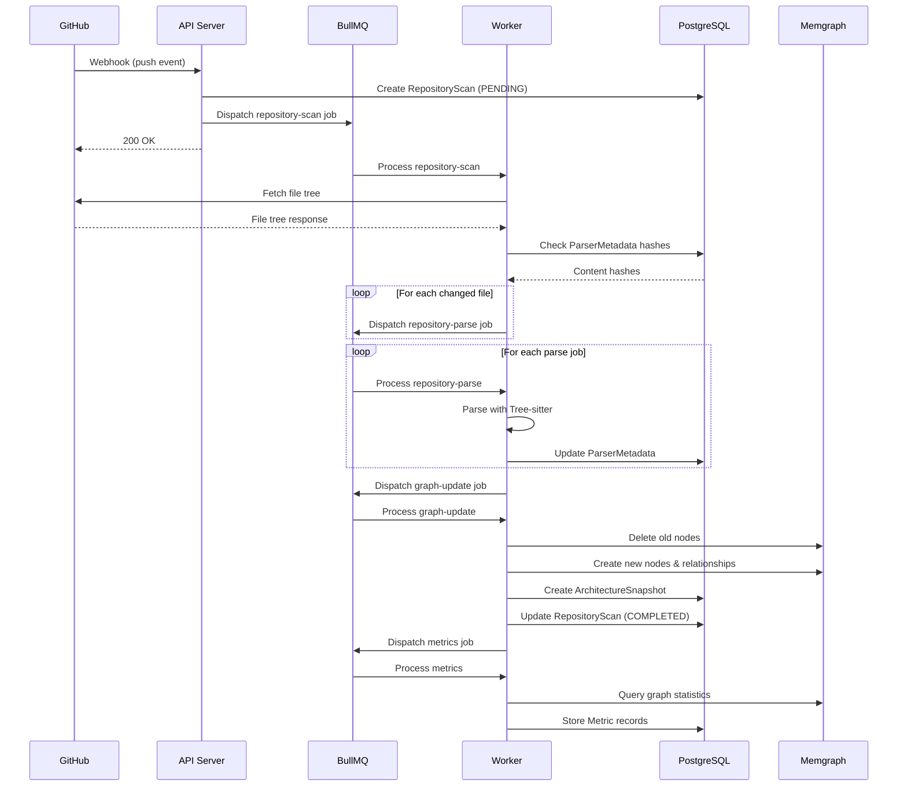

### 4.2 Blast Radius Sequence

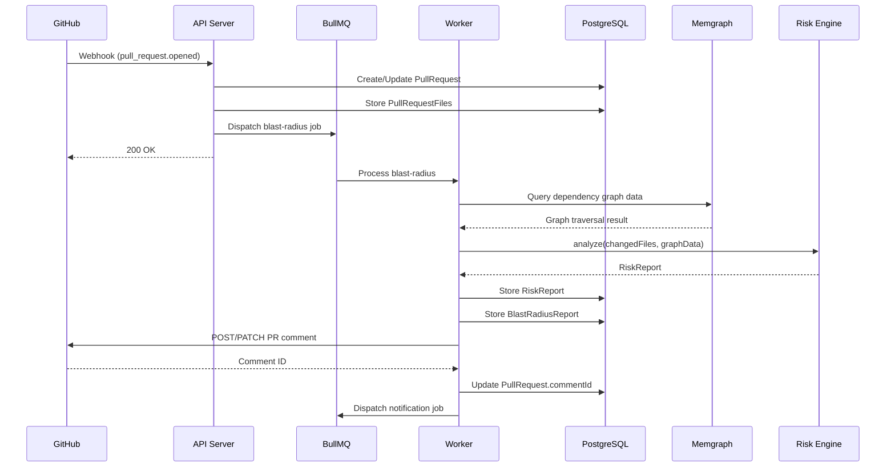

### 4.3 PR Comment Flow

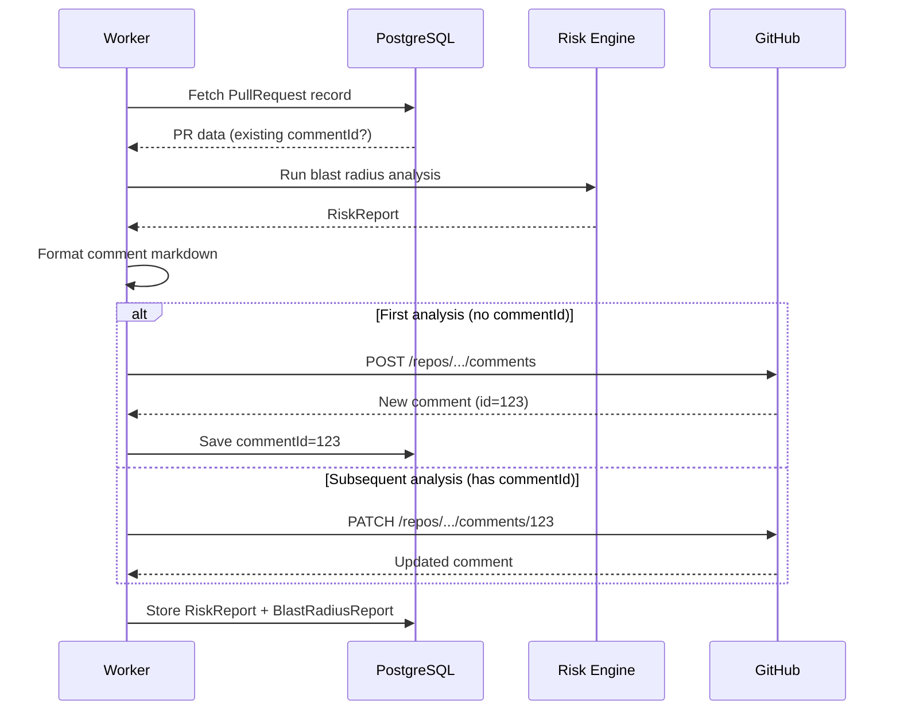

---

*End of Event Architecture. Continue to [11-api-design.md](./11-api-design.md) →*


---

# SystemMapper — API Design

**Document Version:** 1.0.0
**Last Updated:** 2026-06-27
**Parent Document:** [00-executive-summary.md](./00-executive-summary.md)

---

## Table of Contents

1. [Overview](#1-overview)
2. [API Conventions](#2-api-conventions)
3. [Authentication & Authorization](#3-authentication--authorization)
4. [Controller Specifications](#4-controller-specifications)
5. [Error Handling](#5-error-handling)
6. [Pagination, Filtering, Sorting](#6-pagination-filtering-sorting)

---

## 1. Overview

The SystemMapper API is a RESTful API served by the NestJS application at `apps/api`. All endpoints are prefixed with `/api/v1/`. The API serves the web frontend and will eventually support external integrations.

### 1.1 Base URL

```
http://localhost:3001/api/v1
```

### 1.2 Content Type

All requests and responses use `application/json`.

### 1.3 Versioning Strategy

API versioning uses URL path prefix (`/api/v1/`, `/api/v2/`). When breaking changes are introduced:

1. Add the new version (`v2`) alongside the old (`v1`).
2. Deprecate the old version with a response header: `X-API-Deprecated: true`.
3. Remove the old version after a migration period.

---

## 2. API Conventions

### 2.1 URL Patterns

| Pattern | Example | Description |
|---------|---------|-------------|
| Collection | `GET /repositories` | List resources |
| Single resource | `GET /repositories/:id` | Get a specific resource |
| Sub-resource | `GET /repositories/:id/scans` | List child resources |
| Action | `POST /repositories/:id/scan` | Trigger an action |
| Nested action | `POST /repositories/:id/scans/:scanId/retry` | Action on child |

### 2.2 HTTP Methods

| Method | Usage | Idempotent |
|--------|-------|-----------|
| `GET` | Read resources | Yes |
| `POST` | Create resources, trigger actions | No |
| `PUT` | Full update (replace) | Yes |
| `PATCH` | Partial update | No |
| `DELETE` | Soft delete | Yes |

### 2.3 Response Format

All successful responses follow a standard envelope:

**Single Resource:**

```json
{
  "data": { ... },
  "meta": { "requestId": "..." }
}
```

**Collection:**

```json
{
  "data": [ ... ],
  "meta": {
    "requestId": "...",
    "pagination": {
      "page": 1,
      "pageSize": 20,
      "totalItems": 150,
      "totalPages": 8
    }
  }
}
```

**Error:**

```json
{
  "error": {
    "code": "RESOURCE_NOT_FOUND",
    "message": "Repository not found",
    "statusCode": 404,
    "details": { ... }
  },
  "meta": { "requestId": "..." }
}
```

### 2.4 Status Codes

| Code | Usage |
|------|-------|
| 200 | Successful GET, PUT, PATCH |
| 201 | Successful POST (resource created) |
| 204 | Successful DELETE |
| 400 | Validation error |
| 401 | Not authenticated |
| 403 | Not authorized |
| 404 | Resource not found |
| 409 | Conflict (duplicate) |
| 422 | Unprocessable entity |
| 429 | Rate limited |
| 500 | Internal server error |

---

## 3. Authentication & Authorization

### 3.1 Authentication

All API endpoints (except webhooks and health checks) require authentication via a JWT Bearer token:

```
Authorization: Bearer <supabase_jwt_token>
```

The JWT is issued by Supabase Auth and verified by the API using the Supabase JWT secret. The decoded token contains the user's `sub` (Supabase user ID) which is used to look up the `User` record.

### 3.2 RBAC Model

**Role Hierarchy:**

```
OWNER > ADMIN > MEMBER > VIEWER
```

**Permission Matrix:**

| Action | OWNER | ADMIN | MEMBER | VIEWER |
|--------|:-----:|:-----:|:------:|:------:|
| View repositories | ✓ | ✓ | ✓ | ✓ |
| View architecture | ✓ | ✓ | ✓ | ✓ |
| View metrics | ✓ | ✓ | ✓ | ✓ |
| View blast radius | ✓ | ✓ | ✓ | ✓ |
| Trigger scan | ✓ | ✓ | ✓ | ✗ |
| Save views | ✓ | ✓ | ✓ | ✗ |
| Post comments | ✓ | ✓ | ✓ | ✗ |
| Manage repo settings | ✓ | ✓ | ✗ | ✗ |
| Connect repositories | ✓ | ✓ | ✗ | ✗ |
| Manage members | ✓ | ✓ | ✗ | ✗ |
| Manage org settings | ✓ | ✓ | ✗ | ✗ |
| Transfer ownership | ✓ | ✗ | ✗ | ✗ |
| Delete organization | ✓ | ✗ | ✗ | ✗ |
| Manage API keys | ✓ | ✓ | ✗ | ✗ |
| Manage feature flags | ✓ | ✓ | ✗ | ✗ |

### 3.3 Authorization Guards

NestJS guards enforce authorization:

1. **`AuthGuard`** — Verifies JWT and attaches the user to the request.
2. **`RolesGuard`** — Checks the user's organization role against required roles.
3. **`RepositoryAccessGuard`** — Checks repository-level permissions.

Guards are applied via decorators:

```
@Roles(Role.ADMIN)        // Requires ADMIN or higher
@RepositoryAccess(Role.MEMBER)  // Requires MEMBER access to the repository
```

---

## 4. Controller Specifications

### 4.1 Auth Controller — `/api/v1/auth`

| Method | Path | Description | Auth |
|--------|------|-------------|------|
| `GET` | `/auth/github` | Initiate GitHub OAuth flow | No |
| `GET` | `/auth/github/callback` | GitHub OAuth callback | No |
| `POST` | `/auth/logout` | Logout user | Yes |
| `GET` | `/auth/me` | Get current user profile | Yes |
| `PATCH` | `/auth/me` | Update current user profile | Yes |

### 4.2 Organizations Controller — `/api/v1/organizations`

| Method | Path | Description | Auth | Role |
|--------|------|-------------|------|------|
| `GET` | `/organizations` | List user's organizations | Yes | Any |
| `POST` | `/organizations` | Create organization | Yes | — |
| `GET` | `/organizations/:id` | Get organization details | Yes | Any |
| `PATCH` | `/organizations/:id` | Update organization | Yes | ADMIN |
| `DELETE` | `/organizations/:id` | Delete organization | Yes | OWNER |
| `GET` | `/organizations/:id/members` | List members | Yes | Any |
| `POST` | `/organizations/:id/members` | Invite member | Yes | ADMIN |
| `PATCH` | `/organizations/:id/members/:memberId` | Update member role | Yes | ADMIN |
| `DELETE` | `/organizations/:id/members/:memberId` | Remove member | Yes | ADMIN |

### 4.3 Repositories Controller — `/api/v1/repositories`

| Method | Path | Description | Auth | Role |
|--------|------|-------------|------|------|
| `GET` | `/repositories` | List repositories (org-scoped) | Yes | Any |
| `POST` | `/repositories` | Connect a repository | Yes | ADMIN |
| `GET` | `/repositories/:id` | Get repository details | Yes | Any |
| `PATCH` | `/repositories/:id` | Update repository settings | Yes | ADMIN |
| `DELETE` | `/repositories/:id` | Disconnect repository | Yes | ADMIN |
| `POST` | `/repositories/:id/scan` | Trigger manual scan | Yes | MEMBER |
| `GET` | `/repositories/:id/scans` | List scan history | Yes | Any |
| `GET` | `/repositories/:id/scans/:scanId` | Get scan details | Yes | Any |

### 4.4 Architecture Controller — `/api/v1/repositories/:id/architecture`

| Method | Path | Description | Auth | Role |
|--------|------|-------------|------|------|
| `GET` | `/repositories/:id/architecture` | Get current architecture graph | Yes | Any |
| `GET` | `/repositories/:id/architecture/snapshots` | List snapshots | Yes | Any |
| `GET` | `/repositories/:id/architecture/snapshots/:snapshotId` | Get snapshot details | Yes | Any |
| `GET` | `/repositories/:id/architecture/compare` | Compare two snapshots | Yes | Any |
| `GET` | `/repositories/:id/architecture/search` | Search graph nodes | Yes | Any |

**Query Parameters for Architecture Graph:**

| Parameter | Type | Default | Description |
|-----------|------|---------|-------------|
| `depth` | number | 3 | Maximum traversal depth |
| `nodeTypes` | string[] | all | Filter by node types |
| `layout` | string | "hierarchical" | Layout algorithm |
| `focus` | string | — | Center on a specific node |
| `includeExternal` | boolean | false | Include external packages |

### 4.5 Blast Radius Controller — `/api/v1/repositories/:id/blast-radius`

| Method | Path | Description | Auth | Role |
|--------|------|-------------|------|------|
| `GET` | `/repositories/:id/blast-radius` | List blast radius reports | Yes | Any |
| `POST` | `/repositories/:id/blast-radius/analyze` | Run on-demand analysis | Yes | MEMBER |
| `GET` | `/repositories/:id/blast-radius/:reportId` | Get specific report | Yes | Any |

### 4.6 Pull Requests Controller — `/api/v1/repositories/:id/pull-requests`

| Method | Path | Description | Auth | Role |
|--------|------|-------------|------|------|
| `GET` | `/repositories/:id/pull-requests` | List tracked PRs | Yes | Any |
| `GET` | `/repositories/:id/pull-requests/:prId` | Get PR details with risk data | Yes | Any |

### 4.7 Metrics Controller — `/api/v1/repositories/:id/metrics`

| Method | Path | Description | Auth | Role |
|--------|------|-------------|------|------|
| `GET` | `/repositories/:id/metrics` | Get current metrics | Yes | Any |
| `GET` | `/repositories/:id/metrics/history` | Get metrics time series | Yes | Any |
| `GET` | `/repositories/:id/metrics/trends` | Get metric trends | Yes | Any |

### 4.8 Webhooks Controller — `/api/v1/webhooks`

| Method | Path | Description | Auth |
|--------|------|-------------|------|
| `POST` | `/webhooks/github` | GitHub webhook receiver | Webhook signature |

### 4.9 Notifications Controller — `/api/v1/notifications`

| Method | Path | Description | Auth | Role |
|--------|------|-------------|------|------|
| `GET` | `/notifications` | List user notifications | Yes | Any |
| `PATCH` | `/notifications/:id/read` | Mark notification as read | Yes | Any |
| `POST` | `/notifications/read-all` | Mark all as read | Yes | Any |

### 4.10 Saved Views Controller — `/api/v1/repositories/:id/views`

| Method | Path | Description | Auth | Role |
|--------|------|-------------|------|------|
| `GET` | `/repositories/:id/views` | List saved views | Yes | Any |
| `POST` | `/repositories/:id/views` | Create saved view | Yes | MEMBER |
| `GET` | `/repositories/:id/views/:viewId` | Get saved view | Yes | Any |
| `PATCH` | `/repositories/:id/views/:viewId` | Update saved view | Yes | MEMBER |
| `DELETE` | `/repositories/:id/views/:viewId` | Delete saved view | Yes | MEMBER |

### 4.11 Settings Controller — `/api/v1/settings`

| Method | Path | Description | Auth | Role |
|--------|------|-------------|------|------|
| `GET` | `/settings/preferences` | Get user preferences | Yes | Any |
| `PATCH` | `/settings/preferences` | Update user preferences | Yes | Any |

### 4.12 Admin Controller — `/api/v1/admin`

| Method | Path | Description | Auth | Role |
|--------|------|-------------|------|------|
| `GET` | `/admin/jobs` | List recent jobs | Yes | ADMIN |
| `GET` | `/admin/jobs/failed` | List failed jobs | Yes | ADMIN |
| `POST` | `/admin/jobs/:jobId/retry` | Retry a failed job | Yes | ADMIN |
| `GET` | `/admin/audit-logs` | List audit logs | Yes | ADMIN |
| `GET` | `/admin/feature-flags` | List feature flags | Yes | ADMIN |
| `PATCH` | `/admin/feature-flags/:id` | Update feature flag | Yes | ADMIN |
| `GET` | `/admin/health` | System health check | No | — |

### 4.13 GitHub Integration Controller — `/api/v1/github`

| Method | Path | Description | Auth | Role |
|--------|------|-------------|------|------|
| `GET` | `/github/installations` | List GitHub installations | Yes | ADMIN |
| `GET` | `/github/installations/:id/repositories` | List repos in installation | Yes | ADMIN |

---

## 5. Error Handling

### 5.1 Error Codes

| Code | HTTP Status | Description |
|------|------------|-------------|
| `VALIDATION_ERROR` | 400 | Request body/params validation failed |
| `UNAUTHORIZED` | 401 | Missing or invalid authentication |
| `FORBIDDEN` | 403 | Insufficient permissions |
| `RESOURCE_NOT_FOUND` | 404 | Resource does not exist |
| `CONFLICT` | 409 | Duplicate resource |
| `RATE_LIMITED` | 429 | Too many requests |
| `INTERNAL_ERROR` | 500 | Unexpected server error |
| `SCAN_IN_PROGRESS` | 409 | A scan is already running for this repo |
| `GRAPH_UNAVAILABLE` | 503 | Memgraph is not available |
| `GITHUB_API_ERROR` | 502 | GitHub API returned an error |

### 5.2 Global Exception Filter

A NestJS exception filter catches all uncaught exceptions and formats them into the standard error response. It:

1. Logs the full error with stack trace.
2. Strips internal details from the response.
3. Adds the `requestId` for correlation.
4. Returns the appropriate HTTP status code.

---

## 6. Pagination, Filtering, Sorting

### 6.1 Pagination

All list endpoints support offset-based pagination:

| Parameter | Type | Default | Description |
|-----------|------|---------|-------------|
| `page` | number | 1 | Page number (1-indexed) |
| `pageSize` | number | 20 | Items per page (max: 100) |

**Response Meta:**

```json
{
  "pagination": {
    "page": 1,
    "pageSize": 20,
    "totalItems": 150,
    "totalPages": 8,
    "hasNextPage": true,
    "hasPreviousPage": false
  }
}
```

### 6.2 Filtering

List endpoints support field-based filtering via query parameters:

```
GET /repositories?language=typescript&isActive=true
GET /repositories/:id/scans?status=COMPLETED&branch=main
GET /repositories/:id/metrics/history?type=ARCHITECTURE_SCORE&from=2024-01-01&to=2024-12-31
```

### 6.3 Sorting

List endpoints support sorting via the `sort` query parameter:

```
GET /repositories?sort=lastScannedAt:desc
GET /repositories/:id/scans?sort=createdAt:desc
GET /repositories/:id/pull-requests?sort=riskScore:desc
```

Format: `fieldName:asc|desc`. Multiple sort fields are comma-separated: `sort=riskLevel:desc,createdAt:desc`.

### 6.4 DTO Validation

All request bodies are validated using `class-validator` decorators on DTO classes. Validation failures return a 400 response with field-level error messages:

```json
{
  "error": {
    "code": "VALIDATION_ERROR",
    "message": "Validation failed",
    "statusCode": 400,
    "details": [
      { "field": "name", "message": "name must not be empty" },
      { "field": "slug", "message": "slug must be a valid URL slug" }
    ]
  }
}
```

---

*End of API Design. Continue to [12-shared-types.md](./12-shared-types.md) →*


---

# SystemMapper — Shared Types Package

**Document Version:** 1.0.0
**Last Updated:** 2026-06-27
**Parent Document:** [00-executive-summary.md](./00-executive-summary.md)

---

## Table of Contents

1. [Overview](#1-overview)
2. [Enums](#2-enums)
3. [Domain Interfaces](#3-domain-interfaces)
4. [DTOs](#4-dtos)
5. [Graph Types](#5-graph-types)
6. [Event Types](#6-event-types)
7. [Queue Payloads](#7-queue-payloads)
8. [Risk Report Types](#8-risk-report-types)
9. [Metric Types](#9-metric-types)
10. [Constants](#10-constants)
11. [Canonical IR Types](#11-canonical-ir-types)

---

## 1. Overview

The `@systemmapper/types` package is the **single source of truth** for all TypeScript types shared across the monorepo. It has **zero runtime dependencies** — it exports only type definitions, interfaces, enums, and constants.

**Design Rules:**
- No classes. Only interfaces and type aliases.
- No functions. Only type-level utilities.
- No runtime code. Only exports used at compile time (except enums and constants).
- No framework-specific types. No NestJS, no Prisma, no React types.

---

## 2. Enums

### 2.1 Core Enums

| Enum | Values | Usage |
|------|--------|-------|
| `Role` | `OWNER`, `ADMIN`, `MEMBER`, `VIEWER` | Organization member roles |
| `ScanStatus` | `PENDING`, `QUEUED`, `SCANNING`, `PARSING`, `BUILDING_GRAPH`, `CALCULATING_METRICS`, `COMPLETED`, `FAILED`, `CANCELLED` | Scan lifecycle |
| `ScanTriggerType` | `MANUAL`, `WEBHOOK`, `SCHEDULED`, `RETRY` | What initiated the scan |
| `RiskLevel` | `LOW`, `MEDIUM`, `HIGH`, `CRITICAL` | Risk classification |
| `PullRequestStatus` | `OPEN`, `CLOSED`, `MERGED` | PR lifecycle |
| `FileChangeStatus` | `ADDED`, `MODIFIED`, `REMOVED`, `RENAMED` | File change type in PRs |
| `NotificationType` | `SCAN_COMPLETE`, `SCAN_FAILED`, `HIGH_RISK_PR`, `MEMBER_INVITED`, `REPO_CONNECTED` | Notification categories |
| `Language` | `TYPESCRIPT`, `JAVASCRIPT`, `PYTHON`, `GO`, `JAVA`, `RUST`, `UNKNOWN` | Supported languages |
| `MetricType` | `FILE_COUNT`, `FUNCTION_COUNT`, `CLASS_COUNT`, `DEPENDENCY_COUNT`, `ARCHITECTURE_SCORE`, `TECHNICAL_DEBT_SCORE`, `COMPLEXITY_SCORE`, `DEPENDENCY_DENSITY`, `CIRCULAR_DEPENDENCY_COUNT` | Metric categories |
| `EventType` | `REPOSITORY_CONNECTED`, `REPOSITORY_QUEUED`, `REPOSITORY_PARSED`, `GRAPH_CREATED`, `GRAPH_UPDATED`, `SNAPSHOT_CREATED`, `PULL_REQUEST_OPENED`, `PULL_REQUEST_UPDATED`, `BLAST_RADIUS_CALCULATED`, `COMMENT_PUBLISHED`, `METRICS_CALCULATED`, `NOTIFICATION_SENT` | Domain events |
| `QueueName` | `REPOSITORY_SCAN`, `REPOSITORY_PARSE`, `GRAPH_BUILD`, `GRAPH_UPDATE`, `BLAST_RADIUS`, `METRICS`, `NOTIFICATIONS`, `CLEANUP`, `RETRY` | BullMQ queue names |
| `GraphNodeType` | `REPOSITORY`, `WORKSPACE`, `DIRECTORY`, `FILE`, `MODULE`, `PACKAGE`, `NAMESPACE`, `CLASS`, `INTERFACE`, `TYPE`, `ENUM`, `FUNCTION`, `METHOD`, `VARIABLE`, `API_ENDPOINT`, `DATABASE_TABLE`, `DATABASE_COLUMN`, `QUEUE`, `TOPIC`, `EXTERNAL_SERVICE`, `ENVIRONMENT_VARIABLE`, `CONFIGURATION` | Memgraph node labels |
| `GraphRelationType` | `IMPORTS`, `CALLS`, `USES`, `OWNS`, `DEPENDS_ON`, `IMPLEMENTS`, `EXTENDS`, `READS`, `WRITES`, `CONTAINS`, `CONNECTS_TO`, `AUTHENTICATES`, `QUERIES`, `EMITS`, `SUBSCRIBES`, `EXPOSES` | Memgraph relationship types |
| `AuditAction` | `CREATE`, `UPDATE`, `DELETE`, `LOGIN`, `LOGOUT`, `SCAN_TRIGGERED`, `MEMBER_INVITED`, `MEMBER_REMOVED`, `SETTINGS_CHANGED` | Audit log actions |
| `WebhookEventStatus` | `RECEIVED`, `PROCESSING`, `PROCESSED`, `FAILED`, `IGNORED` | Webhook processing status |

---

## 3. Domain Interfaces

### 3.1 User Domain

```
IUser {
  id: string
  email: string
  githubId: number
  githubUsername: string
  displayName: string
  avatarUrl: string | null
}
```

### 3.2 Organization Domain

```
IOrganization {
  id: string
  name: string
  slug: string
  githubOrgId: number | null
  githubOrgName: string | null
  avatarUrl: string | null
}

IOrganizationMember {
  id: string
  userId: string
  organizationId: string
  role: Role
  user: IUser
}
```

### 3.3 Repository Domain

```
IRepository {
  id: string
  organizationId: string
  name: string
  fullName: string
  githubRepoId: number
  defaultBranch: string
  language: string | null
  description: string | null
  isActive: boolean
  lastScannedAt: string | null
  lastScanStatus: ScanStatus | null
}

IRepositoryScan {
  id: string
  repositoryId: string
  status: ScanStatus
  triggerType: ScanTriggerType
  branch: string
  commitSha: string | null
  totalFiles: number
  parsedFiles: number
  failedFiles: number
  skippedFiles: number
  startedAt: string | null
  completedAt: string | null
  durationMs: number | null
  errorMessage: string | null
}
```

### 3.4 Pull Request Domain

```
IPullRequest {
  id: string
  repositoryId: string
  githubPrNumber: number
  title: string
  authorGithubUsername: string
  status: PullRequestStatus
  baseBranch: string
  headBranch: string
  riskScore: number | null
  riskLevel: RiskLevel | null
  commentId: string | null
}

IPullRequestFile {
  id: string
  pullRequestId: string
  filePath: string
  status: FileChangeStatus
  additions: number
  deletions: number
}
```

### 3.5 Architecture Domain

```
IArchitectureSnapshot {
  id: string
  repositoryId: string
  scanId: string
  nodeCount: number
  relationshipCount: number
  fileCount: number
  functionCount: number
  classCount: number
  architectureScore: number | null
  createdAt: string
}
```

---

## 4. DTOs

### 4.1 Request DTOs

```
CreateOrganizationDto {
  name: string
  slug: string
}

ConnectRepositoryDto {
  githubRepoId: number
  installationId: number
}

TriggerScanDto {
  branch?: string
}

CreateSavedViewDto {
  name: string
  graphConfig: Record<string, unknown>
  filters: Record<string, unknown>
}

UpdatePreferencesDto {
  theme?: 'light' | 'dark' | 'system'
  defaultGraphLayout?: string
  emailNotifications?: boolean
}

InviteMemberDto {
  email: string
  role: Role
}
```

### 4.2 Response DTOs

```
PaginatedResponse<T> {
  data: T[]
  meta: {
    pagination: PaginationMeta
    requestId: string
  }
}

PaginationMeta {
  page: number
  pageSize: number
  totalItems: number
  totalPages: number
  hasNextPage: boolean
  hasPreviousPage: boolean
}

ApiResponse<T> {
  data: T
  meta: { requestId: string }
}

ApiError {
  error: {
    code: string
    message: string
    statusCode: number
    details?: unknown
  }
  meta: { requestId: string }
}
```

---

## 5. Graph Types

```
GraphNode {
  nodeId: string
  nodeType: GraphNodeType
  name: string
  filePath?: string
  repositoryId: string
  properties: Record<string, unknown>
}

GraphEdge {
  sourceId: string
  targetId: string
  relationType: GraphRelationType
  properties: Record<string, unknown>
}

DependencyGraphData {
  nodes: GraphNode[]
  edges: GraphEdge[]
  fileIndex: Record<string, GraphNode>
  adjacencyList: Record<string, string[]>
  reverseAdjacencyList: Record<string, string[]>
}

GraphVisualizationData {
  nodes: VisualizationNode[]
  edges: VisualizationEdge[]
  metadata: {
    totalNodes: number
    totalEdges: number
    depth: number
    layout: string
  }
}

VisualizationNode {
  id: string
  label: string
  type: GraphNodeType
  group: string
  metadata: Record<string, unknown>
}

VisualizationEdge {
  id: string
  source: string
  target: string
  type: GraphRelationType
  animated: boolean
}
```

---

## 6. Event Types

```
DomainEvent<T> {
  eventId: string
  eventType: EventType
  timestamp: string
  correlationId: string
  source: string
  payload: T
}

RepositoryConnectedPayload {
  repositoryId: string
  organizationId: string
  githubRepoId: number
  fullName: string
  installationId: number
}

BlastRadiusCalculatedPayload {
  repositoryId: string
  pullRequestId: string
  riskReportId: string
  riskScore: number
  riskLevel: RiskLevel
  affectedFileCount: number
}

// (Other event payloads follow the same pattern per 10-event-architecture.md)
```

---

## 7. Queue Payloads

```
ScanJobPayload {
  repositoryId: string
  scanId: string
  branch: string
  commitSha: string | null
  triggerType: ScanTriggerType
  installationId: number
}

ParseJobPayload {
  repositoryId: string
  scanId: string
  filePath: string
  content: string
  language: Language
  contentHash: string
}

GraphBuildJobPayload {
  repositoryId: string
  scanId: string
  parsedFileCount: number
}

GraphUpdateJobPayload {
  repositoryId: string
  scanId: string
  changedFiles: string[]
  deletedFiles: string[]
  addedFiles: string[]
}

BlastRadiusJobPayload {
  repositoryId: string
  pullRequestId: string
  changedFiles: ChangedFile[]
  installationId: number
}

MetricsJobPayload {
  repositoryId: string
  scanId: string
  snapshotId: string
}

NotificationJobPayload {
  userId: string
  organizationId: string
  type: NotificationType
  title: string
  message: string
  link: string | null
  metadata: Record<string, unknown>
}

CleanupJobPayload {
  cleanupType: 'webhook_events' | 'job_history' | 'notifications' | 'health_check'
}

RetryJobPayload {
  originalQueue: QueueName
  originalJobId: string
  originalPayload: unknown
  retryReason: string
}
```

---

## 8. Risk Report Types

```
RiskReport {
  repositoryId: string
  analyzedAt: string
  riskScore: number
  riskLevel: RiskLevel
  blastRadius: BlastRadiusResult
  dependencyAnalysis: DependencyAnalysisResult
  circularDependencies: CircularDependencyResult
  architectureViolations: ArchitectureViolationResult
  criticalPath: CriticalPathResult
  reviewerSuggestions: ReviewerSuggestionResult
  scoring: RiskScoringResult
  changedFiles: ChangedFile[]
  options: AnalysisOptions
}

BlastRadiusResult {
  affectedFiles: AffectedFile[]
  totalAffectedNodes: number
  maxDepth: number
  dependencyChains: DependencyChain[]
}

AffectedFile {
  filePath: string
  distance: number
  weight: number
  affectedComponents: string[]
}

ChangedFile {
  filePath: string
  status: FileChangeStatus
  additions: number
  deletions: number
  previousPath?: string
}

RiskScoringResult {
  overallScore: number
  riskLevel: RiskLevel
  subScores: SubScore[]
  explanation: string
}

SubScore {
  name: string
  score: number
  weight: number
  weightedScore: number
}
```

---

## 9. Metric Types

```
MetricSnapshot {
  repositoryId: string
  measuredAt: string
  metrics: MetricValue[]
}

MetricValue {
  type: MetricType
  value: number
  unit: string
}

MetricTimeSeries {
  type: MetricType
  dataPoints: MetricDataPoint[]
}

MetricDataPoint {
  timestamp: string
  value: number
}

MetricTrend {
  type: MetricType
  direction: 'improving' | 'declining' | 'stable'
  changePercent: number
  currentValue: number
  previousValue: number
}
```

---

## 10. Constants

```
RISK_SCORE_WEIGHTS = {
  blastRadius: 0.30,
  dependencyCoupling: 0.20,
  circularDependencies: 0.15,
  architectureViolations: 0.15,
  criticalPath: 0.10,
  changeSize: 0.10,
}

DEFAULT_ANALYSIS_OPTIONS = {
  maxTraversalDepth: 5,
  decayFactor: 0.7,
  reviewerSuggestionLimit: 3,
}

MAX_FILE_SIZE_BYTES = 1_048_576  // 1 MB
MAX_PAGE_SIZE = 100
DEFAULT_PAGE_SIZE = 20
SCAN_TIMEOUT_MS = 300_000  // 5 minutes
PARSE_TIMEOUT_MS = 30_000  // 30 seconds
GRAPH_BUILD_TIMEOUT_MS = 600_000  // 10 minutes
```

## 11. Canonical IR Types

```
CanonicalNode {
  type: GraphNodeType
  name: string
  location: SourceLocation
  modifiers: string[]
  metadata: Record<string, unknown>
}

SourceLocation {
  filePath: string
  startLine: number
  endLine: number
}

CanonicalEdge {
  sourceType: GraphNodeType
  sourceName: string
  targetType: GraphNodeType
  targetName: string
  relationType: GraphRelationType
  isDynamic: boolean
}

CanonicalIR {
  nodes: CanonicalNode[]
  edges: CanonicalEdge[]
}
```

---

*End of Shared Types Package. Continue to [13-folder-structure.md](./13-folder-structure.md) →*


---

# SystemMapper — Complete Folder Structure

**Document Version:** 1.0.0
**Last Updated:** 2026-06-27
**Parent Document:** [00-executive-summary.md](./00-executive-summary.md)

---

## 1. Root Structure

```
systemmapper/
├── .github/
│   ├── workflows/
│   │   ├── ci.yml
│   │   └── lint.yml
│   └── PULL_REQUEST_TEMPLATE.md
├── .husky/
│   ├── pre-commit
│   └── commit-msg
├── apps/
│   ├── api/
│   ├── web/
│   └── worker/
├── packages/
│   ├── analytics/
│   ├── config/
│   ├── database/
│   ├── github/
│   ├── graph/
│   ├── parser/
│   ├── risk-engine/
│   ├── shared/
│   ├── types/
│   └── ui/
├── docker/
│   ├── api.Dockerfile
│   ├── web.Dockerfile
│   ├── worker.Dockerfile
│   └── memgraph/
│       └── init-constraints.cypher
├── .env.example
├── .eslintrc.js
├── .gitignore
├── .prettierrc
├── commitlint.config.js
├── docker-compose.yml
├── package.json
├── pnpm-lock.yaml
├── pnpm-workspace.yaml
├── README.md
├── tsconfig.base.json
└── turbo.json
```

---

## 2. `apps/api/` — NestJS Backend

```
apps/api/
├── src/
│   ├── main.ts
│   ├── app.module.ts
│   ├── common/
│   │   ├── decorators/
│   │   │   ├── roles.decorator.ts
│   │   │   ├── current-user.decorator.ts
│   │   │   └── repository-access.decorator.ts
│   │   ├── filters/
│   │   │   └── global-exception.filter.ts
│   │   ├── guards/
│   │   │   ├── auth.guard.ts
│   │   │   ├── roles.guard.ts
│   │   │   └── repository-access.guard.ts
│   │   ├── interceptors/
│   │   │   ├── logging.interceptor.ts
│   │   │   ├── transform.interceptor.ts
│   │   │   └── timeout.interceptor.ts
│   │   ├── middleware/
│   │   │   ├── correlation-id.middleware.ts
│   │   │   └── request-logger.middleware.ts
│   │   ├── pipes/
│   │   │   └── validation.pipe.ts
│   │   └── utils/
│   │       ├── pagination.util.ts
│   │       └── response.util.ts
│   ├── modules/
│   │   ├── auth/
│   │   │   ├── auth.module.ts
│   │   │   ├── auth.controller.ts
│   │   │   ├── auth.service.ts
│   │   │   ├── strategies/
│   │   │   │   └── github-oauth.strategy.ts
│   │   │   └── dto/
│   │   │       └── auth-response.dto.ts
│   │   ├── organizations/
│   │   │   ├── organizations.module.ts
│   │   │   ├── organizations.controller.ts
│   │   │   ├── organizations.service.ts
│   │   │   └── dto/
│   │   │       ├── create-organization.dto.ts
│   │   │       ├── update-organization.dto.ts
│   │   │       └── invite-member.dto.ts
│   │   ├── repositories/
│   │   │   ├── repositories.module.ts
│   │   │   ├── repositories.controller.ts
│   │   │   ├── repositories.service.ts
│   │   │   └── dto/
│   │   │       ├── connect-repository.dto.ts
│   │   │       ├── trigger-scan.dto.ts
│   │   │       └── repository-response.dto.ts
│   │   ├── architecture/
│   │   │   ├── architecture.module.ts
│   │   │   ├── architecture.controller.ts
│   │   │   └── architecture.service.ts
│   │   ├── blast-radius/
│   │   │   ├── blast-radius.module.ts
│   │   │   ├── blast-radius.controller.ts
│   │   │   └── blast-radius.service.ts
│   │   ├── pull-requests/
│   │   │   ├── pull-requests.module.ts
│   │   │   ├── pull-requests.controller.ts
│   │   │   └── pull-requests.service.ts
│   │   ├── metrics/
│   │   │   ├── metrics.module.ts
│   │   │   ├── metrics.controller.ts
│   │   │   └── metrics.service.ts
│   │   ├── notifications/
│   │   │   ├── notifications.module.ts
│   │   │   ├── notifications.controller.ts
│   │   │   └── notifications.service.ts
│   │   ├── webhooks/
│   │   │   ├── webhooks.module.ts
│   │   │   ├── webhooks.controller.ts
│   │   │   ├── webhooks.service.ts
│   │   │   └── handlers/
│   │   │       ├── installation.handler.ts
│   │   │       ├── push.handler.ts
│   │   │       └── pull-request.handler.ts
│   │   ├── saved-views/
│   │   │   ├── saved-views.module.ts
│   │   │   ├── saved-views.controller.ts
│   │   │   └── saved-views.service.ts
│   │   ├── settings/
│   │   │   ├── settings.module.ts
│   │   │   ├── settings.controller.ts
│   │   │   └── settings.service.ts
│   │   ├── admin/
│   │   │   ├── admin.module.ts
│   │   │   ├── admin.controller.ts
│   │   │   └── admin.service.ts
│   │   └── github-integration/
│   │       ├── github-integration.module.ts
│   │       ├── github-integration.controller.ts
│   │       └── github-integration.service.ts
│   └── config/
│       └── app.config.ts
├── test/
│   ├── app.e2e-spec.ts
│   ├── jest-e2e.json
│   └── fixtures/
│       └── test-data.ts
├── .env.example
├── nest-cli.json
├── package.json
├── tsconfig.json
└── tsconfig.build.json
```

---

## 3. `apps/web/` — Next.js Frontend

```
apps/web/
├── public/
│   ├── favicon.ico
│   └── images/
├── src/
│   ├── app/
│   │   ├── layout.tsx
│   │   ├── page.tsx
│   │   ├── globals.css
│   │   ├── (auth)/
│   │   │   ├── login/
│   │   │   │   └── page.tsx
│   │   │   └── callback/
│   │   │       └── page.tsx
│   │   ├── (dashboard)/
│   │   │   ├── layout.tsx
│   │   │   ├── page.tsx
│   │   │   ├── repositories/
│   │   │   │   ├── page.tsx
│   │   │   │   └── [id]/
│   │   │   │       ├── page.tsx
│   │   │   │       ├── architecture/
│   │   │   │       │   └── page.tsx
│   │   │   │       ├── blast-radius/
│   │   │   │       │   └── page.tsx
│   │   │   │       ├── pull-requests/
│   │   │   │       │   ├── page.tsx
│   │   │   │       │   └── [prId]/
│   │   │   │       │       └── page.tsx
│   │   │   │       ├── metrics/
│   │   │   │       │   └── page.tsx
│   │   │   │       ├── scans/
│   │   │   │       │   └── page.tsx
│   │   │   │       └── settings/
│   │   │   │           └── page.tsx
│   │   │   ├── organizations/
│   │   │   │   ├── page.tsx
│   │   │   │   └── [orgId]/
│   │   │   │       ├── page.tsx
│   │   │   │       ├── members/
│   │   │   │       │   └── page.tsx
│   │   │   │       └── settings/
│   │   │   │           └── page.tsx
│   │   │   ├── notifications/
│   │   │   │   └── page.tsx
│   │   │   └── settings/
│   │   │       └── page.tsx
│   │   └── api/
│   │       └── health/
│   │           └── route.ts
│   ├── components/
│   │   ├── layout/
│   │   │   ├── sidebar.tsx
│   │   │   ├── header.tsx
│   │   │   └── nav-item.tsx
│   │   ├── architecture/
│   │   │   ├── graph-canvas.tsx
│   │   │   ├── graph-controls.tsx
│   │   │   ├── graph-legend.tsx
│   │   │   ├── node-detail-panel.tsx
│   │   │   └── snapshot-selector.tsx
│   │   ├── blast-radius/
│   │   │   ├── blast-radius-view.tsx
│   │   │   ├── affected-files-list.tsx
│   │   │   └── risk-score-badge.tsx
│   │   ├── metrics/
│   │   │   ├── metrics-dashboard.tsx
│   │   │   ├── metric-card.tsx
│   │   │   ├── trend-chart.tsx
│   │   │   └── score-gauge.tsx
│   │   └── shared/
│   │       ├── data-table.tsx
│   │       ├── loading-skeleton.tsx
│   │       ├── empty-state.tsx
│   │       └── error-boundary.tsx
│   ├── hooks/
│   │   ├── use-repositories.ts
│   │   ├── use-architecture.ts
│   │   ├── use-blast-radius.ts
│   │   ├── use-metrics.ts
│   │   ├── use-auth.ts
│   │   └── use-notifications.ts
│   ├── lib/
│   │   ├── api-client.ts
│   │   ├── supabase.ts
│   │   ├── query-client.ts
│   │   └── utils.ts
│   ├── providers/
│   │   ├── auth-provider.tsx
│   │   ├── query-provider.tsx
│   │   └── theme-provider.tsx
│   └── types/
│       └── next-auth.d.ts
├── .env.example
├── next.config.js
├── package.json
├── postcss.config.js
├── tailwind.config.ts
└── tsconfig.json
```

---

## 4. `apps/worker/` — NestJS Worker

```
apps/worker/
├── src/
│   ├── main.ts
│   ├── worker.module.ts
│   ├── processors/
│   │   ├── scan.processor.ts
│   │   ├── parse.processor.ts
│   │   ├── graph-build.processor.ts
│   │   ├── graph-update.processor.ts
│   │   ├── blast-radius.processor.ts
│   │   ├── metrics.processor.ts
│   │   ├── notification.processor.ts
│   │   ├── cleanup.processor.ts
│   │   └── retry.processor.ts
│   ├── orchestrators/
│   │   ├── scan.orchestrator.ts
│   │   └── blast-radius.orchestrator.ts
│   ├── schedulers/
│   │   └── cleanup.scheduler.ts
│   └── config/
│       └── worker.config.ts
├── test/
│   ├── processors/
│   │   ├── scan.processor.spec.ts
│   │   ├── parse.processor.spec.ts
│   │   └── blast-radius.processor.spec.ts
│   └── fixtures/
│       └── test-data.ts
├── .env.example
├── nest-cli.json
├── package.json
├── tsconfig.json
└── tsconfig.build.json
```

---

## 5. `packages/types/`

```
packages/types/
├── src/
│   ├── index.ts
│   ├── enums/
│   │   ├── index.ts
│   │   ├── role.enum.ts
│   │   ├── scan-status.enum.ts
│   │   ├── risk-level.enum.ts
│   │   ├── language.enum.ts
│   │   ├── metric-type.enum.ts
│   │   ├── event-type.enum.ts
│   │   ├── queue-name.enum.ts
│   │   ├── graph-node-type.enum.ts
│   │   └── graph-relation-type.enum.ts
│   ├── interfaces/
│   │   ├── index.ts
│   │   ├── user.interface.ts
│   │   ├── organization.interface.ts
│   │   ├── repository.interface.ts
│   │   ├── scan.interface.ts
│   │   ├── pull-request.interface.ts
│   │   ├── architecture.interface.ts
│   │   └── notification.interface.ts
│   ├── dto/
│   │   ├── index.ts
│   │   ├── request.dto.ts
│   │   └── response.dto.ts
│   ├── graph/
│   │   ├── index.ts
│   │   ├── graph-node.type.ts
│   │   ├── graph-edge.type.ts
│   │   └── dependency-graph.type.ts
│   ├── events/
│   │   ├── index.ts
│   │   └── domain-event.type.ts
│   ├── queue/
│   │   ├── index.ts
│   │   └── job-payloads.type.ts
│   ├── risk/
│   │   ├── index.ts
│   │   ├── risk-report.type.ts
│   │   ├── blast-radius.type.ts
│   │   └── analysis-options.type.ts
│   ├── metrics/
│   │   ├── index.ts
│   │   └── metric.type.ts
│   └── constants/
│       ├── index.ts
│       ├── risk-weights.const.ts
│       └── defaults.const.ts
├── package.json
└── tsconfig.json
```

---

## 6. `packages/database/`

```
packages/database/
├── prisma/
│   ├── schema.prisma
│   ├── migrations/
│   │   └── .gitkeep
│   └── seed.ts
├── src/
│   ├── index.ts
│   ├── client.ts
│   ├── repositories/
│   │   ├── index.ts
│   │   ├── base.repository.ts
│   │   ├── user.repository.ts
│   │   ├── organization.repository.ts
│   │   ├── repository.repository.ts
│   │   ├── scan.repository.ts
│   │   ├── pull-request.repository.ts
│   │   ├── snapshot.repository.ts
│   │   ├── risk-report.repository.ts
│   │   ├── metric.repository.ts
│   │   ├── notification.repository.ts
│   │   ├── webhook-event.repository.ts
│   │   ├── audit-log.repository.ts
│   │   ├── saved-view.repository.ts
│   │   └── parser-metadata.repository.ts
│   └── utils/
│       ├── pagination.util.ts
│       └── soft-delete.util.ts
├── package.json
└── tsconfig.json
```

---

## 7. `packages/parser/`

```
packages/parser/
├── grammars/
│   ├── tree-sitter-typescript.wasm
│   ├── tree-sitter-tsx.wasm
│   ├── tree-sitter-javascript.wasm
│   ├── tree-sitter-python.wasm
│   ├── tree-sitter-go.wasm
│   ├── tree-sitter-java.wasm
│   └── tree-sitter-rust.wasm
├── src/
│   ├── index.ts
│   ├── parser.ts
│   ├── pipeline/
│   │   ├── parser-pipeline.ts
│   │   ├── language-detector.ts
│   │   ├── ir-builder.ts
│   │   └── ir-validator.ts
│   ├── extractors/
│   │   ├── base.extractor.ts
│   │   ├── typescript.extractor.ts
│   │   ├── javascript.extractor.ts
│   │   ├── python.extractor.ts
│   │   ├── go.extractor.ts
│   │   ├── java.extractor.ts
│   │   └── rust.extractor.ts
│   ├── registry/
│   │   └── language-registry.ts
│   └── utils/
│       ├── import-resolver.ts
│       ├── complexity-calculator.ts
│       └── hash.util.ts
├── test/
│   ├── extractors/
│   │   ├── typescript.extractor.spec.ts
│   │   ├── python.extractor.spec.ts
│   │   └── go.extractor.spec.ts
│   ├── pipeline/
│   │   └── parser-pipeline.spec.ts
│   └── fixtures/
│       ├── typescript/
│       │   ├── simple-class.ts
│       │   ├── complex-imports.ts
│       │   └── error-syntax.ts
│       ├── python/
│       │   └── simple-module.py
│       └── go/
│           └── simple-package.go
├── package.json
└── tsconfig.json
```

---

## 8. `packages/graph/`

```
packages/graph/
├── src/
│   ├── index.ts
│   ├── driver/
│   │   ├── neo4j-driver.ts
│   │   └── memgraph-session.ts
│   ├── repositories/
│   │   ├── base.graph-repository.ts
│   │   ├── file.graph-repository.ts
│   │   ├── class.graph-repository.ts
│   │   ├── function.graph-repository.ts
│   │   ├── relationship.graph-repository.ts
│   │   └── traversal.graph-repository.ts
│   ├── builders/
│   │   ├── graph-builder.ts
│   │   ├── node-builder.ts
│   │   └── relationship-builder.ts
│   ├── queries/
│   │   ├── blast-radius.query.ts
│   │   ├── circular-dependency.query.ts
│   │   ├── dead-code.query.ts
│   │   ├── statistics.query.ts
│   │   └── visualization.query.ts
│   ├── sync/
│   │   ├── graph-synchronizer.ts
│   │   ├── incremental-updater.ts
│   │   └── graph-rebuilder.ts
│   └── utils/
│       ├── cypher-builder.ts
│       ├── node-id-generator.ts
│       └── schema-version.ts
├── test/
│   ├── builders/
│   │   └── graph-builder.spec.ts
│   ├── queries/
│   │   └── blast-radius.query.spec.ts
│   └── fixtures/
│       └── test-graph-data.ts
├── package.json
└── tsconfig.json
```

---

## 9. `packages/risk-engine/`

```
packages/risk-engine/
├── src/
│   ├── index.ts
│   ├── risk-engine.ts
│   ├── strategies/
│   │   ├── blast-radius.strategy.ts
│   │   ├── dependency-analysis.strategy.ts
│   │   ├── circular-dependency.strategy.ts
│   │   ├── architecture-violation.strategy.ts
│   │   ├── critical-path.strategy.ts
│   │   ├── reviewer-suggestion.strategy.ts
│   │   └── risk-scoring.strategy.ts
│   ├── algorithms/
│   │   ├── bfs-traversal.ts
│   │   ├── tarjan-scc.ts
│   │   ├── topological-sort.ts
│   │   └── longest-path.ts
│   └── interfaces/
│       ├── risk-strategy.interface.ts
│       ├── strategy-context.interface.ts
│       └── analysis-input.interface.ts
├── test/
│   ├── strategies/
│   │   ├── blast-radius.strategy.spec.ts
│   │   ├── dependency-analysis.strategy.spec.ts
│   │   ├── circular-dependency.strategy.spec.ts
│   │   ├── architecture-violation.strategy.spec.ts
│   │   ├── critical-path.strategy.spec.ts
│   │   ├── reviewer-suggestion.strategy.spec.ts
│   │   └── risk-scoring.strategy.spec.ts
│   ├── risk-engine.spec.ts
│   └── fixtures/
│       ├── simple-graph.fixture.ts
│       ├── circular-graph.fixture.ts
│       └── complex-graph.fixture.ts
├── package.json
└── tsconfig.json
```

---

## 10. `packages/github/`

```
packages/github/
├── src/
│   ├── index.ts
│   ├── github-app.ts
│   ├── services/
│   │   ├── authentication.service.ts
│   │   ├── repository.service.ts
│   │   ├── pull-request.service.ts
│   │   ├── comment.service.ts
│   │   └── webhook.service.ts
│   ├── utils/
│   │   ├── token-cache.ts
│   │   ├── rate-limiter.ts
│   │   ├── retry.ts
│   │   └── signature-verifier.ts
│   └── templates/
│       └── blast-radius-comment.template.ts
├── test/
│   ├── services/
│   │   ├── repository.service.spec.ts
│   │   └── comment.service.spec.ts
│   └── utils/
│       └── signature-verifier.spec.ts
├── package.json
└── tsconfig.json
```

---

## 11. `packages/analytics/`

```
packages/analytics/
├── src/
│   ├── index.ts
│   ├── calculators/
│   │   ├── metrics.calculator.ts
│   │   ├── complexity.calculator.ts
│   │   ├── dependency-density.calculator.ts
│   │   ├── coupling.calculator.ts
│   │   └── cohesion.calculator.ts
│   ├── scorers/
│   │   ├── architecture.scorer.ts
│   │   ├── technical-debt.scorer.ts
│   │   └── repository-health.scorer.ts
│   ├── analyzers/
│   │   ├── trend.analyzer.ts
│   │   ├── snapshot-comparator.ts
│   │   └── evolution.analyzer.ts
│   └── interfaces/
│       ├── calculator.interface.ts
│       └── scorer.interface.ts
├── test/
│   ├── calculators/
│   │   └── metrics.calculator.spec.ts
│   └── scorers/
│       └── architecture.scorer.spec.ts
├── package.json
└── tsconfig.json
```

---

## 12. `packages/shared/`

```
packages/shared/
├── src/
│   ├── index.ts
│   ├── utils/
│   │   ├── hash.util.ts
│   │   ├── date.util.ts
│   │   ├── slug.util.ts
│   │   ├── uuid.util.ts
│   │   └── logger.util.ts
│   ├── errors/
│   │   ├── base.error.ts
│   │   ├── not-found.error.ts
│   │   ├── validation.error.ts
│   │   ├── unauthorized.error.ts
│   │   └── conflict.error.ts
│   └── validators/
│       ├── email.validator.ts
│       └── slug.validator.ts
├── package.json
└── tsconfig.json
```

---

## 13. `packages/config/`

```
packages/config/
├── src/
│   ├── index.ts
│   ├── schemas/
│   │   ├── api.config.schema.ts
│   │   ├── worker.config.schema.ts
│   │   ├── database.config.schema.ts
│   │   ├── neo4j.config.schema.ts
│   │   ├── redis.config.schema.ts
│   │   ├── github.config.schema.ts
│   │   └── supabase.config.schema.ts
│   └── loader.ts
├── package.json
└── tsconfig.json
```

---

## 14. `packages/ui/`

```
packages/ui/
├── src/
│   ├── index.ts
│   └── components/
│       ├── button.tsx
│       ├── card.tsx
│       ├── dialog.tsx
│       ├── dropdown.tsx
│       ├── input.tsx
│       ├── table.tsx
│       ├── badge.tsx
│       ├── avatar.tsx
│       ├── tooltip.tsx
│       └── skeleton.tsx
├── package.json
├── tailwind.config.ts
└── tsconfig.json
```

---

*End of Folder Structure. Continue to [14-environment-variables.md](./14-environment-variables.md) →*


---

# SystemMapper — Environment Variables

**Document Version:** 1.0.0
**Last Updated:** 2026-06-27
**Parent Document:** [00-executive-summary.md](./00-executive-summary.md)

---

## Table of Contents

1. [Overview](#1-overview)
2. [Root .env.example](#2-root-envexample)
3. [API .env.example](#3-api-envexample)
4. [Web .env.example](#4-web-envexample)
5. [Worker .env.example](#5-worker-envexample)
6. [Variable Reference](#6-variable-reference)

---

## 1. Overview

Every application in the monorepo has its own `.env.example` file. **All values are intentionally left blank** — no fake credentials, no placeholder values. Developers copy the `.env.example` to `.env` and fill in their own values.

### 1.1 Loading Strategy

Environment variables are loaded using the `@systemmapper/config` package which:

1. Reads `.env` files using `dotenv`.
2. Validates all required variables against a schema (Zod).
3. Provides typed, validated config objects to the application.
4. Fails fast at startup if any required variable is missing or invalid.

### 1.2 Security Rules

- `.env` files are listed in `.gitignore` and **never committed**.
- `.env.example` files are committed with **blank values only**.
- Sensitive variables (keys, secrets) are never logged, even at debug level.
- Docker Compose uses `.env` from the project root for container configuration.

---

## 2. Root .env.example

This file is used by Docker Compose and shared across all applications.

```env
# ============================================
# SystemMapper — Root Environment Variables
# ============================================
# Copy this file to .env and fill in your values.
# All values must be populated for local development.
# ============================================

# ── PostgreSQL (Supabase) ──────────────────
DATABASE_URL=
DIRECT_URL=

# ── Supabase ───────────────────────────────
SUPABASE_URL=
SUPABASE_ANON_KEY=
SUPABASE_SERVICE_ROLE_KEY=

# ── Memgraph ──────────────────────────────────
NEO4J_URI=
NEO4J_USERNAME=
NEO4J_PASSWORD=

# ── Redis ──────────────────────────────────
REDIS_HOST=
REDIS_PORT=
REDIS_PASSWORD=

# ── GitHub App ─────────────────────────────
GITHUB_APP_ID=
GITHUB_CLIENT_ID=
GITHUB_CLIENT_SECRET=
GITHUB_PRIVATE_KEY=
GITHUB_WEBHOOK_SECRET=

# ── JWT ────────────────────────────────────
JWT_SECRET=

# ── Application ───────────────────────────
API_PORT=
WEB_PORT=
NODE_ENV=

# ── Future AI (not used in MVP) ────────────
OPENAI_API_KEY=
```

---

## 3. API .env.example

```env
# ============================================
# SystemMapper API — Environment Variables
# ============================================

# ── Server ─────────────────────────────────
PORT=
NODE_ENV=
CORS_ORIGIN=

# ── PostgreSQL (Supabase) ──────────────────
DATABASE_URL=
DIRECT_URL=

# ── Supabase Auth ──────────────────────────
SUPABASE_URL=
SUPABASE_ANON_KEY=
SUPABASE_SERVICE_ROLE_KEY=
JWT_SECRET=

# ── Memgraph ──────────────────────────────────
NEO4J_URI=
NEO4J_USERNAME=
NEO4J_PASSWORD=

# ── Redis ──────────────────────────────────
REDIS_HOST=
REDIS_PORT=
REDIS_PASSWORD=

# ── GitHub App ─────────────────────────────
GITHUB_APP_ID=
GITHUB_CLIENT_ID=
GITHUB_CLIENT_SECRET=
GITHUB_PRIVATE_KEY=
GITHUB_WEBHOOK_SECRET=
GITHUB_CALLBACK_URL=

# ── Logging ────────────────────────────────
LOG_LEVEL=

# ── Future AI (not used in MVP) ────────────
OPENAI_API_KEY=
```

---

## 4. Web .env.example

```env
# ============================================
# SystemMapper Web — Environment Variables
# ============================================

# ── Next.js ────────────────────────────────
NEXT_PUBLIC_API_URL=
NEXT_PUBLIC_SUPABASE_URL=
NEXT_PUBLIC_SUPABASE_ANON_KEY=
NEXT_PUBLIC_APP_NAME=
NEXT_PUBLIC_GITHUB_CLIENT_ID=
```

---

## 5. Worker .env.example

```env
# ============================================
# SystemMapper Worker — Environment Variables
# ============================================

# ── Server ─────────────────────────────────
NODE_ENV=

# ── PostgreSQL (Supabase) ──────────────────
DATABASE_URL=
DIRECT_URL=

# ── Memgraph ──────────────────────────────────
NEO4J_URI=
NEO4J_USERNAME=
NEO4J_PASSWORD=

# ── Redis ──────────────────────────────────
REDIS_HOST=
REDIS_PORT=
REDIS_PASSWORD=

# ── GitHub App ─────────────────────────────
GITHUB_APP_ID=
GITHUB_PRIVATE_KEY=

# ── Worker Configuration ──────────────────
WORKER_CONCURRENCY=
SCAN_TIMEOUT_MS=
PARSE_TIMEOUT_MS=
GRAPH_BUILD_TIMEOUT_MS=

# ── Logging ────────────────────────────────
LOG_LEVEL=

# ── Future AI (not used in MVP) ────────────
OPENAI_API_KEY=
```

---

## 6. Variable Reference

| Variable | Used By | Required | Description |
|----------|---------|----------|-------------|
| `DATABASE_URL` | API, Worker | Yes | PostgreSQL connection string (pooled) |
| `DIRECT_URL` | API, Worker | Yes | PostgreSQL direct connection (for migrations) |
| `SUPABASE_URL` | API, Web | Yes | Supabase project URL |
| `SUPABASE_ANON_KEY` | API, Web | Yes | Supabase anonymous key (public) |
| `SUPABASE_SERVICE_ROLE_KEY` | API | Yes | Supabase service role key (server-side only) |
| `NEO4J_URI` | API, Worker | Yes | Memgraph connection URI (bolt://) |
| `NEO4J_USERNAME` | API, Worker | Yes | Memgraph username |
| `NEO4J_PASSWORD` | API, Worker | Yes | Memgraph password |
| `REDIS_HOST` | API, Worker | Yes | Redis hostname |
| `REDIS_PORT` | API, Worker | Yes | Redis port number |
| `REDIS_PASSWORD` | API, Worker | No | Redis password (if auth enabled) |
| `GITHUB_APP_ID` | API, Worker | Yes | GitHub App ID |
| `GITHUB_CLIENT_ID` | API, Web | Yes | GitHub OAuth Client ID |
| `GITHUB_CLIENT_SECRET` | API | Yes | GitHub OAuth Client Secret |
| `GITHUB_PRIVATE_KEY` | API, Worker | Yes | GitHub App private key (PEM) |
| `GITHUB_WEBHOOK_SECRET` | API | Yes | Webhook HMAC verification secret |
| `GITHUB_CALLBACK_URL` | API | Yes | OAuth callback URL |
| `JWT_SECRET` | API | Yes | Supabase JWT verification secret |
| `PORT` | API | No | API server port (default: 3001) |
| `WEB_PORT` | Web | No | Web server port (default: 3000) |
| `NODE_ENV` | All | No | development, production, test |
| `CORS_ORIGIN` | API | No | Allowed CORS origin |
| `LOG_LEVEL` | API, Worker | No | debug, info, warn, error |
| `WORKER_CONCURRENCY` | Worker | No | Max concurrent jobs (default: 10) |
| `SCAN_TIMEOUT_MS` | Worker | No | Scan timeout (default: 300000) |
| `PARSE_TIMEOUT_MS` | Worker | No | Parse timeout (default: 30000) |
| `GRAPH_BUILD_TIMEOUT_MS` | Worker | No | Graph build timeout (default: 600000) |
| `NEXT_PUBLIC_API_URL` | Web | Yes | Backend API URL for frontend |
| `NEXT_PUBLIC_APP_NAME` | Web | No | Application display name |
| `OPENAI_API_KEY` | API, Worker | No | Future AI features (not MVP) |

---

*End of Environment Variables. Continue to [15-coding-standards.md](./15-coding-standards.md) →*


---

# SystemMapper — Coding Standards

**Document Version:** 1.0.0
**Last Updated:** 2026-06-27
**Parent Document:** [00-executive-summary.md](./00-executive-summary.md)

---

## Table of Contents

1. [TypeScript Standards](#1-typescript-standards)
2. [ESLint Configuration](#2-eslint-configuration)
3. [Prettier Configuration](#3-prettier-configuration)
4. [Commit Conventions](#4-commit-conventions)
5. [Git Hooks](#5-git-hooks)
6. [Import Standards](#6-import-standards)
7. [Naming Conventions](#7-naming-conventions)
8. [Code Organization](#8-code-organization)

---

## 1. TypeScript Standards

### 1.1 Strict Mode

All `tsconfig.json` files extend a shared base configuration with strict mode enabled:

**`tsconfig.base.json` settings:**

| Setting | Value | Rationale |
|---------|-------|-----------|
| `strict` | `true` | Enables all strict type-checking options |
| `noImplicitAny` | `true` | No implicit `any` types allowed |
| `strictNullChecks` | `true` | Null and undefined are distinct types |
| `strictFunctionTypes` | `true` | Strict function parameter checking |
| `noImplicitReturns` | `true` | All code paths must return a value |
| `noFallthroughCasesInSwitch` | `true` | Switch cases must break or return |
| `noUncheckedIndexedAccess` | `true` | Indexed access returns `T | undefined` |
| `forceConsistentCasingInFileNames` | `true` | Prevent casing issues across OS |
| `esModuleInterop` | `true` | Clean default import interop |
| `skipLibCheck` | `true` | Skip type-checking .d.ts files for performance |
| `resolveJsonModule` | `true` | Allow importing JSON files |
| `declaration` | `true` | Generate .d.ts files for packages |
| `declarationMap` | `true` | Generate declaration maps for IDE navigation |

### 1.2 Type Rules

| Rule | Description |
|------|-------------|
| No `any` | Use `unknown` when the type is truly unknown. Use specific types otherwise. |
| No type assertions | Avoid `as Type` casts. Use type guards instead. |
| Prefer interfaces | Use `interface` for object shapes, `type` for unions/intersections. |
| Exhaustive switches | Use `never` type in default case to enforce exhaustive handling. |
| Readonly by default | Use `readonly` on properties that shouldn't be mutated. |
| No enums (in types package) | Use `const` enums or string literal unions for tree-shaking. Exception: enums in `@systemmapper/types` are allowed as they serve as the canonical enum source. |

---

## 2. ESLint Configuration

### 2.1 Base Configuration

The root `.eslintrc.js` extends:

1. `eslint:recommended`
2. `plugin:@typescript-eslint/recommended`
3. `plugin:@typescript-eslint/recommended-requiring-type-checking`
4. `prettier` (disables formatting rules that conflict with Prettier)

### 2.2 Key Rules

| Rule | Setting | Rationale |
|------|---------|-----------|
| `@typescript-eslint/no-explicit-any` | `error` | Enforce strict typing |
| `@typescript-eslint/no-unused-vars` | `error` (with `argsIgnorePattern: '^_'`) | Catch unused code, allow `_` prefix for intentionally unused params |
| `@typescript-eslint/explicit-function-return-type` | `warn` | Encourage explicit return types |
| `@typescript-eslint/no-floating-promises` | `error` | All promises must be awaited or returned |
| `@typescript-eslint/no-misused-promises` | `error` | Prevent passing async functions where sync is expected |
| `no-console` | `warn` | Use the logger utility instead |
| `no-restricted-imports` | Configured per-package | Prevent importing from internal paths of other packages |
| `import/no-cycle` | `error` | Prevent circular dependencies |
| `import/order` | `warn` | Enforce consistent import ordering |

### 2.3 Per-Package Overrides

- **`packages/risk-engine`**: Disallow imports from any `@systemmapper/*` package except `@systemmapper/types`.
- **`packages/types`**: Disallow any runtime imports. Only type imports allowed.
- **`apps/web`**: Add `plugin:react/recommended` and `plugin:react-hooks/recommended`.
- **`apps/api`, `apps/worker`**: Add NestJS-specific rules.

---

## 3. Prettier Configuration

### 3.1 `.prettierrc`

| Setting | Value | Rationale |
|---------|-------|-----------|
| `printWidth` | `100` | Wider than default for modern monitors |
| `tabWidth` | `2` | Standard for TypeScript/JavaScript projects |
| `useTabs` | `false` | Spaces for consistency |
| `semi` | `true` | Always use semicolons |
| `singleQuote` | `true` | Single quotes for JS/TS strings |
| `trailingComma` | `all` | Trailing commas reduce diff noise |
| `bracketSpacing` | `true` | Spaces in object literals |
| `arrowParens` | `always` | Always wrap arrow function params |
| `endOfLine` | `lf` | Unix-style line endings |

### 3.2 `.prettierignore`

```
node_modules/
dist/
build/
.next/
coverage/
*.wasm
pnpm-lock.yaml
```

---

## 4. Commit Conventions

### 4.1 Conventional Commits

All commits follow the [Conventional Commits](https://www.conventionalcommits.org/) specification:

```
<type>(<scope>): <description>

[optional body]

[optional footer(s)]
```

### 4.2 Commit Types

| Type | Description | Example |
|------|-------------|---------|
| `feat` | New feature | `feat(parser): add Python language support` |
| `fix` | Bug fix | `fix(graph): resolve circular dependency detection` |
| `docs` | Documentation | `docs(api): update REST endpoint docs` |
| `style` | Code style (formatting, no logic) | `style(shared): apply prettier formatting` |
| `refactor` | Code refactor (no feature/fix) | `refactor(risk-engine): extract scoring into strategy` |
| `test` | Add or update tests | `test(parser): add TypeScript extractor tests` |
| `chore` | Build, tooling, config | `chore(deps): update tree-sitter to 0.22` |
| `perf` | Performance improvement | `perf(graph): batch Memgraph MERGE operations` |
| `ci` | CI/CD changes | `ci: add lint workflow` |

### 4.3 Scopes

Scopes correspond to package and app names:

| Scope | Target |
|-------|--------|
| `api` | `apps/api` |
| `web` | `apps/web` |
| `worker` | `apps/worker` |
| `parser` | `packages/parser` |
| `graph` | `packages/graph` |
| `risk-engine` | `packages/risk-engine` |
| `analytics` | `packages/analytics` |
| `github` | `packages/github` |
| `database` | `packages/database` |
| `types` | `packages/types` |
| `shared` | `packages/shared` |
| `config` | `packages/config` |
| `ui` | `packages/ui` |
| `deps` | Dependency updates |
| `docker` | Docker/infra changes |

### 4.4 Commitlint Configuration

**`commitlint.config.js`:**

```
Rules:
- type-enum: Enforce allowed types
- scope-enum: Enforce allowed scopes
- subject-max-length: 72 characters
- body-max-line-length: 100 characters
- type-case: lowercase
- subject-case: lowercase
```

---

## 5. Git Hooks

### 5.1 Husky Setup

Git hooks are managed by Husky and installed automatically via `pnpm prepare`.

### 5.2 Hooks

| Hook | Tool | Action |
|------|------|--------|
| `pre-commit` | `lint-staged` | Lint and format staged files |
| `commit-msg` | `commitlint` | Validate commit message format |

### 5.3 lint-staged Configuration

```
"*.{ts,tsx}": ["eslint --fix", "prettier --write"],
"*.{json,md,yml,yaml}": ["prettier --write"]
```

This ensures:
1. Only staged files are linted (fast).
2. ESLint auto-fixes are applied.
3. Prettier formatting is applied.
4. The commit contains only properly formatted code.

---

## 6. Import Standards

### 6.1 Absolute Imports

All imports within an application use absolute paths, configured via `tsconfig.json` path aliases:

| Alias | Path | Used In |
|-------|------|---------|
| `@/` | `./src/` | `apps/api`, `apps/web`, `apps/worker` |
| `@modules/` | `./src/modules/` | `apps/api` |
| `@common/` | `./src/common/` | `apps/api` |
| `@components/` | `./src/components/` | `apps/web` |
| `@hooks/` | `./src/hooks/` | `apps/web` |
| `@lib/` | `./src/lib/` | `apps/web` |

### 6.2 Import Order

Imports are ordered in the following groups (enforced by `eslint-plugin-import`):

1. **Node built-ins** (`path`, `fs`, `crypto`)
2. **External packages** (`@nestjs/common`, `react`, `@octokit/rest`)
3. **Internal packages** (`@systemmapper/types`, `@systemmapper/database`)
4. **Absolute app imports** (`@/modules/auth`, `@components/layout`)
5. **Relative imports** (`./utils`, `../types`)

Each group is separated by a blank line.

### 6.3 No Circular Dependencies

Circular dependencies are strictly forbidden:

- ESLint's `import/no-cycle` rule is set to `error`.
- Turborepo's dependency graph enforces acyclic package dependencies.
- The `@systemmapper/types` package MUST have zero internal dependencies (only external type imports).
- If a circular dependency is detected, the developer must:
  1. Extract the shared type/function into `@systemmapper/types` or `@systemmapper/shared`.
  2. Use dependency inversion (depend on an interface, not a concrete implementation).
  3. Restructure the module boundaries.

---

## 7. Naming Conventions

### 7.1 File Naming

| Type | Convention | Example |
|------|-----------|---------|
| Module file | `kebab-case.module.ts` | `auth.module.ts` |
| Controller | `kebab-case.controller.ts` | `repositories.controller.ts` |
| Service | `kebab-case.service.ts` | `repositories.service.ts` |
| Repository | `kebab-case.repository.ts` | `user.repository.ts` |
| Strategy | `kebab-case.strategy.ts` | `blast-radius.strategy.ts` |
| DTO | `kebab-case.dto.ts` | `create-organization.dto.ts` |
| Interface | `kebab-case.interface.ts` | `risk-strategy.interface.ts` |
| Test | `kebab-case.spec.ts` | `blast-radius.strategy.spec.ts` |
| E2E Test | `kebab-case.e2e-spec.ts` | `app.e2e-spec.ts` |
| Enum | `kebab-case.enum.ts` | `risk-level.enum.ts` |
| Type | `kebab-case.type.ts` | `risk-report.type.ts` |
| Constant | `kebab-case.const.ts` | `risk-weights.const.ts` |
| Utility | `kebab-case.util.ts` | `hash.util.ts` |
| React Component | `kebab-case.tsx` | `graph-canvas.tsx` |

### 7.2 Code Naming

| Element | Convention | Example |
|---------|-----------|---------|
| Class | PascalCase | `BlastRadiusStrategy` |
| Interface | PascalCase with `I` prefix | `IRiskStrategy` |
| Function | camelCase | `calculateBlastRadius` |
| Variable | camelCase | `riskScore` |
| Constant | UPPER_SNAKE_CASE | `MAX_TRAVERSAL_DEPTH` |
| Enum | PascalCase | `RiskLevel` |
| Enum member | UPPER_SNAKE_CASE | `RiskLevel.HIGH` |
| Type alias | PascalCase | `RiskReport` |
| React Component | PascalCase | `GraphCanvas` |
| CSS class | kebab-case | `graph-canvas-container` |
| Database table | PascalCase (Prisma) | `Repository` |
| Database column | camelCase (Prisma) | `lastScannedAt` |
| Memgraph node label | PascalCase | `File`, `Class` |
| Memgraph relationship | UPPER_SNAKE_CASE | `IMPORTS`, `CALLS` |
| Memgraph property | camelCase | `filePath`, `repositoryId` |
| Queue name | kebab-case | `repository-scan` |
| Event type | UPPER_SNAKE_CASE | `REPOSITORY_CONNECTED` |

---

## 8. Code Organization

### 8.1 Clean Architecture Layers

Within each application, code follows Clean Architecture layers:

```
Frameworks & Drivers → Adapters → Application → Domain
(NestJS, Prisma)    (Controllers,  (Services,    (Types,
                     Repositories)  Use Cases)   Interfaces)
```

**Dependency Rule:** All dependencies point inward. Domain has zero external dependencies.

### 8.2 Feature-First Structure

Within `apps/api`, modules are organized by feature (not by technical layer):

```
✅ Correct: modules/auth/ contains controller, service, DTOs for auth
✗ Wrong:   controllers/auth.controller.ts + services/auth.service.ts
```

### 8.3 Package Independence

Each package under `packages/` must:

1. Have a single `index.ts` barrel export.
2. Export only its public API — internal modules are not exported.
3. Have its own `package.json` with explicit dependencies.
4. Have its own `tsconfig.json` extending the base.
5. Be independently buildable (`pnpm --filter @systemmapper/parser build`).
6. Be independently testable (`pnpm --filter @systemmapper/parser test`).

---

*End of Coding Standards. Continue to [16-testing-strategy.md](./16-testing-strategy.md) →*


---

# SystemMapper — Testing Strategy

**Document Version:** 1.0.0
**Last Updated:** 2026-06-27
**Parent Document:** [00-executive-summary.md](./00-executive-summary.md)

---

## Table of Contents

1. [Overview](#1-overview)
2. [Testing Pyramid](#2-testing-pyramid)
3. [Unit Tests](#3-unit-tests)
4. [Integration Tests](#4-integration-tests)
5. [Parser Tests](#5-parser-tests)
6. [Graph Tests](#6-graph-tests)
7. [Risk Engine Tests](#7-risk-engine-tests)
8. [API Tests](#8-api-tests)
9. [Worker Tests](#9-worker-tests)
10. [Test Infrastructure](#10-test-infrastructure)

---

## 1. Overview

### 1.1 Testing Framework

| Tool | Purpose |
|------|---------|
| **Jest** | Test runner, assertions, mocking |
| **ts-jest** | TypeScript support for Jest |
| **supertest** | HTTP endpoint testing for NestJS |
| **@nestjs/testing** | NestJS module testing utilities |
| **testcontainers** | Docker-based integration test containers |

### 1.2 Coverage Requirements

| Package | Min Coverage | Target |
|---------|-------------|--------|
| `risk-engine` | 90% | 95% |
| `parser` | 85% | 90% |
| `graph` | 80% | 85% |
| `analytics` | 80% | 85% |
| `github` | 70% | 80% |
| `shared` | 80% | 90% |
| `database` | 70% | 80% |
| `api` (unit) | 70% | 80% |
| `worker` (unit) | 70% | 80% |

### 1.3 Test Commands

| Command | Scope |
|---------|-------|
| `pnpm test` | Run all tests across monorepo |
| `pnpm --filter @systemmapper/risk-engine test` | Test specific package |
| `pnpm test:unit` | Unit tests only |
| `pnpm test:integration` | Integration tests only |
| `pnpm test:coverage` | Generate coverage report |
| `pnpm test:watch` | Watch mode |

---

## 2. Testing Pyramid

```
           ╱╲
          ╱  ╲         E2E Tests (Future)
         ╱    ╲        - Full system tests
        ╱──────╲       - Smoke tests
       ╱        ╲
      ╱ Integr.  ╲     Integration Tests
     ╱   Tests    ╲    - Database integration
    ╱──────────────╲   - Memgraph integration
   ╱                ╲  - API endpoint tests
  ╱   Unit Tests     ╲  Unit Tests
 ╱                    ╲ - Strategy tests
╱──────────────────────╲- Parser tests
                        - Utility tests
```

**Distribution:**
- **Unit Tests:** ~70% of all tests
- **Integration Tests:** ~25% of all tests
- **E2E Tests:** ~5% (future, not in MVP)

---

## 3. Unit Tests

### 3.1 What to Unit Test

| Component | What to Test | What NOT to Test |
|-----------|-------------|-----------------|
| Strategies | Algorithm correctness, edge cases | Database queries, API calls |
| Parsers/Extractors | IR output for known inputs | File I/O, Tree-sitter internals |
| Calculators | Metric computation accuracy | Database storage |
| Utilities | Pure function behavior | External dependencies |
| DTOs/Validators | Validation rules, edge cases | Framework internals |
| Error classes | Error formatting, codes | Error handling in controllers |

### 3.2 Unit Test Rules

1. **No I/O.** Unit tests never touch databases, APIs, queues, or the filesystem.
2. **No mocks (when possible).** The `risk-engine` and `analytics` packages are designed to need zero mocks. Other packages may mock external dependencies.
3. **Fast.** Each unit test should complete in <100ms. The full unit test suite should complete in <30 seconds.
4. **Deterministic.** No randomness, no time-dependent behavior, no order dependency between tests.
5. **Descriptive names.** Use `describe` blocks for the class/function and `it` blocks with behavior-driven descriptions:
   ```
   describe('BlastRadiusStrategy', () => {
     describe('analyze', () => {
       it('should return empty result when no files are changed', () => { ... })
       it('should include direct dependents in blast radius', () => { ... })
       it('should apply decay factor to transitive dependents', () => { ... })
     })
   })
   ```

---

## 4. Integration Tests

### 4.1 Database Integration Tests

**Target:** `packages/database` repositories

**Infrastructure:**
- Use `testcontainers` to spin up a PostgreSQL container per test suite.
- Run Prisma migrations on the test database.
- Seed with test fixtures.
- Tear down after the suite completes.

**What to Test:**
- CRUD operations on all repositories.
- Soft delete behavior.
- Cascade deletions.
- Unique constraint enforcement.
- Pagination and filtering queries.
- Complex joins (e.g., repository with latest scan, PR with risk report).

### 4.2 Memgraph Integration Tests

**Target:** `packages/graph` repositories and queries

**Infrastructure:**
- Use `testcontainers` to spin up a Memgraph container.
- Apply constraint and index creation scripts.
- Populate with test graph data.

**What to Test:**
- Node MERGE operations (create and update).
- Relationship creation.
- Blast radius traversal queries.
- Circular dependency detection queries.
- Dead code detection queries.
- Graph statistics queries.
- Incremental update operations (delete + rebuild for a file).

### 4.3 Redis Integration Tests

**Target:** Queue operations in `apps/worker`

**Infrastructure:**
- Use `testcontainers` to spin up a Redis container.
- Create BullMQ queues connected to the test Redis.

**What to Test:**
- Job creation and processing.
- Job retry behavior.
- Job completion callbacks.
- Queue priority ordering.

---

## 5. Parser Tests

### 5.1 Extractor Tests (Unit)

Each language extractor has its own test suite with fixture files:

**TypeScript Extractor Tests:**

| Test Case | Input Fixture | Expected Output |
|-----------|--------------|----------------|
| Simple imports | `import { A } from './a'` | 1 ImportDeclaration with source `./a`, importedNames `['A']` |
| Default import | `import A from './a'` | 1 ImportDeclaration with defaultImport `A` |
| Namespace import | `import * as A from './a'` | 1 ImportDeclaration with namespaceImport `A` |
| External import | `import { X } from 'lodash'` | 1 ImportDeclaration with isExternal `true` |
| Class declaration | `export class Foo { ... }` | 1 ClassDeclaration with isExported `true` |
| Abstract class | `abstract class Bar { ... }` | 1 ClassDeclaration with isAbstract `true` |
| Class with methods | `class Foo { bar() {} }` | 1 ClassDeclaration with 1 MethodDeclaration |
| Function | `export function foo() {}` | 1 FunctionDeclaration with isExported `true` |
| Arrow function | `export const foo = () => {}` | 1 FunctionDeclaration |
| Interface | `export interface IFoo {}` | 1 InterfaceDeclaration |
| Type alias | `export type Foo = { ... }` | 1 TypeDeclaration |
| Enum | `export enum Status { A, B }` | 1 EnumDeclaration with memberCount 2 |
| Syntax errors | `class { broken` | ParseResult with status `partial` and errors |

**Python Extractor Tests:**

| Test Case | Input Fixture | Expected Output |
|-----------|--------------|----------------|
| Import module | `import os` | 1 ImportDeclaration with source `os` |
| From import | `from os import path` | 1 ImportDeclaration with importedNames `['path']` |
| Class | `class Foo:` | 1 ClassDeclaration |
| Function | `def foo():` | 1 FunctionDeclaration |
| Inheritance | `class Foo(Bar):` | 1 ClassDeclaration with superClass `Bar` |

### 5.2 Pipeline Tests (Unit)

| Test Case | Description |
|-----------|-------------|
| Unknown language | Returns `skipped` status for `.xyz` files |
| Empty file | Returns `success` with empty declaration lists |
| Binary file detection | Returns `skipped` for detected binary files |
| Large file | Returns `skipped` for files exceeding MAX_FILE_SIZE |
| Full pipeline | End-to-end parse of a multi-declaration file |

### 5.3 Parser Integration Tests

| Test Case | Description |
|-----------|-------------|
| Real-world TypeScript file | Parse a complex TS file with classes, imports, exports |
| Cross-file imports | Parse two files and verify import resolution |
| Parse performance | Verify that a 1000-line file parses in <200ms |

---

## 6. Graph Tests

### 6.1 Graph Builder Tests (Unit)

| Test Case | Description |
|-----------|-------------|
| Build File node | Verify node properties from ParsedFile IR |
| Build Class node | Verify class node with correct properties |
| Build IMPORTS relationship | Verify edge between File nodes |
| Build CONTAINS relationship | Verify File → Class containment |
| Deterministic node IDs | Same input produces same nodeId |

### 6.2 Query Tests (Integration — requires Memgraph)

| Test Case | Graph Fixture | Expected |
|-----------|--------------|----------|
| Blast radius: no dependents | A → B, change A | Only A affected |
| Blast radius: direct dependent | A → B, change B | A and B affected |
| Blast radius: transitive | A → B → C, change C | A, B, C affected with distances |
| Blast radius: depth limit | Chain of 10, depth=3 | Only 3 hops |
| Circular dependency: simple | A → B → A | Cycle detected with [A, B] |
| Circular dependency: none | A → B → C (no cycle) | No cycles |
| Dead code: unused function | F with no incoming edges | F detected as dead |
| Dead code: used function | F with incoming CALLS | F NOT detected |

### 6.3 Sync Tests (Integration)

| Test Case | Description |
|-----------|-------------|
| Full graph build | Build graph from multiple ParsedFiles |
| Incremental update | Modify one file, verify graph is updated |
| File deletion | Delete a file, verify nodes and edges removed |
| Rebuild from scratch | Delete all nodes, rebuild, verify identical graph |

---

## 7. Risk Engine Tests

### 7.1 Strategy Tests (Unit — Zero Dependencies)

The risk engine's test suite is the most comprehensive because it's the core product:

**Blast Radius Strategy:**

| Test Case | Input | Expected |
|-----------|-------|----------|
| No changed files | Empty changes | `totalAffectedNodes: 0` |
| Single isolated file | 1 file, no edges | `totalAffectedNodes: 1` |
| Direct dependent | A imports B, B changed | A in blast radius at distance 1 |
| Decay factor | A→B→C, C changed, decay=0.7 | B weight=1.0, A weight=0.7 |
| Depth limit | Chain of 10, maxDepth=3 | Only 3 levels in result |
| Multiple changed files | A and B changed | Union of blast radii |

**Circular Dependency Strategy:**

| Test Case | Input | Expected |
|-----------|-------|----------|
| No cycles | DAG graph | `cycleCount: 0` |
| Simple cycle | A→B→A | `cycleCount: 1`, cycle contains [A, B] |
| Complex cycles | Multiple SCCs | All cycles detected |
| Changed file in cycle | Cycle exists, changed file is member | `newCyclesIntroduced: false` (existing) |

**Risk Scoring Strategy:**

| Test Case | Input | Expected |
|-----------|-------|----------|
| Zero risk | All empty results | `overallScore: 0`, `riskLevel: LOW` |
| Low risk | Small blast radius, no violations | Score 0-25, `riskLevel: LOW` |
| Medium risk | Moderate blast radius | Score 26-50, `riskLevel: MEDIUM` |
| High risk | Large blast radius + violations | Score 51-75, `riskLevel: HIGH` |
| Critical risk | Everything maxed out | Score 76-100, `riskLevel: CRITICAL` |
| Determinism | Same input twice | Identical scores |
| Weight validation | All weights sum to 1.0 | Sum of weights = 1.0 |

### 7.2 End-to-End Engine Test (Unit)

A full integration test (still no I/O — uses fixture data):

1. Create a realistic `DependencyGraphData` fixture with 50+ nodes.
2. Define a set of `ChangedFile` entries.
3. Run `RiskEngine.analyze()`.
4. Verify the complete `RiskReport` structure.
5. Snapshot test the full report.

### 7.3 Property-Based Tests

| Property | Test |
|----------|------|
| Score bounded | `0 <= score <= 100` for any valid input |
| Empty input yields zero | No changed files → score 0 |
| Monotonicity | Adding more changed files doesn't decrease the score |
| Determinism | Same input produces same output across 100 runs |

---

## 8. API Tests

### 8.1 Controller Tests (Unit)

Test each controller method in isolation using NestJS testing utilities:

1. Mock the service layer.
2. Invoke the controller method.
3. Assert the response shape and status code.
4. Assert that the correct service method was called with the right args.

### 8.2 Guard Tests (Unit)

| Test Case | Description |
|-----------|-------------|
| Valid JWT | Request passes auth guard |
| Missing JWT | Request returns 401 |
| Invalid JWT | Request returns 401 |
| Insufficient role | Request returns 403 |
| Correct role | Request passes role guard |

### 8.3 E2E Tests (Integration)

Using `supertest` with a NestJS test module:

| Test Suite | Tests |
|-----------|-------|
| Auth | OAuth flow, profile retrieval, logout |
| Repositories | CRUD operations, scan triggering |
| Architecture | Graph data retrieval, snapshot listing |
| Blast Radius | Report retrieval, on-demand analysis |
| Notifications | List, mark as read |
| Webhooks | Signature verification, event processing |

---

## 9. Worker Tests

### 9.1 Processor Tests (Unit)

Each processor is unit tested by mocking its dependencies:

| Processor | Mocked Dependencies | Key Tests |
|-----------|-------------------|-----------|
| `ScanProcessor` | GitHub service, database repos, queue | File tree fetching, change detection, job dispatching |
| `ParseProcessor` | Parser, database repos | Parse invocation, metadata update, error handling |
| `GraphBuildProcessor` | Graph builder, database repos | Node creation, relationship building, snapshot creation |
| `BlastRadiusProcessor` | Graph queries, risk engine, GitHub service | Full analysis flow, comment posting |
| `MetricsProcessor` | Graph queries, calculators, database repos | Metric computation and storage |
| `CleanupProcessor` | Database repos | Record purging, health checking |

### 9.2 Orchestration Tests (Integration)

Test the scan orchestration flow with mocked external services:

1. Trigger a scan.
2. Verify parse jobs are dispatched.
3. Simulate parse job completion.
4. Verify graph build job is dispatched.
5. Simulate graph build completion.
6. Verify metrics job is dispatched.

---

## 10. Test Infrastructure

### 10.1 Fixtures

Fixtures are stored in `test/fixtures/` within each package:

| Fixture Type | Location | Purpose |
|-------------|----------|---------|
| Source files | `packages/parser/test/fixtures/typescript/` | Input for parser tests |
| Graph data | `packages/risk-engine/test/fixtures/` | In-memory graph fixtures |
| Database seeds | `packages/database/prisma/seed.ts` | Test data for integration tests |
| API payloads | `apps/api/test/fixtures/` | Request/response fixtures |

### 10.2 Test Utilities

| Utility | Purpose |
|---------|---------|
| `createTestGraph(nodes, edges)` | Build a `DependencyGraphData` from simple definitions |
| `createTestChangedFiles(paths)` | Build `ChangedFile[]` from file paths |
| `createTestParsedFile(overrides)` | Build a `ParsedFile` with sensible defaults |
| `createTestRiskInput(overrides)` | Build a `RiskAnalysisInput` with defaults |

### 10.3 CI Integration

Tests run in CI via GitHub Actions:

1. **Lint** — ESLint + Prettier check.
2. **Unit Tests** — All unit tests across the monorepo.
3. **Integration Tests** — Database + Memgraph tests using service containers.
4. **Coverage** — Generate and upload coverage report.

---

*End of Testing Strategy. Continue to [17-roadmap.md](./17-roadmap.md) →*


---

# SystemMapper — Implementation Roadmap

**Document Version:** 1.0.0
**Last Updated:** 2026-06-27
**Parent Document:** [00-executive-summary.md](./00-executive-summary.md)

---

## Table of Contents

1. [Overview](#1-overview)
2. [Milestone 1 — Monorepo Setup](#2-milestone-1--monorepo-setup)
3. [Milestone 2 — Authentication](#3-milestone-2--authentication)
4. [Milestone 3 — GitHub Integration](#4-milestone-3--github-integration)
5. [Milestone 4 — Repository Scanning](#5-milestone-4--repository-scanning)
6. [Milestone 5 — Parser](#6-milestone-5--parser)
7. [Milestone 6 — Graph](#7-milestone-6--graph)
8. [Milestone 7 — Risk Engine](#8-milestone-7--risk-engine)
9. [Milestone 8 — Visualization](#9-milestone-8--visualization)
10. [Milestone 9 — PR Comments](#10-milestone-9--pr-comments)
11. [Milestone 10 — Metrics](#11-milestone-10--metrics)
12. [Milestone 11 — Analytics](#12-milestone-11--analytics)
13. [Milestone 12 — Production Readiness](#13-milestone-12--production-readiness)

---

## 1. Overview

The roadmap is structured as 12 sequential milestones. Each milestone builds on the previous ones and can be verified independently. The total estimated implementation time is approximately **12-16 weeks** for a small team (2-3 developers).

### 1.1 Dependency Graph

```
M1 → M2 → M3 → M4 → M5 → M6 → M7 → M8
                                  ↓      ↓
                                 M9     M10 → M11
                                  ↓
                                 M12
```

---

## 2. Milestone 1 — Monorepo Setup

### Objectives
- Initialize the Turborepo monorepo with pnpm.
- Configure all shared tooling (TypeScript, ESLint, Prettier, Husky, Commitlint).
- Create stub packages for all packages in `packages/`.
- Create stub applications for `apps/api`, `apps/web`, `apps/worker`.
- Set up Docker Compose with PostgreSQL, Memgraph, and Redis.
- Establish the `@systemmapper/types` package with foundational enums and interfaces.

### Deliverables
- [ ] `pnpm-workspace.yaml` with all workspace paths
- [ ] `turbo.json` with build, lint, test pipeline definitions
- [ ] `tsconfig.base.json` with strict TypeScript settings
- [ ] Root `.eslintrc.js`, `.prettierrc`, `commitlint.config.js`
- [ ] `.husky/` with pre-commit and commit-msg hooks
- [ ] `docker-compose.yml` with PostgreSQL, Memgraph, Redis containers
- [ ] All `packages/*/package.json` with correct names and dependencies
- [ ] `packages/types/` with all enums and foundational interfaces
- [ ] `packages/config/` with Zod validation schemas
- [ ] `packages/shared/` with base utilities (logger, hash, uuid)
- [ ] `.env.example` files for root, API, web, worker
- [ ] All apps bootstrapped and running (`pnpm dev`)

### Dependencies
- None (first milestone)

### Acceptance Criteria
- `pnpm install` succeeds with zero errors.
- `pnpm build` compiles all packages successfully.
- `pnpm lint` passes with zero errors.
- `docker compose up` starts PostgreSQL, Memgraph, and Redis.
- Each app starts without errors (even if it serves nothing useful yet).
- Committing with an invalid message format is rejected by commitlint.

### Estimated Complexity
**Medium** — 1-2 weeks. Mostly configuration but requires getting many tools to work together.

---

## 3. Milestone 2 — Authentication

### Objectives
- Set up Prisma with the database schema.
- Implement Supabase Auth integration.
- Build the GitHub OAuth login flow.
- Create the `User`, `Organization`, `OrganizationMember` models and repositories.
- Implement RBAC with JWT guards.

### Deliverables
- [ ] `packages/database/prisma/schema.prisma` with User, Organization, OrganizationMember models
- [ ] Prisma initial migration
- [ ] `packages/database/src/repositories/` with user, organization, member repositories
- [ ] `apps/api/src/modules/auth/` with controller, service, guards
- [ ] JWT verification middleware
- [ ] AuthGuard, RolesGuard implementations
- [ ] `apps/web/` with login page, OAuth callback, auth provider
- [ ] Protected route middleware on frontend

### Dependencies
- Milestone 1 (monorepo, Docker, types)

### Acceptance Criteria
- User can log in via GitHub OAuth.
- JWT token is issued and validated on subsequent requests.
- Unauthenticated requests return 401.
- User can create an organization.
- Organization roles (OWNER, ADMIN, MEMBER, VIEWER) are enforced.
- Protected API endpoints reject unauthorized users.

### Estimated Complexity
**Medium** — 1-2 weeks.

---

## 4. Milestone 3 — GitHub Integration

### Objectives
- Implement the `@systemmapper/github` package.
- Set up GitHub App authentication (JWT, installation tokens).
- Implement webhook receiver with signature verification.
- Build repository listing and installation management.

### Deliverables
- [ ] `packages/github/` — Authentication service, repository service, webhook service
- [ ] Token cache with Redis
- [ ] Webhook signature verifier
- [ ] `apps/api/src/modules/webhooks/` — Webhook controller and handlers
- [ ] `apps/api/src/modules/github-integration/` — Installation listing endpoint
- [ ] Prisma models: `GitHubInstallation`, `Repository`, `RepositoryInstallation`
- [ ] Webhook event storage and idempotency check
- [ ] Rate limiting utility

### Dependencies
- Milestone 2 (auth, database, organizations)

### Acceptance Criteria
- API can generate GitHub App JWT and installation tokens.
- Webhook endpoint receives and verifies GitHub events.
- Duplicate webhook deliveries are detected and ignored.
- User can view available GitHub installations.
- User can list repositories available for connection.
- Rate limit tracking prevents exceeding GitHub API limits.

### Estimated Complexity
**Medium-High** — 1-2 weeks. GitHub App auth is complex.

---

## 5. Milestone 4 — Repository Scanning

### Objectives
- Implement repository connection (onboarding).
- Set up BullMQ with Redis.
- Build the `repository-scan` queue and processor.
- Fetch file trees from GitHub.
- Implement incremental scan detection via content hashing.

### Deliverables
- [ ] `apps/api/src/modules/repositories/` — Connect, disconnect, trigger scan
- [ ] Prisma models: `RepositoryScan`, `ParserMetadata`
- [ ] BullMQ queue setup in worker
- [ ] `apps/worker/src/processors/scan.processor.ts`
- [ ] File tree fetching via GitHub API
- [ ] Content hash comparison for incremental detection
- [ ] Scan progress tracking and status updates
- [ ] `apps/web/` — Repository list, connect flow, scan status

### Dependencies
- Milestone 3 (GitHub package, webhook handling)

### Acceptance Criteria
- User can connect a GitHub repository.
- Triggering a scan fetches the file tree.
- Scan progress is trackable (status transitions from PENDING → SCANNING → COMPLETED).
- Incremental scans detect changed files by comparing content hashes.
- Failed scans are retried up to 3 times.

### Estimated Complexity
**Medium** — 1-2 weeks.

---

## 6. Milestone 5 — Parser

### Objectives
- Implement the `@systemmapper/parser` package.
- Build the Tree-sitter parsing pipeline.
- Implement TypeScript and JavaScript extractors (P0 languages).
- Build the `repository-parse` queue and processor.
- Store parsed IR and update ParserMetadata.

### Deliverables
- [ ] `packages/parser/` — Full parser pipeline implementation
- [ ] Tree-sitter WASM loading and language registry
- [ ] TypeScript extractor with import, class, function, interface extraction
- [ ] JavaScript extractor (shares much with TypeScript)
- [ ] IR builder and validator
- [ ] `apps/worker/src/processors/parse.processor.ts`
- [ ] Parser test suite with fixture files
- [ ] Python and Go extractors (P1 — can be deferred)

### Dependencies
- Milestone 4 (scanning, file content fetching)

### Acceptance Criteria
- TypeScript files are correctly parsed into IR.
- Imports, classes, functions, interfaces, types, enums are extracted.
- Parse errors in one file don't break other files.
- Parsed IR matches expected output for all test fixtures.
- Parse performance: <200ms per 1000-line file.
- Parser test coverage ≥ 85%.

### Estimated Complexity
**High** — 2-3 weeks. Core technical work.

---

## 7. Milestone 6 — Graph

### Objectives
- Implement the `@systemmapper/graph` package.
- Build the graph builder that converts parsed IR to Memgraph nodes/relationships.
- Implement graph queries (blast radius, circular dependencies, dead code).
- Build the `graph-build` and `graph-update` queues.
- Create architecture snapshots.

### Deliverables
- [ ] `packages/graph/` — Driver, repositories, builders, queries, sync
- [ ] Memgraph constraint and index setup
- [ ] Graph builder: IR → Memgraph nodes and relationships
- [ ] Cypher query implementations (blast radius, circular deps, etc.)
- [ ] `apps/worker/src/processors/graph-build.processor.ts`
- [ ] `apps/worker/src/processors/graph-update.processor.ts`
- [ ] Prisma model: `ArchitectureSnapshot`
- [ ] Graph integration test suite
- [ ] Incremental graph update logic

### Dependencies
- Milestone 5 (parser output, parsed IR)

### Acceptance Criteria
- Parsed IR is correctly translated to Memgraph nodes and relationships.
- File → Class → Method containment hierarchy is correct.
- IMPORTS relationships correctly link source and target files.
- Blast radius traversal returns correct affected files with distances.
- Circular dependency detection finds known cycles.
- Incremental updates correctly remove old nodes and add new ones.
- Architecture snapshots are created after each scan.

### Estimated Complexity
**High** — 2-3 weeks. Core technical work.

---

## 8. Milestone 7 — Risk Engine

### Objectives
- Implement the `@systemmapper/risk-engine` package.
- Build all strategy implementations.
- Implement the risk scoring algorithm.
- Integrate with the blast radius pipeline.

### Deliverables
- [ ] `packages/risk-engine/` — All strategies implemented
- [ ] BlastRadiusStrategy with BFS traversal
- [ ] DependencyAnalysisStrategy with fan-in/fan-out
- [ ] CircularDependencyStrategy with Tarjan's SCC
- [ ] ArchitectureViolationStrategy with rule matching
- [ ] CriticalPathStrategy with longest path
- [ ] ReviewerSuggestionStrategy with ownership
- [ ] RiskScoringStrategy with weighted aggregation
- [ ] `apps/worker/src/processors/blast-radius.processor.ts`
- [ ] Full test suite with fixtures (coverage ≥ 90%)
- [ ] Prisma models: `RiskReport`, `BlastRadiusReport`

### Dependencies
- Milestone 6 (graph queries, dependency data)

### Acceptance Criteria
- Risk engine produces correct scores for fixture data.
- All strategies produce deterministic results.
- Risk score is bounded to 0-100.
- Risk levels are correctly classified (LOW/MEDIUM/HIGH/CRITICAL).
- Engine has zero runtime dependencies beyond `@systemmapper/types`.
- Test coverage ≥ 90%.

### Estimated Complexity
**High** — 2 weeks. Complex algorithms but well-defined boundaries.

---

## 9. Milestone 8 — Visualization

### Objectives
- Build the architecture visualization frontend.
- Implement graph rendering with React Flow and Cytoscape.js.
- Build snapshot comparison views.
- Create the blast radius visualization.

### Deliverables
- [ ] `apps/web/src/components/architecture/` — Graph canvas, controls, legend
- [ ] React Flow integration for node-link diagram
- [ ] Cytoscape.js integration for layout algorithms
- [ ] Node detail panel (click a node → see properties)
- [ ] Zoom, pan, filter controls
- [ ] Snapshot selector and comparison view
- [ ] Blast radius visualization (highlight affected nodes)
- [ ] Saved views CRUD
- [ ] `apps/api/src/modules/architecture/` — Graph data endpoint
- [ ] `apps/api/src/modules/saved-views/` — Saved views CRUD

### Dependencies
- Milestone 6 (graph data), Milestone 7 (blast radius data)

### Acceptance Criteria
- Architecture graph renders with nodes and edges.
- Nodes are colored by type (file, class, function).
- Users can zoom, pan, and filter the graph.
- Clicking a node shows its properties.
- Blast radius is visually highlighted.
- Two snapshots can be compared side by side.
- Views can be saved and restored.

### Estimated Complexity
**High** — 2 weeks. Complex frontend work.

---

## 10. Milestone 9 — PR Comments

### Objectives
- Implement the full PR analysis pipeline.
- Build the blast radius comment template.
- Integrate comment publishing with GitHub.
- Handle PR updates (re-analysis on new commits).

### Deliverables
- [ ] `packages/github/src/templates/blast-radius-comment.template.ts`
- [ ] `packages/github/src/services/comment.service.ts`
- [ ] Webhook handlers for `pull_request.opened` and `pull_request.synchronize`
- [ ] PR comment create/update logic with commentId tracking
- [ ] End-to-end flow: webhook → analysis → comment
- [ ] Prisma models: `PullRequest`, `PullRequestFile`, `Comment`
- [ ] `apps/web/` — PR list view, PR detail with risk data

### Dependencies
- Milestone 7 (risk engine), Milestone 3 (GitHub package)

### Acceptance Criteria
- When a PR is opened, blast radius analysis runs automatically.
- A comment is posted on the PR with the risk report.
- When new commits are pushed, the comment is updated.
- The comment includes risk score, affected files, and suggested reviewers.
- Duplicate comments are prevented (one comment per PR).

### Estimated Complexity
**Medium** — 1 week. Integration work, the hard parts are done.

---

## 11. Milestone 10 — Metrics

### Objectives
- Implement the `@systemmapper/analytics` calculators and scorers.
- Build the metrics computation pipeline.
- Create the metrics dashboard frontend.

### Deliverables
- [ ] `packages/analytics/src/calculators/` — All metric calculators
- [ ] `packages/analytics/src/scorers/` — Architecture, tech debt, health scorers
- [ ] `apps/worker/src/processors/metrics.processor.ts`
- [ ] Prisma model: `Metric`
- [ ] `apps/api/src/modules/metrics/` — Metrics endpoints
- [ ] `apps/web/src/components/metrics/` — Dashboard, cards, charts
- [ ] Historical metric storage and retrieval

### Dependencies
- Milestone 6 (graph data for metric computation)

### Acceptance Criteria
- Metrics are computed after each scan.
- Architecture score, technical debt score, and complexity score are calculated.
- Metrics are stored with timestamps for historical tracking.
- Dashboard displays current metrics with trend indicators.
- Metric history is available as a time series.

### Estimated Complexity
**Medium** — 1-2 weeks.

---

## 12. Milestone 11 — Analytics

### Objectives
- Build trend analysis and snapshot comparison features.
- Implement evolution tracking.
- Create analytics views in the frontend.

### Deliverables
- [ ] `packages/analytics/src/analyzers/` — Trend, snapshot comparator, evolution
- [ ] Snapshot comparison API and UI
- [ ] Trend charts with direction indicators
- [ ] Repository evolution timeline
- [ ] `apps/api/` — Trend and comparison endpoints
- [ ] `apps/web/` — Analytics dashboard with charts

### Dependencies
- Milestone 10 (metrics data)

### Acceptance Criteria
- Two snapshots can be compared showing deltas for all metrics.
- Trends are correctly classified as improving/declining/stable.
- Evolution timeline shows repository growth over time.
- Analytics dashboard provides actionable insights.

### Estimated Complexity
**Medium** — 1 week.

---

## 13. Milestone 12 — Production Readiness

### Objectives
- Error handling hardening.
- Notification system.
- Admin dashboard.
- Audit logging.
- Performance optimization.
- Documentation.

### Deliverables
- [ ] Notification system (in-app)
- [ ] Admin dashboard (job management, feature flags, audit logs)
- [ ] Audit logging for all state changes
- [ ] Global error handling and logging
- [ ] API key management
- [ ] Cleanup scheduler (purge old webhooks, notifications)
- [ ] Health check endpoints
- [ ] README and developer documentation
- [ ] Performance profiling and optimization

### Dependencies
- All previous milestones

### Acceptance Criteria
- All error scenarios are handled gracefully.
- Users receive notifications for important events.
- Admins can view and retry failed jobs.
- Audit log captures all state-changing operations.
- System recovers from transient failures (Memgraph restart, Redis restart).
- Docker Compose starts the full system in under 60 seconds.

### Estimated Complexity
**Medium** — 1-2 weeks.

---

*End of Roadmap. Continue to [18-diagrams.md](./18-diagrams.md) →*


---

# SystemMapper — Architecture Diagrams

**Document Version:** 1.0.0
**Last Updated:** 2026-06-27
**Parent Document:** [00-executive-summary.md](./00-executive-summary.md)

---

## Table of Contents

1. [Overall Architecture](#1-overall-architecture)
2. [Package Dependencies](#2-package-dependencies)
3. [ER Diagram](#3-er-diagram)
4. [Graph Model](#4-graph-model)
5. [Queue Flow](#5-queue-flow)
6. [Repository Scan Flow](#6-repository-scan-flow)
7. [Blast Radius Flow](#7-blast-radius-flow)
8. [PR Comment Flow](#8-pr-comment-flow)
9. [Clean Architecture Layers](#9-clean-architecture-layers)

---

## 1. Overall Architecture

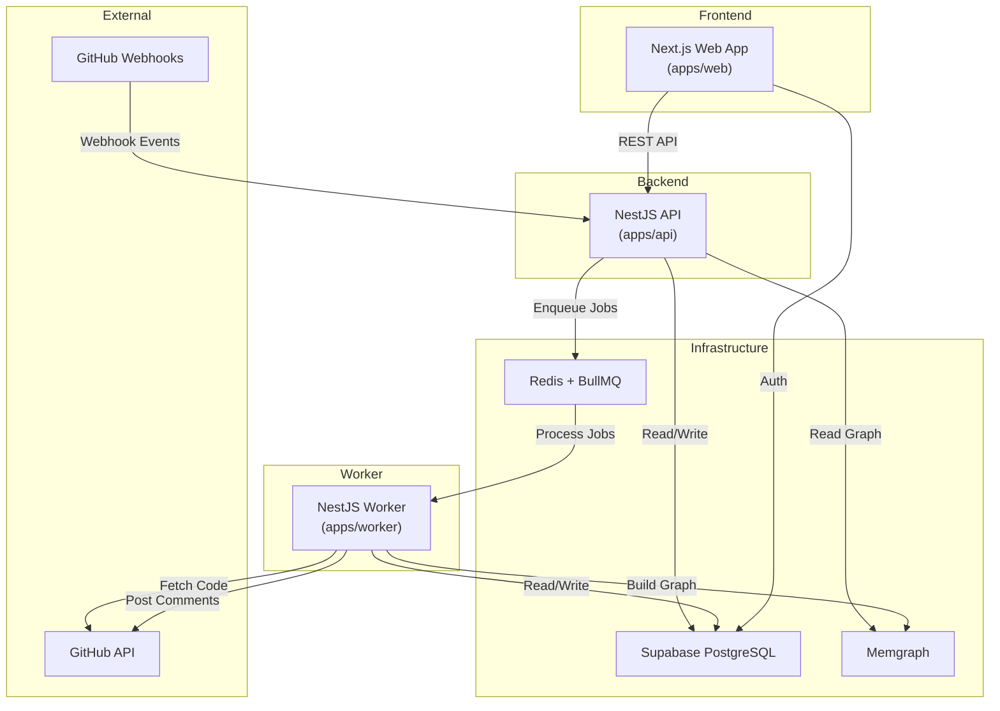

---

## 2. Package Dependencies

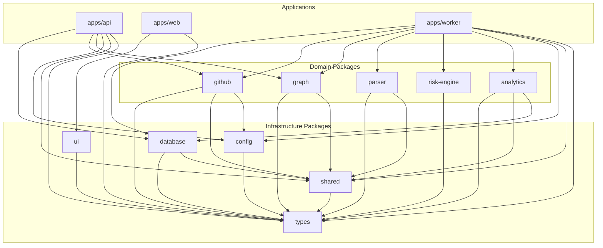

---

## 3. ER Diagram

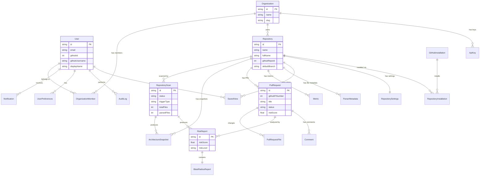

---

## 4. Graph Model

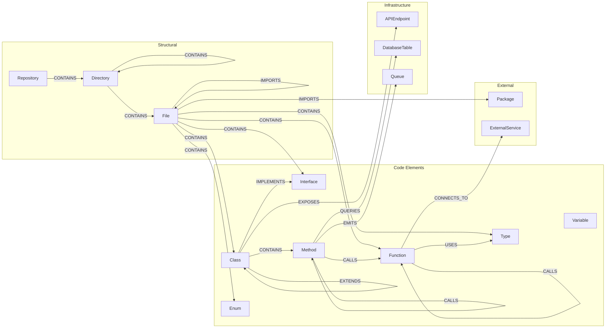

---

## 5. Queue Flow

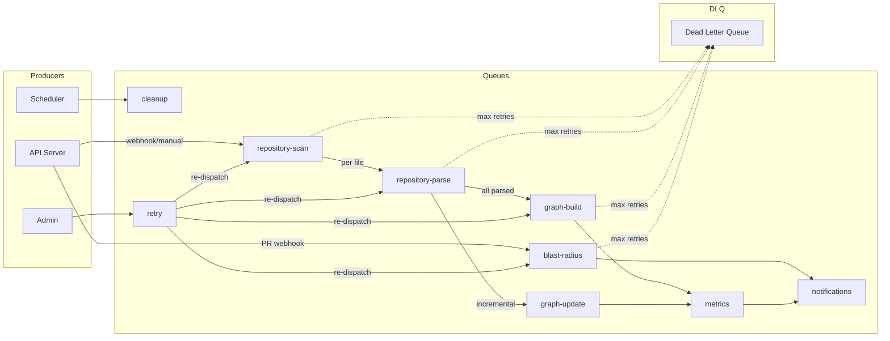

---

## 6. Repository Scan Flow

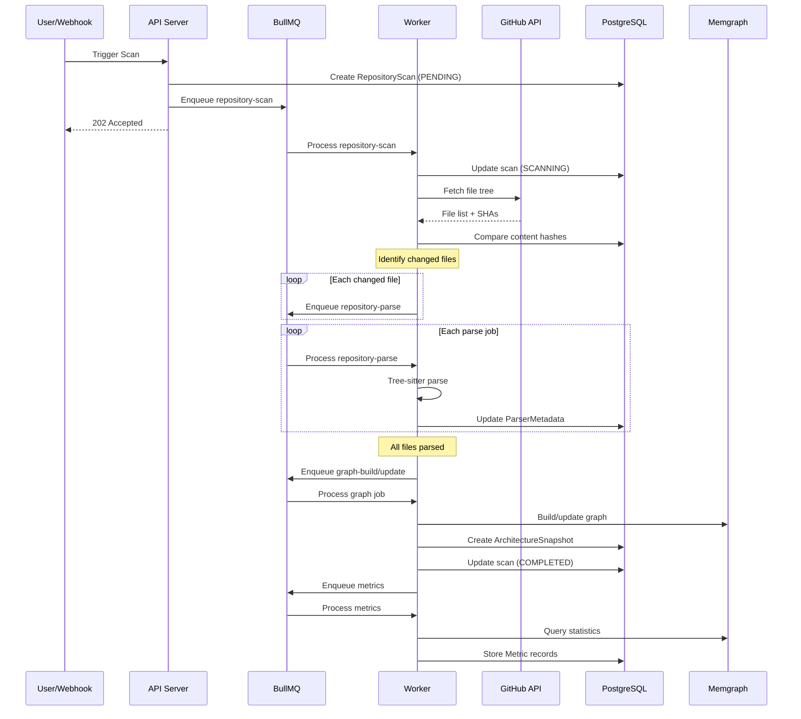

---

## 7. Blast Radius Flow

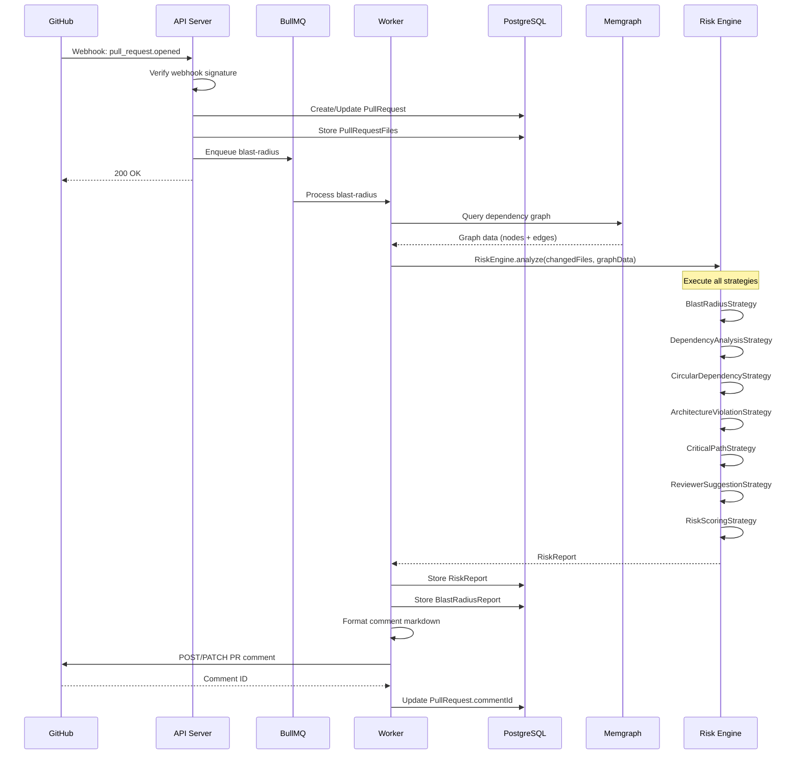

---

## 8. PR Comment Flow

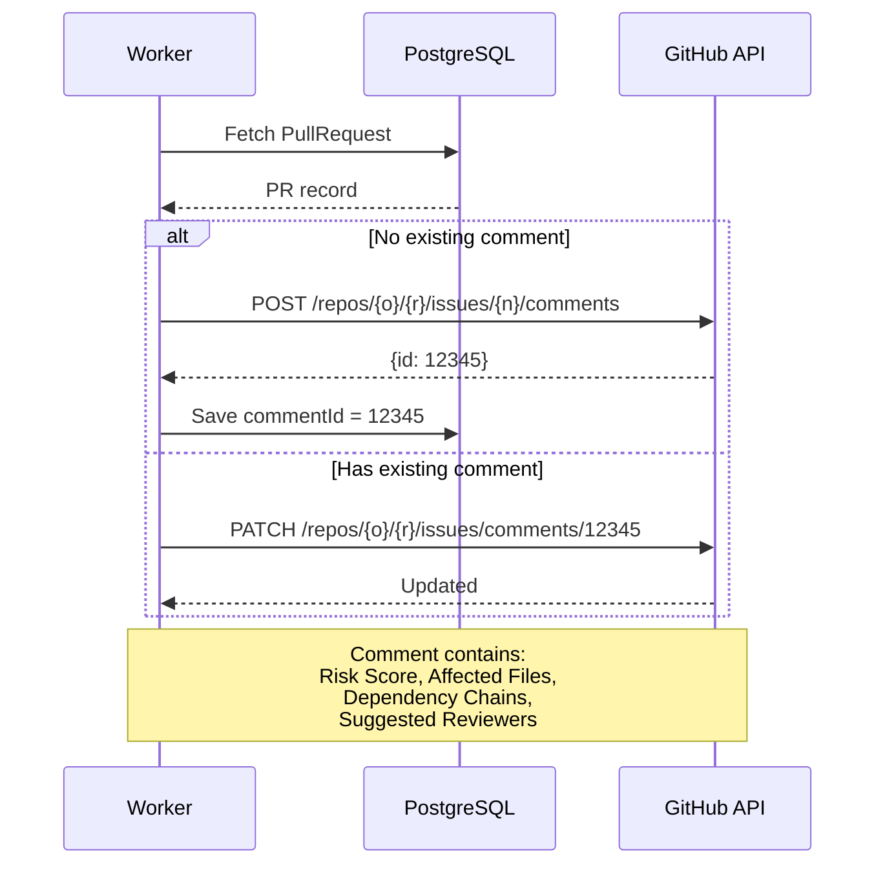

---

## 9. Clean Architecture Layers

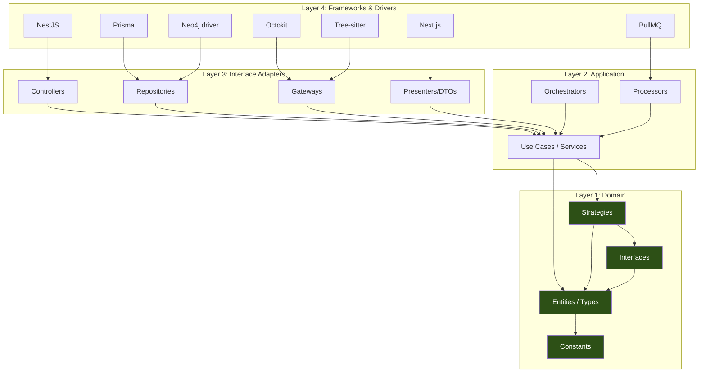

**Dependency Rule:** Arrows point inward. Layer 1 (Domain) has zero dependencies on outer layers. Each layer only depends on the layer immediately inside it.

---

*End of Diagrams. Continue to [19-adrs.md](./19-adrs.md) →*


---

# SystemMapper — Architecture Decision Records

**Document Version:** 1.0.0
**Last Updated:** 2026-06-27
**Parent Document:** [00-executive-summary.md](./00-executive-summary.md)

---

## Table of Contents

1. [ADR-001: Dual-Database Architecture](#adr-001-dual-database-architecture)
2. [ADR-002: Tree-sitter for Parsing](#adr-002-tree-sitter-for-parsing)
3. [ADR-003: Deterministic Risk Engine](#adr-003-deterministic-risk-engine)
4. [ADR-004: Strategy Pattern for Risk Analysis](#adr-004-strategy-pattern-for-risk-analysis)
5. [ADR-005: File-Level Incremental Updates](#adr-005-file-level-incremental-updates)
6. [ADR-006: Turborepo Monorepo](#adr-006-turborepo-monorepo)
7. [ADR-007: BullMQ for Job Processing](#adr-007-bullmq-for-job-processing)
8. [ADR-008: PostgreSQL as Source of Truth](#adr-008-postgresql-as-source-of-truth)
9. [ADR-009: No LLM Dependency in MVP](#adr-009-no-llm-dependency-in-mvp)
10. [ADR-010: Supabase for Auth and Database](#adr-010-supabase-for-auth-and-database)
11. [ADR-011: Risk Engine Zero Dependencies](#adr-011-risk-engine-zero-dependencies)
12. [ADR-012: Content Hash Incremental Parsing](#adr-012-content-hash-incremental-parsing)

---

## ADR-001: Dual-Database Architecture

**Status:** Accepted

**Context:**
SystemMapper needs to store both relational business data (users, organizations, scans) and a complex dependency graph (files, imports, calls). These two data models have fundamentally different query patterns.

**Decision:**
Use PostgreSQL for relational/business data and Memgraph for the architectural dependency graph.

**Rationale:**
- PostgreSQL excels at ACID transactions, relational integrity, aggregation queries, and full-text search. It is the right tool for business metadata.
- Memgraph excels at graph traversals, path queries, cycle detection, and neighborhood queries. It is the right tool for dependency analysis.
- Attempting to model a dependency graph in PostgreSQL would require recursive CTEs that are orders of magnitude slower than native graph traversals.
- Attempting to model relational business data in Memgraph would sacrifice ACID guarantees and relational integrity.

**Consequences:**
- Two databases to manage, deploy, and monitor.
- A synchronization strategy is needed (documented in [04-sync-strategy.md](./04-sync-strategy.md)).
- Memgraph can be rebuilt from PostgreSQL + source code, so it is a derived store, not a source of truth.
- Developers need knowledge of both SQL/Prisma and Cypher.

---

## ADR-002: Tree-sitter for Parsing

**Status:** Accepted

**Context:**
The parser needs to extract structural elements (imports, classes, functions) from source code across multiple programming languages.

**Alternatives Considered:**
1. **TypeScript Compiler API** — Only supports TypeScript/JavaScript.
2. **Babel** — Only supports JavaScript/TypeScript. Slow for large files.
3. **SWC** — Only supports JavaScript/TypeScript. No AST query API.
4. **Tree-sitter** — Supports 100+ languages. Incremental parsing. Error recovery. WASM bindings.
5. **Language-specific parsers** — One parser per language. High maintenance burden.

**Decision:**
Use Tree-sitter with WASM bindings for all language parsing.

**Rationale:**
- Multi-language support from day one. Adding a new language requires only a grammar WASM file and an extractor.
- Built-in error recovery — continues parsing past syntax errors.
- Incremental parsing support (future optimization).
- Battle-tested at scale by GitHub (used in github.com code navigation).
- WASM bindings provide cross-platform support without native compilation.

**Consequences:**
- Each language needs a custom extractor to normalize the CST into the common IR.
- Tree-sitter CSTs are verbose — extractors must navigate deep node hierarchies.
- WASM binaries (~1-3MB per language) are bundled with the package.
- Tree-sitter's query language (S-expressions) has a learning curve.

---

## ADR-003: Deterministic Risk Engine

**Status:** Accepted

**Context:**
The risk engine calculates scores for pull requests. These scores are shown to developers and influence review decisions. Trust in the system requires predictable, explainable results.

**Decision:**
All risk calculations are deterministic. No LLM, no probabilistic models, no sampling.

**Rationale:**
- Deterministic scores are reproducible — the same PR always gets the same score.
- Deterministic scores are auditable — every score can be explained by tracing the algorithm.
- Deterministic scores are testable — expected outputs can be asserted in unit tests.
- Probabilistic or LLM-based scores would undermine trust ("why did the score change between runs?").
- AI can be added as an optional explanation layer in the future without affecting the core score.

**Consequences:**
- Scoring algorithms are simpler but may miss nuanced risk patterns that ML could detect.
- All algorithm parameters (weights, thresholds, decay factors) must be explicitly defined.
- Future AI features must be clearly separated from the deterministic core.

---

## ADR-004: Strategy Pattern for Risk Analysis

**Status:** Accepted

**Context:**
Risk analysis involves multiple independent analyses (blast radius, circular dependencies, architecture violations, etc.) that need to be composed into a final report.

**Decision:**
Use the Strategy Pattern to decompose risk analysis into independent, composable strategies.

**Rationale:**
- Each strategy is independently testable.
- New strategies can be added without modifying existing ones (Open/Closed Principle).
- The future AI explanation strategy can be inserted without changing the core engine.
- Strategy execution order is explicit and configurable.
- Each strategy has a well-defined input/output contract.

**Consequences:**
- Each strategy only sees the raw input and previous strategy results (via StrategyContext).
- The RiskScoringStrategy must run last and understand all other strategy outputs.
- Adding a new strategy requires updating the scoring aggregation.

---

## ADR-005: File-Level Incremental Updates

**Status:** Accepted

**Context:**
When a repository is scanned incrementally (after a push), the system needs to decide what to re-parse and re-graph.

**Alternatives Considered:**
1. **Full re-parse on every scan** — Simple but slow. O(n) for every scan.
2. **Function-level diff** — Complex AST diffing. Error-prone. Hard to maintain.
3. **File-level with content hash** — Re-parse only changed files. Good balance.

**Decision:**
Use file-level granularity with SHA-256 content hashing for incremental detection.

**Rationale:**
- Content hashing is simple, deterministic, and fast.
- File-level granularity avoids the complexity of AST diffing.
- Tree-sitter can parse a 10,000-line file in <100ms, so re-parsing an entire file is not a bottleneck.
- Graph updates are atomic at the file level: delete all nodes from the file, re-create from fresh parse.

**Consequences:**
- Unchanged files are completely skipped (fast).
- Changed files are fully re-parsed (slightly wasteful for small changes, but simple).
- No need to track which functions changed within a file.
- Graph operations are idempotent at the file level.

---

## ADR-006: Turborepo Monorepo

**Status:** Accepted

**Context:**
SystemMapper has 3 applications and 11 packages that share types, utilities, and configuration.

**Alternatives Considered:**
1. **Nx** — More features, steeper learning curve, heavier.
2. **Lerna** — Legacy, less maintained, limited caching.
3. **Turborepo** — Simple, fast, good caching, Vercel ecosystem.
4. **pnpm workspaces alone** — No build caching or task orchestration.

**Decision:**
Use Turborepo with pnpm workspaces.

**Rationale:**
- Turborepo's remote caching speeds up CI builds significantly.
- Simple configuration via `turbo.json`.
- Good integration with Vercel (project sponsor consideration for future).
- pnpm's strict node_modules structure prevents phantom dependencies.
- Lower learning curve than Nx.

**Consequences:**
- All packages must have properly declared dependencies in `package.json`.
- Build order is determined by the dependency graph in `turbo.json`.
- No code generation features (unlike Nx). Packages are created manually.

---

## ADR-007: BullMQ for Job Processing

**Status:** Accepted

**Context:**
Background jobs (parsing, graph building, blast radius) need to be processed reliably with retry support, priority queues, and monitoring.

**Alternatives Considered:**
1. **In-process async** — No retry, no persistence, no monitoring.
2. **RabbitMQ** — Powerful but complex setup, separate service.
3. **AWS SQS** — Cloud-only, not suitable for local development.
4. **BullMQ** — Redis-based, TypeScript-native, simple, feature-rich.

**Decision:**
Use BullMQ with Redis for all job processing.

**Rationale:**
- TypeScript-first with excellent type support.
- Redis is already needed and simple to set up in Docker.
- Built-in retry, backoff, priority, rate limiting, and monitoring.
- Flow producer pattern enables parent-child job relationships.
- Active maintenance and large community.

**Consequences:**
- Redis must be `noeviction` to prevent job loss.
- Single Redis instance is a bottleneck (acceptable for local development).
- BullMQ UI (Bull Board) can be added for job monitoring.

---

## ADR-008: PostgreSQL as Source of Truth

**Status:** Accepted

**Context:**
With two databases (PostgreSQL and Memgraph), a clear source of truth must be established.

**Decision:**
PostgreSQL is the source of truth for all business data. Memgraph is a derived projection that can be rebuilt.

**Rationale:**
- PostgreSQL provides ACID transactions, referential integrity, and backup/restore.
- If Memgraph data is lost, it can be fully rebuilt by re-scanning and re-parsing.
- If PostgreSQL data is lost, the system cannot recover (user data, scan history gone).
- This asymmetry makes PostgreSQL the natural source of truth.

**Consequences:**
- PostgreSQL is always written first, then Memgraph.
- Memgraph rebuild is a supported operation (manually triggered or automatic on schema migration).
- Business decisions (which repos are connected, which scans have run) are always in PostgreSQL.

---

## ADR-009: No LLM Dependency in MVP

**Status:** Accepted

**Context:**
AI/LLM features could add value (natural language explanations of risk, code review suggestions). However, they introduce nondeterminism, latency, cost, and third-party dependency.

**Decision:**
The MVP has zero LLM dependencies. All analysis is deterministic. AI is planned as an optional future layer.

**Rationale:**
- Deterministic analysis builds user trust.
- No API cost for LLM calls.
- No latency from external API calls.
- No dependency on OpenAI/Anthropic availability.
- The architecture explicitly supports a future `AIExplanationStrategy` that can be plugged in without modifying the core engine.

**Consequences:**
- Natural language explanations are template-based, not AI-generated.
- The `OPENAI_API_KEY` environment variable is present but unused in MVP.
- The risk engine's strategy pattern makes future AI integration straightforward.

---

## ADR-010: Supabase for Auth and Database

**Status:** Accepted

**Context:**
The application needs authentication (GitHub OAuth), a PostgreSQL database, and user management.

**Alternatives Considered:**
1. **Auth0** — Powerful but expensive for development.
2. **Firebase Auth** — Google ecosystem, no PostgreSQL.
3. **Self-managed JWT** — More work, security risks.
4. **Supabase** — Open-source, PostgreSQL-native, free tier, Auth + DB in one.

**Decision:**
Use Supabase for both authentication and the PostgreSQL database.

**Rationale:**
- Single service provides both auth and database.
- PostgreSQL-native means Prisma works directly.
- Free tier is generous for development.
- Self-hostable for future production deployment.
- Built-in Row Level Security (future use).

**Consequences:**
- Dependency on Supabase client libraries.
- JWT verification uses Supabase's JWT secret.
- Database connection uses Supabase's pooled connection string.
- For local development, Supabase CLI or cloud project is required.

---

## ADR-011: Risk Engine Zero Dependencies

**Status:** Accepted

**Context:**
The risk engine is the core intellectual property. It needs to be maximally portable, testable, and maintainable.

**Decision:**
The `@systemmapper/risk-engine` package has zero runtime dependencies beyond `@systemmapper/types`. No framework, no database, no I/O.

**Rationale:**
- Zero dependencies means zero mocks in tests.
- The engine can be used in any context: server, CLI, browser, WASM.
- No framework coupling means no framework migration cost.
- Pure functions are the easiest code to reason about and debug.
- Independent versioning — the engine can be published as a standalone npm package.

**Consequences:**
- All data must be serialized and passed into the engine.
- The caller (worker) is responsible for querying Memgraph and formatting the data.
- No async operations — all computations are synchronous.
- Algorithms must be implemented without external libraries (BFS, Tarjan's SCC, etc.).

---

## ADR-012: Content Hash Incremental Parsing

**Status:** Accepted

**Context:**
Re-parsing all files on every scan is wasteful. The system needs to detect which files have changed.

**Alternatives Considered:**
1. **Git diff** — Requires Git access, doesn't work for initial scans.
2. **File modification time** — Unreliable across systems.
3. **Content hash (SHA-256)** — Deterministic, reliable, fast.
4. **Tree-sitter incremental parse** — Complex, requires storing old trees.

**Decision:**
Use SHA-256 content hashing stored in `ParserMetadata.contentHash`.

**Rationale:**
- SHA-256 is deterministic — same content always produces the same hash.
- Comparing hashes is O(1) and avoids reading the file content twice.
- The hash is stored in PostgreSQL alongside parser metadata.
- This approach works for both initial scans and incremental scans.

**Consequences:**
- Every file's content hash is stored in PostgreSQL (~64 bytes per file).
- On incremental scans, all file hashes from GitHub are compared against stored hashes.
- Only files with different hashes are re-parsed and re-graphed.
- Renamed files (same content, different path) are detected as new files with the same hash.

---

*End of Architecture Decision Records. Continue to [20-graph-package.md](./20-graph-package.md) →*


---

# SystemMapper — Graph Package

**Document Version:** 1.0.0
**Last Updated:** 2026-06-27
**Parent Document:** [00-executive-summary.md](./00-executive-summary.md)

---

## Table of Contents

1. [Overview](#1-overview)
2. [Neo4j driver Management](#2-neo4j-driver-management)
3. [Graph Repository Layer](#3-graph-repository-layer)
4. [Graph Builders](#4-graph-builders)
5. [Cypher Abstraction](#5-cypher-abstraction)
6. [Traversal Utilities](#6-traversal-utilities)
7. [Synchronization](#7-synchronization)
8. [Graph Persistence](#8-graph-persistence)

---

## 1. Overview

The `@systemmapper/graph` package encapsulates all Memgraph interactions. It provides a clean API for building, querying, and maintaining the dependency graph. No other package directly uses the Neo4j driver — all graph operations go through this package.

**Dependencies:**
- `@systemmapper/types` — Shared type definitions
- `@systemmapper/shared` — Utility functions
- `neo4j-driver` — Official Memgraph JavaScript driver

**Consumers:**
- `apps/api` — Read-only graph queries for visualization and search
- `apps/worker` — Read/write graph operations for building and updating

### 1.1 Design Principles

| Principle | Implementation |
|-----------|---------------|
| **Single Responsibility** | Each repository handles one node type or query category |
| **Repository Pattern** | All Cypher queries are encapsulated in repository classes |
| **Builder Pattern** | Graph construction uses builder classes that produce Cypher MERGE operations |
| **Abstraction** | No raw Cypher strings outside the `queries/` and `repositories/` directories |
| **Idempotency** | All write operations use MERGE, not CREATE |
| **Transaction Safety** | Multi-step operations use Memgraph transactions |

---

## 2. Neo4j driver Management

### 2.1 Driver Lifecycle

The Neo4j driver is a singleton managed by the package:

1. **Initialization:** `createDriver(uri, username, password)` creates and verifies the driver connection.
2. **Session Creation:** `getSession(database?)` creates a new session for each operation.
3. **Shutdown:** `closeDriver()` gracefully closes the driver and all sessions.

### 2.2 Session Management

Sessions are short-lived and scoped to a single operation:

```
1. Get session from driver
2. Execute query/transaction within session
3. Close session (always, even on error)
```

Sessions use `try/finally` to guarantee cleanup.

### 2.3 Connection Configuration

| Setting | Value | Rationale |
|---------|-------|-----------|
| `maxConnectionPoolSize` | 50 | Sufficient for worker concurrency |
| `connectionAcquisitionTimeout` | 30000ms | Timeout for getting a connection from the pool |
| `connectionTimeout` | 5000ms | Timeout for establishing a new connection |
| `maxTransactionRetryTime` | 15000ms | Timeout for automatic transaction retries |

### 2.4 Health Check

The driver exposes a `verifyConnectivity()` method used by the health check endpoint:

1. Call `driver.verifyConnectivity()`.
2. If it resolves, Memgraph is healthy.
3. If it rejects, Memgraph is unavailable.

---

## 3. Graph Repository Layer

### 3.1 `BaseGraphRepository`

Abstract base class providing shared methods:

| Method | Description |
|--------|-------------|
| `runQuery(cypher, params)` | Execute a read query and return records |
| `runWrite(cypher, params)` | Execute a write query |
| `runInTransaction(fn)` | Execute multiple operations in a single transaction |
| `mergeNode(label, properties)` | MERGE a node by `nodeId` |
| `deleteNodesByProperty(label, key, value)` | Delete nodes matching a property |

### 3.2 `FileGraphRepository`

Handles all `:File` node operations:

| Method | Description |
|--------|-------------|
| `mergeFile(repositoryId, parsedFile)` | Create or update a File node |
| `deleteFileAndContents(repositoryId, filePath)` | Delete a File node and all contained nodes |
| `getFileByPath(repositoryId, filePath)` | Fetch a File node by path |
| `getFilesByRepository(repositoryId)` | List all files for a repository |

### 3.3 `ClassGraphRepository`

Handles all `:Class`, `:Interface`, `:Type`, `:Enum` node operations:

| Method | Description |
|--------|-------------|
| `mergeClass(repositoryId, classDecl, filePath)` | Create or update a Class node |
| `mergeInterface(repositoryId, ifaceDecl, filePath)` | Create or update an Interface node |
| `mergeType(repositoryId, typeDecl, filePath)` | Create or update a Type node |
| `mergeEnum(repositoryId, enumDecl, filePath)` | Create or update an Enum node |

### 3.4 `FunctionGraphRepository`

Handles `:Function`, `:Method`, `:Variable` node operations:

| Method | Description |
|--------|-------------|
| `mergeFunction(repositoryId, funcDecl, filePath)` | Create or update a Function node |
| `mergeMethod(repositoryId, methodDecl, filePath, className)` | Create or update a Method node |
| `mergeVariable(repositoryId, varDecl, filePath)` | Create or update a Variable node |

### 3.5 `RelationshipGraphRepository`

Handles all relationship creation:

| Method | Description |
|--------|-------------|
| `createImportsRelationship(sourceNodeId, targetNodeId, props)` | Create IMPORTS edge |
| `createCallsRelationship(sourceNodeId, targetNodeId, props)` | Create CALLS edge |
| `createContainsRelationship(parentNodeId, childNodeId)` | Create CONTAINS edge |
| `createExtendsRelationship(childNodeId, parentNodeId)` | Create EXTENDS edge |
| `createImplementsRelationship(classNodeId, ifaceNodeId)` | Create IMPLEMENTS edge |
| `createUsesRelationship(sourceNodeId, targetNodeId, props)` | Create USES edge |
| `deleteRelationshipsForFile(repositoryId, filePath)` | Delete all relationships from/to nodes in a file |

### 3.6 `TraversalGraphRepository`

Handles complex traversal queries:

| Method | Description |
|--------|-------------|
| `getBlastRadius(repositoryId, filePaths, maxDepth)` | Execute blast radius traversal |
| `getCircularDependencies(repositoryId)` | Detect circular import chains |
| `getDeadCode(repositoryId)` | Find unreferenced functions and classes |
| `getReverseDependencies(repositoryId, filePath, maxDepth)` | Find all dependents of a file |
| `getRepositoryStatistics(repositoryId)` | Aggregate node/relationship counts |
| `getVisualizationData(repositoryId, options)` | Get graph data formatted for visualization |
| `getMostConnectedNodes(repositoryId, limit)` | Find hub nodes (bottlenecks) |
| `getLongestDependencyChain(repositoryId)` | Find the critical path |

---

## 4. Graph Builders

### 4.1 `GraphBuilder`

The main builder that orchestrates graph construction from parsed IR:

**Input:** Array of `ParsedFile` IR objects + `repositoryId` + `scanId`

**Process:**
1. Create the `:Repository` node (MERGE).
2. For each `ParsedFile`:
   a. Create directory chain (`:Directory` nodes with `CONTAINS`).
   b. Create `:File` node with `CONTAINS` from parent directory.
   c. For each class: create `:Class` node with `CONTAINS` from file.
   d. For each method in class: create `:Method` node with `CONTAINS` from class.
   e. For each function: create `:Function` node with `CONTAINS` from file.
   f. For each interface, type, enum, variable: create corresponding nodes.
3. For each `ParsedFile`:
   a. For each import: create `:IMPORTS` relationship to the target file.
   b. For each class extending another: create `:EXTENDS` relationship.
   c. For each class implementing an interface: create `:IMPLEMENTS` relationship.
   d. For each function call: create `:CALLS` relationship.
   e. For each type usage: create `:USES` relationship.

**Two-pass approach:** Nodes are created in the first pass, relationships in the second pass. This ensures all target nodes exist before relationships are created.

### 4.2 `NodeBuilder`

Constructs node properties from parsed IR:

| Method | Input | Output |
|--------|-------|--------|
| `buildFileNode(repositoryId, parsedFile)` | ParsedFile | File node properties with deterministic nodeId |
| `buildClassNode(repositoryId, classDecl, filePath)` | ClassDeclaration + path | Class node properties |
| `buildFunctionNode(repositoryId, funcDecl, filePath)` | FunctionDeclaration + path | Function node properties |
| `buildMethodNode(repositoryId, methodDecl, filePath, className)` | MethodDeclaration + path + class | Method node properties |

Each builder method:
1. Generates a deterministic `nodeId` using `NodeIdGenerator`.
2. Maps IR fields to Memgraph node properties.
3. Adds temporal properties (`createdAt`, `updatedAt`, `scanId`).

### 4.3 `RelationshipBuilder`

Constructs relationship properties from parsed IR:

| Method | Input | Output |
|--------|-------|--------|
| `buildImportsRelationship(importDecl)` | ImportDeclaration | IMPORTS relationship properties |
| `buildCallsRelationship(callerNode, calleeNode, lines)` | Node pair + line numbers | CALLS relationship properties |
| `buildContainsRelationship(parentNode, childNode)` | Node pair | CONTAINS relationship properties |

---

## 5. Cypher Abstraction

### 5.1 `CypherBuilder`

A fluent builder for constructing Cypher queries programmatically:

| Method | Description |
|--------|-------------|
| `match(label, alias, properties)` | Add a MATCH clause |
| `optionalMatch(label, alias, properties)` | Add an OPTIONAL MATCH clause |
| `where(condition)` | Add a WHERE condition |
| `merge(label, alias, mergeProps, onCreateProps, onMatchProps)` | Add a MERGE with ON CREATE and ON MATCH |
| `create(label, alias, properties)` | Add a CREATE clause |
| `delete(alias)` | Add a DELETE clause |
| `returnFields(fields)` | Add a RETURN clause |
| `orderBy(field, direction)` | Add ORDER BY |
| `limit(count)` | Add LIMIT |
| `withParams(params)` | Set query parameters |
| `build()` | Return `{ query: string, params: Record<string, unknown> }` |

### 5.2 Usage Rules

1. All Cypher queries are built using `CypherBuilder` or stored as named query templates in the `queries/` directory.
2. No string concatenation for Cypher. All dynamic values use parameterized queries (`$paramName`).
3. Complex traversal queries (blast radius, cycle detection) are stored as template strings in dedicated query files.
4. Simple CRUD operations (merge node, delete node) use `CypherBuilder`.

---

## 6. Traversal Utilities

### 6.1 `BlastRadiusTraverser`

Executes the blast radius algorithm against Memgraph:

**Algorithm:**
1. Match changed file nodes.
2. Execute parameterized Cypher query with variable-length path traversal.
3. Apply depth limiting (`maxDepth`).
4. Return results with distance and affected components.

### 6.2 `DependencyGraphSerializer`

Converts Memgraph query results into the `DependencyGraphData` format consumed by the risk engine:

**Process:**
1. Query all file-level nodes and IMPORTS relationships for a repository.
2. Build the `nodes` array from node records.
3. Build the `edges` array from relationship records.
4. Build the `fileIndex` lookup map (filePath → node).
5. Build the `adjacencyList` and `reverseAdjacencyList`.
6. Return the complete `DependencyGraphData` object.

This serialization is the bridge between Memgraph and the risk engine. The risk engine never queries Memgraph directly — it receives this pre-serialized data.

### 6.3 `GraphStatisticsCollector`

Aggregates graph statistics for snapshots and metrics:

| Method | Description |
|--------|-------------|
| `getNodeCountByLabel(repositoryId)` | Count of each node type |
| `getRelationshipCountByType(repositoryId)` | Count of each relationship type |
| `getTotalNodeCount(repositoryId)` | Total nodes in the repository graph |
| `getTotalRelationshipCount(repositoryId)` | Total relationships |
| `getAverageImportsPerFile(repositoryId)` | Mean import count |
| `getMaxImportsPerFile(repositoryId)` | File with most imports |

---

## 7. Synchronization

### 7.1 `GraphSynchronizer`

Orchestrates the sync between PostgreSQL data and the Memgraph graph:

| Method | Description |
|--------|-------------|
| `fullSync(repositoryId, parsedFiles, scanId)` | Full graph build from all files |
| `incrementalSync(repositoryId, changed, deleted, added, scanId)` | Update only changed files |
| `verifyConsistency(repositoryId)` | Check PG ↔ Memgraph consistency |

### 7.2 `IncrementalUpdater`

Handles incremental graph updates:

**Process for each changed file:**
1. Delete all Memgraph nodes with `filePath` matching the changed file and `repositoryId`.
2. This automatically removes relationships connected to those nodes.
3. Re-create nodes from the new parsed IR.
4. Re-create relationships from the new parsed IR.
5. All operations are within a single Memgraph transaction.

**Process for deleted files:**
1. Delete all Memgraph nodes with the file's `filePath`.
2. No re-creation needed.

**Process for added files:**
1. Create new nodes from parsed IR.
2. Create relationships from parsed IR.

### 7.3 `GraphRebuilder`

Handles full graph rebuilds:

**Process:**
1. Delete ALL nodes and relationships for the repository: `MATCH (n {repositoryId: $id}) DETACH DELETE n`.
2. Run the full `GraphBuilder` with all parsed files.
3. Create a new `ArchitectureSnapshot` in PostgreSQL.

This is used for:
- Initial repository onboarding.
- Schema migration recovery.
- Manual rebuild triggered by admin.

---

## 8. Graph Persistence

### 8.1 Transaction Strategy

| Operation | Transaction Scope |
|-----------|------------------|
| Single file parse → graph update | One transaction per file |
| Full graph build | One transaction per batch of 50 files |
| Blast radius query | Single read transaction |
| Graph deletion | One transaction for DETACH DELETE |
| Statistics query | Single read transaction |

### 8.2 Batch Operations

For large repositories (1000+ files), graph operations are batched:

1. Nodes are created in batches of 50 files per transaction.
2. Relationships are created in a separate batch pass after all nodes exist.
3. Each batch is committed independently — partial builds are valid.
4. If a batch fails, it is retried. Already-merged nodes are unaffected (idempotent).

### 8.3 Index and Constraint Initialization

On first connection (or via a setup script), the following are created:

1. Uniqueness constraints on `nodeId` for all node labels.
2. Property indexes on `repositoryId`, `filePath`, `name`, `scanId`.
3. Full-text index on `name` and `qualifiedName` for code element search.

These are defined in `docker/memgraph/init-constraints.cypher` and applied:
- Automatically by the worker on startup (if not already present).
- Manually via `pnpm graph:init` script.

### 8.4 Schema Version Tracking

The graph schema version is stored on the `:Repository` node:

```
(:Repository {schemaVersion: "1.0.0"})
```

On worker startup:
1. Check the `schemaVersion` on all repository nodes.
2. If any repository's version is older than the current `SCHEMA_VERSION` constant, queue a rebuild.
3. After rebuild, the `schemaVersion` is updated to the current version.

---

*End of Graph Package. This concludes the SystemMapper Architecture Blueprint.*

---

## Document Index

| # | Document | Description |
|---|----------|-------------|
| 00 | [Executive Summary](./00-executive-summary.md) | Project overview, goals, tech stack |
| 01 | [Monorepo Structure](./01-monorepo-structure.md) | Turborepo layout, package details |
| 02 | [Database Design](./02-database-design.md) | PostgreSQL schema (30 models) |
| 03 | [Graph Design](./03-graph-design.md) | Memgraph node/relationship model |
| 04 | [Sync Strategy](./04-sync-strategy.md) | PostgreSQL ↔ Memgraph synchronization |
| 05 | [Parser Architecture](./05-parser-architecture.md) | Tree-sitter pipeline and IR |
| 06 | [Risk Engine](./06-risk-engine.md) | Strategy Pattern risk analysis |
| 07 | [Analytics Package](./07-analytics-package.md) | Metrics, scores, trends |
| 08 | [GitHub Package](./08-github-package.md) | GitHub App, OAuth, webhooks |
| 09 | [Queue Architecture](./09-queue-architecture.md) | BullMQ queues and DLQ |
| 10 | [Event Architecture](./10-event-architecture.md) | Domain events, sequence diagrams |
| 11 | [API Design](./11-api-design.md) | REST endpoints, RBAC, DTOs |
| 12 | [Shared Types](./12-shared-types.md) | Enums, interfaces, constants |
| 13 | [Folder Structure](./13-folder-structure.md) | Complete file tree |
| 14 | [Environment Variables](./14-environment-variables.md) | .env.example files |
| 15 | [Coding Standards](./15-coding-standards.md) | TypeScript, linting, commits |
| 16 | [Testing Strategy](./16-testing-strategy.md) | Unit, integration, coverage |
| 17 | [Roadmap](./17-roadmap.md) | 12-milestone implementation plan |
| 18 | [Diagrams](./18-diagrams.md) | Mermaid architecture diagrams |
| 19 | [ADRs](./19-adrs.md) | Architecture Decision Records |
| 20 | [Graph Package](./20-graph-package.md) | Memgraph abstraction layer |


---

# 21 — Code Intelligence Architecture

**Document Version:** 1.0.0
**Last Updated:** 2026-06-27
**Parent Document:** [00-executive-summary.md](./00-executive-summary.md)

---

## 1. Overview

The **Code Intelligence Architecture** defines the multi-language, multi-repository analysis subsystem of the Application Intelligence Platform. 

This architecture mandates a strict **First-Class Knowledge Graph Lifecycle**, ensuring that source code from any language is uniformly processed, normalized, and eventually constructed into a Generic Graph Model. 

The primary goal is to describe how every supported language produces the exact same **Canonical Intermediate Representation (Canonical IR)** consumed by the Graph Builder, regardless of underlying language semantics or framework conventions.

---

## 2. The Code Intelligence Pipeline

The architecture is driven by the following canonical information flow:

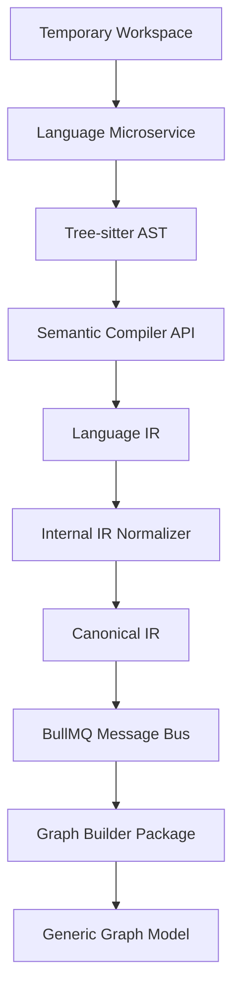

No language microservice may bypass this lifecycle or interact directly with the Graph Store (e.g., Memgraph). Normalization happens *inside* the microservice.

---

## 3. Language Microservice Architecture

SystemMapper delegates language-specific parsing to isolated microservices (e.g., `parse-ts`, `parse-py`, `parse-db`) to ensure horizontal scalability and fault tolerance.

### Responsibilities
1. **Source Ingestion**: Read files from the temporary workspace.
2. **AST Generation**: Produce an Abstract Syntax Tree using engines like Tree-sitter.
3. **Semantic Enrichment**: Resolve cross-file types using Semantic Compiler APIs (e.g., TypeScript `TypeChecker`) where available.
4. **Translation to Language IR**: The parsed structures must be translated into the microservice's internal Language IR.
5. **Normalization**: Convert the Language IR into the shared Canonical IR before returning the result over the queue.

### Language Intermediate Representation (Language IR)
The Language IR represents concepts specific to a language ecosystem (e.g., TypeScript's `namespace`, Go's `goroutine`, Python's `decorator`). It is strongly typed but internal to the microservice.

---

## 4. IR Normalization & Canonical IR

The core of the Code Intelligence Engine is the **Normalizer**, which sits at the boundary of each language microservice and converts varied Language IRs into the **Canonical IR**.

### Canonical Intermediate Representation
The Canonical IR is a highly restricted, language-agnostic schema defining the universal structures of software architecture. Its types are centrally defined in the `@systemmapper/types` package.

It defines entities such as:
- `File`
- `Symbol`
- `Function`
- `Class`
- `Interface`
- `Dependency` (Internal and External Imports)
- `Route` (HTTP Endpoints)
- `Component` (UI elements)
- `Controller` (API handlers)
- `Service` (Business logic)
- `Entity` (Database models)

### Normalization Rules
Every Language Microservice must map its Language IR to the Canonical IR.
- *Example*: A Java `@RestController` class maps to a Canonical `Controller` entity.
- *Example*: A NestJS `@Get()` decorator maps to a Canonical `Route` entity.
- *Example*: A React `function Component()` maps to a Canonical `Component` entity.
- *Example*: A SQL `CREATE TABLE` maps to a Canonical `Entity`.

---

## 5. Extractor Pipelines

Operating on top of the Canonical IR, specific extractors build relationships before handing off to the Graph Builder.

### Framework Detection
Detects underlying frameworks (React, Angular, NestJS, Spring Boot, Django) by scanning dependency manifestations (`package.json`, `pom.xml`, `requirements.txt`) and structural patterns in the Canonical IR.

### ORM Detection & Database Extraction
Detects Object-Relational Mappers (Prisma, TypeORM, Hibernate, SQLAlchemy). Extracts:
- Table structures
- Column definitions
- Relationships (One-to-Many, Many-to-Many)
These are mapped to Canonical `Entity` objects.

### Route & API Extraction
Analyzes framework-specific routing to extract HTTP methods, paths, request bodies, and response types, standardizing them into Canonical `Route` definitions.

### Dependency Extraction
Maps `import`/`require`/`using` statements into Canonical `Dependency` edges connecting files, packages, and external libraries.

---

## 6. Multi-Repository Architecture Discovery

The Code Intelligence Engine understands that a single repository is rarely an entire application.

### Repository Classification
Upon scanning, the engine classifies the repository into a designated role:
- `Frontend`
- `Backend`
- `Shared Library`
- `Mobile`
- `Infrastructure`
- `Database`
- `Worker`
- `Microservice`

### Cross-Language & Cross-Repository Analysis
By standardizing on the Canonical IR, the platform can link entities across repositories and languages.
- *Example*: A TypeScript `Frontend` API call (Fetch/Axios) can be pattern-matched against a Go `Backend` Canonical `Route`, establishing an application-wide boundary-crossing edge.

---

## 7. Graph Builder Integration

The `graph-builder` package sits at the end of the Code Intelligence Pipeline.

### Role
The Graph Builder is strictly responsible for transforming the Canonical IR into the **Generic Graph Model (GGM)**.
- Generates deterministic, UUID v5 deterministic identities based on the Workspace and Repository contexts.
- Creates `GraphNode` and `GraphEdge` abstractions.
- Bundles the generic nodes and passes them to the [Graph Package / Store](./20-graph-package.md) via generic `GraphWriter` interfaces.

---

## 8. Supported Language Roadmap

The Plugin SDK enforces a phased rollout of language support:

**Phase 1 (MVP)**:
- JavaScript (Node.js, React, Vue)
- TypeScript (NestJS, React)

**Phase 2**:
- Python (Django, FastAPI)
- Go (Gin, standard library)

**Phase 3**:
- Java (Spring Boot)
- Kotlin (Spring Boot, Android)
- C# (.NET Core)

**Phase 4**:
- Rust
- PHP (Laravel)
- Ruby (Rails)
- Swift

Because all plugins must yield Canonical IR, adding a Phase 4 language requires zero modifications to the Graph Builder, Generic Graph Model, or UI layers.


---

# 22 — Visualization Architecture

**Document Version:** 1.0.0
**Last Updated:** 2026-06-27
**Parent Document:** [00-executive-summary.md](./00-executive-summary.md)

---

## 1. Overview

The **Visualization Architecture** dictates how complex software topologies are presented to the end user. It enforces a strict separation of concerns, ensuring that the frontend never consumes raw graph data directly. 

The architecture introduces a **Projection Engine** and explicitly decouples the **Layout Engine** from the **Renderer**.

---

## 2. Visualization Pipeline

The entire visualization subsystem is designed around the following unidirectional data flow:

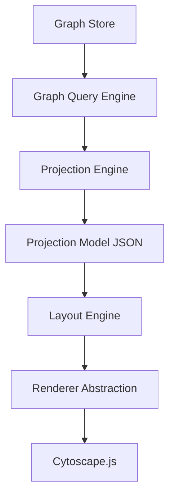

---

## 3. Projection Engine & Projection Models

The frontend must never receive `Memgraph` nodes or the raw `Generic Graph Model`. 

### Responsibilities of the Projection Engine
- Retrieve subgraphs from the Graph Query Engine.
- Transform backend domain entities into visualization-specific **Projection Models**.
- Embed default styling, grouping, metadata, and expansion states.

### Supported Projection Views
A projection model is tailored to a specific user context.
1. **Workspace View**: Top-level view of Repositories and their interdependencies.
2. **Repository View**: Folders, files, and modules within a single repo.
3. **Architecture View**: High-level component interactions across the workspace.
4. **Service Dependency View**: API calls bridging Frontend and Backend.
5. **Database View**: Lineage from Route → Controller → Service → ORM → Database Table.
6. **Risk / Blast Radius View**: Highlighted paths showing the downstream impact of a change.

---

## 4. Separation of Layout Engine and Renderer

The visual placement of nodes (Layout) is architecturally distinct from the drawing of nodes (Rendering).

### Layout Engine Abstraction
The system calculates X/Y coordinates independently of the canvas. The Layout Engine supports multiple algorithms to accommodate different graph typologies:
- **ELK (Eclipse Layout Kernel)**: Best for strictly layered architecture diagrams (e.g., ports and adapters).
- **Dagre**: Directed acyclic graphs (call graphs, dependency chains).
- **Force-Directed (d3-force / cola)**: Organic, highly interconnected clusters (e.g., symbol-level coupling).
- **Hierarchical & Circular**: Used for folder structures and package dependencies.

### Renderer Abstraction
The system communicates with the canvas through a `RendererInterface`.
- **Current Implementation**: `Cytoscape.js`. Chosen for its robustness with large graphs and rich styling API.
- **Future Flexibility**: Because the Layout Engine pre-calculates positions and the Projection Model defines the structure, swapping to `WebGL`, `Three.js`, or `ReactFlow` requires zero business-logic changes.

---

## 5. Large Graph Virtualization & Optimizations

Software architecture graphs can easily exceed 100,000 nodes. Rendering this simultaneously is impossible in a browser.

### Optimization Strategies
1. **Incremental Expand/Collapse**: The projection engine only sends the root nodes (e.g., Repositories). When a user double-clicks, an API call fetches the next level of depth (Folders/Modules).
2. **Graph Clustering**: Visually collapsing highly connected subgroups into a single meta-node until zoomed.
3. **Viewport Culling**: The renderer must destroy or hide SVG/Canvas elements that exist outside the current viewport.
4. **Debounced Layouts**: Layout algorithms run in Web Workers to prevent main-thread UI blocking.

---

## 6. Graph Interaction Model

The architecture defines standard interactive behaviors:
- **Hover**: Dim non-connected nodes; highlight the immediate upstream/downstream neighborhood.
- **Select (Click)**: Lock the highlight state; fetch detailed metadata in a side-panel.
- **Expand (Double-Click)**: Fetch children nodes from the API and dynamically update the Layout Engine.
- **Focus**: Trigger a new Projection Model rooted at the selected node.

---

## 7. Saved Views Subsystem

A **Saved View** is a persistent database record that captures the exact state of the visualization, allowing users to share or return to a specific context.

### Saved View Payload
Instead of saving X/Y coordinates for every node, the `SavedView` entity stores:
- **Target Projection ID**: (e.g., "Architecture View for Repo A").
- **Viewport State**: Camera X/Y position and Zoom level.
- **Expansion State**: An array of Node IDs that have been explicitly expanded.
- **Visibility State**: Arrays of Node IDs that are hidden or pinned.
- **Layout Algorithm**: The selected layout engine (e.g., `dagre`).
- **Filters**: Applied metadata filters (e.g., "Hide test files", "Show only internal dependencies").

This guarantees that as the underlying code evolves, a Saved View will dynamically render the *newest* code using the *saved* parameters.


---

# 23 — Search Architecture

**Document Version:** 1.0.0
**Last Updated:** 2026-06-27
**Parent Document:** [00-executive-summary.md](./00-executive-summary.md)

---

## 1. Overview

As the Application Intelligence Platform ingests massive amounts of cross-repository data, navigation through visual exploration alone becomes insufficient. 

The **Search Architecture** elevates search into a first-class subsystem. It defines the indexing strategies and APIs required to rapidly query the entire workspace spanning code, infrastructure, database schemas, and operational metadata.

---

## 2. Search Engine Subsystem

The Search Engine is decoupled from the transactional Graph Store and Postgres. 

### Architecture Flow
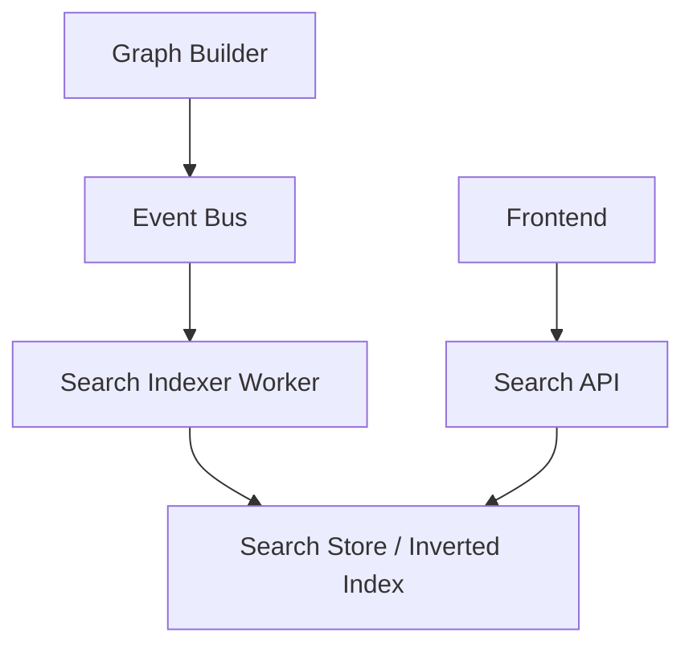

### Search Store Technology
While Memgraph provides Lucene-backed full-text indices, relying on it for high-throughput global autocomplete queries creates unnecessary database contention.
- **Primary Search Store**: Elasticsearch or Typesense (accessed via a `SearchStoreAdapter`).
- **Graph Fallback**: For complex relational searches (e.g., "Find all controllers using Service X"), the Search Engine routes the query to the `Graph Query Engine`.

---

## 3. Indexing Strategy

Indexing occurs asynchronously to prevent blocking the primary analysis pipeline.

### Incremental Indexing
Whenever the `GraphBuilder` emits a `GraphUpdatedV1` event, the `SearchIndexer` calculates the delta and updates the Search Store. 

### Indexed Entities
The Search Engine indexes the **Canonical Domain Model**.
- **Structural**: Repositories, Folders, Files.
- **Code Intelligence**: Symbols, Functions, Classes, Interfaces.
- **Framework specific**: React components, Angular components, Vue components, Controllers, Services.
- **Data & Infrastructure**: Database tables, columns, Queues, Events, Routes, APIs.
- **Operational**: Ownership records, Risks, Vulnerabilities, Commits, Contributors.

---

## 4. Query Capabilities

The Search API must support diverse query models.

### 4.1 Global Omnibox (Fuzzy Search)
The primary UI interaction is a global command palette.
- Supports fuzzy matching and typos.
- Ranks results by relevance (e.g., matching a Repository name ranks higher than matching a variable inside a file).

### 4.2 Faceted / Structured Search
Users can filter by the Canonical Domain Model type.
- Example: `type:controller owner:team-auth query:login`
- Example: `type:table database:postgres-main`

### 4.3 Relational Search (Graph Search)
Relational queries are routed from the Search API to the Graph Query Engine.
- Example: `depends_on:UserService`
- Example: `called_by:FrontendApp`

### 4.4 Risk & Ownership Search
- Searching for all components owned by a specific user.
- Searching for all high-severity blast-radius risks.

---

## 5. Integration with the Platform

Search is deeply integrated with the visualization and navigation layers.

### Global Navigation
Clicking a search result does not just open a text file. It triggers a **Focus Event** in the Visualization Engine.
- Example: Searching for `OrderController` and clicking it will instantly render the **Service Dependency View** Projection centered on `OrderController`.

### API & Frontend Integration
- **API**: Exposed via `/api/v1/search` with support for pagination, faceting, and highlighting.
- **Frontend**: Consumes the API using a debounced hook connected to a global state command palette.

---

## 6. Future Capabilities

The Search Architecture is designed to easily accommodate advanced AI-driven search models.

### Semantic & Vector Search
- **Embedding Generation**: In the future, the `SearchIndexer Worker` will generate vector embeddings for function bodies and documentation using the AI Provider SDK.
- **Vector Store**: Embeddings will be stored in a dedicated vector database (e.g., Pinecone, pgvector).
- **Natural Language Queries**: Users can ask "Where do we handle password resets?" The Search Engine will execute a vector similarity search across the codebase embeddings.


---

# 24 — Plugin SDK & Extension System

**Document Version:** 1.0.0
**Last Updated:** 2026-06-27
**Parent Document:** [00-executive-summary.md](./00-executive-summary.md)

---

## 1. Overview

The **Plugin SDK & Extension System** is the universal extension mechanism for the Application Intelligence Platform. To ensure the core architecture remains vendor-agnostic and infinitely extensible, almost all external interactions are mediated through plugins.

By establishing strict Plugin Contracts, the system allows internal teams and external contributors to extend capabilities without modifying core business logic.

---

## 2. Supported Plugin Categories

The platform supports the following extensible categories:
1. **Language Plugins**: Parse source code (e.g., JavaScript, Python, Go) into Language IR.
2. **Framework Plugins**: Identify patterns like Routes and Controllers (e.g., React, NestJS, Spring Boot).
3. **ORM Plugins**: Identify database models and queries (e.g., Prisma, Hibernate).
4. **Database Plugins**: Connect to live databases to extract schemas (e.g., Postgres, MongoDB).
5. **Graph Store Plugins**: Persist the Generic Graph Model (e.g., Memgraph, Memgraph).
6. **Git Provider Plugins**: Connect to VCS (e.g., GitHub, GitLab, Bitbucket).
7. **AI Provider Plugins**: Execute LLM inference (e.g., OpenAI, Anthropic, Gemini).
8. **Visualization Providers**: Custom rendering layers.
9. **Search Providers**: Connect to external indices (e.g., Elasticsearch, Algolia).
10. **Authentication Providers**: SSO integrations (e.g., Okta, Auth0).

---

## 3. Plugin Registration & Discovery

### Plugin Metadata
Every plugin must export a canonical metadata manifest:
```typescript
interface PluginManifest {
  id: string; // e.g., "@systemmapper/plugin-language-typescript"
  version: string;
  category: PluginCategory;
  author: string;
  capabilities: string[];
  dependencies?: Record<string, string>; // e.g., requires specific SDK version
}
```

### Discovery Mechanism
Plugins are discovered dynamically at boot. The platform scans configured plugin directories (or `npm` modules) and registers them into the central `PluginRegistry`. 
- Capability negotiation occurs during registration. If a workspace contains Python code, the registry dynamically resolves and activates the Python Language Plugin.

---

## 4. Plugin Contracts & Interfaces

To ensure stability, the SDK provides strictly typed interfaces that all plugins must implement.

### Example: Language Plugin Contract
```typescript
interface ILanguagePlugin {
  manifest: PluginManifest;
  
  // Capability check
  canParse(fileExtension: string): boolean;
  
  // Core parsing lifecycle
  parse(fileContext: IFileContext): Promise<LanguageIR>;
  
  // Extension hooks
  extractImports?(ast: ASTNode): Dependency[];
  extractExports?(ast: ASTNode): Symbol[];
  extractClasses?(ast: ASTNode): ClassDeclaration[];
}
```

### Example: Graph Store Plugin Contract
```typescript
interface IGraphStorePlugin {
  connect(config: StoreConfig): Promise<void>;
  writeNodes(nodes: GenericGraphNode[]): Promise<void>;
  writeEdges(edges: GenericGraphEdge[]): Promise<void>;
  executeQuery(query: GraphQuery): Promise<GraphResult>;
}
```

---

## 5. Plugin Lifecycle

The platform manages the execution lifecycle of all plugins:
1. **Init**: Plugins are instantiated and receive environment variables/configuration.
2. **Negotiate**: The platform asks plugins if they can handle a specific task (e.g., "Can you parse `.tsx` files?").
3. **Execute**: The plugin performs its isolated task and yields results.
4. **Teardown**: The plugin is gracefully shut down, releasing resources (e.g., DB connections).

---

## 6. Extension Hooks & Dependency Management

### Hooks
Plugins can register into platform lifecycle hooks (similar to Webpack). 
- *Pre-Analysis Hook*: A Git plugin pulls the latest code.
- *Post-Analysis Hook*: A notification plugin sends a Slack message when graph analysis completes.

### Backward Compatibility
The Plugin SDK is versioned independently of the platform (e.g., `v1.x.x`). The core platform will guarantee backward compatibility for older SDK versions by using internal adapters, ensuring plugins do not break during minor platform upgrades.


---

# 25 — AI Intelligence Architecture

**Document Version:** 1.0.0
**Last Updated:** 2026-06-27
**Parent Document:** [00-executive-summary.md](./00-executive-summary.md)

---

## 1. Overview

The **AI Intelligence Architecture** defines how Large Language Models (LLMs) intersect with the Application Intelligence Platform.

Crucially, the AI Engine **does not** parse ASTs or construct the Knowledge Graph. The graph construction is strictly deterministic. Instead, the AI Engine acts as an advanced *consumer* of the graph, operating on **Projection Models** to generate insights, explanations, and natural language interfaces for engineers.

---

## 2. AI Provider Abstraction

To avoid vendor lock-in, the system relies on an `AIProvider` abstraction. 

### Supported Providers
Via the [Plugin SDK & Extension System](./24-plugin-sdk-architecture.md), the AI Engine supports:
- **OpenAI** (GPT-4o)
- **Anthropic** (Claude 3.5 Sonnet)
- **Google** (Gemini 1.5 Pro)
- **Azure OpenAI** (Enterprise boundaries)
- **Vertex AI**
- **Ollama** (Local, privacy-first inference)

### Abstraction Interface
```typescript
interface IAIProvider {
  generateCompletion(prompt: PromptContext): Promise<string>;
  generateEmbeddings(texts: string[]): Promise<number[][]>;
  supportsContextWindow(): number;
}
```

---

## 3. RAG Strategy (Retrieval-Augmented Generation)

The core mechanism for answering architectural questions relies on RAG.

### Graph & Projection Retrieval
When a user asks a question (e.g., "What services will break if I change the Payment schema?"), the AI Engine does not read raw source code.
1. **Graph Query**: The Graph Query Engine retrieves the blast radius subgraph.
2. **Projection**: The subgraph is converted into a condensed JSON Projection Model.
3. **Context Building**: The Projection Model is injected into the LLM prompt.
4. **Generation**: The LLM explains the JSON topology in natural language.

---

## 4. AI Use Cases & Capabilities

### Repository & Architecture Summaries
- Automatically generates high-level documentation for undocumented repositories based on their dependency graphs and extracted symbols.
- Summarizes the purpose of individual modules or React components.

### Blast Radius & Risk Explanations
- When the [Risk Engine](./06-risk-engine.md) flags a highly coupled component, the AI Engine explains *why* the coupling is dangerous and suggests architectural decoupling strategies.

### Dead Code Identification
- Combines graph connectivity (finding disconnected subgraphs) with AI analysis to confidently recommend dead code removal.

### Refactoring & Migration Suggestions
- When migrating from React Class Components to Hooks, or migrating from REST to GraphQL, the AI Engine analyzes the Projection Model of the targeted files and provides step-by-step refactoring guides contextualized to the application's architecture.

### Onboarding Assistance & Developer Q&A
- Powers a chat interface where engineers can ask: "Where is user authentication handled?" The search engine retrieves the relevant graph nodes, and the AI Engine summarizes the flow.

---

## 5. Future Agent Architecture

While MVP capabilities are read-only, future iterations will introduce an **Agent Architecture**.
- Agents will have access to tools (e.g., executing a Cypher query, running a specific projection).
- Agents will navigate the graph autonomously to answer multi-hop architectural reasoning questions.


---

# 26 — Security & Authorization Architecture

**Document Version:** 1.0.0
**Last Updated:** 2026-06-27
**Parent Document:** [00-executive-summary.md](./00-executive-summary.md)

---

## 1. Overview

The **Security & Authorization Architecture** establishes the long-term enterprise security model for the Application Intelligence Platform.

Because the system ingests sensitive intellectual property (source code) and operational infrastructure details (database schemas), rigorous multi-tenancy isolation and Role-Based Access Control (RBAC) are fundamental to the architecture.

---

## 2. The Multi-Tenancy Hierarchy

The system defines boundaries through a strict top-down ownership model.

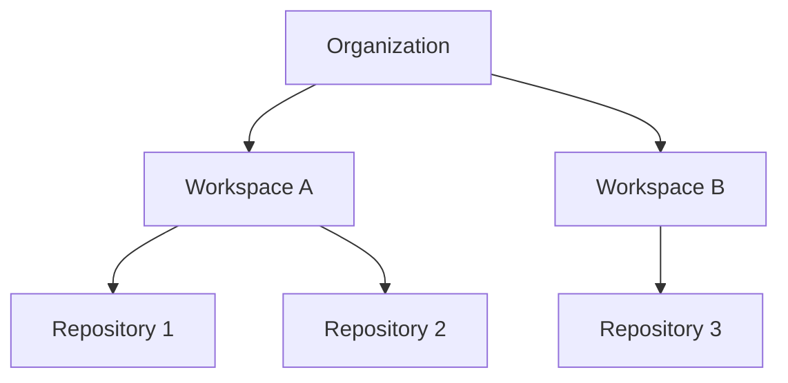

### Organization
The highest level of tenant isolation. Corresponds to a billing entity or enterprise customer. All users, workspaces, and API keys belong to an Organization. Data between organizations is strictly isolated.

### Workspace
A logical grouping of repositories and databases that form a single cohesive application. A user may have access to an Organization but be restricted to specific Workspaces.

### Repository
The granular code boundary. Access to a workspace implies access to its repositories, though future features will support repository-level exclusion.

---

## 3. Role-Based Access Control (RBAC)

The system relies on predefined roles assigned at either the Organization or Workspace level.

### Organization Roles
- **Owner**: Full billing, API key, and workspace management.
- **Admin**: Can create workspaces and invite users.
- **Member**: Can view workspaces they are explicitly assigned to.

### Workspace Roles
- **Workspace Admin**: Can connect new GitHub repositories, trigger analysis runs, and manage Workspace settings.
- **Editor**: Can create, update, and delete Saved Views. Can annotate graphs.
- **Viewer**: Read-only access to visualizations, search, and insights.

---

## 4. Resource Access Verification

Authorization checks must be performed before any resource is served.

### API Authorization
Every REST endpoint is protected by an Auth Guard that verifies:
1. The user's valid JWT session.
2. The user's membership in the Organization/Workspace.
3. The user's role against the required permissions for the endpoint.

### Graph Access Isolation
The `Graph Query Engine` automatically injects Organization and Workspace filters into every underlying Cypher/Store query. 
- A user can *never* query a Generic Graph Node that belongs to a workspace they cannot access.
- Cross-workspace queries are strictly prohibited unless explicit peering is configured (Future).

### Saved View Permissions
Saved Views are tied to a Workspace. 
- **Private Views**: Only visible to the creator.
- **Shared Views**: Visible to all Workspace members.

---

## 5. Authentication Abstraction

To ensure the platform can be deployed in diverse enterprise environments, authentication is abstracted via the [Plugin SDK & Extension System](./24-plugin-sdk-architecture.md).

- **Authentication Providers**: Implementations for standard OAuth2, OpenID Connect, SAML.
- **Default Implementation**: Email/Password + GitHub OAuth.
- **Enterprise Integrations**: Okta, Auth0, Azure Active Directory.

---

## 6. Audit Logging

Enterprise environments require traceability of all mutating actions and sensitive reads.

### Logged Events
The Event Bus emits `AuditEvent` objects for:
- User login / logout.
- Organization / Workspace creation or deletion.
- Repository connection / disconnection.
- Manual triggers of Analysis Runs.
- API Key generation / revocation.
- Role assignments.

### Storage
Audit logs are stored in PostgreSQL (or a dedicated cold storage bucket) and are strictly immutable. They are exposed to Organization Owners via a dedicated Audit UI.


---

# 27 — Infrastructure & Deployment Architecture

**Document Version:** 1.0.0
**Last Updated:** 2026-06-27
**Parent Document:** [00-executive-summary.md](./00-executive-summary.md)

---

## 1. Overview

The **Infrastructure & Deployment Architecture** ensures the Application Intelligence Platform can scale horizontally, remain highly available, and deploy seamlessly into various enterprise environments.

A core tenet of this architecture is **Cloud Independence**. The platform must not be tightly coupled to proprietary cloud services (e.g., AWS SQS, GCP PubSub) without an abstraction layer.

---

## 2. Core Infrastructure Components

The platform relies on the following core technologies, encapsulated via containerization:

- **Compute**: Node.js (Next.js for Frontend/API, NestJS for Workers).
- **Relational Database**: PostgreSQL (Stores operational metadata, configurations, RBAC).
- **Graph Store**: Memgraph (Default adapter for the Generic Graph Model).
- **In-Memory Store / Broker**: Redis (Powers BullMQ queues, caching, and rate limiting).
- **Search Store**: Elasticsearch or Typesense (Provides the first-class Search Engine).
- **Object Storage**: S3-compatible storage (MinIO for local, AWS S3 / GCS for production). Used for storing immutable Snapshot JSON payloads.

---

## 3. Cloud Provider Abstraction

To ensure vendor neutrality, the system uses adapters for external dependencies.

- **Queue System**: Default is `BullMQ` (Redis-backed). A future adapter could support AWS SQS or Kafka if required by an enterprise, though Redis is the standard.
- **Object Storage**: The `BlobStorageAdapter` interface wraps the S3 SDK, allowing seamless swapping between AWS, GCP, Azure, or MinIO.
- **Secret Management**: Instead of hardcoding `.env` files in production, secrets are fetched via a `SecretManagerAdapter` (supporting AWS Secrets Manager, HashiCorp Vault, etc.).

---

## 4. Deployment Topology

The system is designed for **Kubernetes Readiness**, allowing horizontal scaling of distinct workloads.

### Workload Separation
1. **Web App (Frontend)**: Next.js frontend serving React UI and Projection Models. Scales based on user traffic.
2. **API Gateway & Core API**: NestJS application handling HTTP requests, Authorization, and Graph Query translation. Scales based on read-heavy traffic.
3. **Queue Workers (Analysis Engines)**: Dedicated Node.js processes executing the First-Class Knowledge Graph Lifecycle (Parsing, Normalization, Graph Building). Highly CPU/Memory intensive. Scales horizontally based on the queue backlog (e.g., KEDA).
4. **Search Indexer**: A specialized worker observing the Event Bus to update the Search Store incrementally.

---

## 5. Background Processing & Queues

The platform relies heavily on asynchronous processing. The [Queue Architecture](./09-queue-architecture.md) defines specific queues.

### Horizontal Scaling of Workers
- **Concurrency**: Each worker node processes a configurable number of concurrent jobs.
- **Auto-Scaling**: Metrics from Redis (Queue Depth) determine how many Worker Pods are spun up.
- **Resource Limits**: Parsers (e.g., Tree-sitter) require strict memory limits to prevent out-of-memory (OOM) crashes on massively bloated source files.

---

## 6. Observability & Reliability

### Monitoring & Logging
- **Metrics**: API and Worker processes expose `/metrics` endpoints compatible with Prometheus (CPU, Memory, Event Loop Lag, Queue depths, Parser durations).
- **Logging**: All logs are emitted in JSON format (using Pino) for seamless ingestion into ELK/Datadog/CloudWatch.
- **Tracing**: OpenTelemetry (OTel) instrumentation is embedded in the Graph Query Engine and Parser Pipelines to trace a request from UI click -> API -> Memgraph Query -> Projection Engine.

### Health Checks
- **Liveness/Readiness Probes**: Exposed at `/health`. Verifies connections to Postgres, Redis, the Graph Store, and the Search Store.

### Backup Strategy & Disaster Recovery
- **Postgres**: Standard daily/continuous WAL archiving.
- **Graph Store**: Daily snapshots. Because the Graph Store can be fully reconstructed by re-running the Code Intelligence Pipeline over connected repositories, it can be treated as a highly durable cache.
- **Object Storage (Snapshots)**: Immutable blobs, naturally replicated across zones via the cloud provider.


---

# 28 — Versioning & Snapshot Architecture

**Document Version:** 1.0.0
**Last Updated:** 2026-06-27
**Parent Document:** [00-executive-summary.md](./00-executive-summary.md)

---

## 1. Overview

The **Versioning & Snapshot Architecture** establishes the foundation for historical analysis, time-travel, and incremental updates. 

Because software architectures evolve continuously, the Application Intelligence Platform must not only represent the *current* state of a workspace but also capture its *historical* topology to track degradation, technical debt accumulation, and dependency drift over time.

---

## 2. The Snapshot Hierarchy

The architecture defines a strict hierarchy of immutable snapshots generated during every analysis.

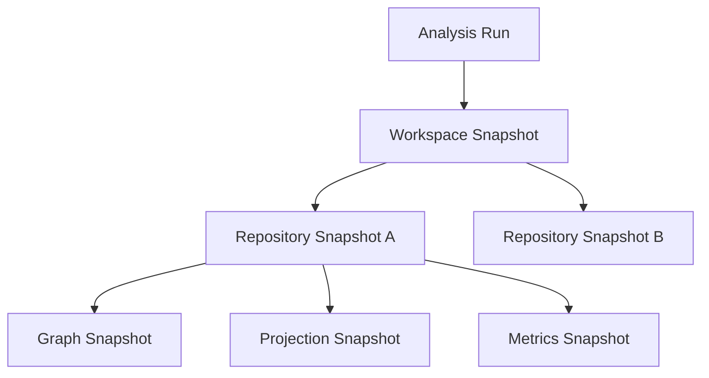

### Analysis Run
The overarching orchestration event. Triggered by a webhook (e.g., merge to `main`), a scheduled cron, or manual intervention.

### Workspace Snapshot
An immutable record aggregating all child repository snapshots at a specific point in time. Resolves cross-repository edges.

### Repository Snapshot
An immutable record of a specific repository at a specific commit hash.

### Graph Snapshot
The raw JSON payload representing the Generic Graph Model generated by the Graph Builder. Saved to Object Storage.

### Projection Snapshot
A pre-calculated layout representation (e.g., Dagre layout positions) for ultra-fast historical rendering.

### Metrics Snapshot
Calculated architecture scores (coupling, cohesion, blast radius severity) linked to this exact commit.

---

## 3. Immutability & Storage

Snapshots are inherently **immutable**. Once created, they can never be modified.

- **PostgreSQL**: Stores the lightweight metadata and hierarchy (IDs, commit hashes, timestamps, relationships between snapshots).
- **Object Storage**: Stores the heavy JSON payloads (Graph Snapshots, Projection Snapshots).
- **Graph Store (Memgraph)**: Stores the *current* live graph for fast querying. Historical queries load the JSON graph snapshots back into temporary/in-memory instances if deep traversal is required, or rely directly on Projection Snapshots for visualization.

---

## 4. Incremental Analysis

Rebuilding a massive enterprise application graph for every single commit is computationally unfeasible. The architecture mandates **Incremental Analysis**.

### Incremental Parsing
The Plugin SDK utilizes Tree-sitter's incremental parsing capabilities. Only modified files produce new ASTs.

### Graph Diffing
The Graph Builder compares the new Canonical IR against the previous Graph Snapshot to produce a **Graph Delta**.
- **Nodes Added**: Inserted into the Graph Store.
- **Nodes Removed**: Deleted from the Graph Store.
- **Edges Modified**: Updated.

### Cache Invalidation
Only the projections and metrics affected by the Graph Delta are recalculated. 

---

## 5. Historical Analysis & Time Travel

Users can step backward in time to view the architecture as it existed at a previous Workspace Snapshot.

### Time-Travel View
The frontend requests a Projection Snapshot corresponding to a specific date or commit. Because the Projection Snapshot contains pre-calculated node positions, the visualization renders instantly without hitting the live Graph Store.

### Trend Analysis
The [Analytics Package](./07-analytics-package.md) plots historical Metrics Snapshots to show changes in coupling and risk over time.

---

## 6. Snapshot Retention & Cleanup

As snapshots accumulate, storage costs increase. The system implements a retention lifecycle policy:
- **Last 30 Days**: All snapshots kept.
- **30 to 90 Days**: Roll up to daily snapshots (keep only the last snapshot of the day).
- **90+ Days**: Roll up to weekly snapshots.
- **Tagged Releases**: Snapshots tied to semantic version tags (e.g., `v1.2.0`) are retained indefinitely.


---

