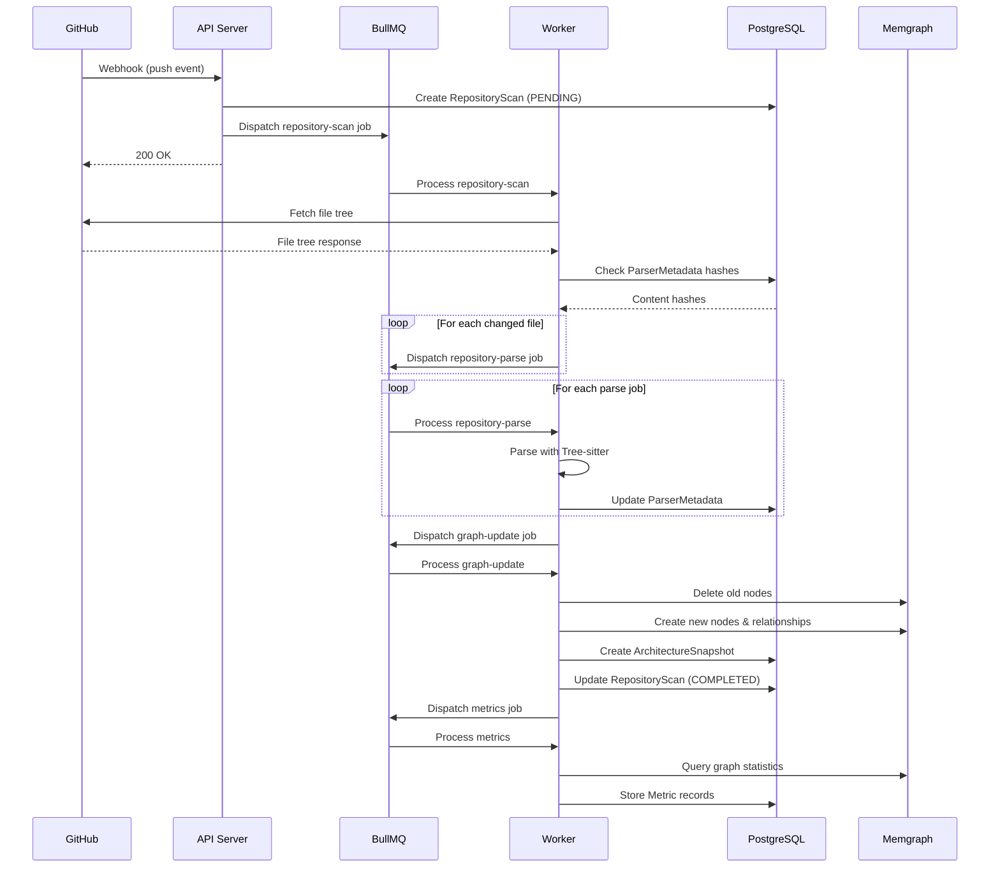
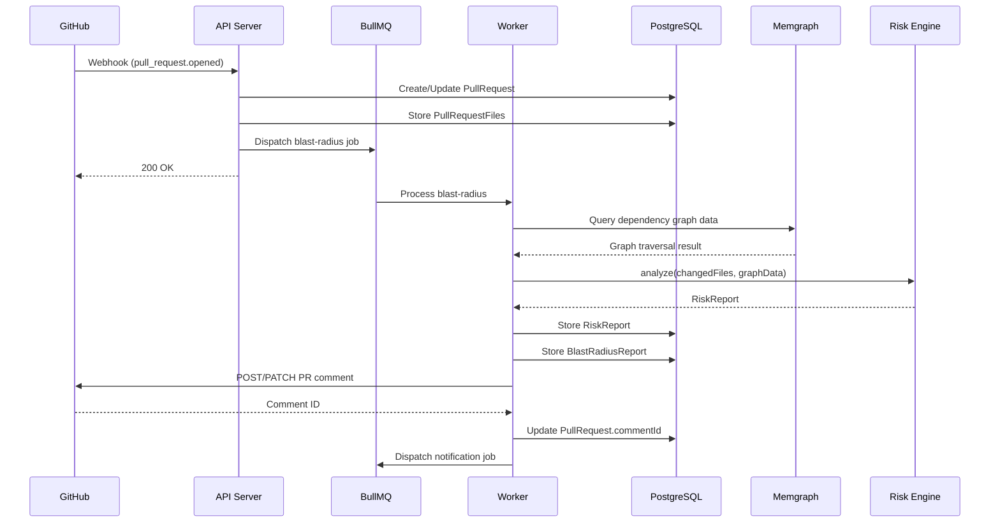
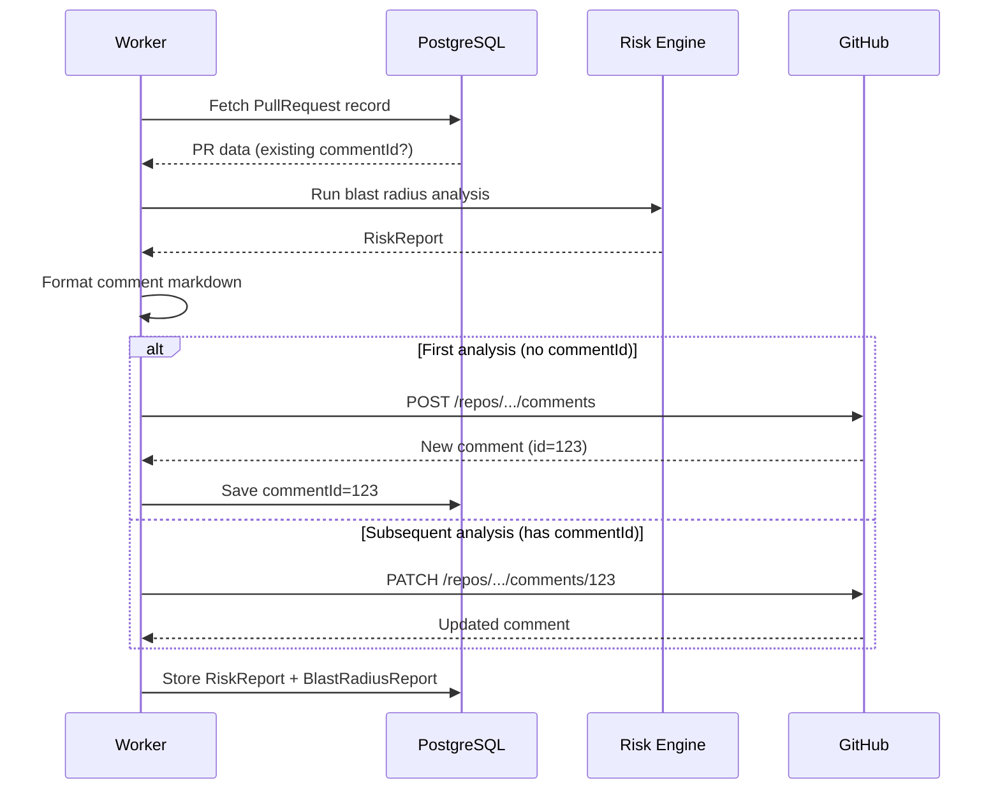

# SystemMapper — Event Architecture

**Document Version:** 1.0.0
**Last Updated:** 2026-06-27
**Parent Document:** [00-executive-summary.md](./00-executive-summary.md)

---

## Table of Contents

1. [Overview](#1-overview)
2. [Domain Events](#2-domain-events)
3. [Event Flow](#3-event-flow)
4. [Sequence Diagrams](#4-sequence-diagrams)

---

## 1. Overview

SystemMapper uses an **event-driven architecture** where domain events flow through BullMQ queues. Events represent state transitions in the system and trigger downstream processing. Events are **not** a separate pub/sub system — they are the job payloads dispatched between queues.

### 1.1 Event Contract

Every event follows a common envelope:

| Field | Type | Description |
|-------|------|-------------|
| `eventId` | string (UUID) | Unique event identifier |
| `eventType` | EventType (enum) | Event category |
| `timestamp` | string (ISO 8601) | When the event occurred |
| `correlationId` | string | Request correlation ID for tracing |
| `source` | string | Originating component |
| `payload` | T | Event-specific data |

---

## 2. Domain Events

### 2.1 `RepositoryConnected`

- **Trigger:** User installs GitHub App on a repository or manually connects a repo.
- **Source:** API Server (webhook handler or connect endpoint).
- **Payload:** `{ repositoryId, organizationId, githubRepoId, fullName, installationId }`
- **Consumers:** Scan Orchestrator (triggers initial scan), Notification Processor (notifies team).

### 2.2 `RepositoryQueued`

- **Trigger:** A repository scan is queued.
- **Source:** API Server or Webhook Handler.
- **Payload:** `{ repositoryId, scanId, branch, commitSha, triggerType }`
- **Consumers:** Scan Processor (begins scanning), UI (updates scan status display).

### 2.3 `RepositoryParsed`

- **Trigger:** All files in a repository have been parsed.
- **Source:** Worker (Parse Processor completion detection).
- **Payload:** `{ repositoryId, scanId, totalFiles, parsedFiles, failedFiles, skippedFiles }`
- **Consumers:** Graph Build Processor or Graph Update Processor.

### 2.4 `GraphCreated`

- **Trigger:** The Memgraph dependency graph is fully built for the first time.
- **Source:** Worker (Graph Build Processor).
- **Payload:** `{ repositoryId, scanId, nodeCount, relationshipCount }`
- **Consumers:** Metrics Processor, Notification Processor.

### 2.5 `GraphUpdated`

- **Trigger:** The Memgraph graph is incrementally updated after a push.
- **Source:** Worker (Graph Update Processor).
- **Payload:** `{ repositoryId, scanId, nodesAdded, nodesRemoved, nodesModified, relationshipsAdded, relationshipsRemoved }`
- **Consumers:** Metrics Processor, Notification Processor.

### 2.6 `SnapshotCreated`

- **Trigger:** An architecture snapshot is captured.
- **Source:** Worker (Graph Build/Update Processor).
- **Payload:** `{ repositoryId, snapshotId, scanId, nodeCount, relationshipCount, architectureScore }`
- **Consumers:** Analytics (trend update), Notification Processor.

### 2.7 `PullRequestOpened`

- **Trigger:** A pull request is opened on a tracked repository.
- **Source:** API Server (webhook handler).
- **Payload:** `{ repositoryId, pullRequestId, githubPrNumber, changedFiles, installationId }`
- **Consumers:** Blast Radius Processor.

### 2.8 `PullRequestUpdated`

- **Trigger:** New commits are pushed to an open pull request.
- **Source:** API Server (webhook handler).
- **Payload:** `{ repositoryId, pullRequestId, githubPrNumber, newCommitSha, changedFiles, installationId }`
- **Consumers:** Blast Radius Processor (re-analyze).

### 2.9 `BlastRadiusCalculated`

- **Trigger:** Blast radius analysis is complete.
- **Source:** Worker (Blast Radius Processor).
- **Payload:** `{ repositoryId, pullRequestId, riskReportId, riskScore, riskLevel, affectedFileCount }`
- **Consumers:** Comment Publisher, Notification Processor.

### 2.10 `CommentPublished`

- **Trigger:** Blast radius comment is posted/updated on GitHub.
- **Source:** Worker (Blast Radius Processor — comment step).
- **Payload:** `{ repositoryId, pullRequestId, commentId, githubPrNumber }`
- **Consumers:** Notification Processor (optional confirmation).

### 2.11 `MetricsCalculated`

- **Trigger:** Repository metrics are computed and stored.
- **Source:** Worker (Metrics Processor).
- **Payload:** `{ repositoryId, scanId, snapshotId, architectureScore, technicalDebtScore, metricCount }`
- **Consumers:** Notification Processor (if significant changes), Analytics (trend update).

### 2.12 `NotificationSent`

- **Trigger:** A notification is delivered to a user.
- **Source:** Worker (Notification Processor).
- **Payload:** `{ notificationId, userId, type, title }`
- **Consumers:** None (terminal event, logged for audit).

---

## 3. Event Flow

### 3.1 Repository Onboarding Flow

```
User Installs App
       │
       ▼
RepositoryConnected ──→ RepositoryQueued
                              │
                              ▼
                        (parse all files)
                              │
                              ▼
                        RepositoryParsed
                              │
                              ▼
                        GraphCreated ──→ SnapshotCreated
                              │
                              ▼
                        MetricsCalculated
                              │
                              ▼
                        NotificationSent (scan complete)
```

### 3.2 Push Event Flow

```
git push
       │
       ▼
RepositoryQueued (incremental)
       │
       ▼
(parse changed files)
       │
       ▼
RepositoryParsed
       │
       ▼
GraphUpdated ──→ SnapshotCreated
       │
       ▼
MetricsCalculated
       │
       ▼
NotificationSent (if significant changes)
```

### 3.3 Pull Request Flow

```
PR Opened/Updated
       │
       ▼
PullRequestOpened/Updated
       │
       ▼
(blast radius analysis)
       │
       ▼
BlastRadiusCalculated
       │
       ▼
CommentPublished
       │
       ▼
NotificationSent (if high risk)
```

---

## 4. Sequence Diagrams

### 4.1 Repository Scan Sequence



### 4.2 Blast Radius Sequence



### 4.3 PR Comment Flow



---

*End of Event Architecture. Continue to [11-api-design.md](./11-api-design.md) →*
