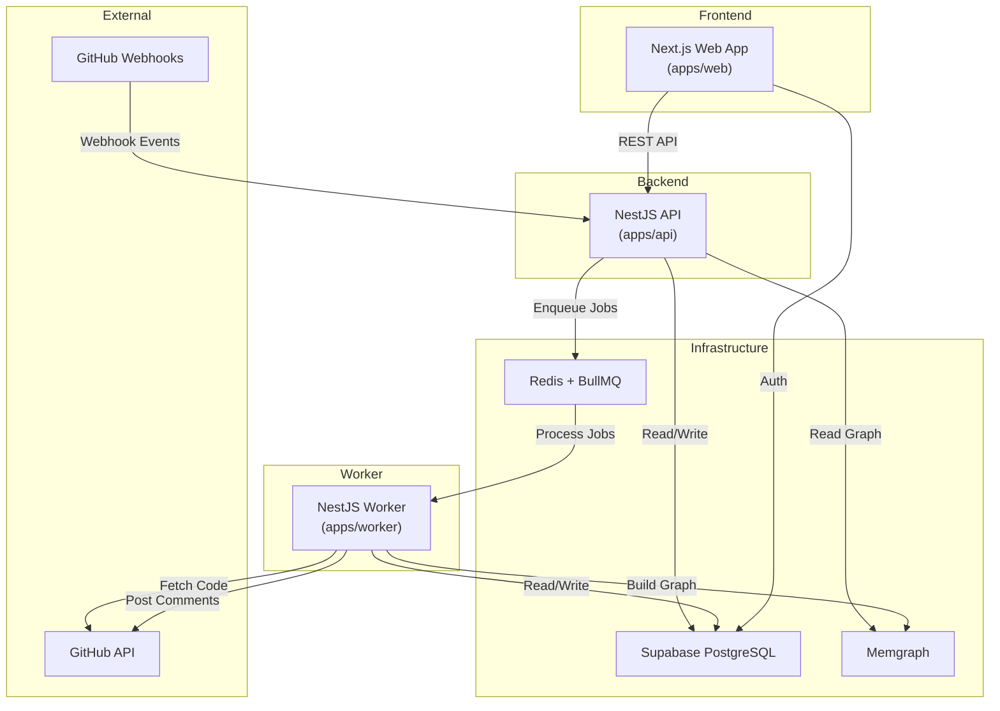
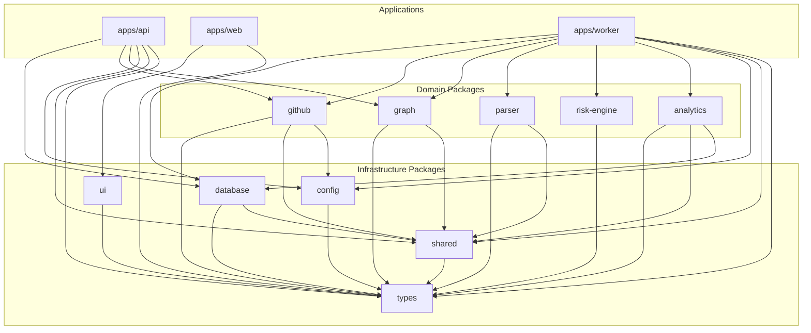
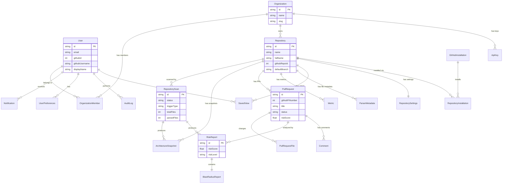
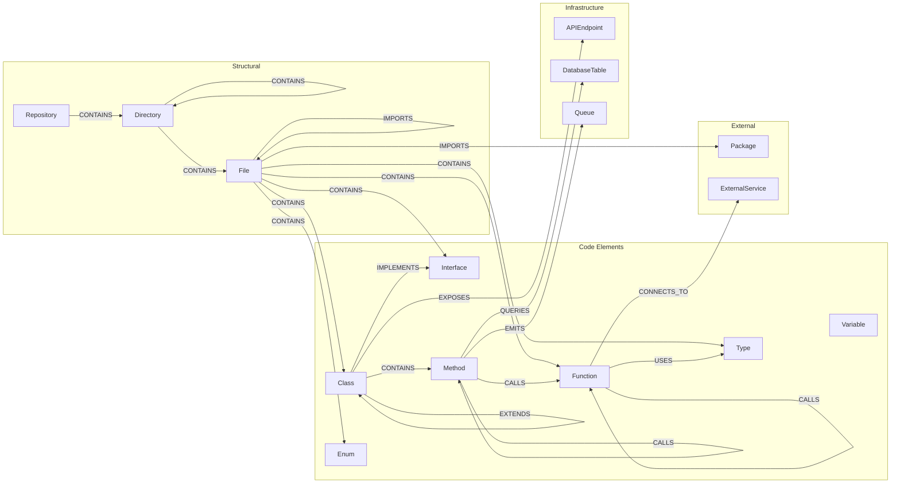
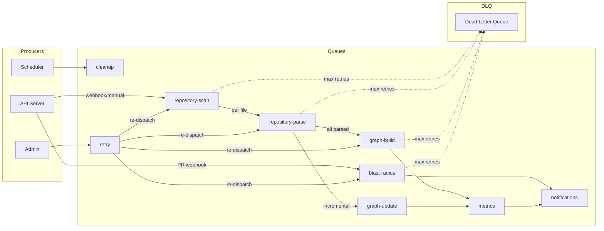
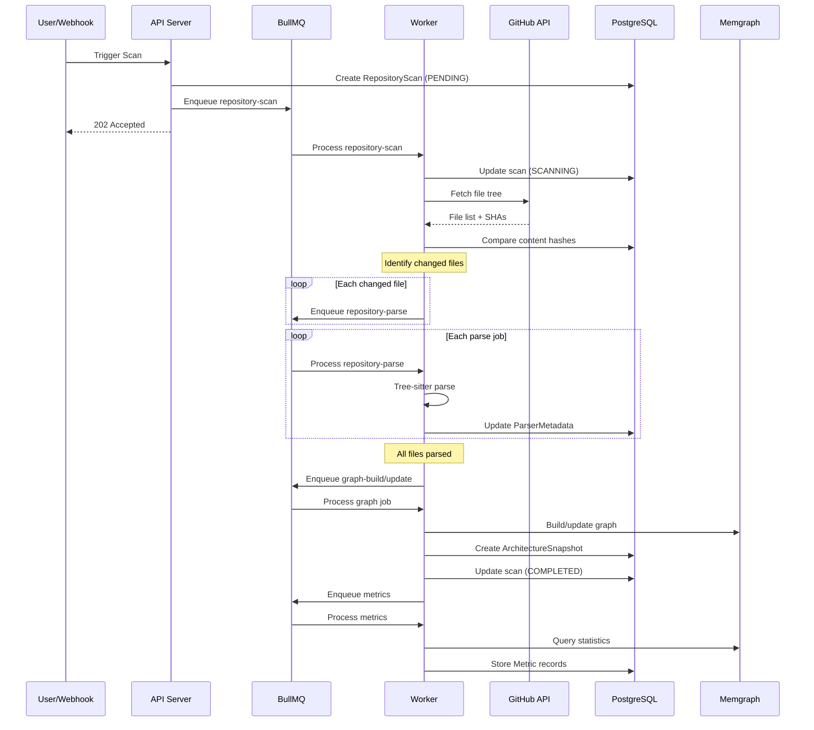
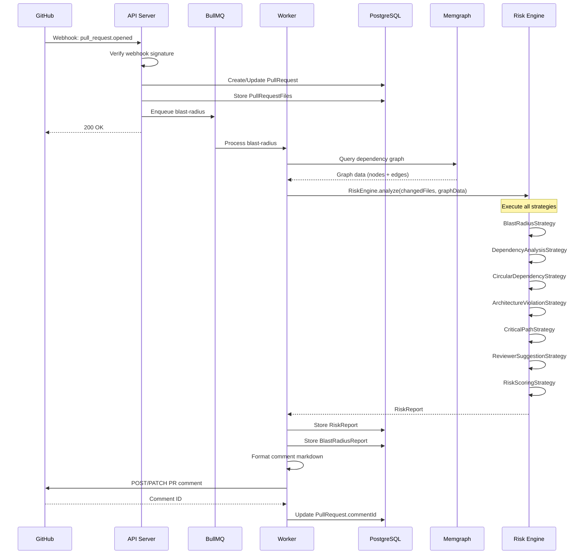
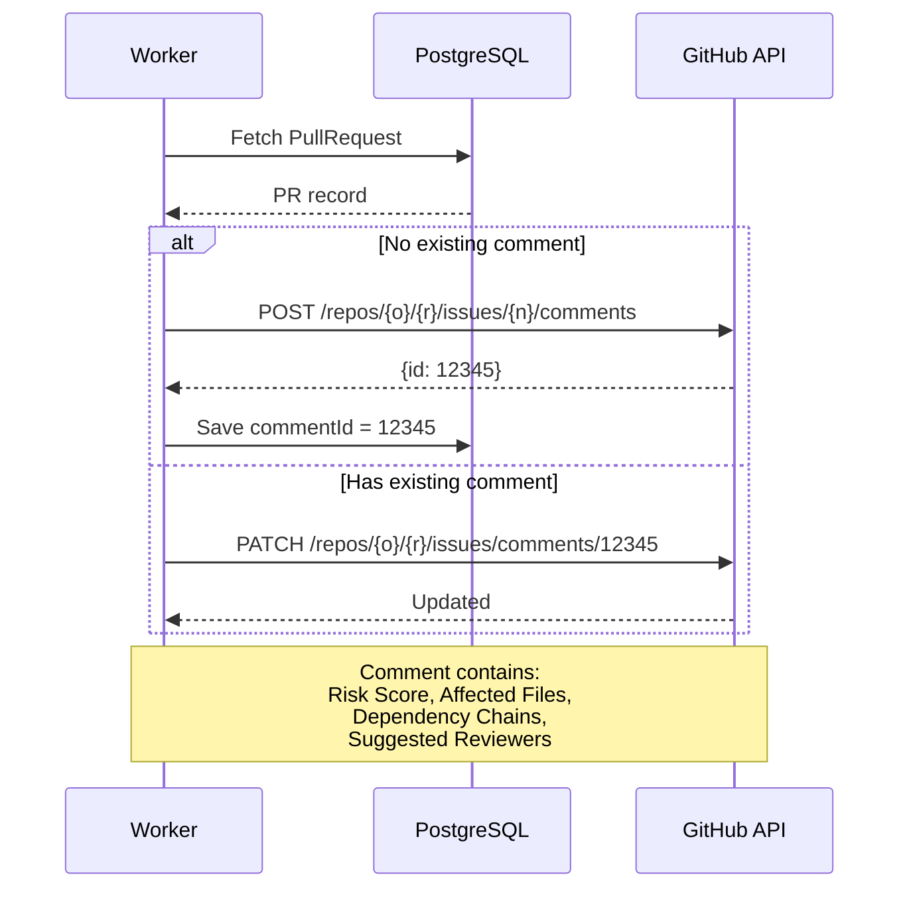
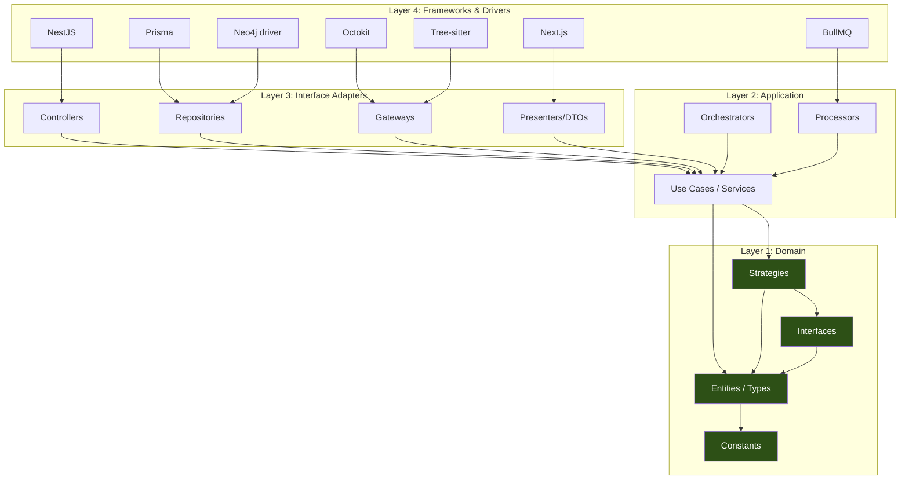

# SystemMapper — Architecture Diagrams

**Document Version:** 1.0.0
**Last Updated:** 2026-06-27
**Parent Document:** [00-executive-summary.md](./00-executive-summary.md)

---

## Table of Contents

1. [Overall Architecture](#1-overall-architecture)
2. [Package Dependencies](#2-package-dependencies)
3. [ER Diagram](#3-er-diagram)
4. [Graph Model](#4-graph-model)
5. [Queue Flow](#5-queue-flow)
6. [Repository Scan Flow](#6-repository-scan-flow)
7. [Blast Radius Flow](#7-blast-radius-flow)
8. [PR Comment Flow](#8-pr-comment-flow)
9. [Clean Architecture Layers](#9-clean-architecture-layers)

---

## 1. Overall Architecture

---

## 2. Package Dependencies

---

## 3. ER Diagram

---

## 4. Graph Model

---

## 5. Queue Flow

---

## 6. Repository Scan Flow

---

## 7. Blast Radius Flow

---

## 8. PR Comment Flow

---

## 9. Clean Architecture Layers

**Dependency Rule:** Arrows point inward. Layer 1 (Domain) has zero dependencies on outer layers. Each layer only depends on the layer immediately inside it.

---

*End of Diagrams. Continue to [19-adrs.md](./19-adrs.md) →*
