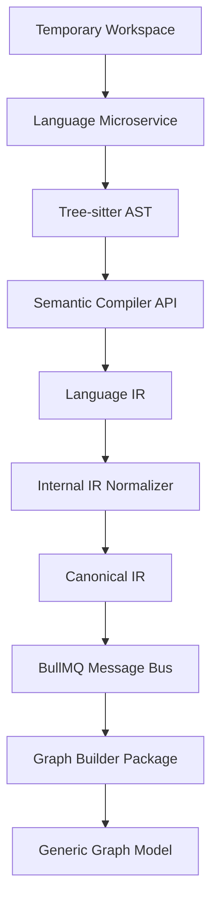

# 21 — Code Intelligence Architecture

**Document Version:** 1.0.0
**Last Updated:** 2026-06-27
**Parent Document:** [00-executive-summary.md](./00-executive-summary.md)

---

## 1. Overview

The **Code Intelligence Architecture** defines the multi-language, multi-repository analysis subsystem of the Application Intelligence Platform. 

This architecture mandates a strict **First-Class Knowledge Graph Lifecycle**, ensuring that source code from any language is uniformly processed, normalized, and eventually constructed into a Generic Graph Model. 

The primary goal is to describe how every supported language produces the exact same **Canonical Intermediate Representation (Canonical IR)** consumed by the Graph Builder, regardless of underlying language semantics or framework conventions.

---

## 2. The Code Intelligence Pipeline

The architecture is driven by the following canonical information flow:

No language microservice may bypass this lifecycle or interact directly with the Graph Store (e.g., Memgraph). Normalization happens *inside* the microservice.

---

## 3. Language Microservice Architecture

SystemMapper delegates language-specific parsing to isolated microservices (e.g., `parse-ts`, `parse-py`, `parse-db`) to ensure horizontal scalability and fault tolerance.

### Responsibilities
1. **Source Ingestion**: Read files from the temporary workspace.
2. **AST Generation**: Produce an Abstract Syntax Tree using engines like Tree-sitter.
3. **Semantic Enrichment**: Resolve cross-file types using Semantic Compiler APIs (e.g., TypeScript `TypeChecker`) where available.
4. **Translation to Language IR**: The parsed structures must be translated into the microservice's internal Language IR.
5. **Normalization**: Convert the Language IR into the shared Canonical IR before returning the result over the queue.

### Language Intermediate Representation (Language IR)
The Language IR represents concepts specific to a language ecosystem (e.g., TypeScript's `namespace`, Go's `goroutine`, Python's `decorator`). It is strongly typed but internal to the microservice.

---

## 4. IR Normalization & Canonical IR

The core of the Code Intelligence Engine is the **Normalizer**, which sits at the boundary of each language microservice and converts varied Language IRs into the **Canonical IR**.

### Canonical Intermediate Representation
The Canonical IR is a highly restricted, language-agnostic schema defining the universal structures of software architecture. Its types are centrally defined in the `@systemmapper/types` package.

It defines entities such as:
- `File`
- `Symbol`
- `Function`
- `Class`
- `Interface`
- `Dependency` (Internal and External Imports)
- `Route` (HTTP Endpoints)
- `Component` (UI elements)
- `Controller` (API handlers)
- `Service` (Business logic)
- `Entity` (Database models)

### Normalization Rules
Every Language Microservice must map its Language IR to the Canonical IR.
- *Example*: A Java `@RestController` class maps to a Canonical `Controller` entity.
- *Example*: A NestJS `@Get()` decorator maps to a Canonical `Route` entity.
- *Example*: A React `function Component()` maps to a Canonical `Component` entity.
- *Example*: A SQL `CREATE TABLE` maps to a Canonical `Entity`.

---

## 5. Extractor Pipelines

Operating on top of the Canonical IR, specific extractors build relationships before handing off to the Graph Builder.

### Framework Detection
Detects underlying frameworks (React, Angular, NestJS, Spring Boot, Django) by scanning dependency manifestations (`package.json`, `pom.xml`, `requirements.txt`) and structural patterns in the Canonical IR.

### ORM Detection & Database Extraction
Detects Object-Relational Mappers (Prisma, TypeORM, Hibernate, SQLAlchemy). Extracts:
- Table structures
- Column definitions
- Relationships (One-to-Many, Many-to-Many)
These are mapped to Canonical `Entity` objects.

### Route & API Extraction
Analyzes framework-specific routing to extract HTTP methods, paths, request bodies, and response types, standardizing them into Canonical `Route` definitions.

### Dependency Extraction
Maps `import`/`require`/`using` statements into Canonical `Dependency` edges connecting files, packages, and external libraries.

---

## 6. Multi-Repository Architecture Discovery

The Code Intelligence Engine understands that a single repository is rarely an entire application.

### Repository Classification
Upon scanning, the engine classifies the repository into a designated role:
- `Frontend`
- `Backend`
- `Shared Library`
- `Mobile`
- `Infrastructure`
- `Database`
- `Worker`
- `Microservice`

### Cross-Language & Cross-Repository Analysis
By standardizing on the Canonical IR, the platform can link entities across repositories and languages.
- *Example*: A TypeScript `Frontend` API call (Fetch/Axios) can be pattern-matched against a Go `Backend` Canonical `Route`, establishing an application-wide boundary-crossing edge.

---

## 7. Graph Builder Integration

The `graph-builder` package sits at the end of the Code Intelligence Pipeline.

### Role
The Graph Builder is strictly responsible for transforming the Canonical IR into the **Generic Graph Model (GGM)**.
- Generates deterministic, UUID v5 deterministic identities based on the Workspace and Repository contexts.
- Creates `GraphNode` and `GraphEdge` abstractions.
- Bundles the generic nodes and passes them to the [Graph Package / Store](./20-graph-package.md) via generic `GraphWriter` interfaces.

---

## 8. Supported Language Roadmap

The Plugin SDK enforces a phased rollout of language support:

**Phase 1 (MVP)**:
- JavaScript (Node.js, React, Vue)
- TypeScript (NestJS, React)

**Phase 2**:
- Python (Django, FastAPI)
- Go (Gin, standard library)

**Phase 3**:
- Java (Spring Boot)
- Kotlin (Spring Boot, Android)
- C# (.NET Core)

**Phase 4**:
- Rust
- PHP (Laravel)
- Ruby (Rails)
- Swift

Because all plugins must yield Canonical IR, adding a Phase 4 language requires zero modifications to the Graph Builder, Generic Graph Model, or UI layers.
