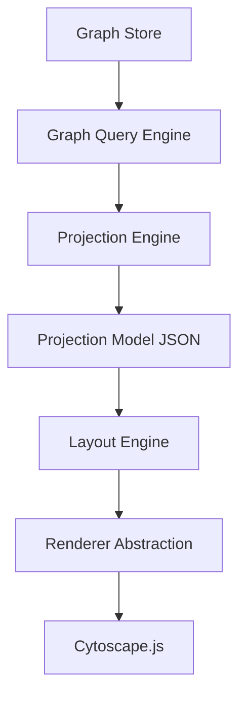

# 22 — Visualization Architecture

**Document Version:** 1.0.0
**Last Updated:** 2026-06-27
**Parent Document:** [00-executive-summary.md](./00-executive-summary.md)

---

## 1. Overview

The **Visualization Architecture** dictates how complex software topologies are presented to the end user. It enforces a strict separation of concerns, ensuring that the frontend never consumes raw graph data directly. 

The architecture introduces a **Projection Engine** and explicitly decouples the **Layout Engine** from the **Renderer**.

---

## 2. Visualization Pipeline

The entire visualization subsystem is designed around the following unidirectional data flow:

---

## 3. Projection Engine & Projection Models

The frontend must never receive `Memgraph` nodes or the raw `Generic Graph Model`. 

### Responsibilities of the Projection Engine
- Retrieve subgraphs from the Graph Query Engine.
- Transform backend domain entities into visualization-specific **Projection Models**.
- Embed default styling, grouping, metadata, and expansion states.

### Supported Projection Views
A projection model is tailored to a specific user context.
1. **Workspace View**: Top-level view of Repositories and their interdependencies.
2. **Repository View**: Folders, files, and modules within a single repo.
3. **Architecture View**: High-level component interactions across the workspace.
4. **Service Dependency View**: API calls bridging Frontend and Backend.
5. **Database View**: Lineage from Route → Controller → Service → ORM → Database Table.
6. **Risk / Blast Radius View**: Highlighted paths showing the downstream impact of a change.

---

## 4. Separation of Layout Engine and Renderer

The visual placement of nodes (Layout) is architecturally distinct from the drawing of nodes (Rendering).

### Layout Engine Abstraction
The system calculates X/Y coordinates independently of the canvas. The Layout Engine supports multiple algorithms to accommodate different graph typologies:
- **ELK (Eclipse Layout Kernel)**: Best for strictly layered architecture diagrams (e.g., ports and adapters).
- **Dagre**: Directed acyclic graphs (call graphs, dependency chains).
- **Force-Directed (d3-force / cola)**: Organic, highly interconnected clusters (e.g., symbol-level coupling).
- **Hierarchical & Circular**: Used for folder structures and package dependencies.

### Renderer Abstraction
The system communicates with the canvas through a `RendererInterface`.
- **Current Implementation**: `Cytoscape.js`. Chosen for its robustness with large graphs and rich styling API.
- **Future Flexibility**: Because the Layout Engine pre-calculates positions and the Projection Model defines the structure, swapping to `WebGL`, `Three.js`, or `ReactFlow` requires zero business-logic changes.

---

## 5. Large Graph Virtualization & Optimizations

Software architecture graphs can easily exceed 100,000 nodes. Rendering this simultaneously is impossible in a browser.

### Optimization Strategies
1. **Incremental Expand/Collapse**: The projection engine only sends the root nodes (e.g., Repositories). When a user double-clicks, an API call fetches the next level of depth (Folders/Modules).
2. **Graph Clustering**: Visually collapsing highly connected subgroups into a single meta-node until zoomed.
3. **Viewport Culling**: The renderer must destroy or hide SVG/Canvas elements that exist outside the current viewport.
4. **Debounced Layouts**: Layout algorithms run in Web Workers to prevent main-thread UI blocking.

---

## 6. Graph Interaction Model

The architecture defines standard interactive behaviors:
- **Hover**: Dim non-connected nodes; highlight the immediate upstream/downstream neighborhood.
- **Select (Click)**: Lock the highlight state; fetch detailed metadata in a side-panel.
- **Expand (Double-Click)**: Fetch children nodes from the API and dynamically update the Layout Engine.
- **Focus**: Trigger a new Projection Model rooted at the selected node.

---

## 7. Saved Views Subsystem

A **Saved View** is a persistent database record that captures the exact state of the visualization, allowing users to share or return to a specific context.

### Saved View Payload
Instead of saving X/Y coordinates for every node, the `SavedView` entity stores:
- **Target Projection ID**: (e.g., "Architecture View for Repo A").
- **Viewport State**: Camera X/Y position and Zoom level.
- **Expansion State**: An array of Node IDs that have been explicitly expanded.
- **Visibility State**: Arrays of Node IDs that are hidden or pinned.
- **Layout Algorithm**: The selected layout engine (e.g., `dagre`).
- **Filters**: Applied metadata filters (e.g., "Hide test files", "Show only internal dependencies").

This guarantees that as the underlying code evolves, a Saved View will dynamically render the *newest* code using the *saved* parameters.
