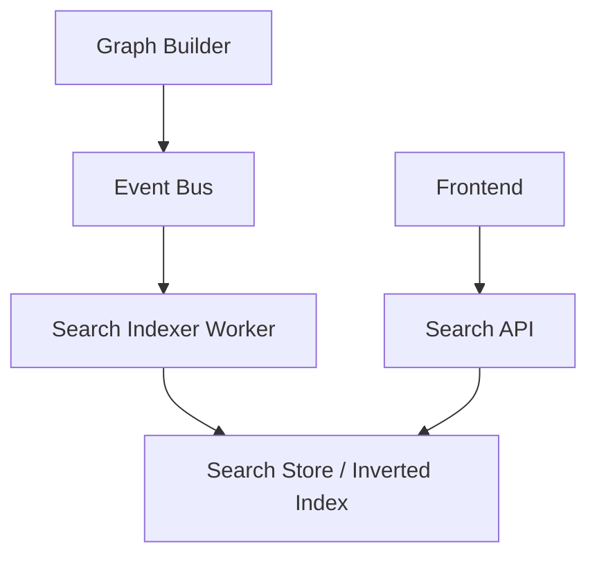

# 23 — Search Architecture

**Document Version:** 1.0.0
**Last Updated:** 2026-06-27
**Parent Document:** [00-executive-summary.md](./00-executive-summary.md)

---

## 1. Overview

As the Application Intelligence Platform ingests massive amounts of cross-repository data, navigation through visual exploration alone becomes insufficient. 

The **Search Architecture** elevates search into a first-class subsystem. It defines the indexing strategies and APIs required to rapidly query the entire workspace spanning code, infrastructure, database schemas, and operational metadata.

---

## 2. Search Engine Subsystem

The Search Engine is decoupled from the transactional Graph Store and Postgres. 

### Architecture Flow

### Search Store Technology
While Memgraph provides Lucene-backed full-text indices, relying on it for high-throughput global autocomplete queries creates unnecessary database contention.
- **Primary Search Store**: Elasticsearch or Typesense (accessed via a `SearchStoreAdapter`).
- **Graph Fallback**: For complex relational searches (e.g., "Find all controllers using Service X"), the Search Engine routes the query to the `Graph Query Engine`.

---

## 3. Indexing Strategy

Indexing occurs asynchronously to prevent blocking the primary analysis pipeline.

### Incremental Indexing
Whenever the `GraphBuilder` emits a `GraphUpdatedV1` event, the `SearchIndexer` calculates the delta and updates the Search Store. 

### Indexed Entities
The Search Engine indexes the **Canonical Domain Model**.
- **Structural**: Repositories, Folders, Files.
- **Code Intelligence**: Symbols, Functions, Classes, Interfaces.
- **Framework specific**: React components, Angular components, Vue components, Controllers, Services.
- **Data & Infrastructure**: Database tables, columns, Queues, Events, Routes, APIs.
- **Operational**: Ownership records, Risks, Vulnerabilities, Commits, Contributors.

---

## 4. Query Capabilities

The Search API must support diverse query models.

### 4.1 Global Omnibox (Fuzzy Search)
The primary UI interaction is a global command palette.
- Supports fuzzy matching and typos.
- Ranks results by relevance (e.g., matching a Repository name ranks higher than matching a variable inside a file).

### 4.2 Faceted / Structured Search
Users can filter by the Canonical Domain Model type.
- Example: `type:controller owner:team-auth query:login`
- Example: `type:table database:postgres-main`

### 4.3 Relational Search (Graph Search)
Relational queries are routed from the Search API to the Graph Query Engine.
- Example: `depends_on:UserService`
- Example: `called_by:FrontendApp`

### 4.4 Risk & Ownership Search
- Searching for all components owned by a specific user.
- Searching for all high-severity blast-radius risks.

---

## 5. Integration with the Platform

Search is deeply integrated with the visualization and navigation layers.

### Global Navigation
Clicking a search result does not just open a text file. It triggers a **Focus Event** in the Visualization Engine.
- Example: Searching for `OrderController` and clicking it will instantly render the **Service Dependency View** Projection centered on `OrderController`.

### API & Frontend Integration
- **API**: Exposed via `/api/v1/search` with support for pagination, faceting, and highlighting.
- **Frontend**: Consumes the API using a debounced hook connected to a global state command palette.

---

## 6. Future Capabilities

The Search Architecture is designed to easily accommodate advanced AI-driven search models.

### Semantic & Vector Search
- **Embedding Generation**: In the future, the `SearchIndexer Worker` will generate vector embeddings for function bodies and documentation using the AI Provider SDK.
- **Vector Store**: Embeddings will be stored in a dedicated vector database (e.g., Pinecone, pgvector).
- **Natural Language Queries**: Users can ask "Where do we handle password resets?" The Search Engine will execute a vector similarity search across the codebase embeddings.
