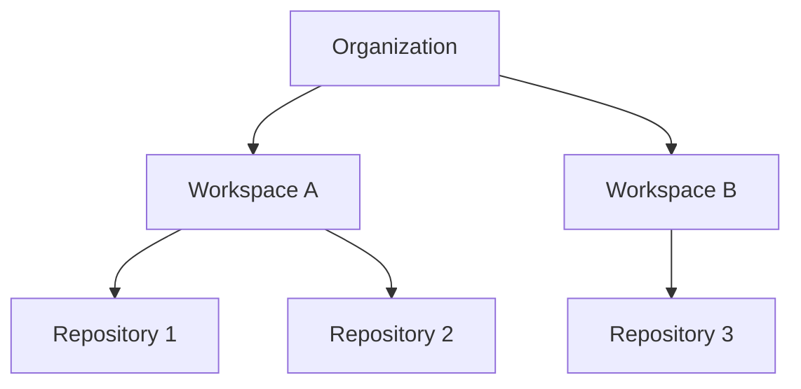

# 26 — Security & Authorization Architecture

**Document Version:** 1.0.0
**Last Updated:** 2026-06-27
**Parent Document:** [00-executive-summary.md](./00-executive-summary.md)

---

## 1. Overview

The **Security & Authorization Architecture** establishes the long-term enterprise security model for the Application Intelligence Platform.

Because the system ingests sensitive intellectual property (source code) and operational infrastructure details (database schemas), rigorous multi-tenancy isolation and Role-Based Access Control (RBAC) are fundamental to the architecture.

---

## 2. The Multi-Tenancy Hierarchy

The system defines boundaries through a strict top-down ownership model.

### Organization
The highest level of tenant isolation. Corresponds to a billing entity or enterprise customer. All users, workspaces, and API keys belong to an Organization. Data between organizations is strictly isolated.

### Workspace
A logical grouping of repositories and databases that form a single cohesive application. A user may have access to an Organization but be restricted to specific Workspaces.

### Repository
The granular code boundary. Access to a workspace implies access to its repositories, though future features will support repository-level exclusion.

---

## 3. Role-Based Access Control (RBAC)

The system relies on predefined roles assigned at either the Organization or Workspace level.

### Organization Roles
- **Owner**: Full billing, API key, and workspace management.
- **Admin**: Can create workspaces and invite users.
- **Member**: Can view workspaces they are explicitly assigned to.

### Workspace Roles
- **Workspace Admin**: Can connect new GitHub repositories, trigger analysis runs, and manage Workspace settings.
- **Editor**: Can create, update, and delete Saved Views. Can annotate graphs.
- **Viewer**: Read-only access to visualizations, search, and insights.

---

## 4. Resource Access Verification

Authorization checks must be performed before any resource is served.

### API Authorization
Every REST endpoint is protected by an Auth Guard that verifies:
1. The user's valid JWT session.
2. The user's membership in the Organization/Workspace.
3. The user's role against the required permissions for the endpoint.

### Graph Access Isolation
The `Graph Query Engine` automatically injects Organization and Workspace filters into every underlying Cypher/Store query. 
- A user can *never* query a Generic Graph Node that belongs to a workspace they cannot access.
- Cross-workspace queries are strictly prohibited unless explicit peering is configured (Future).

### Saved View Permissions
Saved Views are tied to a Workspace. 
- **Private Views**: Only visible to the creator.
- **Shared Views**: Visible to all Workspace members.

---

## 5. Authentication Abstraction

To ensure the platform can be deployed in diverse enterprise environments, authentication is abstracted via the [Plugin SDK & Extension System](./24-plugin-sdk-architecture.md).

- **Authentication Providers**: Implementations for standard OAuth2, OpenID Connect, SAML.
- **Default Implementation**: Email/Password + GitHub OAuth.
- **Enterprise Integrations**: Okta, Auth0, Azure Active Directory.

---

## 6. Audit Logging

Enterprise environments require traceability of all mutating actions and sensitive reads.

### Logged Events
The Event Bus emits `AuditEvent` objects for:
- User login / logout.
- Organization / Workspace creation or deletion.
- Repository connection / disconnection.
- Manual triggers of Analysis Runs.
- API Key generation / revocation.
- Role assignments.

### Storage
Audit logs are stored in PostgreSQL (or a dedicated cold storage bucket) and are strictly immutable. They are exposed to Organization Owners via a dedicated Audit UI.
