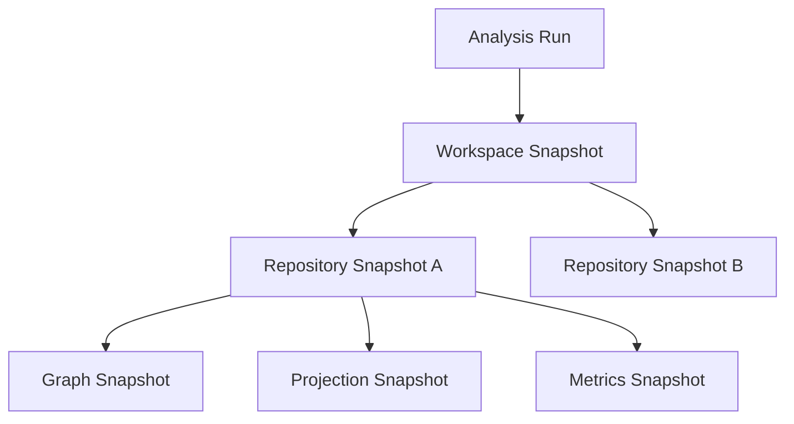

# 28 — Versioning & Snapshot Architecture

**Document Version:** 1.0.0
**Last Updated:** 2026-06-27
**Parent Document:** [00-executive-summary.md](./00-executive-summary.md)

---

## 1. Overview

The **Versioning & Snapshot Architecture** establishes the foundation for historical analysis, time-travel, and incremental updates. 

Because software architectures evolve continuously, the Application Intelligence Platform must not only represent the *current* state of a workspace but also capture its *historical* topology to track degradation, technical debt accumulation, and dependency drift over time.

---

## 2. The Snapshot Hierarchy

The architecture defines a strict hierarchy of immutable snapshots generated during every analysis.

### Analysis Run
The overarching orchestration event. Triggered by a webhook (e.g., merge to `main`), a scheduled cron, or manual intervention.

### Workspace Snapshot
An immutable record aggregating all child repository snapshots at a specific point in time. Resolves cross-repository edges.

### Repository Snapshot
An immutable record of a specific repository at a specific commit hash.

### Graph Snapshot
The raw JSON payload representing the Generic Graph Model generated by the Graph Builder. Saved to Object Storage.

### Projection Snapshot
A pre-calculated layout representation (e.g., Dagre layout positions) for ultra-fast historical rendering.

### Metrics Snapshot
Calculated architecture scores (coupling, cohesion, blast radius severity) linked to this exact commit.

---

## 3. Immutability & Storage

Snapshots are inherently **immutable**. Once created, they can never be modified.

- **PostgreSQL**: Stores the lightweight metadata and hierarchy (IDs, commit hashes, timestamps, relationships between snapshots).
- **Object Storage**: Stores the heavy JSON payloads (Graph Snapshots, Projection Snapshots).
- **Graph Store (Memgraph)**: Stores the *current* live graph for fast querying. Historical queries load the JSON graph snapshots back into temporary/in-memory instances if deep traversal is required, or rely directly on Projection Snapshots for visualization.

---

## 4. Incremental Analysis

Rebuilding a massive enterprise application graph for every single commit is computationally unfeasible. The architecture mandates **Incremental Analysis**.

### Incremental Parsing
The Plugin SDK utilizes Tree-sitter's incremental parsing capabilities. Only modified files produce new ASTs.

### Graph Diffing
The Graph Builder compares the new Canonical IR against the previous Graph Snapshot to produce a **Graph Delta**.
- **Nodes Added**: Inserted into the Graph Store.
- **Nodes Removed**: Deleted from the Graph Store.
- **Edges Modified**: Updated.

### Cache Invalidation
Only the projections and metrics affected by the Graph Delta are recalculated. 

---

## 5. Historical Analysis & Time Travel

Users can step backward in time to view the architecture as it existed at a previous Workspace Snapshot.

### Time-Travel View
The frontend requests a Projection Snapshot corresponding to a specific date or commit. Because the Projection Snapshot contains pre-calculated node positions, the visualization renders instantly without hitting the live Graph Store.

### Trend Analysis
The [Analytics Package](./07-analytics-package.md) plots historical Metrics Snapshots to show changes in coupling and risk over time.

---

## 6. Snapshot Retention & Cleanup

As snapshots accumulate, storage costs increase. The system implements a retention lifecycle policy:
- **Last 30 Days**: All snapshots kept.
- **30 to 90 Days**: Roll up to daily snapshots (keep only the last snapshot of the day).
- **90+ Days**: Roll up to weekly snapshots.
- **Tagged Releases**: Snapshots tied to semantic version tags (e.g., `v1.2.0`) are retained indefinitely.
